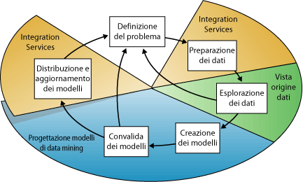
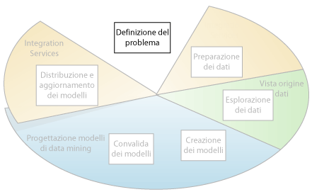
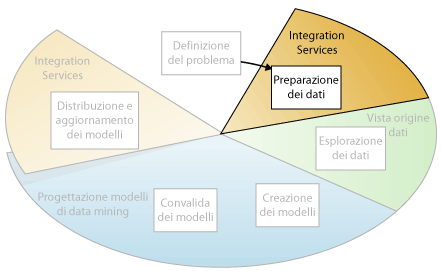
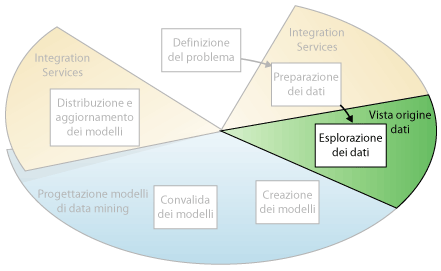
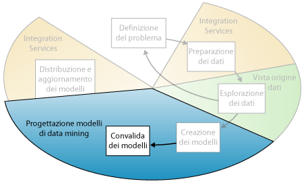
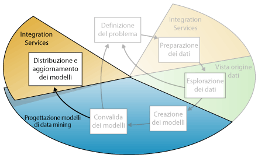

# Concetti di data mining
[!INCLUDE[ssas-appliesto-sqlas](../../includes/ssas-appliesto-sqlas.md)]Data mining è il processo di individuazione informazioni utilizzabili da grandi set di dati. Nel data mining viene usata l'analisi matematica per dedurre modelli e tendenze esistenti nei dati. In genere, questi modelli non possono essere individuati tramite l'esplorazione tradizionale dei dati perché le relazioni sono troppo complesse o perché sono presenti troppi dati.  
  
 I modelli e le tendenze possono essere raccolti e definiti in un *modello di data mining*. È possibile applicare i modelli di data mining a scenari specifici, ad esempio:  
  
-   **Previsioni**: stima delle vendite, dei carichi del server o del tempo di inattività del server  
  
-   **Rischio e probabilità**: scelta dei clienti migliori per mailing diretti, determinazione del punto di pareggio probabile per scenari di rischio e assegnazione di probabilità a diagnosi o ad altri risultati  
  
-   **Indicazioni**: determinazione dei prodotti che probabilmente vengono venduti insieme e generazione di indicazioni  
  
-   **Individuazione delle sequenze**: analisi delle scelte dei clienti in un carrello acquisti e stima dei possibili eventi successivi  
  
-   **Raggruppamento**: separazione di clienti o eventi in cluster di elementi correlati, analisi e stima delle affinità  
  
 La compilazione di un modello di data mining rientra in un processo più ampio che include tutte le fasi necessarie, dalla formulazione di domande sui dati e dalla creazione di un modello per rispondere a tali domande, alla distribuzione del modello in un ambiente di lavoro. È possibile definire tale processo suddividendolo nei sei passaggi di base seguenti:  
  
1.  [Definizione del problema](#DefiningTheProblem)  
  
2.  [Preparazione dei dati](#PreparingData)  
  
3.  [Esplorazione dei dati](#ExploringData)  
  
4.  [Compilazione dei modelli](#BuildingModels)  
  
5.  [Esplorazione e convalida dei modelli](#ValidatingModels)  
  
6.  [Distribuzione e aggiornamento dei modelli](#DeployingandUpdatingModels)  
  
 Nel diagramma seguente vengono descritte le relazioni tra i vari passaggi del processo e le tecnologie di [!INCLUDE[msCoName](../../includes/msconame-md.md)] [!INCLUDE[ssNoVersion](../../includes/ssnoversion-md.md)] che consentono di completare ogni passaggio.  
  
   
  
 Il processo illustrato nel diagramma è ciclico, pertanto la creazione di un modello di data mining è un processo dinamico e iterativo. Dopo avere esplorato i dati, è possibile scoprire che questi dati non sono sufficienti per la creazione di modelli di data mining appropriati e che pertanto è necessario cercarne altri. In alternativa, è possibile compilare diversi modelli e successivamente rendersi conto che tali modelli non consentono di risolvere in modo appropriato il problema definito, il quale deve pertanto essere ridefinito. Potrebbe inoltre essere necessario aggiornare i modelli dopo la loro distribuzione perché nel frattempo sono diventati disponibili altri dati. Potrebbe inoltre essere necessario ripetere molte volte ogni passaggio del processo per creare un modello funzionale.  
  
 Data Mining di Microsoft SQL Server offre un ambiente integrato per la creazione e l'utilizzo dei modelli di data mining. In questo ambiente è incluso SQL Server Development Studio, in cui sono contenuti algoritmi di data mining e strumenti query che facilitano la compilazione di una soluzione completa per un'ampia varietà di progetti, e [!INCLUDE[ssManStudioFull](../../includes/ssmanstudiofull-md.md)], in cui sono disponibili strumenti per l'esplorazione di modelli e la gestione di oggetti di data mining. Per altre informazioni, vedere [Creazione di modelli multidimensionali tramite SQL Server Data Tools &#40;SSDT&#41;](../../analysis-services/multidimensional-models/creating-multidimensional-models-using-sql-server-data-tools-ssdt.md).  
  
 Per un esempio di applicazione degli strumenti di [!INCLUDE[ssNoVersion](../../includes/ssnoversion-md.md)] a uno scenario aziendale, vedere [Esercitazione di base sul data mining](http://msdn.microsoft.com/library/6602edb6-d160-43fb-83c8-9df5dddfeb9c).  
  
##   Definizione del problema  
 Il primo passaggio del processo di data mining, illustrato nel diagramma seguente, consiste nel definire chiaramente il problema e nel considerare le modalità con cui i dati possono essere usati per risolvere il problema.  
  
   
  
 Tale passaggio include l'analisi dei requisiti aziendali e la definizione dell'ambito del problema, della metrica in base alla quale verrà valutato il modello e degli obiettivi specifici per il progetto di data mining. È necessario trasformare queste attività nelle domande seguenti:  
  
-   Quali tipi di dati sono necessari? Quali tipi di relazioni si intende trovare?  
  
-   Il problema che si sta tentando di risolvere riflette i criteri o i processi aziendali?  
  
-   Si desidera eseguire stime in base al modello di data mining o soltanto cercare modelli e associazioni interessanti?  
  
-   Quale risultato o attributo del set di dati si desidera stimare?  
  
-   Di che tipo di dati si dispone e che tipo di informazioni è contenuto in ogni colonna? Se esistono più tabelle, che tipo di relazione esiste tra di esse? È necessario eseguire operazioni di pulizia, aggregazione o elaborazione per rendere i dati utilizzabili?  
  
-   Come sono distribuiti i dati? Si tratta di dati stagionali? I dati rappresentano accuratamente i processi aziendali?  
  
 Per rispondere a queste domande, potrebbe essere necessario effettuare uno studio sulla disponibilità dei dati al fine di individuare le esigenze degli utenti aziendali in relazione ai dati disponibili. Se i dati non soddisfano le esigenze degli utenti, potrebbe essere necessario ridefinire il progetto.  
  
 È inoltre necessario considerare i modi in cui incorporare i risultati del modello negli indicatori di prestazioni chiave usati per misurare i progressi aziendali.  
  
##   Preparazione dei dati  
 Il secondo passaggio del processo di data mining, illustrato nel diagramma seguente, consiste nel consolidamento e nella pulizia dei dati identificati nel passaggio [Definizione del problema](#DefiningTheProblem) .  
  
   
  
 I dati possono essere sparsi nell'intera azienda e archiviati in formati diversi oppure possono contenere incoerenze quali voci errate o mancanti. I dati potrebbero ad esempio indicare che un cliente ha acquistato un prodotto prima che tale prodotto fosse disponibile sul mercato o che effettua acquisti periodicamente presso un negozio situato a 2.000 chilometri di distanza da casa sua.  
  
 La pulizia dei dati non consiste solo nella rimozione di quelli errati o nell'interpolazione dei valori mancanti, ma anche nell'individuazione delle correlazioni nascoste nei dati, nell'identificazione delle origini dati più accurate e nella determinazione delle colonne più appropriate per l'utilizzo nell'analisi. Ad esempio, deve essere usata la data di spedizione o quella dell'ordine? Il miglior fattore di influenza sulle vendite è la quantità, il prezzo totale o un prezzo scontato? I dati incompleti, errati e gli input che appaiono separati, ma che in realtà sono fortemente correlati, possono incidere sui risultati del modello in modi non previsti.  
  
 Pertanto, prima di avviare la compilazione di modelli di data mining, è necessario identificare questi problemi e stabilire come risolverli. Per il data mining si usano in genere un set di dati di grandi dimensioni e non è possibile esaminare la qualità dei dati di ogni transazione. Pertanto, per esplorare i dati e individuare le incoerenze, potrebbe essere necessario usare una forma di profiling dei dati, nonché strumenti di pulizia e filtro dei dati automatizzati come quelli forniti in [!INCLUDE[ssISnoversion](../../includes/ssisnoversion-md.md)], [!INCLUDE[ssMDSlong](../../includes/ssmdslong-md.md)]o [!INCLUDE[ssDQSnoversionLong](../../includes/ssdqsnoversionlong-md.md)] . Per altre informazioni, vedere le risorse seguenti:  
  
-   [Integration Services in Business Intelligence Development Studio](https://technet.microsoft.com/library/ms174181\(v=sql.110\).aspx)  
  
-   [Panoramica di Master Data Services (MDS)](../../master-data-services/master-data-services-overview-mds.md)  
  
-   [Data Quality Services](../../data-quality-services/data-quality-services.md)  
  
 È importante notare che i dati usati per il processo di data mining non devono essere archiviati in un cubo OLAP (Online Analytical Processing) o in un database relazionale, anche se è possibile usare entrambi come origini dati. È possibile eseguire il processo di data mining usando qualsiasi origine dati definita come un'origine dati [!INCLUDE[ssASnoversion](../../includes/ssasnoversion-md.md)] . Sono inclusi file di testo, cartelle di lavoro di Excel o dati da altri provider esterni. Per altre informazioni, vedere [Origini dati supportate &#40;SSAS - multidimensionale&#41;](../../analysis-services/multidimensional-models/supported-data-sources-ssas-multidimensional.md).  
  
##   Esplorazione dei dati  
 Il terzo passaggio del processo di data mining, illustrato nel diagramma seguente, consiste nell'esplorazione dei dati preparati.  
  
   
  
 Per prendere decisioni appropriate durante la creazione dei modelli di data mining, è necessario interpretare correttamente i dati. Tra le tecniche di esplorazione sono inclusi il calcolo dei valori minimi e massimi, il calcolo delle deviazioni media e standard e l'analisi della distribuzione dei dati. Ad esempio, analizzando i valori massimo, minimo e medio è possibile stabilire che i dati non sono rappresentativi dei clienti o dei processi aziendali e che di conseguenza è necessario ottenere dati più equilibrati o rivedere le ipotesi su cui si basano le proprie aspettative. Deviazioni standard e altri valori di distribuzione possono fornire informazioni utili su stabilità e accuratezza dei risultati. Una marcata deviazione standard può indicare che l'aggiunta di ulteriori dati potrebbe migliorare il modello. I dati con una notevole deviazione da una distribuzione standard potrebbero essere asimmetrici oppure rappresentare un'immagine precisa di un problema reale, ma rendere difficile l'adattamento di un modello ai dati.  
  
 Esplorando i dati alla luce della propria conoscenza del problema aziendale, è possibile decidere se nel set di dati sono contenuti dati non validi, quindi mettere a punto una strategia per risolvere i problemi o per acquisire una comprensione più approfondita dei comportamenti tipici dell'azienda.  
  
 È possibile usare strumenti quale [!INCLUDE[ssMDSshort](../../includes/ssmdsshort-md.md)] per esaminare le origini dati esistenti e stabilire la relativa disponibilità per di data mining. È possibile usare strumenti ad esempio [!INCLUDE[ssDQSnoversionLong](../../includes/ssdqsnoversionlong-md.md)]o Profiler dati in Integration Services, per analizzare la distribuzione dei dati e correggere problemi quali dati errati o mancanti.  
  
 Dopo aver definito le origini, combinarle in un vista Origine dati tramite Progettazione vista origine dati in [!INCLUDE[ssBIDevStudio](../../includes/ssbidevstudio-md.md)]. Per altre informazioni, vedere [Viste origine dati in modelli multidimensionali](../../analysis-services/multidimensional-models/data-source-views-in-multidimensional-models.md). In questa finestra di progettazione sono disponibili inoltre alcuni strumenti utilizzabili per esplorare i dati e verificare che siano adatti per la creazione di un modello. Per altre informazioni, vedere [Esplorare dati in una vista origine dati &#40;Analysis Services&#41;](../../analysis-services/multidimensional-models/explore-data-in-a-data-source-view-analysis-services.md).  
  
 Si noti che, al momento della creazione di un modello, in [!INCLUDE[ssASnoversion](../../includes/ssasnoversion-md.md)] vengono automaticamente creati riepiloghi statistici dei dati contenuti nel modello, su cui è possibile eseguire una query da usare in report o ulteriori analisi. Per altre informazioni, vedere [Query di data mining](../../analysis-services/data-mining/data-mining-queries.md).  
  
##   Compilazione dei modelli  
 Il quarto passaggio del processo di data mining, illustrato nel diagramma seguente, consiste nella compilazione del modello o dei modelli di data mining. Le conoscenze acquisite durante il passaggio [Esplorazione dei dati](#ExploringData) verranno usate per definire e creare i modelli.  
  
   
  
 Le colonne di dati che si desidera usare vengono definite creando una struttura di data mining. La struttura di data mining è collegata all'origine dei dati, ma di fatto non contiene alcun dato finché non viene elaborata. Quando si elabora la struttura di data mining, in [!INCLUDE[ssASnoversion](../../includes/ssasnoversion-md.md)] vengono generate aggregazioni e altre informazioni statistiche utilizzabili per l'analisi. Queste informazioni possono essere usate da qualsiasi modello di data mining basato sulla struttura. Per altre informazioni sulle modalità di correlazione delle strutture di data mining per modelli di data mining, vedere [Architettura logica &#40;Analysis Services – Data mining&#41;](../../analysis-services/data-mining/logical-architecture-analysis-services-data-mining.md).  
  
 Prima dell'elaborazione della struttura e del modello, anche un modello di data mining è semplicemente un contenitore in cui sono specificate le colonne usate per l'input, l'attributo stimato e i parametri tramite cui viene indicato all'algoritmo come elaborare i dati. L'elaborazione di un modello viene spesso definita *training*. Il termine training si riferisce al processo di applicazione di un algoritmo matematico specifico ai dati nella struttura allo scopo di estrarre dei modelli. I modelli che si trovano nel processo di training dipendono dalla selezione dei dati di training, dall'algoritmo che si sceglie e dalla modalità di configurazione di quest'ultimo. [!INCLUDE[ssCurrent](../../includes/sscurrent-md.md)] sono disponibili molti algoritmi diversi, ognuno per un tipo diverso di attività nonché per la creazione di un tipo differente di modello. Per un elenco degli algoritmi disponibili in [!INCLUDE[ssCurrent](../../includes/sscurrent-md.md)], vedere [Algoritmi di data mining &#40;Analysis Services - Data mining&#41;](../../analysis-services/data-mining/data-mining-algorithms-analysis-services-data-mining.md).  
  
 Per regolare ciascun algoritmo, è anche possibile usare parametri e applicare filtri ai dati di training per usare solo un subset di dati, generando risultati diversi. Dopo avere passato i dati nel modello, l'oggetto modello di data mining contiene riepiloghi e schemi su cui è possibile eseguire query o che possono essere usati per la stima.  
  
 In [!INCLUDE[ssBIDevStudio](../../includes/ssbidevstudio-md.md)] è possibile definire un nuovo modello tramite Creazione guidata modello di data mining o usando il linguaggio DMX (Data Mining Extensions). Per altre informazioni su come usare Creazione guidata modelli di data mining, vedere [Creazione guidata modello di data mining &#40;Analysis Services - Data mining&#41;](../../analysis-services/data-mining/data-mining-wizard-analysis-services-data-mining.md). Per altre informazioni su come usare DMX, vedere [Guida di riferimento a DMX &#40;Data Mining Extensions&#41;](../../dmx/data-mining-extensions-dmx-reference.md).  
  
 È importante ricordare che a ogni modifica dei dati è necessario aggiornare sia la struttura di data mining sia il modello di data mining. Quando si aggiorna una struttura di data mining rielaborandola, [!INCLUDE[ssASnoversion](../../includes/ssasnoversion-md.md)] recupera i dati dall'origine, includendo qualsiasi nuovo dato se l'origine è aggiornata dinamicamente e ripopola la struttura di data mining. Se si dispone di modelli basati sulla struttura, è possibile scegliere di aggiornare i modelli basati sulla struttura, ovvero sottoporli nuovamente al training sulla base dei nuovi dati, oppure lasciare invariati i modelli. Per altre informazioni, vedere [Requisiti e considerazioni sull'elaborazione &#40;data mining&#41;](../../analysis-services/data-mining/processing-requirements-and-considerations-data-mining.md).  
  
##   Esplorazione e convalida dei modelli  
 Il quinto passaggio del processo di data mining, illustrato nel diagramma seguente, consiste nell'esplorazione dei modelli di data mining compilati e nella verifica della relativa efficienza.  
  
   
  
 Prima di distribuire un modello in un ambiente di produzione, è opportuno verificarne le prestazioni. Inoltre, quando si compila un modello, in genere si creano più modelli con configurazioni diverse e si testano tutti per stabilire quale di questi produce i migliori risultati per il problema e i dati.  
  
 [!INCLUDE[ssASnoversion](../../includes/ssasnoversion-md.md)] sono disponibili strumenti che consentono di separare i dati in set di dati di training e di testing in modo da poter valutare accuratamente le prestazioni di tutti i modelli sugli stessi dati. Il set di dati di training viene usato per compilare il modello, mentre il set di dati di testing viene usato per verificare l'accuratezza del modello creando query di stima. Questo partizionamento può essere eseguito automaticamente durante la compilazione del modello di data mining. Per altre informazioni, vedere [Test e convalida &#40;Data mining&#41;](../../analysis-services/data-mining/testing-and-validation-data-mining.md).  
  
 È possibile esplorare le tendenze e gli schemi individuati dagli algoritmi tramite i visualizzatori di Progettazione modelli di data mining disponibili in [!INCLUDE[ssBIDevStudio](../../includes/ssbidevstudio-md.md)]. Per altre informazioni, vedere [Visualizzatori modello di data mining](../../analysis-services/data-mining/data-mining-model-viewers.md). È inoltre possibile verificare l'accuratezza delle stime create dai modelli mediante gli strumenti della finestra di progettazione, ad esempio il grafico di accuratezza e la matrice di classificazione. Per verificare se il modello è specifico per i dati o se può essere usato per creare inferenze sul popolamento generale, è possibile usare la tecnica statistica chiamata *convalida incrociata* per creare automaticamente subset dei dati ed eseguire il test del modello rispetto a ogni subset. Per altre informazioni, vedere [Test e convalida &#40;Data mining&#41;](../../analysis-services/data-mining/testing-and-validation-data-mining.md).  
  
 Se nessuno dei modelli creati durante il passaggio [Compilazione dei modelli](#BuildingModels) risulta efficace, potrebbe essere necessario tornare al passaggio precedente del processo e ridefinire il problema o esaminare nuovamente i dati nel set di dati originale.  
  
##   Distribuzione e aggiornamento dei modelli  
 L'ultimo passaggio del processo di data mining, illustrato nel diagramma seguente, consiste nella distribuzione dei modelli più efficaci in un ambiente di produzione.  
  
   
  
 Dopo la distribuzione dei modelli di data mining in un ambiente di produzione, è possibile eseguire numerose attività, a seconda delle esigenze. Tra le attività che è possibile eseguire sono incluse le seguenti:  
  
-   Usare i modelli per creare stime che è possibile usare per prendere decisioni aziendali. [!INCLUDE[ssNoVersion](../../includes/ssnoversion-md.md)] è disponibile il linguaggio DMX, che può essere usato per creare query di stima, e il generatore delle query di stima, per facilitare la compilazione delle query. Per altre informazioni, vedere [Guida di riferimento a DMX &#40;Data Mining Extensions&#41;](../../dmx/data-mining-extensions-dmx-reference.md).  
  
-   Creare query sul contenuto per recuperare statistiche, regole o formule dal modello. Per altre informazioni, vedere [Query di data mining](../../analysis-services/data-mining/data-mining-queries.md).  
  
-   Incorporare la funzionalità di data mining direttamente in un'applicazione. È possibile includere la libreria AMO (Analysis Management Objects) che contiene un set di oggetti utilizzabili dall'applicazione per creare, modificare, elaborare ed eliminare strutture e modelli di data mining. In alternativa, è possibile inviare messaggi XMLA (XML for Analysis) direttamente a un'istanza di [!INCLUDE[ssASnoversion](../../includes/ssasnoversion-md.md)]. Per altre informazioni, vedere [Sviluppo (Analysis Services - Data mining)](https://technet.microsoft.com/library/bb522473\(v=sql.110\).aspx).  
  
-   Usare [!INCLUDE[ssISnoversion](../../includes/ssisnoversion-md.md)] per creare un pacchetto in cui viene usato un modello di data mining per separare in modo intelligente i dati in entrata dividendoli tra più tabelle. Se ad esempio un database viene aggiornato continuamente con i potenziali clienti, è possibile usare un modello di data mining insieme a [!INCLUDE[ssISnoversion](../../includes/ssisnoversion-md.md)] per dividere i dati in entrata separando i clienti che probabilmente acquisteranno un prodotto dai clienti che probabilmente non lo acquisteranno. Per altre informazioni, vedere [Utilizzi tipici di Integration Services](http://msdn.microsoft.com/en-us/3b97897a-d418-4ef4-b5a4-5aabf4fa6bca).  
  
-   Creare un report che consenta agli utenti di eseguire direttamente le query su un modello di data mining esistente. Per altre informazioni, vedere [Reporting Services in SQL Server Data Tools &#40;SSDT&#41;](../../reporting-services/tools/reporting-services-in-sql-server-data-tools-ssdt.md).  
  
-   Aggiornare i modelli dopo la revisione e l'analisi. Qualsiasi aggiornamento richiede la rielaborazione dei modelli. Per altre informazioni, vedere [Processing Data Mining Objects](../../analysis-services/data-mining/processing-data-mining-objects.md).  
  
-   La pratica di aggiornare dinamicamente i modelli, parallelamente all'ingresso di ulteriori dati nell'organizzazione, e di apportare modifiche costanti per migliorare l'efficacia della soluzione deve essere parte integrante della strategia di distribuzione. Per altre informazioni, vedere [Gestione degli oggetti e delle soluzioni di data mining](../../analysis-services/data-mining/management-of-data-mining-solutions-and-objects.md)  
  
## Vedere anche  
 [Soluzioni di data mining](../../analysis-services/data-mining/data-mining-solutions.md)   
 [Strumenti di data mining](../../analysis-services/data-mining/data-mining-tools.md)  
  
  
