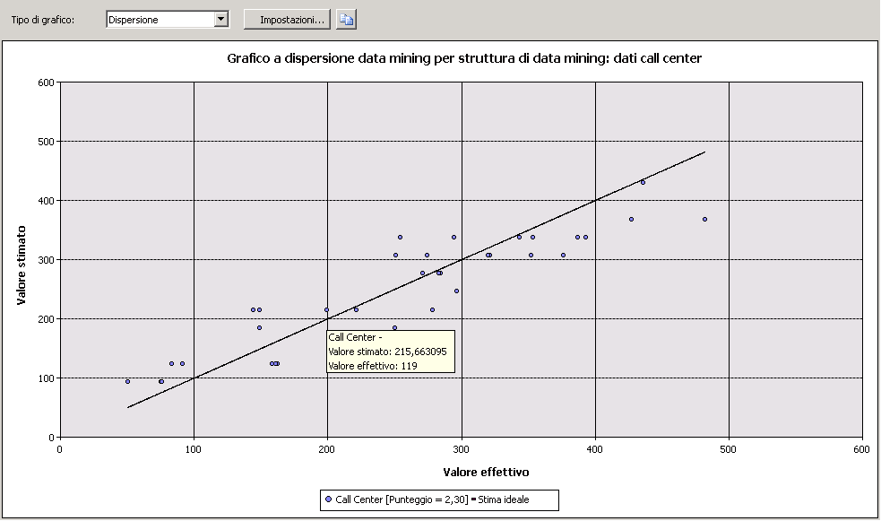

# Grafico a dispersione (Analysis Services - Data mining)
[!INCLUDE[ssas-appliesto-sqlas](../../includes/ssas-appliesto-sqlas.md)]Oggetto *dispersione* tracciati i valori effettivi nei dati rispetto ai valori stimati dal modello. Nel grafico a dispersione i valori effettivi e i valori previsti vengono visualizzati rispettivamente lungo l'asse X e lungo l'asse Y. Viene inoltre visualizzata una linea che illustra la stima perfetta, in cui il valore stimato corrisponde esattamente al valore effettivo. La distanza di un punto da questa linea ideale inclinata di 45 gradi indica il livello di precisione della stima.  
  
## Informazioni sul grafico a dispersione  
 Si consideri un modello in cui il reparto di marketing esegua stime delle vendite giornaliere in base al numero di clic su un collegamento inviato in un messaggio di posta elettronica promozionale. Poiché sia il numero di clic sia il ricavo delle vendite sono valori numerici continui, è possibile tracciare un grafico in cui il numero di clic corrisponde alla variabile indipendente e le vendite rappresentano la variabile dipendente. In questo caso, la linea retta indica la relazione lineare prevista, mentre i punti distribuiti intorno alla linea indicano la divergenza dei dati effettivi rispetto alla stima. Questa analisi consente di determinare immediatamente il livello di correlazione tra un set di risultati e un input specifico e la variazione dal modello ideale.  
  
## Interpretazione dei risultati  
 Nel diagramma seguente viene illustrato un esempio di grafico a dispersione, creato per lo scenario appena descritto.  
  
   
  
 È possibile posizionare il mouse su un punto qualsiasi tra quelli intorno alla linea per visualizzare i valori stimati ed effettivi in una descrizione comandi. Per un grafico a dispersione non è disponibile alcuna area **Legenda data mining**, ma il grafico stesso contiene una legenda indicante il punteggio associato al modello. Per altre informazioni sull'interpretazione del punteggio, vedere [Contenuto dei modelli di data mining per i modelli di regressione lineare &#40;Analysis Services - Data mining&#41;](../../analysis-services/data-mining/mining-model-content-for-linear-regression-models-analysis-services-data-mining.md).  
  
 È possibile copiare la rappresentazione visiva del grafico negli Appunti, ma non i dati sottostanti o la formula. Se si desidera visualizzare la formula di regressione per linea, è possibile creare una query di contenuto sul modello. Per altre informazioni, vedere [Esempi di query sul modello di regressione lineare](../../analysis-services/data-mining/linear-regression-model-query-examples.md).  
  
## Restrizioni sui grafici a dispersione  
 È possibile creare un grafico a dispersione solo se il modello scelto nella scheda **Selezione input** contiene un attributo stimabile continuo. Non è necessario effettuare altre selezioni; il tipo di grafico a dispersione viene automaticamente visualizzato nella scheda **Grafico di accuratezza** in base al modello e al tipo di attributo.  
  
 Anche se tramite i modelli Time Series vengono stimati numeri continui, non è possibile misurare l'accuratezza di un modello Time Series tramite un grafico a dispersione. Sono disponibili altri metodi, ad esempio la riserva di una parte dei dati cronologici. Per altre informazioni, vedere [Esempi di query sul modello di serie temporale](../../analysis-services/data-mining/time-series-model-query-examples.md).  
  
## Contenuto correlato  
 Negli argomenti seguenti sono contenute ulteriori informazioni su come sia possibile compilare e utilizzare i grafici a dispersione e i grafici di accuratezza correlati.  
  
|Argomento|Collegamenti|  
|------------|-----------|  
|Viene fornita una procedura dettagliata relativa alla creazione di un grafico di accuratezza per il modello Targeted Mailing.|[Esercitazione di base sul data mining](http://msdn.microsoft.com/library/6602edb6-d160-43fb-83c8-9df5dddfeb9c)   [Test dell'accuratezza con i grafici di accuratezza &#40;Esercitazione di base sul data mining&#41;](http://msdn.microsoft.com/library/822d414b-4a39-473f-80c3-53476e30655a)|  
|Vengono illustrati i tipi di grafici correlati.|[Grafico di accuratezza &#40;Analysis Services - Data mining&#41;](../../analysis-services/data-mining/lift-chart-analysis-services-data-mining.md)   [Grafico dei profitti &#40;Analysis Services - Data mining&#41;](../../analysis-services/data-mining/profit-chart-analysis-services-data-mining.md)   [Matrice di classificazione &#40;Analysis Services - Data mining&#41;](../../analysis-services/data-mining/classification-matrix-analysis-services-data-mining.md)|  
|Vengono descritti gli utilizzi della convalida incrociata per modelli e strutture di data mining.|[Convalida incrociata &#40;Analysis Services - Data mining&#41;](../../analysis-services/data-mining/cross-validation-analysis-services-data-mining.md)|  
|Vengono descritti i passaggi per la creazione di grafici di accuratezza e di altri grafici simili.|[Attività e procedure di test e convalida &#40;data mining&#41;](../../analysis-services/data-mining/testing-and-validation-tasks-and-how-tos-data-mining.md)|  
  
## Vedere anche  
 [Test e convalida &#40;Data mining&#41;](../../analysis-services/data-mining/testing-and-validation-data-mining.md)  
  
  
