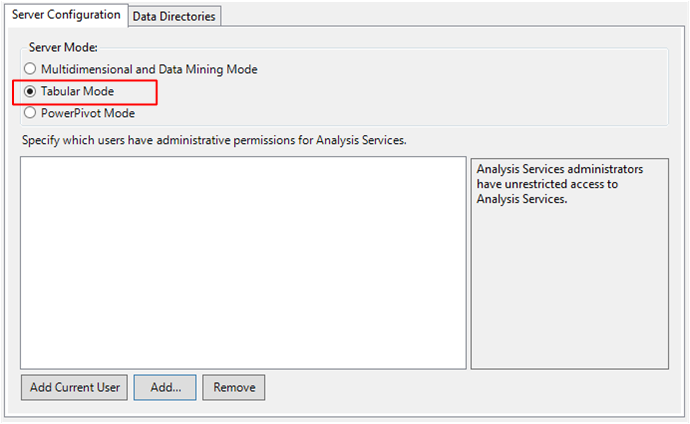

# Installare Analysis Services
  [!INCLUDE[ssASnoversion](../../../includes/ssasnoversion-md.md)] è un server di database analitico che ospita modelli tabulari, cubi multidimensionali e modelli di data mining a cui è possibile accedere da report, fogli di calcolo e dashboard.  
  
 [!INCLUDE[ssASnoversion](../../../includes/ssasnoversion-md.md)] è un server a istanza multipla, e quindi è possibile installare più di una copia di [!INCLUDE[ssASnoversion](../../../includes/ssasnoversion-md.md)] in un singolo computer oppure eseguire le versioni nuove e obsolete affiancate. Qualsiasi istanza installata viene eseguita in una delle tre modalità, in base a quanto stabilito durante l'installazione: multidimensionale, data mining e tabulare o SharePoint. Per usare più modalità, è necessario installare un'istanza distinta per ciascuna modalità.  
  
 Dopo aver installato il server in una specifica modalità, è possibile usare le soluzioni host conformi a tale modalità. Ad esempio, un server in modalità tabulare è necessario se si desidera l'accesso ai dati dei modelli tabulari sulla rete.  
  
## Ottenere strumenti e finestre di progettazione  
 L'installazione di SQL Server non installa più le finestre di progettazione dei modelli o gli strumenti di gestione usati per la progettazione di soluzioni o l'amministrazione server. In questa versione, gli strumenti hanno un'installazione separata, che è possibile ottenere dai collegamenti seguenti:  
  
-   [Scaricare SQL Server Management Studio per SQL Server 2016](https://msdn.microsoft.com/en-US/library/mt238290.aspx)  
  
-   [Scaricare SQL Server Data Tools per SQL Server 2016](https://msdn.microsoft.com/en-US/library/mt204009.aspx)  
  
 È necessario usare sia Management Studio che SQL Server Data Tools con i dati e le istanze di Analysis Services. È possibile installare gli strumenti in un punto qualsiasi, ma assicurarsi di configurare le porte nel server prima di tentare una connessione. Per informazioni dettagliate, vedere [Configure the Windows Firewall to Allow Analysis Services Access](../../../analysis-services/instances/configure-the-windows-firewall-to-allow-analysis-services-access.md) .  
  
## Eseguire l'installazione guidata  
 Nel seguente elenco sono riportate le pagine dell'installazione guidata di SQL Server che vengono usate per installare Analysis Services.  
  
1.  Selezionare **Analysis Services** dall'albero delle funzionalità nell'installazione.  
  
       
  
2.  Nella pagina Configurazione di Analysis Services selezionare **Modalità tabulare** per ottenere un'istanza tabulare. In caso contrario, il valore predefinito è **Modalità multidimensionale e di data mining**.  
  
       
  
 La modalità multidimensionale e di data mining usa MOLAP come risorsa di archiviazione predefinita per i modelli distribuiti in Analysis Services. Dopo la distribuzione nel server, è possibile configurare una soluzione per l'uso di ROLAP per eseguire query direttamente sul database relazionale piuttosto che archiviare dati di query in un database multidimensionale di Analysis Services.  
  
 Tramite questa modalità viene utilizzato il motore di analisi in memoria xVelocity (VertiPaq) che costituisce l'archivio predefinito per i modelli tabulari distribuiti in Analysis Services. Una volta distribuite le soluzioni del modello tabulare nel server, è possibile configurare selettivamente le soluzioni tabulari per utilizzare l'archivio su disco DirectQuery in alternativa allo spazio di archiviazione associato alla memoria.  
  
 È possibile regolare la gestione della memoria e le impostazioni I/O per ottenere prestazioni migliori quando si usano le modalità di archiviazione non predefinite. Per altre informazioni, vedere [Proprietà del server in Analysis Services](../../../analysis-services/server-properties/server-properties-in-analysis-services.md).  
  
## Installazione dalla riga di comando  
 Nell'installazione di SQL Server è incluso un parametro (**ASSERVERMODE**) che specifica la modalità server. Nell'esempio seguente viene illustrata un'istallazione dalla riga di comando che installa Analysis Services nella modalità server Tabella.  
  
```  
  
Setup.exe /q /IAcceptSQLServerLicenseTerms /ACTION=install /FEATURES=AS /ASSERVERMODE=TABULAR /INSTANCENAME=ASTabular /INDICATEPROGRESS/ASSVCACCOUNT=<DomainName\UserName> /ASSVCPASSWORD=<StrongPassword> /ASSYSADMINACCOUNTS=<DomainName\UserName>   
```  
  
 **INSTANCENAME** deve contenere meno di 17 caratteri.  
  
 Tutti i valori segnaposto degli account devono essere sostituiti con password e account validi.  
  
 **ASSERVERMODE** rispetta la distinzione tra maiuscole e minuscole.  È necessario esprimere tutti i valori in lettere maiuscole. Nella tabella seguente vengono descritti i valori validi per **ASSERVERMODE**.  
  
|Valore|Descrizione|  
|-----------|-----------------|  
|MULTIDIMENSIONAL|Si tratta del valore predefinito. Se **ASSERVERMODE**non viene impostato, il server viene installato nella modalità server Multidimensionale.|  
|POWERPIVOT|Questo valore è facoltativo. In pratica, se si imposta il parametro **ROLE**, la modalità server è automaticamente impostata su 1, rendendo **ASSERVERMODE** facoltativo per un'installazione di [!INCLUDE[ssGemini](../../../includes/ssgemini-md.md)] per SharePoint. Per altre informazioni, vedere [Installazione di PowerPivot dal prompt dei comandi](http://msdn.microsoft.com/it-it/7f1f2b28-c9f5-49ad-934b-02f2fa6b9328).|  
|TABULAR|Questo valore è obbligatorio se si installa Analysis Services nella modalità Tabella tramite l'installazione dalla riga di comando.|  
  
## Vedere anche  
 [Determinare la modalità server di un'istanza di Analysis Services](../../../analysis-services/instances/determine-the-server-mode-of-an-analysis-services-instance.md)   
 [Convertire un database tabulare in memoria in DirectQuery in SQL Server Management Studio &#40;SSMS&#41;](../Topic/Convert%20an%20in-memory%20Tabular%20Database%20to%20DirectQuery%20in%20SQL%20Server%20Management%20Studio%20\(SSMS\).md)   
 [Modellazione tabulare &#40;SSAS&#41;](../Topic/Tabular%20Modeling%20\(SSAS\).md)  
  
  