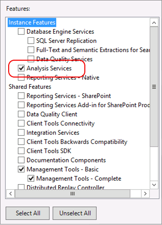

# <a name="install-sql-server-analysis-services"></a>Installare SQL Server Analysis Services
  SQL Server Analysis Services è un server di database analitico che ospita modelli tabulari, cubi multidimensionali e modelli di data mining che è possibile accedere da report, fogli di calcolo e dashboard.  
  
 Analysis Services è a istanza multipla, il che significa che è possibile installare più di una copia in un singolo computer o eseguire nuovi e precedenti versioni side-by-side. Qualsiasi istanza installata viene eseguita in una delle tre modalità, in base a quanto stabilito durante l'installazione: multidimensionale, data mining e tabulare o SharePoint. Per usare più modalità, è necessario installare un'istanza distinta per ciascuna modalità.  
  
 Dopo aver installato il server in una specifica modalità, è possibile usare le soluzioni host conformi a tale modalità. Ad esempio, un server in modalità tabulare è necessario se si desidera l'accesso ai dati dei modelli tabulari sulla rete.  
  
## <a name="get-tools-and-designers"></a>Ottenere strumenti e finestre di progettazione  
 L'installazione di SQL Server non installa più le finestre di progettazione dei modelli o gli strumenti di gestione usati per la progettazione di soluzioni o l'amministrazione server. In questa versione, gli strumenti hanno un'installazione separata, che è possibile ottenere dai collegamenti seguenti:  
  
-   [Scaricare SQL Server Management Studio (SSMS)](/sql-docs/docs/ssms/download-sql-server-management-studio-ssms)  
  
-   [Scaricare SQL Server Data Tools (SSDT)](/sql-docs/docs/ssdt/download-sql-server-data-tools-ssdt)  
  
 È necessario SQL Server Management Studio e SSDT per lavorare con i dati e le istanze di Analysis Services. Gli strumenti possono essere installati in un punto qualsiasi, ma assicurarsi di configurare le porte nel server prima di tentare una connessione. Per informazioni dettagliate, vedere [Configure the Windows Firewall to Allow Analysis Services Access](../../../analysis-services/instances/configure-the-windows-firewall-to-allow-analysis-services-access.md) .  
  
## <a name="install-using-a-wizard"></a>Eseguire l'installazione guidata  
 Nel seguente elenco sono riportate le pagine dell'installazione guidata di SQL Server che vengono usate per installare Analysis Services.  
  
1.  Selezionare **Analysis Services** dall'albero delle funzionalità nell'installazione.  
  
       
  
2.  Nella pagina Configurazione di Analysis Services, selezionare una modalità. Modalità tabulare è l'impostazione predefinita...  
  
       
  
  Questa modalità viene utilizzato il motore di analitica in memoria xVelocity (VertiPaq), che costituisce l'archivio predefinito per i modelli tabulari. Dopo aver distribuito i modelli tabulari al server, è possibile configurare selettivamente le soluzioni tabulari per utilizzare l'archiviazione su disco DirectQuery in alternativa all'archiviazione associata alla memoria.  
 
 Multidimensionale e Data Mining modalità Usa MOLAP come risorsa di archiviazione predefinita per i modelli distribuiti in Analysis Services. Dopo la distribuzione nel server, è possibile configurare una soluzione per l'uso di ROLAP per eseguire query direttamente sul database relazionale piuttosto che archiviare dati di query in un database multidimensionale di Analysis Services.  
  

  
 È possibile regolare la gestione della memoria e le impostazioni I/O per ottenere prestazioni migliori quando si usano le modalità di archiviazione non predefinite. Per altre informazioni, vedere [Proprietà del server in Analysis Services](../../../analysis-services/server-properties/server-properties-in-analysis-services.md) .  
  
## <a name="command-line-setup"></a>Installazione dalla riga di comando  
 Nell'installazione di SQL Server è incluso un parametro (**ASSERVERMODE**) che specifica la modalità server. Nell'esempio seguente viene illustrata un'istallazione dalla riga di comando che installa Analysis Services nella modalità server Tabella.  
  
```  
  
Setup.exe /q /IAcceptSQLServerLicenseTerms /ACTION=install /FEATURES=AS /ASSERVERMODE=TABULAR /INSTANCENAME=ASTabular /INDICATEPROGRESS/ASSVCACCOUNT=<DomainName\UserName> /ASSVCPASSWORD=<StrongPassword> /ASSYSADMINACCOUNTS=<DomainName\UserName>   
```  
  
 **INSTANCENAME** deve contenere meno di 17 caratteri.  
  
 Tutti i valori segnaposto degli account devono essere sostituiti con password e account validi.  
  
 **ASSERVERMODE** rispetta la distinzione tra maiuscole e minuscole.  È necessario esprimere tutti i valori in lettere maiuscole. Nella tabella seguente vengono descritti i valori validi per **ASSERVERMODE**.  
  
|Valore|Descrizione|  
|-----------|-----------------|  
|TABULAR|Si tratta del valore predefinito. Se non si imposta **ASSERVERMODE**, il server viene installato in modalità tabulare.|
|MULTIDIMENSIONAL|Questo valore è facoltativo.|  
|POWERPIVOT|Questo valore è facoltativo. In pratica, se si imposta il parametro **ROLE** , la modalità server è automaticamente impostata su 1, rendendo **ASSERVERMODE** facoltativo per un'installazione di [!INCLUDE[ssGemini](../../../includes/ssgemini-md.md)] per SharePoint. Per altre informazioni, vedere [Installazione di PowerPivot dal prompt dei comandi](http://msdn.microsoft.com/en-us/7f1f2b28-c9f5-49ad-934b-02f2fa6b9328).|  
  
  
## <a name="see-also"></a>Vedere anche  
 [Determinare la modalità server di un'istanza di Analysis Services](../../../analysis-services/instances/determine-the-server-mode-of-an-analysis-services-instance.md)   
 [Modellazione tabulare (SSAS tabulare)](https://msdn.microsoft.com/library/hh212945(v=sql.110).aspx)  
  
  

