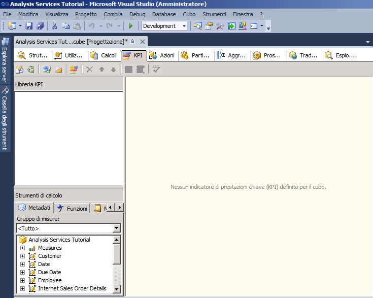
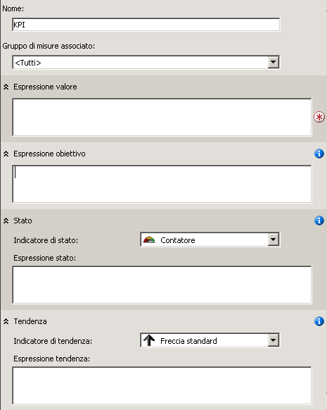

# <a name="lesson-7-1---defining-and-browsing-kpis"></a>Lezione 7-1-definizione ed esplorazione dei KPI
[!INCLUDE[ssas-appliesto-sqlas](../includes/ssas-appliesto-sqlas.md)]Per definire gli indicatori di prestazioni chiave (KPI), è innanzitutto necessario definire un nome di indicatore KPI e il gruppo di misure a cui è associato l'indicatore KPI. Un indicatore KPI può essere associato a tutti i gruppi di misure o a un unico gruppo di misure. In seguito è possibile definire gli elementi seguenti dell'indicatore KPI:  
  
-   L'espressione valore  
  
    Un'espressione valore è una misura fisica, ad esempio Vendite, una misura calcolata, ad esempio Profitto, o un calcolo definito all'interno dell'indicatore KPI utilizzando un'espressione MDX (Multidimensional Expressions).  
  
-   L'espressione obiettivo  
  
    Un'espressione obiettivo è un valore, o un'espressione MDX che restituisce un valore, che definisce l'obiettivo della misura definita dall'espressione valore. Ad esempio, un'espressione obiettivo potrebbe essere l'importo di aumento delle vendite o dei profitti che i responsabili di un'azienda desiderano ottenere.  
  
-   L'espressione stato  
  
    Un'espressione stato è un'espressione MDX utilizzata da [!INCLUDE[ssASnoversion](../includes/ssasnoversion-md.md)] per valutare lo stato corrente dell'espressione valore rispetto all'espressione obiettivo. Un'espressione obiettivo è un valore normalizzato compreso tra -1 e +1, dove -1 significa pessimo e +1 significa eccellente. L'espressione stato viene visualizzata su un diagramma che consente di determinare facilmente lo stato dell'espressione valore rispetto all'espressione obiettivo.  
  
-   L'espressione tendenza  
  
    Un'espressione tendenza è un'espressione MDX utilizzata da [!INCLUDE[ssASnoversion](../includes/ssasnoversion-md.md)] per valutare la tendenza corrente dell'espressione valore rispetto all'espressione obiettivo. L'espressione tendenza consente all'utente aziendale di determinare rapidamente se l'espressione valore sta migliorando o peggiorando relativamente all'espressione obiettivo. È possibile associare uno dei vari diagrammi all'espressione tendenza per consentire agli utenti aziendali di comprendere rapidamente la tendenza.  
  
Oltre a definire questi elementi per un indicatore KPI è possibile definire diverse proprietà di un indicatore KPI. Tali proprietà includono una cartella di visualizzazione, un KPI padre se l'indicatore KPI viene calcolato da altri KPI, il membro temporale corrente, se presente, il peso del KPI, se presente, e una descrizione del KPI.  
  
> [!NOTE]  
> Per altri esempi di indicatori KPI vedere quelli disponibili nella scheda Modelli nel riquadro Strumenti di calcolo oppure nel data warehouse di esempio **Adventure Works DW 2012** . Per altre informazioni su come installare questo database, vedere [Installare dati di esempio e progetti per l'esercitazione di modellazione multidimensionale di Analysis Services](../analysis-services/install-sample-data-and-projects.md).  
  
Nelle attività di questa lezione si definiranno gli indicatori KPI nel progetto [!INCLUDE[ssASnoversion](../includes/ssasnoversion-md.md)] Tutorial, quindi si esplorerà il cubo [!INCLUDE[ssASnoversion](../includes/ssasnoversion-md.md)] Tutorial utilizzando tali KPI. Verranno definiti gli indicatori KPI seguenti:  
  
-   Reseller Revenue  
  
    Questo KPI viene utilizzato per misurare il confronto tra le vendite effettive del rivenditore e gli obiettivi di vendita per le vendite rivenditore, la prossimità delle vendite all'obiettivo e la tendenza al raggiungimento dell'obiettivo.  
  
-   Product Gross Profit Margin  
  
    Questo KPI viene utilizzato per stabilire la distanza del margine di profitto lordo relativo a ogni categoria di prodotto rispetto a un determinato obiettivo, nonché per individuare la tendenza verso il raggiungimento dell'obiettivo.  
  
## <a name="defining-the-reseller-revenue-kpi"></a>Definizione del KPI Reseller Revenue  
  
1.  Aprire Progettazione cubi per il cubo di [!INCLUDE[ssASnoversion](../includes/ssasnoversion-md.md)] Tutorial e fare clic sulla scheda **KPI** .  
  
    La scheda **KPI** include diversi riquadri. Sul lato sinistro della scheda si trovano il riquadro **Libreria KPI** e il riquadro **Strumenti di calcolo** . Il riquadro di visualizzazione posto nella parte intermedia della scheda contiene i dettagli relativi all'indicatore KPI selezionato nel riquadro **Libreria KPI** .  
  
    Nella figura seguente viene illustrata la scheda **KPI** di Progettazione cubi.  
  
      
  
2.  Fare clic sul pulsante **Nuovo indicatore KPI** sulla barra degli strumenti della scheda **KPI** .  
  
    Verrà visualizzato un modello KPI vuoto nel riquadro di visualizzazione, come illustrato nella figura seguente.  
  
      
  
3.  Nella casella **Nome** digitare **Reseller Revenue**, quindi selezionare **Reseller Sales** nell'elenco **Gruppo di misure associato** .  
  
4.  Nella scheda **Metadati** del riquadro **Strumenti di calcolo** , espandere **Misure**e **Vendite rivenditore**e quindi trascinare la misura **Reseller Sales-Sales Amount** nella casella **Espressione valore** .  
  
5.  Nella scheda **Metadati** del riquadro **Strumenti di calcolo** , espandere **Misure**e **Sales Quotas**e trascinare la misura **Quote vendite** nella casella **Espressione obiettivo** .  
  
6.  Verificare che nell'elenco **Indicatore di stato** sia selezionata l'opzione **Misuratore** e quindi digitare l'espressione MDX seguente nella casella **Espressione stato** :  
  
    ```  
    Case  
     When   
      KpiValue("Reseller Revenue")/KpiGoal("Reseller Revenue")>=.95  
       Then 1  
     When  
      KpiValue("Reseller Revenue")/KpiGoal("Reseller Revenue")<.95  
       And   
      KpiValue("Reseller Revenue")/KpiGoal("Reseller Revenue")>=.85  
       Then 0  
      Else-1  
    End  
    ```  
  
    Questa espressione MDX rappresenta la base di valutazione del processo di raggiungimento dell'obiettivo. Se in questa espressione MDX le vendite rivenditore sono superiori all'85 percento dell'obiettivo viene utilizzato un valore 0 per popolare il diagramma scelto. Poiché il diagramma scelto è un misuratore, l'indicatore di misura al suo interno si troverà in posizione intermedia tra il livello superiore e il livello inferiore. Se le vendite rivenditore effettive superano il 90 percento, l'indicatore di misura del misuratore si troverà a tre quarti tra il livello superiore e il livello inferiore.  
  
7.  Verificare che nell'elenco **Indicatore di tendenza** sia selezionata l'opzione **Freccia standard** e quindi digitare l'espressione seguente nella casella **Espressione tendenza** :  
  
    ```  
    Case  
     When IsEmpty  
      (ParallelPeriod  
       ([Date].[Calendar Date].[Calendar Year],1,  
           [Date].[Calendar Date].CurrentMember))  
      Then 0    
     When  (  
      KpiValue("Reseller Revenue") -   
       (KpiValue("Reseller Revenue"),   
        ParallelPeriod  
         ([Date].[Calendar Date].[Calendar Year],1,  
           [Date].[Calendar Date].CurrentMember))  
          /  
          (KpiValue ("Reseller Revenue"),  
           ParallelPeriod  
            ([Date].[Calendar Date].[Calendar Year],1,  
             [Date].[Calendar Date].CurrentMember)))  
           >=.02  
      Then 1  
       When(  
        KpiValue("Reseller Revenue") -   
         (KpiValue ( "Reseller Revenue" ),  
          ParallelPeriod  
           ([Date].[Calendar Date].[Calendar Year],1,  
            [Date].[Calendar Date].CurrentMember))  
           /  
            (KpiValue("Reseller Revenue"),  
             ParallelPeriod  
              ([Date].[Calendar Date].[Calendar Year],1,  
                [Date].[Calendar Date].CurrentMember)))  
            <=.02  
      Then -1  
       Else 0  
    End  
    ```  
  
    Questa espressione MDX rappresenta la base di valutazione della tendenza verso il raggiungimento dell'obiettivo definito.  
  
## <a name="browsing-the-cube-by-using-the-reseller-revenue-kpi"></a>Esplorazione del cubo utilizzando l'indicatore KPI Reseller Revenue  
  
1.  Nel menu **Compila** di [!INCLUDE[ssBIDevStudioFull](../includes/ssbidevstudiofull-md.md)]scegliere **Distribuisci Analysis Service Tutorial**.  
  
2.  Dopo che la distribuzione è stata completata, fare clic su **Visualizzazione Esplorazione** nella barra degli strumenti della scheda **KPI** e fare clic su **Riconnetti**.  
  
    I misuratori di stato e di tendenza vengono visualizzati nel riquadro **Visualizzatore KPI** per le vendite rivenditore basate sui valori del membro predefinito di ogni dimensione, unitamente al valore relativo al valore e all'obiettivo. Il membro predefinito di ogni dimensione è il membro Totale del livello Totale, perché non sono stati definiti altri membri di altre dimensioni come membro predefinito.  
  
3.  Nel riquadro Filtro selezionare **Sales Territory** nell'elenco **Dimensione** , selezionare **Sales Territories** nell'elenco **Gerarchia** , selezionare **Uguale a** nell'elenco **Operatore** , selezionare la casella di controllo **North America** nell'elenco **Espressione filtro** e fare clic su **OK**.  
  
4.  Nella riga successiva del riquadro **Filtro** selezionare **Date** nell'elenco **Dimensione** , selezionare **Calendar Date** nell'elenco **Gerarchia** , selezionare **Uguale a** nell'elenco **Operatore** , selezionare la casella di controllo **Q3 CY 2007** nell'elenco **Espressione filtro** e fare clic su **OK**.  
  
5.  Fare clic in un punto qualsiasi del riquadro **Visualizzatore KPI** per aggiornare i valori di **Reseller Revenue KPI**.  
  
    Si noti che le sezioni **Valore**, **Obiettivo**e **Stato** dell'indicatore KPI riflettono i valori del nuovo periodo temporale.  
  
## <a name="defining-the-product-gross-profit-margin-kpi"></a>Definizione dell'indicatore KPI Product Gross Profit Margin  
  
1.  Fare clic sul pulsante **Visualizzazione Form** nella barra degli strumenti della scheda **KPI** e fare clic sul pulsante **Nuovo indicatore KPI** .  
  
2.  Nella casella **Nome** digitare **Product Gross Profit Margin**e verificare che **<All>** venga visualizzato nell'elenco **Gruppo di misure associato** .  
  
3.  Nella scheda **Metadati** del riquadro **Strumenti di calcolo** trascinare la misura **Total GPM** nella casella **Espressione valore** .  
  
4.  Nella casella **Espressione obiettivo** digitare l'espressione seguente:  
  
    ```  
    Case  
        When [Product].[Category].CurrentMember Is  
          [Product].[Category].[Accessories]  
        Then .40                   
        When [Product].[Category].CurrentMember   
          Is [Product].[Category].[Bikes]  
        Then .12                  
        When [Product].[Category].CurrentMember Is  
          [Product].[Category].[Clothing]  
        Then .20  
        When [Product].[Category].CurrentMember Is  
          [Product].[Category].[Components]  
        Then .10  
        Else .12              
    End  
    ```  
  
5.  Nell'elenco **Indicatore di stato** selezionare l'opzione **Cilindro**.  
  
6.  Digitare l'espressione MDX seguente nella casella **Espressione stato** :  
  
    ```  
    Case  
        When KpiValue( "Product Gross Profit Margin" ) /   
             KpiGoal ( "Product Gross Profit Margin" ) >= .90  
        Then 1  
        When KpiValue( "Product Gross Profit Margin" ) /   
             KpiGoal ( "Product Gross Profit Margin" ) <  .90  
             And   
             KpiValue( "Product Gross Profit Margin" ) /   
             KpiGoal ( "Product Gross Profit Margin" ) >= .80  
        Then 0  
        Else -1  
    End  
    ```  
  
    Questa espressione MDX rappresenta la base di valutazione del processo di raggiungimento dell'obiettivo.  
  
7.  Verificare che nell'elenco **Indicatore di tendenza** sia selezionata l'opzione **Freccia standard** , quindi digitare l'espressione MDX seguente nella casella **Espressione tendenza** :  
  
    ```  
    Case  
    When IsEmpty  
      (ParallelPeriod  
       ([Date].[Calendar Date].[Calendar Year],1,  
           [Date].[Calendar Date].CurrentMember))  
      Then 0    
       When VBA!Abs  
        (  
          KpiValue( "Product Gross Profit Margin" ) -   
           (  
             KpiValue ( "Product Gross Profit Margin" ),  
              ParallelPeriod  
              (   
                [Date].[ Calendar Date].[ Calendar Year],  
                1,  
                [Date].[ Calendar Date].CurrentMember  
              )  
            ) /  
            (  
              KpiValue ( "Product Gross Profit Margin" ),  
              ParallelPeriod  
              (   
                [Date].[ Calendar Date].[ Calendar Year],  
                1,  
                [Date].[ Calendar Date].CurrentMember  
              )  
            )    
          ) <=.02  
      Then 0  
      When KpiValue( "Product Gross Profit Margin" ) -   
           (  
             KpiValue ( "Product Gross Profit Margin" ),  
             ParallelPeriod  
             (   
               [Date].[ Calendar Date].[ Calendar Year],  
               1,  
               [Date].[ Calendar Date].CurrentMember  
             )  
           ) /  
           (  
             KpiValue ( "Product Gross Profit Margin" ),  
             ParallelPeriod  
             (   
               [Date].[Calendar Date].[Calendar Year],  
               1,  
               [Date].[Calendar Date].CurrentMember  
             )  
           )  >.02  
      Then 1  
      Else -1  
    End  
    ```  
  
    Questa espressione MDX rappresenta la base di valutazione della tendenza verso il raggiungimento dell'obiettivo definito.  
  
## <a name="browsing-the-cube-by-using-the-total-gross-profit-margin-kpi"></a>Esplorazione del cubo utilizzando l'indicatore KPI Total Gross Profit Margin  
  
1.  Scegliere **Distribuisci Analysis Services Tutorial** dal menu **Compila**.  
  
2.  Quando la distribuzione ha avuto esito positivo, fare clic su **Riconnetti** nella barra degli strumenti della scheda **KPI** e scegliere **Visualizzazione Esplorazione**.  
  
    Verrà inserito l'indicatore KPI **Product Gross Profit Margin** che indicherà il valore KPI relativo a **Q3 CY 2007** e al territorio vendite **North America** .  
  
3.  Nel riquadro **Filtro** selezionare **Product** nell'elenco **Dimensione** , selezionare **Category** nell'elenco **Gerarchia** , selezionare **Uguale a** nell'elenco **Operatore** , quindi selezionare **Bikes** nell'elenco **Espressione filtro** e infine fare clic su **OK**.  
  
    Verrà visualizzato il margine di profitto lordo per le biciclette vendute dai rivenditori in Nord America nel terzo trimestre dell'anno di calendario 2007.  
  
## <a name="next-lesson"></a>Lezione successiva  
[Lezione 8: Definizione di azioni](../analysis-services/lesson-8-defining-actions.md)  
  
