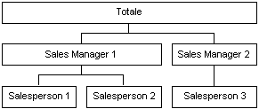

# Attributi della dimensione padre-figlio
  In [!INCLUDE[msCoName](../../includes/msconame-md.md)] [!INCLUDE[ssNoVersion](../../includes/ssnoversion-md.md)] [!INCLUDE[ssASnoversion](../../includes/ssasnoversion-md.md)]viene in genere adottato un presupposto generale riguardo al contenuto dei membri di una dimensione. I membri foglia contengono dati derivati direttamente da origini dei dati sottostanti, mentre i membri non foglia contengono dati derivati da aggregazioni eseguite su membri figlio.  
  
 In una gerarchia padre-figlio, tuttavia, alcuni membri non foglia potrebbero includere dati derivati da origini dei dati sottostanti oltre ai dati aggregati da membri figlio. Per questi membri non foglia di una gerarchia padre-figlio vengono creati membri figlio speciali generati dal sistema contenenti i dati della tabella dei fatti sottostante. Questi membri, denominati *membri dei dati*, contengono un valore direttamente associato a un membro non foglia indipendente dal valore di riepilogo calcolato dai discendenti del membro non foglia.  
  
 I membri dei dati sono disponibili solo per le dimensioni con gerarchie padre-figlio e sono visibili solo se l'attributo padre lo consente. È possibile utilizzare Progettazione dimensioni per controllare la visibilità dei membri dei dati. Per esporre i membri dei dati, impostare la proprietà **MembersWithData** dell'attributo padre su **NonLeafDataVisible**. Per nascondere i membri dei dati contenuti nell'attributo padre, impostare la proprietà **MembersWithData** dell'attributo padre su **NonLeafDataHidden**.  
  
 Questa impostazione non altera la normale modalità di aggregazione dei membri non foglia in quanto il membro dei dati viene sempre incluso come membro figlio ai fini dell'aggregazione. È tuttavia possibile utilizzare una formula personalizzata di rollup per ignorare la normale modalità di aggregazione. La funzione MDX (MultiDimensional Expressions) [DataMember](../../mdx/datamember-mdx.md) consente di accedere al valore del membro dei dati associato indipendentemente dal valore della proprietà **MembersWithData** .  
  
 La proprietà **MembersWithDataCaption** dell'attributo padre indica a [!INCLUDE[ssASnoversion](../../includes/ssasnoversion-md.md)] il modello di denominazione da usare per generare i nomi dei membri dei dati.  
  
## Utilizzo dei membri dei dati  
 I membri dei dati sono utili durante l'aggregazione di misure in base a dimensioni organizzative con gerarchie padre-figlio. Ad esempio, nella figura seguente viene illustrata una dimensione con tre livelli, rappresentante il volume delle vendite lorde dei prodotti. Il primo livello indica il volume delle vendite lorde per tutti i rappresentanti. Il secondo livello include il volume delle vendite lorde per tutto il personale addetto alle vendite raggruppato in base al responsabile delle vendite e il terzo livello include il volume delle vendite lorde per tutto il personale addetto alle vendite raggruppato in base al rappresentante.  
  
   
  
 In genere, il valore del membro Sales Manager 1 verrebbe derivato dall'aggregazione dei valori dei membri Salesperson 1 e Salesperson 2. Tuttavia, poiché anche Sales Manager 1 può vendere prodotti, tale membro può inoltre includere dati derivati dalla tabella dei fatti, in quanto a Sales Manager 1 potrebbero essere associate vendite lorde.  
  
 Le commissioni individuali per ogni membro del personale addetto alle vendite, inoltre, possono essere diverse. In questo caso, vengono utilizzate due scale diverse per calcolare le commissioni per le vendite lorde individuali dei responsabili delle vendite rispetto alle vendite lorde totali generate dai rappresentanti. Pertanto, è importante poter accedere ai dati della tabella dei fatti sottostante per i membri non foglia. Per recuperare il volume delle vendite lorde individuali per il membro Sales Manager 1, è possibile usare la funzione MDX **DataMember** , mentre per escludere il membro dei dati dal valore aggregato del membro Sales Manager 1 in modo da ottenere il volume delle vendite lorde per i rappresentanti associati a tale membro, è possibile usare un'espressione di rollup personalizzata.  
  
## Vedere anche  
 [Riferimento alle proprietà degli attributi delle dimensioni](../../analysis-services/multidimensional-models/dimension-attribute-properties-reference.md)   
 [Dimensioni padre-figlio](../../analysis-services/multidimensional-models/parent-child-dimension.md)  
  
  

