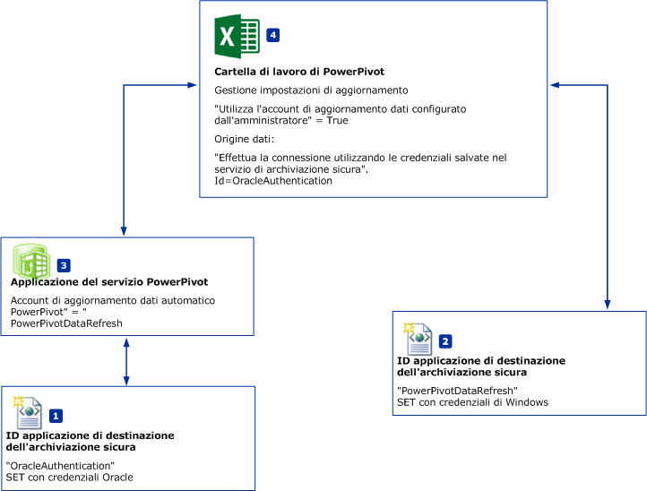
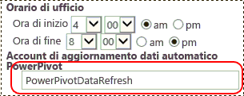

# Pianificazione dell'aggiornamento di dati e origini dati - Nessuna autenticazione di Windows
  Questo argomento descrive un flusso di lavoro della pianificazione di un aggiornamento dati di [!INCLUDE[ssGemini](../../includes/ssgemini-md.md)] per SharePoint in cui si possono usare origini dati che **NON** supportano l'autenticazione di Windows, ad esempio origini dati Oracle o IDM DB2. Le illustrazioni e i passaggi presenti in questo argomento fanno riferimento alle origini dati Oracle ma lo stesso flusso di lavoro è valido anche per altre origini dati.  
  
||  
|-|  
|**[!INCLUDE[applies](../../includes/applies-md.md)]** SharePoint 2010 &#124; SharePoint 2013.|  
  
 **Panoramica:** creare due applicazioni di destinazione dell'archiviazione sicura. Configurare la prima applicazione di destinazione (PowerPivotDataRefresh) per l'utilizzo delle credenziali Windows. Configurare la seconda applicazione di destinazione con le credenziali di un'origine dati che non supporta l'autenticazione di Windows, ad esempio un database Oracle. La seconda applicazione di destinazione utilizza anche la prima applicazione di destinazione per l'account di aggiornamento dati automatico.  
  
   
  
-   **(1) PowerPivotDatarefresh:** ID dell'applicazione di destinazione di archiviazione sicura impostato con l'autenticazione di Windows.  
  
-   **(2) OracleAuthentication:** ID dell'applicazione di destinazione di archiviazione sicura impostato con le credenziali Oracle.  
  
-   **(3)** L'applicazione del servizio [!INCLUDE[ssGemini](../../includes/ssgemini-md.md)] viene configurata in modo da usare l'applicazione di destinazione "PowerPivotDataRefresh" per l' **Account di aggiornamento dati automatico**.  
  
-   **(4)** Cartella di lavoro PowerePivot con dati Oracle. Le impostazioni di aggiornamento della cartella di lavoro specificano la connessione all'origine dati in modo da usare l'applicazione di destinazione **(2)** per le credenziali.  
  
## Prerequisiti  
  
-   Applicazione del servizio [!INCLUDE[ssGemini](../../includes/ssgemini-md.md)] esistente.  
  
-   Applicazione del servizio di archiviazione sicura esistente  
  
-   Cartella di lavoro di Excel con modello di dati [!INCLUDE[ssGemini](../../includes/ssgemini-md.md)] esistente.  
  
## Per creare un ID applicazione di destinazione che utilizza l'autenticazione di Windows  
  
1.  In Amministrazione centrale SharePoint fare clic su **Gestisci applicazioni di servizio**.  
  
2.  Fare clic sul nome dell'applicazione del servizio di archiviazione sicura.  
  
3.  Nella pagina **Gestione** fare clic su **Nuovo**.   
  
4.  Nella pagina **Crea nuova applicazione di destinazione dell'archiviazione sicura** configurare i valori seguenti:  
  
    -   **ID applicazione di destinazione:** PowerPivotDataRefresh.  
  
    -   **Nome visualizzato:** PowerPivotDataRefresh.  
  
    -   **Posta elettronica contatto:** ?  
  
    -   **Tipo di applicazione di destinazione:** Gruppo.  
  
    -   **URL della pagina dell'applicazione di destinazione:** Nessuno.  
  
5.  Scegliere **Avanti**.  
  
6.  Nella pagina Credenziali lasciare i due nomi di campo e tipi di campo predefiniti per **Nome utente Windows** e **Password Windows**.  
  
7.  Scegliere **Avanti**.  
  
8.  Nella pagina **Impostazioni di appartenenza** aggiungere almeno un **Amministratore dell'applicazione di destinazione** e quindi aggiungere i membri che richiedono l'accesso all'applicazione di destinazione.  
  
9. Scegliere **OK**.  
  
10. Il nuovo ID applicazione di destinazione verrà aggiunto all'elenco. Selezionare l'ID applicazione di destinazione e fare clic su **Imposta credenziali**.  
  
11. Digitare il Nome utente Windows e la Password Windows e quindi fare clic su **OK**.  
  
## Per creare un ID applicazione di destinazione che utilizza le credenziali Oracle  
  
1.  In Amministrazione centrale SharePoint fare clic su **Gestisci applicazioni di servizio**.  
  
2.  Fare clic sul nome dell'applicazione del servizio di archiviazione sicura.  
  
3.  Nel **Gestisci** pagina, fare clic su **New**.  
  
4.  Nella pagina **Crea nuova applicazione di destinazione dell'archiviazione sicura** configurare i valori seguenti:  
  
    -   **ID applicazione di destinazione:** OracleAuthentication.  
  
    -   **Nome visualizzato:** OracleAuthentication.  
  
    -   **Posta elettronica contatto:** ?  
  
    -   **Tipo di applicazione di destinazione:** Gruppo.  
  
    -   **URL della pagina dell'applicazione di destinazione:** Nessuno.  
  
5.  Scegliere **Avanti**.  
  
6.  Nella pagina **Credenziali** modificare il primo nome di campo in **Oracle User ID** e il **Tipo di campo** in **User Name**.  
  
     Modificare il secondo nome di campo in **Oracle Password** e il **Tipo di campo** in **Password**.  
  
7.  Scegliere **Avanti**.  
  
8.  Nella pagina **Impostazioni di appartenenza** aggiungere almeno un **Amministratore dell'applicazione di destinazione** e quindi aggiungere i membri che richiedono l'accesso all'applicazione di destinazione.  
  
9. Scegliere **OK**.  
  
10. Il nuovo ID applicazione di destinazione verrà aggiunto all'elenco. Selezionare l'ID applicazione di destinazione e fare clic su **Imposta credenziali**.  
  
11. Digitare l'ID utente Oracle e la Password Oracle e quindi fare clic su **OK**.  
  
 Per altre informazioni, vedere la sezione "Per creare un'applicazione di destinazione per l'Autenticazione di SQL Server" in [Use Secure Store with SQL Server Authentication (SharePoint Server 2013)](http://technet.microsoft.com/library/gg298949.aspx) (Utilizzare l'archiviazione sicura con l'Autenticazione di SQL Server (SharePoint Server 2013)) (http://technet.microsoft.com/library/gg298949.aspx).  
  
## Per configurare l'applicazione del servizio PowerPivot  
  
1.  In Amministrazione centrale SharePoint fare clic su Gestisci applicazioni di servizio.  
  
2.  Fare clic sul nome dell'applicazione del servizio [!INCLUDE[ssGemini](../../includes/ssgemini-md.md)] , ad esempio "Applicazione del servizio [!INCLUDE[ssGemini](../../includes/ssgemini-md.md)] predefinita".  
  
3.  Fare clic su **Configura impostazioni dell'applicazione di servizio** nella sezione Azioni.  
  
4.  Nella sezione **Aggiornamento dati** impostare **Account di aggiornamento dati automatico [!INCLUDE[ssGemini](../../includes/ssgemini-md.md)]** su **PowerPivotDataRefresh** e quindi fare clic su **OK**.  
  
       
  
## Per configurare la cartella di lavoro  
  
1.  Individuare la cartella di lavoro di [!INCLUDE[ssGemini](../../includes/ssgemini-md.md)] raccolta e fare clic su **Gestisci aggiornamento dati**.  
  
2.  Se viene visualizzata la pagina **Cronologia aggiornamento dati** , fare clic su **Configura pianificazione**.  
  
3.  Fare clic su **Abilita**.  
  
4.  Fare clic su **Aggiorna anche appena possibile**.  
  
5.  Nella sezione **Credenziali** fare clic su **Utilizza l'account di aggiornamento dati configurato dall'amministratore**.  
  
6.  Deselezionare **Tutte le origini dati**.  
  
7.  Selezionare **Aggiorna** per l'origine dati che utilizza i dati Oracle. Il nome dell'origine dati può essere modificato in Microsoft Excel nel menu **Dati**, **Connessioni**, **Proprietà** .  
  
8.  Nell'origine dati selezionare **Utilizza pianificazione predefinita**.  
  
9. Selezionare **Effettua la connessione utilizzando le credenziali salvate nel servizio di archiviazione sicura per accedere all'origine dati. Immettere l'ID usato per cercare le credenziali nella casella ID servizio di archiviazione sicura**.  
  
10. Nella casella **ID:** digitare **OracleAuthentication**.  
  
11. Scegliere **OK**.  
  
     Se viene visualizzato un messaggio di errore simile al seguente: `The provided Secure Store target application is either incorrectly configured or does not exist`.  
  
     Le due soluzioni comuni sono:  
  
    -   Verificare che l'ID applicazione di destinazione sia corretto.  
  
    -   Verificare di aver impostato le credenziali per l'applicazione di destinazione.  
  
## Per verificare l'aggiornamento dati con la nuova autenticazione  
 Quando si fa clic su **OK**, viene visualizzata la pagina **Cronologia aggiornamento** . Nell'arco di pochi minuti verrà visualizzato un nuovo elemento nella cronologia di aggiornamento perché nei passaggi precedenti è stato selezionato **Aggiorna anche appena possibile**. Il valore predefinito per il processo timer **Processo timer di aggiornamento dati [!INCLUDE[ssGemini](../../includes/ssgemini-md.md)]** è di 1 minuto. Se non viene visualizzato un nuovo elemento nella cronologia di aggiornamento, attendere qualche minuto e aggiornare il browser. Se il nuovo elemento continua a non essere visualizzato, verificare il valore corrente del processo timer.  
  
## Ulteriori informazioni  
  
-   [Configurare il servizio di archiviazione sicura in SharePoint 2013](http://technet.microsoft.com/library/ee806866.aspx).  
  
-   Vedere la sezione "Aggiornamento dati pianificato" in [Aggiornamento dati PowerPivot con SharePoint 2013 e SQL Server 2012 SP1 (Analysis Services)](http://msdn.microsoft.com/library/jj879294.aspx#bkmk_windows_auth_interactive_data_refresh).  
  
  
