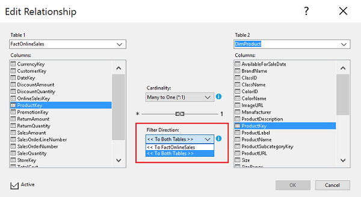
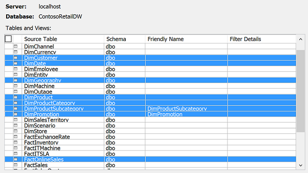

# -Modelli tabulari - Analysis Services i filtri incrociati bidirezionali
  La novità di SQL Server 2016 è un approccio predefinito per l'abilitazione dei *filtri incrociati bidirezionali* nei modelli tabulari, eliminando in questo modo la necessità di prevedere soluzioni DAX personalizzate per la propagazione del contesto di filtro nelle relazioni tra tabelle.  
  
 Suddividendo il concetto nelle sue parti componenti, il *filtro incrociato* è la possibilità di impostare un contesto di filtro in una tabella in base ai valori contenuti in una tabella correlata, mentre con *bidirezionale* si intende il trasferimento di un contesto di filtro alla seconda tabella correlata all'altra estremità di una relazione tra tabelle. Come suggerisce il nome, è possibile sezionare in entrambe le direzioni della relazione piuttosto che in una sola.  Internamente, il filtro bidirezionale espande il contesto di filtro in modo da eseguire la query di un superset dei dati.  
  
   
  
 Esistono due tipi di filtri incrociati: unidirezionale e bidirezionale. Il filtro unidirezionale è la direzione tradizionale del filtro molti-a-uno tra le tabelle dei fatti e le tabelle delle dimensioni in tale relazione. Il filtro bidirezionale è un filtro incrociato che abilita il contesto di filtro di una relazione in modo che sia usato come contesto di filtro per un'altra relazione di tabella, con una tabella comune a entrambe le relazioni.  
  
 Dati **DimDate** e **DimProduct** con relazioni di chiave esterna con **FactOnlineSales**, un filtro incrociato bidirezionale è equivalente a **FactOnlineSales-to-DimDate** più **FactOnlineSales-to-DimProduct** usati contemporaneamente.  
  
 I filtri incrociati bidirezionali possono rappresentare una facile correzione dei problemi di progettazione query molti-a-molti che gli sviluppatori di modelli tabulari e Power Pivot hanno dovuto risolvere in passato. Se è stata usata la soluzione DAX per le relazioni molti-a-molti nei modelli tabulari o Power Pivot, è possibile provare ad applicare un filtro bidirezionale per vedere se produce i risultati previsti.  
  
 Quando si crea un filtro incrociato bidirezionale, tenere presente quanto i punti seguenti:  
  
-   Riflettere prima di abilitare i filtri bidirezionali.  
  
     Se si abilitano i filtri bidirezionali ovunque, i dati potrebbero essere eccessivamente filtrati in modo imprevedibile.  Si potrebbe anche introdurre inavvertitamente una certa ambiguità creando più percorsi di query potenziali. Per evitare entrambi i problemi, prevedere di usare una combinazione di filtri unidirezionali e bidirezionali.  
  
-   Eseguire test incrementale per verificare l'impatto di ogni modifica del filtro sul modello. [Analizza in Excel](../../analysis-services/tabular-models/analyze-a-tabular-model-in-excel-ssas-tabular.md) è appropriato per il test incrementale. Come procedura consigliata, farlo seguire periodicamente con i test con altri client di creazione report in modo da non avere sorprese in un secondo momento.  
  
> [!NOTE]  
>  A partire dalla versione CTP 3.2, SSDT include un valore predefinito che determina se i filtri incrociati bidirezionali vengono eseguiti automaticamente. Se si abilitano i filtri bidirezionali per impostazione predefinita, SSDT abiliterà il filtro bidirezionale solo se il modello indica chiaramente un percorso di query attraverso una catena di relazioni tra tabelle.  
  
## Impostare il valore predefinito  
 I filtri direzionali singoli sono quelli predefiniti. È possibile modificare l'impostazione predefinita per tutti i nuovi progetti creati nella finestra di progettazione oppure nel modello stesso, se il progetto esiste già.  
  
 A livello di progetto, l'impostazione viene valutata quando si crea il progetto, dunque se si modifica il valore predefinito in bidirezionale, gli effetti della selezione saranno visibili quando si crea il progetto successivo.  
  
1.  In SSDT selezionare **Strumenti** > **Opzioni** > **Analysis Services Tabular Designers** > **Nuovo progetto**.  
  
2.  Impostare la **Direzione filtro** predefinita sulla direzione **Singola** oppure su **Filtra in entrambe le direzioni**.  
  
 In alternativa, è possibile modificare il valore predefinito nel modello.  
  
1.  In Esplora soluzioni selezionare **Model.bim** > **Proprietà** .  
  
2.  Impostare la **Direzione filtro** predefinita sulla direzione **Singola** oppure su **Filtra in entrambe le direzioni**.  
  
## Scenario di esempio  
 Il modo migliore per apprezzare il valore di un filtro incrociato bidirezionale è attraverso un esempio. Si consideri il set di dati seguente da [ContosoRetailDW](http://www.microsoft.com/en-us/download/details.aspx?id=18279), che riflette la cardinalità e i filtri incrociati che vengono creati per impostazione predefinita.  
  
   
  
> [!NOTE]  
>  Per impostazione predefinita, durante l'importazione di dati, le relazioni tra tabelle vengono create automaticamente nelle configurazioni molti-a-uno derivate dalle relazioni di chiave esterna e chiave primaria tra la tabella dei fatti e le tabelle delle dimensioni correlate.  
  
 Si noti che la direzione del filtro è dalle tabelle delle dimensioni alla tabella dei fatti: promozioni, prodotti, date, cliente e dati geografici del cliente sono tutti filtri validi che producono correttamente una certa aggregazione di una misura, il cui valore effettivo varia in base alle dimensioni usate.  
  
   
  
 Per questo semplice schema star, i test in Excel confermano che i dati vengono suddivisi in sezioni senza alcun problema quando si filtrano i flussi provenienti dalle tabelle delle dimensioni nelle righe e nelle colonne in dati aggregati forniti da una misura **Somma delle vendite** , che si trova nella tabella **FactOnlineSales** centrale.  
  
   
  
 Purché le misure vengano estratte dalla tabella dei fatti e il contesto di filtro termini in corrispondenza della tabella dei fatti, le aggregazioni verranno filtrate in modo corretto per questo modello. Ma cosa accade se si vogliono creare delle misure altrove, ad esempio una misura Distinct Count nella tabella Products o Customer o uno sconto medio nella tabella Promotion, e si estende un contesto di filtro esistente a tale misura?  
  
 È possibile provarlo aggiungendo una misura Distinct Count da **DimProducts** alla tabella pivot. Osservare i valori ripetuti per **Count Products**. A prima vista, sembra che manchi una relazione tra tabelle, ma nel modello in esame si noterà che tutte le relazioni sono completamente definite e attive. In questo caso, i valori si ripetono perché non sono presenti filtri per date nelle righe della tabella Product.  
  
   
  
 Dopo aver aggiunto un filtro incrociato bidirezionale tra **FactOnlineSales** e **DimProduct**, le righe della tabella Product sono ora correttamente filtrate in base al produttore e alla data.  
  
   
  
## Informazioni dettagliate  
 È possibile provare i filtri incrociati bidirezionali eseguendo le istruzioni in questa procedura dettagliata. Per proseguire, è necessario avere:  
  
-   Un'istanza di SQL Server 2016 Analysis Services, modalità tabulare, versione CTP più recente  
  
-   [SQL Server Data Tools per Visual Studio 2015 (SSDT)](http://go.microsoft.com/fwlink/p/?LinkID=627574), rilasciato con l'ultima versione CTP.  
  
-   [ContosoRetailDW](http://www.microsoft.com/en-us/download/details.aspx?id=18279)  
  
-   Autorizzazioni di lettura per i dati.  
  
-   Excel (per l'uso con Analizza in Excel)  
  
### Creare un progetto  
  
1.  Avviare SQL Server Data Tools per Visual Studio 2015.  
  
2.  Fare clic su **File** > **Nuovo** > **Progetto** > **Modello tabulare di Analysis Services**.  
  
3.  In Progettazione modelli tabulari, impostare il database dell'area di lavoro su un'istanza di Analysis Services dell'Anteprima di SQL Server 2016 in modalità server tabulare.  
  
4.  Verificare il livello di compatibilità del modello sia impostato su **SQL Server 2016 RTM (1200)** o versione successiva.  
  
     Fare clic su **OK** per creare il progetto.  
  
### Aggiungere dati  
  
1.  Fare clic su **Modello** > **Importa da origine dati** > **Microsoft SQL Server**.  
  
2.  Specificare il server, il database e il metodo di autenticazione.  
  
3.  Scegliere il database ContosoRetailDW.  
  
4.  Scegliere **Avanti**.  
  
5.  In Selezione tabelle, premere CTRL e selezionare le tabelle seguenti:  
  
    -   FactOnlineSales  
  
    -   DimCustomer  
  
    -   DimDate  
  
    -   DimGeography  
  
    -   DimPromotion  
  
     A questo punto è possibile modificare i nomi per renderli più leggibili nel modello.  
  
       
  
6.  Importare i dati.  
  
 Se si verificano errori, controllare che per l'account usato per connettersi al database sia presente un accesso di SQL Server con autorizzazioni di lettura nel data warehouse di Contoso. In una connessione remota, è opportuno controllare anche la configurazione della porta nel firewall per SQL Server.  
  
### Esaminare le relazioni tra tabelle predefinite  
 Passare alla vista diagramma: **Modello** > **Vista modelli** > **Vista diagramma**. La cardinalità e le relazioni attive sono indicate in modo visivo. Tutte le relazioni sono uno-a-molti tra due tabelle correlate qualsiasi.  
  
   
  
 In alternativa, fare clic su **Tabella** > **Gestisci relazioni** per visualizzare le stesse informazioni in un layout di tabella.  
  
   
  
### Creare misure  
 È necessaria un'aggregazione per sommare gli importi di vendita per diversi facet dei dati dimensionali. In **DimProduct,** è possibile creare una misura che conti i prodotti e quindi usarla in un'analisi di merchandising del prodotto che mostra il numero di prodotti che hanno partecipato alle vendite per un determinato anno, una determinata area o un tipo di cliente.  
  
1.  Fare clic su **Modello** > **Vista modelli** > **Vista diagramma**.  
  
2.  Fare clic su **FactOnlineSales**.  
  
3.  Selezionare la colonna **SalesAmount** .  
  
4.  Fare clic su **Colonna** > **Somma automatica** > **Somma** per creare una misura per le vendite.  
  
5.  Fare clic su **DimProduct**.  
  
6.  Selezionare la colonna **ProductKey**.  
  
7.  Fare clic su **Colonna** > **Somma automatica** > **DistinctCount** per creare una misura per prodotti esclusivi.  
  
### Analizza in Excel  
  
1.  Fare clic su **Modello** > **Analizza in Excel** per riunire tutti i dati in una tabella pivot.  
  
2.  Selezionare le due misure appena create dall'elenco di campi.  
  
3.  Selezionare **Prodotti** > **Produttore**.  
  
4.  Selezionare **Data** > **Anno di calendario**.  
  
 Si noti che le vendite sono suddivise per anno e produttore come previsto. Il motivo è che il contesto di filtro predefinito tra **FactOnlineSales**, **DimProduct**e **DimDate** funziona correttamente per le misure sul lato "molti" della relazione.  
  
 Allo stesso tempo, si noterà che il numero di prodotti non seleziona lo stesso contesto di filtro delle vendite. Nonostante i numeri di prodotti siano filtrati correttamente in base al produttore (i numeri produttore e prodotto sono nella stessa tabella), il filtro per date non viene propagato al numero di prodotto.  
  
### Modificare il filtro incrociato  
  
1.  Tornando al modello, selezionare **Tabella** > **Gestisci relazioni**.  
  
2.  Modificare la relazione tra **FactOnlineSales** e **DimProduct**.  
  
     Modificare la direzione del filtro verso entrambe le tabelle.  
  
3.  Salvare le impostazioni.  
  
4.  Nella cartella di lavoro fare clic su **Aggiorna** per leggere nuovamente il modello.  
  
 Si noterà ora che il numero di prodotti e di vendite viene filtrato in base allo stesso contesto di filtro, che include non solo i produttori da **DimProducts** ma anche l'anno di calendario da **DimDate**.  
  
## Conclusione e passaggi successivi  
 Comprendere quando e come usare un filtro incrociato bidirezionale può essere una questione di prove empiriche per verificarne il funzionamento nel proprio scenario. In alcuni casi, si noterà che i comportamenti predefiniti non sono sufficienti e sarà necessario ricorrere ai calcoli DAX per portare a termine il lavoro. Nella sezione **Vedere anche** sono disponibili diversi collegamenti a risorse aggiuntive sull'argomento.  
  
 In termini pratici, i filtri incrociati possono consentire forme di esplorazione dei dati in genere consentite solo da un costrutto molti-a-molti. Detto questo, è importante riconoscere che i filtri incrociati bidirezionali non rappresentano un costrutto molti-a-molti.  In questa versione, non è supportata un'effettiva configurazione di tabella molti-a-molti nella finestra di progettazione per i modelli tabulari.  
  
## Vedere anche  
 [Creare e gestire le relazioni in Power BI Desktop](https://support.powerbi.com/knowledgebase/articles/464155-create-and-manage-relationships-in-power-bi-desktop)   
 [Un esempio pratico di come gestire le semplici relazioni molti-a-molti nei modelli tabulari Power Pivot e SSAS](http://social.technet.microsoft.com/wiki/contents/articles/22202.a-practical-example-of-how-to-handle-simple-many-to-many-relationships-in-power-pivotssas-tabular-models.aspx)   
 [Risolvere le relazioni molti-a-molti sfruttando DAX tra tabelle filtro](http://blog.gbrueckl.at/2012/05/resolving-many-to-many-relationships-leveraging-dax-cross-table-filtering/)   
 [Molti-a-molti revolution (blog di SQLBI)](http://www.sqlbi.com/articles/many2many/)  
  
  
