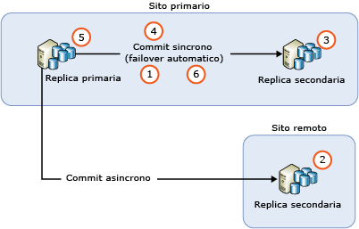
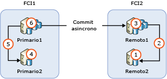

# Aggiornamento delle istanze di replica dei gruppi di disponibilità AlwaysOn
[!INCLUDE[tsql-appliesto-ss2016-xxxx-xxxx-xxx_md](../../../includes/tsql-appliesto-ss2016-xxxx-xxxx-xxx-md.md)]

  Quando si aggiorna un gruppo di disponibilità AlwaysOn di [!INCLUDE[ssNoVersion](../../../includes/ssnoversion-md.md)] a una nuova versione di [!INCLUDE[ssCurrent](../../../includes/sscurrent-md.md)] , a un nuovo Service Pack o aggiornamento cumulativo di [!INCLUDE[ssNoVersion](../../../includes/ssnoversion-md.md)]oppure quando si installa su un nuovo Service Pack o aggiornamento cumulativo di Windows, è possibile ridurre i tempi di inattività per la replica primaria a un singolo failover manuale eseguendo un aggiornamento in sequenza (o a due failover manuali in caso di failback alla replica primaria originale). Durante il processo di aggiornamento, non sarà disponibile una replica secondaria per il failover o per le operazioni di sola lettura e, dopo l'aggiornamento, la replica secondaria potrebbe richiedere del tempo per l'aggiornamento al nodo della replica primaria in base al volume di attività nel nodo (è dunque prevedibile un traffico di rete elevato).  
  
> [!NOTE]  
>  In questo argomento viene illustrata esclusivamente la modalità di aggiornamento di SQL Server. Non viene descritto l'aggiornamento del sistema operativo che contiene il cluster Windows Server Failover Clustering (WSFC). L'aggiornamento del sistema operativo Windows che ospita il cluster di failover non è supportato per i sistemi operativi precedenti a Windows Server 2012 R2. Per aggiornare un nodo del cluster in esecuzione su Windows Server 2012 R2, vedere [Aggiornamento in sequenza del sistema operativo del cluster](https://technet.microsoft.com/library/dn850430.aspx)  
  
## Prerequisiti  
 Prima di iniziare, esaminare le informazioni seguenti:  
  
-   [Supported Version and Edition Upgrades](../../../database-engine/install-windows/supported-version-and-edition-upgrades.md): verificare che sia possibile eseguire l'aggiornamento a SQL Server 2016 dalla versione del sistema operativo Windows e di SQL Server. Ad esempio, non è possibile eseguire l'aggiornamento diretto da un'istanza di SQL Server 2005 a [!INCLUDE[ssCurrent](../../../includes/sscurrent-md.md)].  
  
-   [Choose a Database Engine Upgrade Method](../../../database-engine/install-windows/choose-a-database-engine-upgrade-method.md): selezionare il metodo e la procedura di aggiornamento appropriati in base alla verifica degli aggiornamenti della versione e dell'edizione supportate e anche agli altri componenti installati nell'ambiente interessato per aggiornare i componenti nell'ordine corretto.  
  
-   [Pianificare e testare il piano di aggiornamento del motore di database](../../../database-engine/install-windows/plan-and-test-the-database-engine-upgrade-plan.md): esaminare le note sulla versione, i problemi di aggiornamento noti e l'elenco di controllo pre-aggiornamento e sviluppare e testare il piano di aggiornamento.  
  
-   [Hardware and Software Requirements for Installing SQL Server 2016](../../../sql-server/install/hardware-and-software-requirements-for-installing-sql-server.md): esaminare i requisiti software per l'installazione di [!INCLUDE[ssCurrent](../../../includes/sscurrent-md.md)]. Se è necessario software aggiuntivo, installarlo in ogni nodo prima di iniziare il processo di aggiornamento per ridurre al minimo eventuali tempi di inattività.  
  
## Procedure consigliate relative all'aggiornamento in sequenza per i gruppi di disponibilità AlwaysOn  
 Quando si eseguono aggiornamenti dei server, è opportuno attenersi alle procedure consigliate illustrate di seguito allo scopo di ridurre al minimo i tempi di inattività e la perdita di dati per i gruppi di disponibilità:  
  
-   Prima di avviare l'aggiornamento in sequenza:  
  
    -   Eseguire un failover manuale di prova su almeno una delle istanze di replica con commit sincrono  
  
    -   Proteggere i dati eseguendo un backup completo di ogni database di disponibilità  
  
    -   Eseguire il comando DBCC CHECKDB su ogni database di disponibilità  
  
-   Aggiornare sempre prima le istanze di replica secondaria remota, quindi quelle di replica secondaria locale e, infine, l'istanza di replica primaria.  
  
-   Non è possibile eseguire backup su un database in corso di aggiornamento.  Prima di eseguire l'aggiornamento delle repliche secondarie, configurare la preferenza per i backup automatici in modo che vengano eseguiti solo sulla replica primaria.  Durante un aggiornamento di versione, le repliche non sono né leggibili né disponibili per i backup. Durante un aggiornamento non di versione, è possibile configurare l'esecuzione di backup automatici sulle repliche secondarie prima di aggiornare la replica primaria.  
  
-   Durante un aggiornamento di versione, non è possibile leggere repliche secondarie leggibili dopo il relativo aggiornamento e prima che venga eseguito il failover della replica primaria su una replica secondaria aggiornata o che venga aggiornata la replica primaria.  
  
-   Per evitare failover accidentali del gruppo di disponibilità durante il processo di aggiornamento, prima di iniziare rimuovere il failover da tutte le repliche con commit sincrono.  
  
-   Non aggiornare l'istanza di replica primaria prima di aver eseguito il failover del gruppo di disponibilità su un'istanza aggiornata con una replica secondaria. In caso contrario, le applicazioni client potrebbero subire tempi di inattività prolungati durante l'aggiornamento sull'istanza di replica primaria.  
  
-   Eseguire sempre il failover del gruppo di disponibilità su un'istanza di replica secondaria con commit sincrono. Se si esegue il failover su un'istanza di replica secondaria con commit asincrono, si verificheranno perdite di dati nei database e lo spostamento dei dati verrà automaticamente sospeso finché non verrà ripreso manualmente.  
  
-   Non aggiornare l'istanza di replica primaria prima di aver aggiornato tutte le altre istanze di replica secondaria. Non è più possibile recapitare log tramite una replica primaria aggiornata alle repliche secondarie la cui istanza di [!INCLUDE[ssCurrent](../../../includes/sscurrent-md.md)] non è ancora stata aggiornata alla stessa versione. Se viene sospeso lo spostamento dei dati in una replica secondaria, il failover automatico per quest'ultima non può essere eseguito e nei database di disponibilità possono verificarsi perdite di dati.  
  
-   Prima di effettuare il failover di un gruppo di disponibilità, verificare che lo stato di sincronizzazione della destinazione di failover risulti essere SINCRONIZZATO.  
  
## Processo di aggiornamento in sequenza  
 Il processo effettivo dipende da fattori quali la topologia di distribuzione dei gruppi di disponibilità e la modalità di commit di ogni replica. Nello scenario più semplice, l'aggiornamento in sequenza è articolato in un processo a più fasi che nella sua forma essenziale prevede i passaggi seguenti:  
  
   
  
1.  Rimuovere il failover automatico in tutte le repliche con commit sincrono  
  
2.  Aggiornare tutte le istanze di replica secondaria remota in cui vengono eseguite repliche secondarie con commit asincrono  
  
3.  Aggiornare tutte le istanze di replica secondaria locale in cui non è attualmente in esecuzione la replica primaria  
  
4.  Eseguire manualmente il failover del gruppo di disponibilità su una replica secondaria locale con commit sincrono  
  
5.  Aggiornare l'istanza di replica locale in cui, in precedenza, era ospitata la replica primaria  
  
6.  Configurare i partner di failover automatico nel modo desiderato  
  
 Se necessario, è possibile eseguire un ulteriore failover manuale per ripristinare la configurazione originale del gruppo di disponibilità.  
  
## Gruppo di disponibilità con una replica secondaria remota  
 Se è stato distribuito un gruppo di disponibilità solo a fini di ripristino di emergenza, potrebbe essere necessario effettuarne il failover a una replica secondaria con commit asincrono. Questo tipo di configurazione è illustrato nella figura seguente:  
  
   
  
 In questo caso è necessario eseguire il failover del gruppo di disponibilità su una replica secondaria con commit asincrono durante l'aggiornamento in sequenza. Per evitare perdite di dati, modificare la modalità di commit impostando il commit sincrono e attendere che venga completata la sincronizzazione della replica secondaria prima di effettuare il failover del gruppo di disponibilità. Il processo di aggiornamento in sequenza può quindi avvenire come segue:  
  
1.  Aggiornare l'istanza di replica secondaria sul sito remoto  
  
2.  Impostare la modalità di commit sincrono  
  
3.  Attendere che lo stato di sincronizzazione sia SINCRONIZZATO  
  
4.  Eseguire il failover del gruppo di disponibilità su una replica secondaria sul sito remoto  
  
5.  Aggiornare l'istanza di replica (sito primario) locale  
  
6.  Eseguire di nuovo il failover del gruppo di disponibilità sul sito primario  
  
7.  Impostare la modalità di commit asincrono  
  
 Poiché la modalità di commit sincrono non è consigliata per la sincronizzazione dei dati con un sito remoto, tramite le applicazioni client potrebbe essere rilevato un aumento immediato della latenza del database in seguito alla modifica dell'impostazione. Inoltre, l'esecuzione di un failover causerà la rimozione di tutti i messaggi di log non riconosciuti. La quantità di messaggi di log rimossi può essere notevole a causa dell'elevata latenza di rete tra i due siti, il che determina un numero elevato di errori delle transazioni con i client. È possibile ridurre l'impatto per le applicazioni client nel modo seguente:  
  
-   Scegliere con attenzione una finestra di manutenzione nei periodi di minore traffico client  
  
-   Durante l'aggiornamento di [!INCLUDE[ssCurrent](../../../includes/sscurrent-md.md)] nel sito primario, impostare di nuovo la modalità di commit asincrono, quindi ripristinare il commit sincrono una volta pronti a effettuare nuovamente il failover sul sito primario  
  
## Gruppo di disponibilità con nodi di istanze del cluster di failover  
 Se in un gruppo di disponibilità sono contenuti nodi di istanze del cluster di failover, è consigliabile aggiornare i nodi inattivi prima di quelli attivi. Nella figura seguente è illustrato uno scenario comune di gruppi di disponibilità con istanze del cluster di failover per la disponibilità elevata locale e il commit asincrono tra le istanze stesse ai fini del ripristino di emergenza remoto ed è indicata la relativa sequenza di aggiornamento.  
  
   
  
1.  Aggiornare REMOTE2  
  
2.  Effettuare il failover dell'istanza FCI2 a REMOTE2  
  
3.  Aggiornare REMOTE1  
  
4.  Aggiornare PRIMARY2  
  
5.  Effettuare il failover dell'istanza FCI1 a PRIMARY2  
  
6.  Aggiornare PRIMARY1  
  
## Aggiornare le istanze di SQL Server con più gruppi di disponibilità  
 Se si eseguono più gruppi di disponibilità con repliche primarie su nodi server distinti (configurazione Attiva/Attiva), il percorso di aggiornamento prevede più passaggi di failover allo scopo di preservare la disponibilità elevata durante il processo. Si supponga di disporre di tre gruppi di disponibilità in tre nodi server come illustrato nella tabella seguente e che tutte le repliche secondarie vengano eseguite in modalità di commit sincrono.  
  
|Gruppo di disponibilità|Nodo1|Nodo2|Nodo3|  
|------------------------|-----------|-----------|-----------|  
|AG1|Primaria|||  
|AG2||Primaria||  
|AG3|||Primaria|  
  
 In determinate situazioni potrebbe essere opportuno eseguire un aggiornamento in sequenza con bilanciamento del carico articolato come segue:  
  
1.  Effettuare il failover di AG2 a Nodo3 (per liberare Nodo2)  
  
2.  Aggiornare Nodo2  
  
3.  Effettuare il failover di AG1 a Nodo2 (per liberare Nodo1)  
  
4.  Aggiornare Nodo1  
  
5.  Effettuare il failover di AG2 e AG3 a Nodo1 (per liberare Nodo3)  
  
6.  Aggiornare Nodo3  
  
7.  Effettuare il failover di AG3 a Nodo3  
  
 Questa sequenza di aggiornamento implica un tempo di inattività medio inferiore alla durata di due failover per ciascun gruppo di disponibilità. La configurazione risultante è illustrata nella tabella seguente.  
  
|Gruppo di disponibilità|Nodo1|Nodo2|Nodo3|  
|------------------------|-----------|-----------|-----------|  
|AG1||Primaria||  
|AG2|Primaria|||  
|AG3|||Primaria|  
  
 Il percorso di aggiornamento e i tempi di inattività per le applicazioni client possono variare a seconda della specifica implementazione in uso.  
  
> [!NOTE]  
>  In molti casi, dopo aver completato l'aggiornamento in sequenza, sarà possibile eseguire il failback alla replica primaria originale.  
  
## Vedere anche  
 [Eseguire l'aggiornamento a SQL Server 2016 usando l'Installazione guidata &#40;programma di installazione&#41;](../../../database-engine/install-windows/upgrade-sql-server-using-the-installation-wizard-setup.md)   
 [Installazione di SQL Server 2016 dal prompt dei comandi](../../../database-engine/install-windows/install-sql-server-2016-from-the-command-prompt.md)  
  
  

