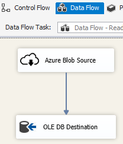

# Feature Pack di Integration Services (SSIS) per Azure
  Il Feature Pack di SQL Server Integration Services (SSIS) per Azure per SQL Server 2016 è un'estensione che fornisce i componenti seguenti per consentire a SSIS di connettersi ad Azure, trasferire i dati tra Azure e le origini dati locali ed elaborare i dati archiviati in Azure.

 **Scaricare** il [Feature Pack di SSIS per Azure per SQL Server 2016](http://go.microsoft.com/fwlink/?LinkID=626967)

-   Gestioni connessioni

    -   [Gestione connessione dell'archiviazione di Azure](../integration-services/connection-manager/azure-storage-connection-manager.md)

    -   [Gestione connessione della sottoscrizione di Azure](../integration-services/connection-manager/azure-subscription-connection-manager.md)
    
    -   [Gestione connessioni di Azure Data Lake Store](../integration-services/connection-manager/azure-data-lake-store-connection-manager.md)

-   Attività

    -   [Attività di caricamento BLOB di Azure](../integration-services/control-flow/azure-blob-upload-task.md)

    -   [Attività di download BLOB di Azure](../integration-services/control-flow/azure-blob-download-task.md)

    -   [Attività Hive di Azure HDInsight](../integration-services/control-flow/azure-hdinsight-hive-task.md)

    -   [Attività Pig di Azure HDInsight](../integration-services/control-flow/azure-hdinsight-pig-task.md)

    -   [Attività di creazione cluster di Azure HDInsight](../integration-services/control-flow/azure-hdinsight-create-cluster-task.md)

    -   [Attività di eliminazione cluster di Azure HDInsight](../integration-services/control-flow/azure-hdinsight-delete-cluster-task.md)
    
    -   [Attività di caricamento di Azure SQL DW](../integration-services/control-flow/azure-sql-dw-upload-task.md)

-   Componenti del flusso di dati

    -   [Origine BLOB di Azure](../integration-services/data-flow/azure-blob-source.md)

    -   [Destinazione BLOB di Azure](../integration-services/data-flow/azure-blob-destination.md)
    
    -   [Origine di Azure Data Lake Store](../integration-services/data-flow/azure-data-lake-store-source.md)
    
    -   [Destinazione di Azure Data Lake Store](../integration-services/data-flow/azure-data-lake-store-destination.md)

-   Enumeratore BLOB di Azure. Vedere [Enumerator = Foreach Azure Blob Enumerator](../../../Topic/Foreach%20Loop%20Editor%20\(Collection%20Page\).md#ForeachAzureBlob)

## Scaricare il Feature Pack
 Scaricare [qui](http://go.microsoft.com/fwlink/?LinkID=626967)il Feature Pack di SQL Server Integration Services (SSIS) per Azure per SQL Server 2016.

## Prerequisiti
 Prima di installare questo Feature Pack, è necessario installare i prerequisiti seguenti.

-   SQL Server Integration Services

-   .Net Framework 4.5

## Scenario: Elaborazione di Big data
 Usare il connettore di Azure per completare l'elaborazione di Big Data:

1.  Usare l'attività di caricamento BLOB di Azure per caricare i dati di input nell'archivio BLOB di Azure.

2.  Usare l'attività di creazione cluster di Azure HDInsight per creare un cluster di Azure HDInsight. Questo passaggio è facoltativo se si vuole usare un cluster personale.

3.  Usare l'attività Hive o Pig di Azure HDInsight per richiamare un processo Pig o Hive nel cluster di Azure HDInsight.

4.  Usare l'attività di eliminazione cluster di Azure HDInsight per eliminare il cluster di HDInsight dopo l'uso se è stato creato un cluster di HDInsight su richiesta nel passaggio 2.

5.  Usare l'attività di download BLOB di Azure HDInsight per scaricare i dati di output Pig/Hive dall'archivio BLOB di Azure.

 
## Scenario: Gestione di dati nel cloud
 Usare la destinazione BLOB di Azure in un pacchetto SSIS per scrivere i dati di output in un archivio BLOB di Azure oppure usare l'origine BLOB di Azure per leggere i dati da un archivio BLOB di Azure.

 
 

 Usare il contenitore Ciclo Foreach con l'enumeratore BLOB di Azure per elaborare i dati in più file BLOB.

  