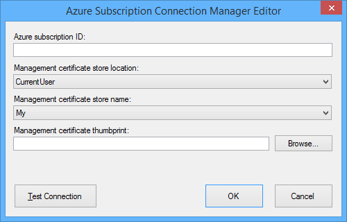

# Gestione connessione della sottoscrizione di Azure
  **Gestione connessione della sottoscrizione di Azure** consente di connettere un pacchetto SSIS a una sottoscrizione di Azure usando i valori specificati per le proprietà: ID sottoscrizione di Azure e Certificato di gestione.  
  
 Il **gestione connessione della sottoscrizione di Azure** è un componente del [Feature Pack di SQL Server Integration Services (SSIS) per Azure](../../integration-services/azure-feature-pack-for-integration-services-ssis.md).
  
1.  Nella finestra di dialogo **Aggiungi gestione connessione SSIS** mostrata sopra selezionare **Sottoscrizione di Azure**, quindi fare clic su **Aggiungi**.  Viene visualizzata la finestra di dialogo **Editor gestione connessione di Sottoscrizione di Azure** .  
  
    
  
2.  Immettere l'ID sottoscrizione di Azure, che identifica in modo univoco una sottoscrizione di Azure, per **ID sottoscrizione di Azure**.  Il valore si trova nel [portale di gestione di Azure](https://manage.windowsazure.com) nella pagina **Impostazioni** :  
  
      
  
3.  Scegliere il **percorso dell'archivio** e il **nome dell'archivio** del certificato di gestione dagli elenchi a discesa.  
  
4.  Immettere l' **identificazione personale del certificato di gestione** oppure fare clic su **Sfoglia** per scegliere un certificato dall'archivio selezionato. Il certificato deve essere caricato come certificato di gestione per la sottoscrizione. A tale scopo, fare clic su **Carica** nella pagina seguente del portale di Azure. Per altre informazioni, vedere questo [post MSDN](https://msdn.microsoft.com/library/azure/gg551722.aspx) .  
  
       
  
5.  Fare clic su **Test connessione** per testare la connessione.  
  
6.  Scegliere **OK** per chiudere la finestra di dialogo.  
  
  
