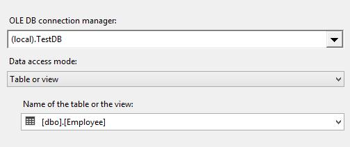
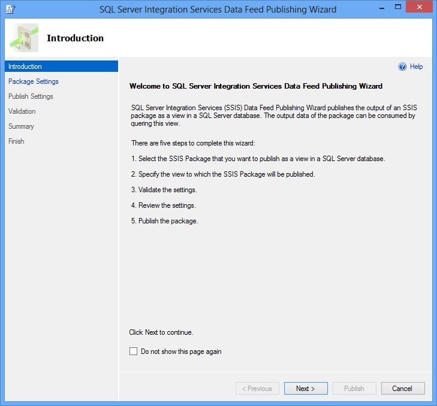
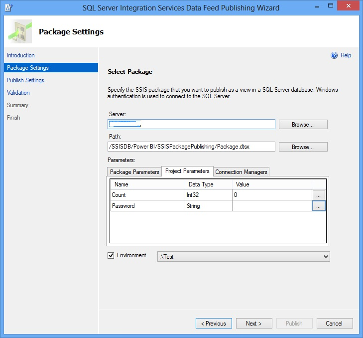
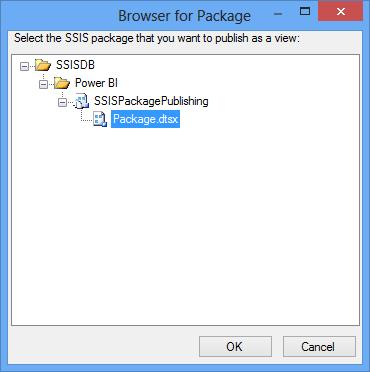
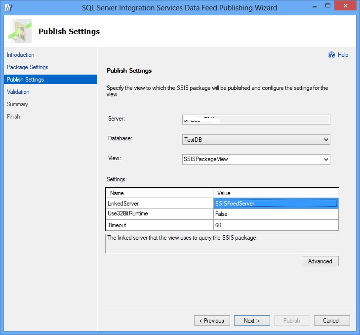
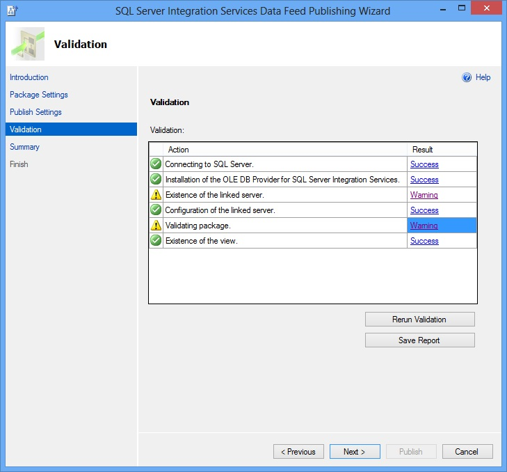
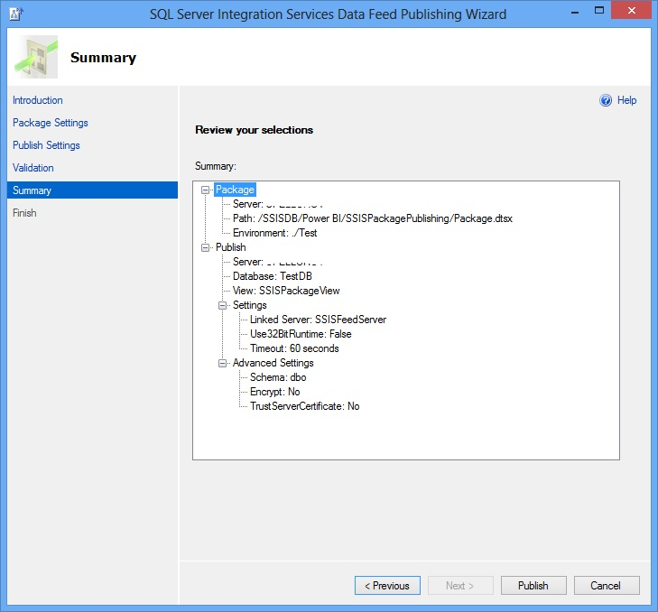

# <a name="walkthrough-publish-an-ssis-package-as-a-sql-view"></a>Procedura dettagliata: Pubblicare un pacchetto SSIS come vista SQL
  Questa procedura dettagliata fornisce le informazioni necessarie per pubblicare un pacchetto SSIS come vista SQL in un database di [!INCLUDE[ssNoVersion](../../includes/ssnoversion-md.md)] .  
  
## <a name="prerequisites"></a>Prerequisiti  
 Per eseguire questa procedura dettagliata è necessario che nel computer sia installato il software seguente:  
  
1.  [!INCLUDE[ssCurrent](../../includes/sscurrent-md.md)] o versioni successive con [!INCLUDE[ssNoVersion](../../includes/ssnoversion-md.md)] [!INCLUDE[ssISnoversion](../../includes/ssisnoversion-md.md)].  
  
2.  [SQL Server Data Tools](../../ssdt/download-sql-server-data-tools-ssdt.md).  
  
## <a name="step-1-build-and-deploy-ssis-project-to-the-ssis-catalog"></a>Passaggio 1: Creare e distribuire il progetto SSIS nel catalogo SSIS  
 In questo passaggio si crea un pacchetto SSIS che estrae dati da un'origine dati supportata da SSIS, in questo esempio un database [!INCLUDE[ssNoVersion](../../includes/ssnoversion-md.md)] , e restituisce i dati usando un componente Destinazione flusso di dati. Successivamente il progetto SSIS viene creato e distribuito nel catalogo SSIS.  
  
1.  Avviare **SQL Server Data Tools**. Fare clic sul menu **Start** , scegliere **Programmi**, **Microsoft SQL Server**, quindi **SQL Server Data Tools**.  
  
2.  Creare un nuovo progetto [!INCLUDE[ssISnoversion](../../includes/ssisnoversion-md.md)] .  
  
    1.  Fare clic su **File** nella barra dei menu, scegliere **Nuovo**e fare clic su **Progetto**.  
  
    2.  Espandere **Business Intelligence** nel riquadro sinistro e fare clic su **Integration Services** nella visualizzazione albero.  
  
    3.  Selezionare **Progetto di Integration Services** se non è già selezionato.  
  
    4.  Specificare **SSISPackagePublishing** come **Nome progetto**.  
  
    5.  Specificare un percorso per il progetto.  
  
    6.  Scegliere **OK** per chiudere la finestra di dialogo **Nuovo progetto** .  
  
3.  Trascinare il componente **Flusso di dati** da **Casella degli strumenti SSIS** nell'area di progettazione della scheda **Flusso di controllo** .  
  
4.  Fare doppio clic sul componente **Flusso di dati** in **Flusso di controllo** per aprire la **finestra di progettazione del flusso di dati**.  
  
5.  Trascinare un **componente di origine** dalla casella degli strumenti alla **finestra di progettazione del flusso di dati** e configurarlo per estrarre dati da un'origine dati.  
  
    1.  Ai fini della procedura dettagliata, creare un database di prova **TestDB** con una tabella **Dipendente**. Creare la tabella con tre colonne, **ID**, **Nome** e **Cognome**.  
  
    2.  Impostare **ID** come chiave primaria.  
  
    3.  Inserire due record con i dati seguenti.  
  
        |ID|Nome|Cognome|  
        |--------|---------------|--------------|  
        |1|John|Doe|  
        |2|Jane|Doe|  
  
    4.  Trascinare il componente **Origine OLE DB** dalla **Casella degli strumenti SSIS** nella **finestra di progettazione del flusso di dati**.  
  
    5.  Configurare il componente per estrarre i dati dalla tabella **Dipendente** nel database **TestDB** . Selezionare **(locale).TestDB** per **Gestione connessione OLE DB**, **Tabella o vista** per **Modalità di accesso ai dati**e **[dbo].[Dipendente]** per **Nome tabella o vista**.  
  
           
  
6.  Trascinare il componente **Destinazione flusso di dati** dalla casella degli strumenti nel flusso di dati. Questo componente si trova nella sezione Comune della casella degli strumenti.  
  
7.  Connettere il componente **Origine OLE DB** nel flusso di dati per il componente **Destinazione flusso di dati** .  
  
8.  Creare e distribuire il progetto SSIS nel catalogo SSIS.  
  
    1.  Fare clic su **Progetto** sulla barra dei menu e scegliere **Distribuisci**.  
  
    2.  Seguire le istruzioni della procedura guidata per distribuire il progetto nel catalogo SSIS nel server di database locale. L'esempio seguente usa **Power BI** come nome della cartella e **SSISPackagePublishing** come nome del progetto nel catalogo SSIS.  
  
## <a name="step-2-use-the-ssis-data-feed-publishing-wizard-to-publish-ssis-package-as-a-sql-view"></a>Passaggio 2: Usare la Pubblicazione guidata di feed di dati di SSIS per pubblicare il pacchetto SSIS come vista SQL.  
 In questo passaggio verrà usata la Pubblicazione guidata di feed di dati di SQL Server Integration Services (SSIS) per pubblicare il pacchetto SSIS come vista in un database di SQL Server. I dati di output del pacchetto possono essere utilizzati eseguendo query in questa vista.  
  
 La Pubblicazione guidata di feed di dati di SSIS crea un server collegato usando il provider OLE DB per SSIS (SSISOLEDB) e quindi crea una vista SQL costituita da una query di tale server. La query include il nome della cartella, il nome del progetto e il nome del pacchetto nel catalogo SSIS.  
  
 In fase di esecuzione, la vista invia la query al Provider OLE DB per SSIS usando il server collegato che è stato creato. Il provider OLE DB per SSIS esegue il pacchetto specificato nella query e restituisce il set di risultati tabulari alla query.  
  
1.  Avviare la **Pubblicazione guidata di feed di dati SSIS** eseguendo ISDataFeedPublishingWizard.exe da C:\Programmi\Microsoft SQL Server\130\DTS\Binn o facendo clic su Microsoft SQL Server 2016\Pubblicazione guidata di feed di dati di SQL Server 2016 in Start\Tutti i programmi.  
  
2.  Fare clic su **Avanti** nella pagina **Introduzione** .  
  
       
  
3.  Nella pagina **Impostazioni del pacchetto** effettuare le seguenti operazioni:  
  
    1.  Digitare il **nome** dell'istanza di SQL Server che contiene il catalogo SSIS o fare clic su **Sfoglia** per selezionare il server.  
  
           
  
    2.  Fare clic su **Sfoglia** accanto al campo Percorso, selezionare il catalogo SSIS, selezionare il pacchetto SSIS da pubblicare (ad esempio: **SSISDB**->**SSISPackagePublishing**->**Package.dtsx**) e quindi fare clic su **OK**.  
  
           
  
    3.  Usando le schede Parametri del pacchetto, Parametri del progetto e Gestioni connessioni nella parte inferiore della pagina, immettere i valori per i parametri di pacchetto, i parametri del progetto o le impostazioni di gestione connessione per il pacchetto. È anche possibile indicare un riferimento all'ambiente da usare per l'esecuzione del pacchetto e associare i parametri di progetto o del pacchetto alle variabili di ambiente.  
  
         È consigliabile associare parametri sensibili alle variabili di ambiente. In questo modo si garantisce che il valore di un parametro sensibile non venga archiviato nel formato di testo normale nella vista SQL creata dalla procedura guidata.  
  
    4.  Fare clic su **Avanti** per passare alla pagina **Impostazioni di pubblicazione** .  
  
4.  Nella pagina **Impostazioni di pubblicazione** effettuare le seguenti operazioni:  
  
    1.  Selezionare il **database** per la vista da creare.  
  
           
  
    2.  Digitare un **nome** per la **vista**. È anche possibile selezionare una vista esistente dall'elenco a discesa.  
  
    3.  Nell'elenco **Impostazioni** specificare un **nome** del **server collegato** da associare alla vista. Se il server collegato non esiste ancora, la procedura guidata creerà il server collegato prima di creare la vista. In questa pagina è anche possibile impostare i valori per **User32BitRuntime** e **Timeout** .  
  
    4.  Fare clic sul pulsante **Avanzate** . Viene visualizzata la finestra di dialogo **Impostazioni avanzate** .  
  
    5.  Nella finestra di dialogo **Impostazioni avanzate** effettuare le operazioni seguenti:  
  
        1.  Specificare lo schema del database in cui si vuole creare la vista (campo Schema).  
  
        2.  Specificare se i dati devono essere crittografati prima di inviarli in rete (campo Crittografa). Vedere [Utilizzo della crittografia senza convalida](http://msdn.microsoft.com/library/ms131691.aspx) per altre informazioni su questa impostazione e sull'impostazione TrustServerCertificate.  
  
        3.  Specificare se è possibile usare un certificato server autofirmato quando è abilitata l'impostazione di crittografia (campo**TrustServerCertificate** ).  
  
        4.  Fare clic su **OK** per chiudere la finestra di dialogo **Impostazioni avanzate** .  
  
    6.  Fare clic su **Avanti** per passare alla pagina **Convalida** .  
  
5.  Nella pagina **Convalida** esaminare i risultati della convalida dei valori per tutte le impostazioni. Nell'esempio seguente è visualizzato un **avviso** relativo all'esistenza del server collegato perché il server collegato non esiste nell'istanza di SQL Server selezionata. Se viene visualizzato **Errore** come **Risultato**, posizionare il mouse su **Errore** per visualizzare i relativi dettagli. Ad esempio, se non è stata abilitata l'opzione Consenti in-process per il provider SSISOLEDB, verrà visualizzato un errore relativo all'azione di configurazione del server collegato.  
  
       
  
6.  Per salvare questo report come file XML, fare clic su Salva report.  
  
7.  Fare clic su **Avanti** nella pagina **Convalida** per passare alla pagina **Riepilogo** .  
  
8.  Verificare le selezioni nella pagina **Riepilogo** e fare clic su **Pubblica** per avviare il processo di pubblicazione, che creerà il server collegato se non esiste già nel server e quindi creare la vista usando il server collegato.  
  
       
  
     Ora è possibile eseguire query sui dati di output del pacchetto usando l'istruzione SQL seguente sul database TestDB: SELECT * FROM [SSISPackageView].  
  
9. Per salvare questo report come file XML, fare clic su **Salva report**.  
  
10. Esaminare i risultati del processo di pubblicazione e fare clic su **Fine** per chiudere la procedura guidata.  
  
    > [!NOTE]  
    >  Non sono supportati i tipi di dati seguenti: text, ntext, image, nvarchar(max), varchar(max) e varbinary(max).  
  
## <a name="step-3-test-the-sql-view"></a>Passaggio 3: Testare la vista SQL  
 In questo passaggio si eseguirà la vista SQL creata dalla Pubblicazione guidata di feed di dati di SSIS.  
  
1.  Avviare SQL Server Management Studio.  
  
2.  Espandere \< **nome macchina**>, **database**, \< **database selezionato nella procedura guidata**>, e **viste**.  
  
3.  Fare doppio clic su di \< **vista creata dalla procedura guidata**> creato dalla procedura guidata e fare clic su **selezionare le prime 1000 righe**.  
  
4.  Confermare la visualizzazione dei risultati del pacchetto SSIS.  
  
## <a name="step-4-verify-the-ssis-package-execution"></a>Passaggio 4: Verificare l'esecuzione del pacchetto SSIS  
 In questo passaggio si verificherà che il pacchetto SSIS sia stato eseguito.  
  
1.  In SQL Server Management Studio espandere **Cataloghi di Integration Services**, **SSISDB**, la **cartella** in cui esiste il progetto SSIS, **Progetti**, il nodo del progetto e **Pacchetti**.  
  
2.  Fare clic con il pulsante destro del mouse sul pacchetto SSIS e quindi fare clic su **Report**, scegliere **Report standard**e quindi fare clic su **Tutte le esecuzioni**.  
  
3.  Viene visualizzata l'esecuzione del pacchetto SSIS nel report.  
  
    > [!NOTE]  
    >  In un computer Windows Vista Service Pack 2 potrebbero essere visualizzate due esecuzioni del pacchetto SSIS nel report, una riuscita e l'altra non riuscita. Ignorare quella non riuscita perché è causata da un problema noto di questa versione.  
  
## <a name="more-info"></a>Altre informazioni  
 La Pubblicazione guidata di feed di dati esegue i passaggi importanti seguenti:  
  
1.  Crea un server collegato e lo configura per usare il provider OLE DB per SSIS.  
  
2.  Crea una visualizzazione SQL nel database specificato, che esegue query sul server collegato con informazioni del catalogo per il pacchetto selezionato.  
  
 Questa sezione include procedure per la creazione di un server collegato e di una vista SQL senza usare la Pubblicazione guidata di feed di dati. Include anche informazioni aggiuntive sull'uso della funzione OPENQUERY con il provider OLE DB per SSIS.  
  
### <a name="create-a-linked-server-using-the-ole-db-provider-for-ssis"></a>Creare un server collegato usando il provider OLE DB per SSIS  
 Per creare un server collegato usando il provider OLE DB per SSIS (SSISOLEDB) eseguire la query seguente in SQL Server Management Studio.  
  
```sql 
  
USE [master]  
GO  
  
EXEC sp_addlinkedserver  
@server = N'SSISFeedServer',  
@srvproduct = N'Microsoft',  
@provider = N'SSISOLEDB',  
@datasrc = N'.'  
GO  
  
```  
  
### <a name="create-a-view-using-linked-server-and-ssis-catalog-information"></a>Creare una vista usando un server collegato e le informazioni del catalogo SSIS  
 In questo passaggio si creerà una vista SQL che esegue una query sul server collegato creato nella sezione precedente. La query include il nome della cartella, il nome del progetto e il nome del pacchetto nel catalogo SSIS.  
  
 Durante l'esecuzione della vista, la query del server collegato definito nella vista avvia il pacchetto SSIS specificato nella query e riceve l'output del pacchetto come un set di risultati tabulari.  
  
1.  Prima di creare la vista digitare ed eseguire la query seguente nel nuovo intervallo di query. OPENQUERY è una funzione di set di righe supportata da SQL Server. Esegue la query pass-through specificata sul server collegato specificato usando il provider OLE DB associato a tale server. È possibile fare riferimento alla funzione OPENQUERY nella clausola FROM di una query come se fosse un nome di tabella. Vedere la [documentazione su OPENQUERY in MSDN Library](http://msdn.microsoft.com/library/ms188427.aspx) per altre informazioni.  
  
    ```sql
    SELECT * FROM OPENQUERY(SSISFeedServer,N'Folder=Eldorado;Project=SSISPackagePublishing;Package=Package.dtsx')   
    GO  
    ```  
  
    > [!IMPORTANT]  
    >  Se necessario, aggiornare il nome della cartella, il nome del progetto e il nome del pacchetto. Se la funzione OPENQUERY non riesce, in **SQL Server Management Studio**espandere **Oggetti server**, **Server collegati**, **Provider**, fare doppio clic sul provider **SSISOLEDB** e assicurarsi che l'opzione **Consenti in-process** sia abilitata.  
  
2.  Creare una vista nel database **TestDB** per le finalità di questa procedura dettagliata eseguendo la query seguente.  
  
    ```sql
  
    USE [TestDB]   
    GO   
  
    CREATE VIEW SSISPackageView AS   
    SELECT * FROM OPENQUERY(SSISFeedServer, 'Folder=Eldorado;Project=SSISPackagePublishing;Package=Package.dtsx')   
    GO  
  
    ```  
  
3.  Testare la vista eseguendo la query seguente.  
  
    ```sql
    SELECT * FROM SSISPackageView  
    ```  
  
### <a name="openquery-function"></a>Funzione OPENQUERY  
 La sintassi per la funzione OPENQUERY è:  
  
```sql 
SELECT * FROM OPENQUERY(<LinkedServer Name>, N’Folder=<Folder Name from SSIS Catalog>; Project=<SSIS Project Name>; Package=<SSIS Package Name>; Use32BitRuntime=[True | False];Parameters=”<parameter_name_1>=<value1>; parameter_name_2=<value2>”;Timeout=<Number of Seconds>;’)  
```  
  
 I parametri Folder, Project e Package sono obbligatori. Use32BitRuntime, Timeout e Parameters sono facoltativi.  
  
 Il valore di Use32BitRuntime può essere 0, 1, true o false. Indica se il pacchetto deve essere eseguito con il runtime a 32 bit (1 o true) quando la piattaforma di SQL Server è a 64 bit.  
  
 Timeout indica il numero di secondi che il provider OLE DB per SSIS può attendere prima dell'arrivo di nuovi dati dal pacchetto SSIS. Per impostazione predefinita il timeout è di 60 secondi. Per il timeout è possibile specificare un valore intero compreso tra 20 e 32.000.  
  
 I parametri contengono il valore sia dei parametri del pacchetto che dei parametri del progetto. Le regole per i parametri sono le stesse dei parametri in [DTExec](http://msdn.microsoft.com/library/hh231187.aspx).  
  
 L'elenco seguente specifica i caratteri speciali consentiti nella clausola di query:  
  
-   Virgoletta singola ('): questo carattere è supportato da OPENQUERY standard. Se si vuole usare la virgoletta singola nella clausola di query, usare due virgolette singole ('').  
  
-   Virgolette doppie ("): la parte della query relativa ai parametri è racchiusa tra virgolette doppie. Se un valore del parametro stesso contiene virgolette doppie, usare il carattere di escape. Ad esempio: \".  
  
-   Parentesi quadre sinistra e destra ([ and ]): questi caratteri vengono usati per indicare gli spazi iniziale e finale. Ad esempio, "[ alcuni spazi ]" rappresenta la stringa " alcuni spazi " con uno spazio iniziale e uno finale. Se questi caratteri vengono usati nella clausola di query, è necessario sottoporli a escape. Ad esempio \\[ e \\].  
  
-   Barra (\\): ogni barra usata nella clausola di query deve usare il carattere di escape. Ad esempio, \\\ viene valutato come \ nella clausola di query.  
  
 Barra (\\): ogni barra usata nella clausola di query deve usare il carattere di escape. Ad esempio, \\\ viene valutato come \ nella clausola di query.  
  
## <a name="see-also"></a>Vedere anche  
 [Destinazione flusso di dati](../../integration-services/data-flow/data-streaming-destination.md)   
 [Configurare la destinazione flusso di dati](../../integration-services/data-flow/configure-data-streaming-destination.md)  
  
  

