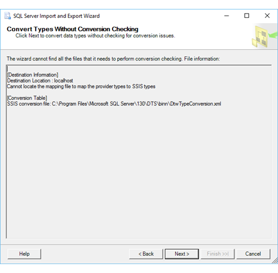

# Converti tipi senza eseguire i controlli di conversione (Importazione/Esportazione guidata SQL Server)
  Dopo aver selezionato le tabelle e le viste per copiare o rivedere la query fornita, l’Importazione/Esportazione guidata [!INCLUDE[ssNoVersion](../../includes/ssnoversion-md.md)] potrebbe mostrare **Converti tipi senza eseguire i controlli di conversione**. La procedura guidata visualizza questa pagina quando non è in grado di individuare uno o più file di conversione dei tipi di dati e di mapping necessari per mappare i tipi di dati tra origine e destinazione. La pagina contiene informazioni che semplificano l’individuazione di cosa manca.
  
 Fare clic su **Avanti** per continuare senza sapere se le conversioni dei tipi di dati avranno esito positivo. In alternativa, fare clic su **Indietro** per modificare le selezioni oppure fare clic su **Annulla** per uscire dalla procedura guidata.
  
 Per informazioni sul modo in cui la procedura guidata esegue il mapping dei tipi di dati tra le colonne di origine e quelle di destinazione e usa i file di mapping dei tipi di dati, vedere [Come viene eseguito il mapping dei tipi di dati tra origine e destinazione durante la procedura guidata?](Import%20and%20Export%20Data%20with%20the%20SQL%20Server%20Import%20and%20Export%20Wizard.md\#wizardMapping)  

## Screenshot della pagina Converti tipi  
  
La schermata riportata di seguito mostra un esempio della pagina **Converti tipi senza eseguire i controlli di conversione** della procedura guidata.

Il problema è che la procedura guidata non è in grado di trovare un file di mapping che esegue il mapping dei tipi di dati per la destinazione selezionata.

Le informazioni contenute in questa pagina non includono il nome del file di mapping mancante. Poiché la procedura guidata non sa se esiste un file per il provider di dati specificato, non può indicare il nome del file mancante.

## Operazioni successive  
 Dopo aver fatto clic su **Avanti** per continuare senza sapere se le conversioni dei tipi di dati avranno esito positivo, la pagina successiva visualizzata è **Salvare ed eseguire il pacchetto**. In questa pagina specificare se eseguire immediatamente l'operazione di copia. A seconda della configurazione, è anche possibile salvare il pacchetto [!INCLUDE[ssNoVersion](../../includes/ssnoversion-md.md)] [!INCLUDE[ssISnoversion](../../includes/ssisnoversion-md.md)] creato dalla procedura guidata per personalizzarlo e usarlo di nuovo in seguito. Per altre informazioni, vedere [Salvare ed eseguire il pacchetto](../../integration-services/import-export-data/save-and-run-package-sql-server-import-and-export-wizard.md).  
