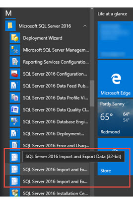
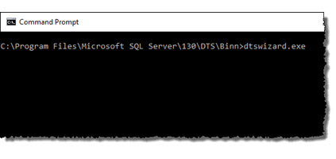

# Avviare l&#39;Importazione/Esportazione guidata SQL Server
È possibile avviare l'Importazione/Esportazione guidata [!INCLUDE[ssNoVersion](../../includes/ssnoversion-md.md)] nei modi seguenti.
-   Dal [menu Start](#startStart) o dal [prompt dei comandi](#startCmd), per importare o esportare in una qualsiasi origine dati supportata.
-   Da [SQL Server Management Studio (SSMS)](#startSSMS), per importare o esportare da SQL Server.
-   Da [Visual Studio con SQL Server Data Tools (SSDT)](#startVS), se è aperto un progetto di SQL Server Integration Services.

Questo argomento descrive solo come **avviare** la procedura guidata.
-   Per una panoramica della procedura guidata, vedere [Importare ed esportare dati con l'Importazione/Esportazione guidata SQL Server](../../integration-services/import-export-data/import-and-export-data-with-the-sql-server-import-and-export-wizard.md).
-   Per informazioni sui passaggi della procedura guidata, selezionare la pagina desiderata nel menu di navigazione del contenuto. Per ogni pagina della procedura guidata è disponibile una pagina di documentazione separata. In alternativa, premere il tasto F1 da qualsiasi pagina o finestra di dialogo della procedura guidata per visualizzare la documentazione relativa alla pagina corrente.

**Ottenere la procedura guidata.** Se si vuole eseguire la procedura guidata, ma [!INCLUDE[msCoName] (../Token/msCoName_md.md)] [!INCLUDE[ssNoVersion](../../includes/ssnoversion-md.md)] non è disponibile nel computer, è possibile installare l'Importazione/Esportazione guidata [!INCLUDE[ssNoVersion](../../includes/ssnoversion-md.md)] installando SQL Server Data Tools (SSDT). Per altre informazioni, vedere [Scaricare SQL Server Data Tools (SSDT)](https://msdn.microsoft.com/library/mt204009.aspx).  

##  Avviare la procedura guidata dal menu Start  
1.  Scegliere **Tutte le app** dal menu **Start**.
2.  Trovare ed espandere **Microsoft SQL Server 2016**.
3.  Fare clic su una delle opzioni seguenti.
  
    -   **Import. ed esport. dati di SQL Server 2016 (64 bit)**
          
    -   **Import. ed esport. dati di SQL Server 2016 (32 bit)**  
  
Eseguire la versione a 64 bit della procedura guidata a meno che l'origine dati non richieda un provider di dati a 32 bit.
 

  
##  Avviare la procedura guidata dal prompt dei comandi  
In una finestra del prompt dei comandi eseguire **DTSWizard.exe** da una delle posizioni seguenti.  
  
-   **C:\Programmi\Microsoft SQL Server\130\DTS\Binn** per la versione a 64 bit.  
  
-   **C:\Programmi (x86)\Microsoft SQL Server\130\DTS\Binn** per la versione a 32 bit.  
  
Eseguire la versione a 64 bit della procedura guidata a meno che l'origine dati non richieda un provider di dati a 32 bit.

  
  
##  Avviare la procedura guidata da SQL Server Management Studio (SSMS)  
1.  In [!INCLUDE[ssManStudioFull](../../includes/ssmanstudiofull-md.md)] connettersi a un'istanza del [!INCLUDE[ssDE](../../includes/ssde-md.md)] di [!INCLUDE[ssNoVersion](../../includes/ssnoversion-md.md)].
2.  Espandere **Database**.
3.  Fare clic con il pulsante destro del mouse su un database.
4.  Scegliere **Attività**.
5.  Fare clic su una delle opzioni seguenti.
  
    -   **Importare dati**
      
    -   **Esportare dati**  

 

Se SQL Server non è installato o è installato senza SQL Server Management Studio, vedere [Scaricare SQL Server Management Studio (SSMS)](https://msdn.microsoft.com/library/mt238290.aspx).
    
##  Avviare la procedura guidata da Visual Studio con SQL Server Data Tools (SSDT)  
 In Visual Studio con [!INCLUDE[ssBIDevStudioFull](../../includes/ssbidevstudiofull-md.md)], eseguire una delle operazioni seguenti se è aperto un progetto di Integration Services.  
  
-   Scegliere **Importazione ed esportazione guidata di SSIS** dal menu **Progetto**. 

     
    
    \- oppure
    
-   In Esplora soluzioni fare clic con il pulsante destro del mouse sulla cartella **Pacchetti SSIS** e quindi scegliere **Importazione ed esportazione guidata di SSIS**.

    

Se Visual Studio non è installato o è installato senza SQL Server Data Tools, vedere [Scaricare SQL Server Data Tools (SSDT)](https://msdn.microsoft.com/library/mt204009.aspx). 

## Visualizzare la Guida durante l'esecuzione della procedura guidata
> [!TIP] Premere il tasto F1 da qualsiasi pagina o finestra di dialogo della procedura guidata per visualizzare la documentazione relativa alla pagina corrente.   

 ## Operazioni successive  
 La prima pagina visualizzata all'avvio della procedura guidata è **Importazione/Esportazione guidata SQL Server**. Non è necessario eseguire alcuna operazione in questa pagina. Per altre informazioni, vedere [Importazione/Esportazione guidata SQL Server](../../integration-services/import-export-data/welcome-to-sql-server-import-and-export-wizard.md).  
  
  