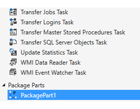
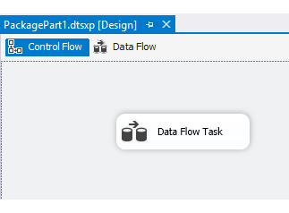
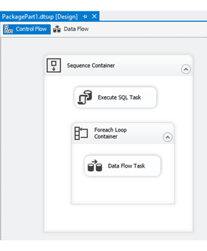
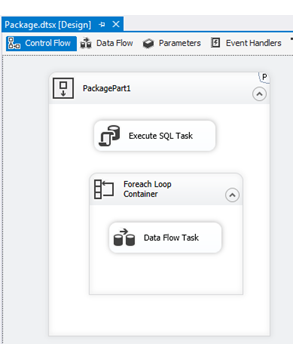
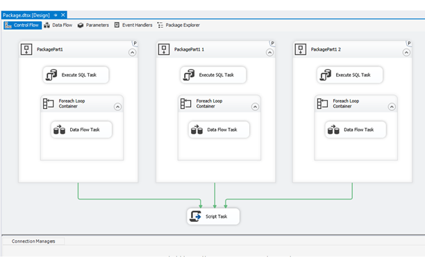
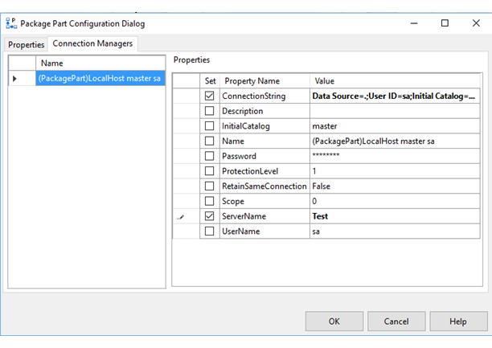
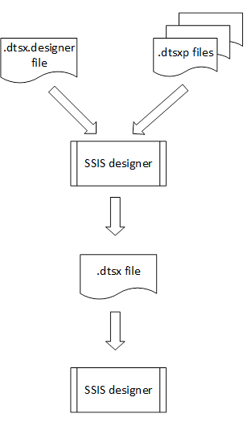

# Riusare il flusso di controllo dei pacchetti tramite le parti del pacchetto del flusso di controllo
  Salvare un'attività o un contenitore di flusso di controllo di uso comune in un file di parte autonomo (file con estensione dtsxp) e riusarli più volte in uno o più pacchetti usando le parti del flusso di controllo. Questa riusabilità semplifica la progettazione e la manutenzione dei pacchetti SSIS.  
  
## Creare una nuova parte del pacchetto del flusso di controllo  
 Per creare una nuova parte del pacchetto del flusso controllo, in Esplora soluzioni espandere la cartella **Parti del pacchetto** . Fare clic con il pulsante destro del mouse su **Flusso di controllo** e selezionare **Nuova parte del pacchetto del flusso di controllo**.  
  
   
  
 Viene creato un nuovo file di parte con estensione dtsxp nella cartella **Parti del pacchetto | Flusso di controllo** . Allo stesso tempo, viene aggiunto un nuovo elemento con lo stesso nome nella casella degli strumenti SSIS (l'elemento della casella degli strumenti è visibile solo quando si dispone di un progetto che contiene la parte sia aperto in Visual Studio).  
  
   
  
## Progettare una parte del pacchetto del flusso di controllo  
 Per aprire l'editor delle parti del pacchetto, fare doppio clic sul file di parte in Esplora soluzioni. È possibile progettare la parte esattamente come si progetta un pacchetto.  
  
   
  
   
  
 Le parti del pacchetto del flusso di controllo presentano le limitazioni seguenti.  
  
-   Una parte può avere solo un contenitore o un'attività di livello principale. Se si desidera includere più attività o contenitori, inserirli in un unico contenitore di sequenza.  
  
-   Non è possibile eseguire o eseguire il debug di una parte direttamente nella finestra di progettazione.  
  
## Aggiungere una parte del pacchetto del flusso di controllo esistente a un pacchetto  
 È possibile riusare le parti che vengono salvate nel progetto di Servizi di integrazione corrente o in un progetto diverso.  
  
-   Per riusare una parte del progetto corrente, trascinare e rilasciare la parte dalla casella degli strumenti.  
  
-   Per riusare una parte di un progetto diverso, usare il comando **Aggiungi parte del pacchetto del flusso di controllo esistente** .  
  
### Trascinare e rilasciare una parte del pacchetto del flusso di controllo  
 Per riusare una parte in un progetto, è sufficiente trascinare e rilasciare l'elemento della parte dalla casella degli strumenti come qualsiasi altra attività o contenitore. È possibile trascinare e rilasciare più volte la parte in un pacchetto per usare la logica in più posizioni nel pacchetto. Impiegare questo metodo per riusare una parte del progetto corrente.  
  
   
  
   
  
 Quando si salva il pacchetto, Progettazione SSIS controlla se sono presenti istanze di parte nel pacchetto.  
  
-   Se il pacchetto contiene istanze di parte, la finestra di progettazione genera un nuovo file con estensione dtsx che contiene tutte le informazioni relative alla parte.  
  
-   Se il pacchetto non contiene parti, la finestra di progettazione elimina qualsiasi file con estensione dtsx creato in precedenza per il pacchetto (ovvero, qualsiasi file di progettazione con estensione dtsx con lo stesso nome del pacchetto).  
  
   
  
### Aggiungere una copia di una parte del pacchetto del flusso di controllo esistente o un riferimento a una parte esistente  
 Per aggiungere a un pacchetto una copia di una parte esistente nel file system, in Esplora soluzioni espandere la cartella **Parti del pacchetto** . Fare clic con il pulsante destro del mouse su **Flusso di controllo** e selezionare **Aggiungi parte del pacchetto del flusso di controllo esistente**.  
  
   
  
   
  
 **Opzioni**  
  
 **Percorso della parte del pacchetto**  
 Digitare il percorso del file di parte o fare clic sul pulsante Sfoglia (...) e individuare il file di parte da copiare o a cui fare riferimento.  
  
 **Aggiungi come riferimento**  
 -   Se viene selezionata questa opzione, la parte viene aggiunta al progetto di Servizi di integrazione come riferimento. Selezionare questa opzione quando si desidera fare riferimento a una singola copia di un file di parte in più progetti di Servizi di integrazione.  
  
-   Se deselezionata, una copia del file di parte viene aggiunta al progetto.  
  
## Configurare una parte del pacchetto del flusso di controllo  
 Per configurare le parti del pacchetto del flusso di controllo dopo averle aggiunte al flusso di controllo di un pacchetto, usare la finestra di dialogo **Configurazione della parte del pacchetto**  .  
  
#### Per aprire la finestra di dialogo Configurazione della parte del pacchetto  
  
1.  Per configurare un'istanza di parte, fare doppio clic sull'istanza di parte specifica nel flusso di controllo. Oppure fare clic con il pulsante destro del mouse sull'istanza di parte e selezionare **Modifica**. Si apre la finestra di dialogo **Configurazione della parte del pacchetto** .  
  
2.  Configurare le proprietà e le gestioni connessioni per l'istanza di parte.  
  
### Scheda Proprietà  
 Usare la scheda **Proprietà** della finestra di dialogo **Configurazione della parte del pacchetto**  per specificare le proprietà della parte.  
  
   
  
 La gerarchia della visualizzazione ad albero nel riquadro sulla sinistra elenca tutte le proprietà configurabili dell'istanza di parte.  
  
-   Se deselezionata, la proprietà non è configurata nell'istanza di parte. L'istanza di parte usa il valore predefinito per la proprietà, definito nella parte del pacchetto del flusso di controllo.  
  
-   Se selezionata, il valore immesso o selezionato esegue l'override del valore predefinito.  
  
 La tabella nel riquadro sulla destra elenca le proprietà da configurare.  
  
-   **Percorso proprietà**. Il percorso della proprietà.  
  
-   **Tipo proprietà**. Tipo di dati della proprietà.  
  
-   **Valore**. Il valore configurato. Questo valore esegue l'override del valore predefinito.  
  
### Scheda Gestioni connessioni  
 Usare la scheda **Gestioni connessioni** della finestra di dialogo **Configurazione della parte del pacchetto**  per specificare le proprietà delle gestioni connessioni dell'istanza di parte.  
  
   
  
 La tabella nel riquadro sulla sinistra elenca tutte le gestioni connessioni definite nella parte del flusso di controllo. Scegliere la gestione connessione che si desidera configurare.  
  
 L'elenco nel riquadro sulla destra riporta le proprietà della gestione connessione selezionata.  
  
-   **Imposta**. Selezionata se la proprietà è configurata per l'istanza di parte.  
  
-   **Nome proprietà**. Nome della proprietà.  
  
-   **Valore**. Il valore configurato. Questo valore esegue l'override del valore predefinito.  
  
## Eliminare una parte del flusso di controllo  
 Per eliminare una parte, in Esplora soluzioni fare clic con il pulsante destro del mouse sulla parte, quindi scegliere **Elimina**. Selezionare **OK** per confermare l'eliminazione oppure **Annulla** per mantenere la parte.  
  
 Se si elimina una parte da un progetto, viene eliminata definitivamente dal file system e non può essere ripristinata.  
  
> [!NOTE]  
>  Se si vuole rimuovere una parte da un progetto di Servizi di integrazione, ma continuare a usarla in altri progetti, scegliere l'opzione **Escludi dal progetto**  anziché l'opzione **Elimina** .  
  
## Le parti del progetto sono disponibili solo in modalità di progettazione  
 Le parti del progetto sono proprio una funzionalità della modalità di progettazione Progettazione SSIS crea, apre, salva e aggiorna le parti e aggiunge, configura o elimina le istanze di parte di un pacchetto. Tuttavia, SSIS Runtime non riconosce le parti. Ecco come la finestra di progettazione ottiene la separazione.  
  
-   La finestra di progettazione consente di salvare le istanze delle parti del pacchetto con le proprietà configurate in un file con estensione dtsx.designer.  
  
-   Se la finestra di progettazione consente di salvare il file con estensione dtsx.designer, è anche possibile estrarre il contenuto dalle parti a cui il file fa riferimento e sostituire le istanze di parte nel pacchetto con il contenuto delle parti.  
  
-   Infine tutto il contenuto, che non include più informazioni sulla parte, viene salvato nel file di pacchetto con estensione dtsx. Questo è il file che viene eseguito da SSIS Runtime.  
  
 Il diagramma seguente illustra la relazione tra le parti (file con estensione dtsxp), Progettazione SSIS e SSIS Runtime.  
  
   
  
  
