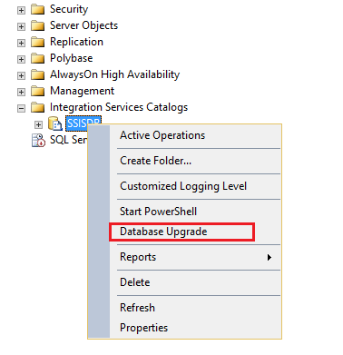

# Aggiornare il catalogo SSIS (SSISDB)
  Eseguire Aggiornamento guidato del database SSISDB per aggiornare il database di catalogo SSIS, SSISDB, quando il database è antecedente alla versione corrente dell'istanza di SQL Server. Ciò si verifica quando viene soddisfatta una delle condizioni seguenti.  
  
-   Il database è stato ripristinato da una versione precedente di SQL Server.  
  
-   Il database non è stato rimosso da un gruppo di disponibilità AlwaysOn prima di aggiornare l'istanza di SQL Server. In questo modo si impedisce l'aggiornamento automatico del database. Per ulteriori informazioni, vedere [Upgrading SSISDB in an availability group](../../integration-services/service/always-on-for-ssis-catalog-ssisdb.md#Upgrade).  
  
 La procedura guidata può aggiornare solo il database in un'istanza del server locale.  
  
## Aggiornare il catalogo SSIS (SSISDB) con Aggiornamento guidato del database SSISDB  
  
1.  Eseguire il backup del database del catalogo SSIS, SSISDB.  
  
2.  In [!INCLUDE[ssManStudioFull](../../includes/ssmanstudiofull-md.md)]espandere il server locale e **Cataloghi di Integration Services**.  
  
3.  Fare clic con il pulsante destro del mouse su **SSISDB** e quindi selezionare **Aggiornamento database** per avviare Aggiornamento guidato del database SSISDB.  
  
       
  
4.  Nella pagina **Seleziona istanza** selezionare un'istanza di SQL Server nel server locale.  
  
    > [!IMPORTANT]  
    >  La procedura guidata può aggiornare solo il database in un'istanza del server locale.  
  
     Selezionare la casella di controllo per indicare che è stato eseguito il backup del database SSISDB prima della procedura guidata.  
  
       
  
5.  Selezionare **Aggiorna** per aggiornare il database del catalogo SSIS.  
  
6.  Nella pagina **Risultato** esaminare i risultati.  
  
       
  
  