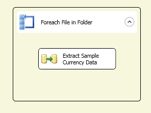

# Passaggio 3: Test del pacchetto creato nella lezione 3 dell&#39;esercitazione
In questa attività verrà eseguito il pacchetto Lesson 3.dtsx. Durante l'esecuzione del pacchetto, nella finestra Registra eventi verranno elencate le voci di log scritte nel file di log. Al termine dell'esecuzione del pacchetto sarà possibile verificare il contenuto del file di log generato dal provider di log.  
  
## Verifica del layout del pacchetto  
Prima di testare il pacchetto è consigliabile verificare che il flusso di controllo e il flusso di dati nel pacchetto della lezione 3 contengano gli oggetti visualizzati nelle figure seguenti. Il flusso di controllo deve essere identico a quello nella lezione 2. Il flusso di dati deve essere identico a quello nelle lezioni 1 e 2.  
  
**Flusso di controllo**  
  
  
  
**Flusso di dati**  
  
  
  
### Per eseguire il pacchetto creato nella lezione 4 dell'esercitazione  
  
1.  Scegliere Registra eventi dal menu SSIS.  
  
2.  Scegliere **Avvia debug** dal menu **Debug**.  
  
3.  Al termine dell'esecuzione del pacchetto, scegliere **Arresta debug** dal menu **Debug**.  
  
### Per esaminare il file di log generato  
  
-   Aprire il file TutorialLog.log in Blocco note o in un altro editor di testo.  
  
-   Sebbene la semantica delle informazioni generate per gli eventi **PipelineExecutionPlan** e **PipelineExecutionTrees** esuli dall'ambito di questa esercitazione, si può notare che nella prima riga sono elencati i campi di informazione specificati nella scheda **Dettagli** della finestra di dialogo **Configura log SSIS** . È inoltre possibile verificare che i due eventi selezionati, PipelineExecutionPlan e PipelineExecutionTrees, sono stati inseriti nel log per ogni iterazione del ciclo Foreach.  
  
## Lezione successiva  
[Lezione 4: Aggiungere il reindirizzamento del flusso errato tramite SSIS](../integration-services/lesson-4-add-error-flow-redirection-with-ssis.md)  
  
  
  
