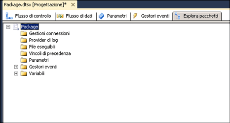

# Visualizzazione di oggetti di pacchetto
  In Progettazione [!INCLUDE[ssIS](../includes/ssis-md.md)] è disponibile la scheda **Esplora pacchetti** , che consente di visualizzare i pacchetti in una modalità simile a quella di Esplora risorse. La visualizzazione riflette la gerarchia dei contenitori dell'architettura di [!INCLUDE[ssISnoversion](../includes/ssisnoversion-md.md)] . Il contenitore del pacchetto si trova al livello principale della gerarchia. Espandendo il pacchetto è possibile visualizzare le connessioni, gli eseguibili, i gestori di eventi, i provider di log, i vincoli di precedenza e le variabili del pacchetto.  
  
 Gli eseguibili, ovvero i contenitori e le attività nel pacchetto, possono includere gestori di eventi, vincoli di precedenza e variabili. [!INCLUDE[ssISnoversion](../includes/ssisnoversion-md.md)] supporta una gerarchia nidificata di contenitori. A loro volta, i contenitori Ciclo For, Ciclo Foreach e Sequenza possono includere altri eseguibili.  
  
 Se un pacchetto include un flusso di dati, in **Esplora pacchetti** verranno visualizzate l'attività Flusso di dati e una cartella **Componenti** contenente l'elenco dei componenti del flusso di dati.  
  
 Dalla scheda **Esplora pacchetti** è possibile eliminare oggetti da un pacchetto e accedere alla finestra **Proprietà** per visualizzare le proprietà degli oggetti.  
  
 Nella figura seguente viene illustrata l'albero di un semplice pacchetto.  
  
   
  
### Per visualizzare il contenuto di un pacchetto  
  
-   [Visualizzazione degli oggetti dei pacchetti in Esplora pacchetti](../Topic/View%20Package%20Objects%20in%20Package%20Explorer.md)  
  
## Vedere anche  
 [Attività di Integration Services](../integration-services/control-flow/integration-services-tasks.md)   
 [Contenitori in Integration Services](../integration-services/control-flow/integration-services-containers.md)   
 [Vincoli di precedenza](../integration-services/control-flow/precedence-constraints.md)   
 [Variabili di Integration Services &#40;SSIS&#41;](../integration-services/integration-services-ssis-variables.md)   
 [Gestori eventi di Integration Services &#40;SSIS&#41;](../integration-services/integration-services-ssis-event-handlers.md)   
 [Registrazione di Integration Services &#40;SSIS&#41;](../integration-services/performance/integration-services-ssis-logging.md)  
  
  