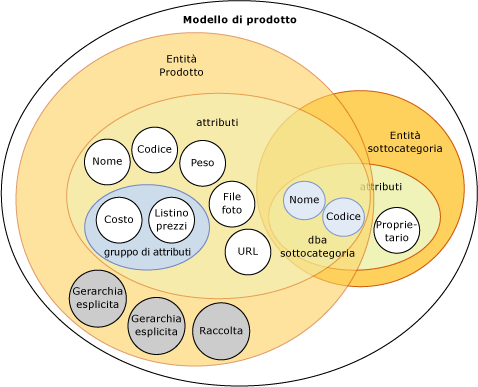
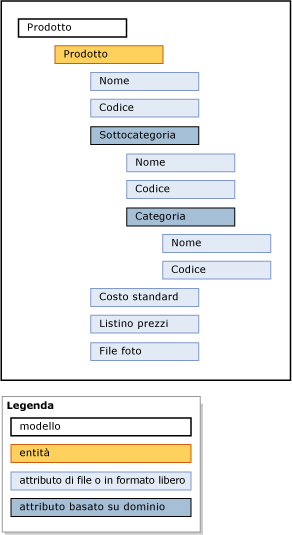

# Modelli (Master Data Services)
  I modelli rappresentano il livello più elevato di organizzazione dei dati in [!INCLUDE[ssMDSshort](../includes/ssmdsshort-md.md)]. Un modello definisce la struttura di dati nella soluzione di gestione dati master. Un modello contiene gli oggetti seguenti:  
  
-   Entità  
  
-   Attributi e gruppi di attributi  
  
-   Gerarchie derivate ed esplicite  
  
-   Raccolte  
  
 I modelli organizzano la struttura dei dati master. Il [!INCLUDE[ssMDSshort](../includes/ssmdsshort-md.md)] implementazione può avere uno o più modelli che ogni gruppo di tipi di dati simili. I dati master rientrano in genere in una delle quattro categorie seguenti: persone, luoghi, cose o concetti. È ad esempio possibile creare un modello Product per contenere dati relativi al prodotto oppure un modello Customer per contenere dati relativi al cliente.  
  
 È possibile assegnare le autorizzazioni di utenti e gruppi per visualizzare e aggiornare oggetti all'interno del modello. Se non si assegnano autorizzazioni al modello, questo non verrà visualizzato.  
  
 In qualsiasi momento è possibile creare copie dei dati master all'interno di un modello. Queste copie sono denominate versioni.  
  
 Dopo aver definito un modello in un ambiente di prova, è possibile distribuirlo, con o senza i dati corrispondenti, dall'ambiente di prova in un ambiente di produzione. In questo modo viene eliminata la necessità di ricreare i modelli nell'ambiente di produzione.  
  
## Correlazione tra modelli e altri oggetti  
 Un modello contiene entità. Le entità contengono attributi, gerarchie esplicite e raccolte. È possibile contenere gli attributi in gruppi di attributi. Gli attributi si dicono basati su dominio quando un'entità viene utilizzata come un attributo per un'altra entità.  
  
 La seguente immagine illustra la relazione tra gli oggetti di un modello.  
  
   
  
> [!NOTE]  
>  Anche le gerarchie derivate sono oggetti modello, ma non sono presenti nell'immagine. Le gerarchie derivate sono basate sulle relazioni tra gli attributi basati su dominio che esistono in un modello. Vedere [derivato gerarchie & #40; Master Data Services & #41;](../master-data-services/derived-hierarchies-master-data-services.md) Per ulteriori informazioni.  
  
 I dati master sono i dati contenuti negli oggetti modello. In [!INCLUDE[ssMDSshort](../includes/ssmdsshort-md.md)], i dati master vengono archiviati come membri all'interno di un'entità.  
  
 Gli oggetti modello vengono gestiti nel **Amministrazione sistema** area funzionale del [!INCLUDE[ssMDSmdm](../includes/ssmdsmdm-md.md)] interfaccia utente.  
  
## Esempio di modello  
 Nell'esempio seguente, gli oggetti del modello Product raggruppano in modo logico i dati relativi al prodotto.  
  
   
  
 Altri modelli comuni sono:  
  
-   Conti, che potrebbe includere entità quali conti patrimoniali, conti economici, statistiche e tipo di conto.  
  
-   Cliente, che potrebbe includere entità quale genere, livello di istruzione, occupazione e stato civile.  
  
-   Geografia, che potrebbe includere entità quali codici postali, paesi, città, province, regioni, stati e continenti.  
  
## Attività correlate  
  
|Descrizione dell'attività|Argomento|  
|----------------------|-----------|  
|Creare un modello per organizzare i dati master.|[Creare un modello di & #40; Master Data Services & #41;](../master-data-services/create-a-model-master-data-services.md)|  
|Modificare il nome di un modello esistente.|[Modifica del modello e 40 #; Master Data Services & #41;](../master-data-services/edit-model-master-data-services.md)|  
|Eliminare un modello esistente.|[Eliminare un modello di & #40; Master Data Services & #41;](../master-data-services/delete-a-model-master-data-services.md)|  
  
## Contenuto correlato  
  
-   [Panoramica di master Data Services e 40 #; MDS & #41;](../master-data-services/master-data-services-overview-mds.md)  
  
-   [Le entità & #40; Master Data Services & #41;](../master-data-services/entities-master-data-services.md)  
  
-   [Attributi & #40; Master Data Services & #41;](../master-data-services/attributes-master-data-services.md)  
  
-   [Distribuzione di modelli & #40; Master Data Services & #41;](../master-data-services/deploying-models-master-data-services.md)  
  
-   [Autorizzazioni per oggetti modello & #40; Master Data Services & #41;](../master-data-services/model-object-permissions-master-data-services.md)  
  
  