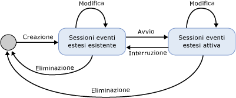
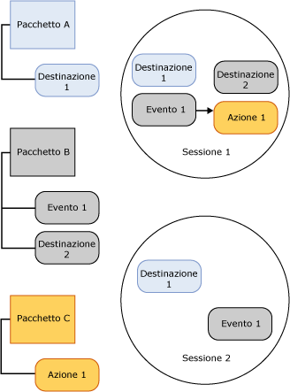

# Sessioni degli eventi estesi di SQL Server
[!INCLUDE[tsql-appliesto-ss2014-asdb-xxxx-xxx_md](../../includes/tsql-appliesto-ss2014-asdb-xxxx-xxx-md.md)]

  Una sessione di eventi estesi di [!INCLUDE[ssNoVersion](../../includes/ssnoversion-md.md)] viene creata nel processo di [!INCLUDE[ssNoVersion](../../includes/ssnoversion-md.md)] in cui è ospitato il motore degli eventi estesi. Gli aspetti seguenti di una sessione degli eventi estesi forniscono un contesto per la comprensione dell'infrastruttura degli eventi estesi e dell'elaborazione generale che si verifica:  
  
-   Stati della sessione. Vari stati in cui si trova una sessione degli eventi estesi quando sono eseguite le istruzioni CREATE EVENT SESSION e ALTER EVENT SESSION.  
  
-   Contenuto e caratteristiche della sessione. Contenuto di una sessione degli eventi estesi, ad esempio destinazioni ed eventi, e il modo in cui questi oggetti sono correlati in una sessione oggetti o tra sessioni.  
  
## Stati della sessione  
 Nella figura seguente sono mostrati i vari stati di una sessione degli eventi estesi.  
  
   
  
 Con riferimento alla figura precedente, si noti come lo stato della sessione cambi man mano che vengono inviati i vari comandi DDL per una sessione dell'evento. Tali cambiamenti di stato sono descritti nella tabella seguente.  
  
|Etichetta di illustrazione|Istruzione DDL|Descrizione|  
|------------------------|-------------------|-----------------|  
|Crea|CREATE EVENT SESSION|Il processo host consente di creare un oggetto di sessione contenente i metadati forniti da CREATE EVENT SESSION. Il processo host convalida la definizione di sessione, convalida il livello di autorizzazione dell'utente e archivia i metadati nel database master. A questo punto, la sessione non è attiva.|  
|Alter|ALTER EVENT SESSION, STATE=START|Il processo host avvia la sessione. Il processo host legge i metadati archiviati, convalida la definizione di sezione, verifica il livello di autorizzazione dell'utente e crea la sessione. Gli oggetti di sessione, ad esempio eventi e destinazioni, sono caricati e la gestione degli eventi è attiva.|  
|Alter|ALTER EVENT SESSION, STATE=STOP|Il processo host arresta la sessione attiva ma conserva i metadati.|  
|Drop|DROP EVENT SESSION|A seconda che la sessione sia attiva o meno, Drop (DROP SESSION) elimina i metadati e chiude la sessione attiva oppure elimina i metadati della sessione.|  
  
> [!NOTE]  
>  Sia ALTER EVENT SESSION che DROP EVENT SESSION possono essere applicati ai metadati o a una sessione attiva e ai metadati.  
  
## Contenuto e caratteristiche della sessione  
 Le sessioni degli eventi estesi dei limiti impliciti in quanto la configurazione di una sessione non modifica la configurazione di un'altra sessione. Tuttavia, questi limiti non impediscono che un evento o una destinazione siano utilizzati in più di una sessione.  
  
 Nella figura seguente viene illustrato il contenuto di una sessione e la relazione tra pacchetti e sessioni.  
  
   
  
 Con riferimento all'illustrazione precedente, si noti che:  
  
-   Il mapping tra oggetti del pacchetto e le sessioni è molti-a-molti, ciò significa che un oggetto può apparire in più sessioni e una sessione può contenere più oggetti.  
  
-   Lo stesso evento (Evento 1) o destinazione (Destinazione 1) può essere abilitato in più di una sessione.  
  
 Le sessioni hanno le seguenti caratteristiche:  
  
-   Azioni e predicati sono associati agli eventi per singola sessione. Se Evento 1 è presente nella sessione A con Azione 1 e predicato Z, ciò non avrà alcuna influenza sulla presenza di Evento 1 nella sessione B con Azione 2 e Azione 3 senza predicato.  
  
-   I criteri sono allegati alle sessioni per gestire il buffering e il dispatch e il rilevamento della causalità.  
  
 **Buffering e dispatch**  
  
 Con il buffering si intende come i dati dell'evento sono archiviati mentre è in esecuzione una sessione dell'evento.  I criteri di buffering specificano quanta memoria utilizzare per i dati dell'evento e i criteri di perdita per gli eventi. Con il dispatch si intende la quantità di eventi temporali che rimangono nei buffer prima di essere inviati alle destinazioni per essere elaborati.  
  
 **Rilevamento della causalità**  
  
 Il rilevamento della causalità fornisce la possibilità di monitorare il lavoro in più attività. Se il rilevamento della causalità è abilitato, ogni evento generato ha un ID attività univoco in tutto il sistema. L'ID attività è una combinazione di un valore GUID che rimane costante in tutti gli eventi per un'attività e un numero di sequenza che si incrementa ogni volta che viene generato un evento. Quando un'attività fa sì che il lavoro sia svolto da un'altra, l'ID attività padre è inviato all'attività figlio. L'attività figlio restituisce la prima l'ID attività padre la prima volta che genera un evento.  
  
 L'architettura degli eventi estesi fornisce un sistema flessibile che consente a una varietà di oggetti di essere utilizzata insieme per risolvere problemi specifici.  
  
## Vedere anche  
 [Eventi estesi](../../relational-databases/extended-events/extended-events.md)  
  
  
