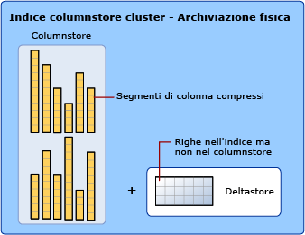

# Indici columnstore - Architettura
[!INCLUDE[tsql-appliesto-ss2016-xxxx-xxxx-xxx_md](../../includes/tsql-appliesto-ss2016-xxxx-xxxx-xxx-md.md)]

Informazioni sull'architettura di un indice columnstore. La conoscenza di questi concetti di base renderà più facile comprendere altri articoli dedicati agli indici columnstore che spiegano come usarli in modo efficace.

## Per l'archiviazione dei dati viene usata la compressione di columnstore e rowstore
Quando si parla di indici columnstore, si usano i termini *rowstore* e *columnstore* per enfatizzare il formato per l'archiviazione dei dati.  Gli indici columnstore usano entrambi i tipi di archiviazione.

 

- Un **indice columnstore** è costituito da dati organizzati logicamente in una tabella con righe e colonne e archiviati fisicamente in un formato di dati a colonne.
  
Un indice columnstore archivia fisicamente la maggior parte dei dati nel formato columnstore. Nel formato columnstore i dati vengono compressi e decompressi come colonne. Non è necessario decomprimere altri valori in ogni riga, se non sono richiesti dalla query. Ciò consente di analizzare in modo veloce un'intera colonna di una tabella di grandi dimensioni. 

- Un **indice rowstore** è costituito da dati organizzati logicamente in una tabella con righe e colonne e archiviati fisicamente in un formato di dati a righe. Questo è stato il metodo tradizionale per archiviare dati di tabelle relazionali, come un indice heap o un indice "albero B" cluster.

Un indice columnstore archivia inoltre fisicamente alcune righe in un formato rowstore, denominato archivio differenziale. L'archivio differenziale, detto anche rowgroup differenziale, è una posizione di archiviazione per le righe in numero troppo limitato per qualificarsi per la compressione nel columnstore. Ogni rowgroup differenziale viene implementato come indice albero B cluster. 

- L'**archivio differenziale** è una posizione di archiviazione per le righe in numero troppo limitato per essere compresse nel columnstore. L'archivio differenziale è un indice rowstore. 
  
## Le operazioni vengono eseguite sui rowgroup e sui segmenti di colonna

L'indice columnstore raggruppa le righe in unità gestibili. Ognuna di queste unità viene chiamata rowgroup. Per ottenere prestazioni ottimali, il numero di righe nel rowgroup deve essere sufficientemente grande da migliorare il tasso di compressione e sufficientemente ridotto da poter trarre vantaggio dall'esecuzione delle operazioni in memoria.

* Un **rowgroup** è un gruppo di righe su cui l'indice columnstore esegue operazioni di gestione e compressione. 

Ad esempio, l'indice columnstore esegue queste operazioni sui rowgroup:

* Compressione dei rowgroup nel columnstore. La compressione viene eseguita su ogni segmento di colonna all'interno di un rowgroup.
* Unione dei rowgroup durante un'operazione ALTER INDEX REORGANIZE.
* Creazione di nuovi rowgroup durante un'operazione ALTER INDEX REBUILD.
* Restituzione di informazioni sull'integrità e la frammentazione dei rowgroup nelle viste a gestione dinamica (DMV).

L'archivio differenziale è costituito da uno o più rowgroup chiamati rowgroup differenziali. Ogni rowgroup differenziale è un indice albero B cluster che archivia le righe quando sono troppo poche per la compressione nel columnstore.  

* Un **rowgroup differenziale** è un indice albero B cluster che archivia caricamenti e inserimenti bulk di dimensioni contenute, fino a quando il rowgroup non contiene 1.048.576 righe o l'indice non viene ricompilato.  Quando un rowgroup differenziale raggiunge 1.048.576 righe, viene contrassegnato come chiuso e attende che un processo denominato motore di tuple lo comprima nel columnstore. 

Ogni colonna dispone di alcuni dei relativi valori in ogni rowgroup. Questi valori sono denominati segmenti di colonna. Quando l'indice columnstore comprime un rowgroup, ogni segmento di colonna viene compresso separatamente. Per decomprimere un'intera colonna, l'indice columnstore deve semplicemente decomprimere un segmento di colonna da ogni rowgroup.

* Un **segmento di colonna** è la parte dei valori di colonna in un rowgroup. Ogni rowgroup contiene un segmento di colonna per ogni colonna della tabella. Ogni colonna ha un segmento di colonna in ogni rowgroup. 
  
   
 
## I caricamenti e gli inserimenti di dimensioni contenute vengono indirizzati all'archivio differenziale
Un indice columnstore migliora le prestazioni e la compressione del columnstore comprimendo almeno 102.400 righe alla volta nell'indice columnstore. Per eseguire la compressione bulk delle righe, l'indice columnstore accumula caricamenti e inserimenti di dimensioni contenute nell'archivio differenziale. Le operazioni deltastore sono gestite in modo automatico. Per tornare ai risultati della query corretti, l'indice columnstore cluster combina i risultati della query da columnstore e deltastore. 

Le righe vengono indirizzate all'archivio differenziale nei casi seguenti:
* Quando vengono inserite con l'istruzione INSERT INTO VALUES.
* Alla fine di un caricamento bulk e quando sono meno di 102.400.
* Quando vengono aggiornate. Ogni aggiornamento viene implementato come un'eliminazione e un inserimento.

L'archivio differenziale archivia anche un elenco di ID per le righe eliminate contrassegnate come eliminate ma non ancora eliminate fisicamente dal columnstore. 

## Quando i rowgroup differenziali sono pieni, vengono compressi nel columnstore

Gli indici columnstore cluster acquisiscono fino a 1.048.576 righe in ogni rowgroup differenziale prima di comprimere il rowgroup nel columnstore. migliorando così la compressione dell'indice columnstore. Quando un rowgroup differenziale contiene 1.048.576 righe, l'indice columnstore lo contrassegna come chiuso. Un processo in background, denominato *motore di tuple*, trova ogni rowgroup chiuso e lo comprime nel columnstore. 

È possibile forzare l'inserimento dei rowgroup differenziali nel columnstore usando [ALTER INDEX](../../t-sql/statements/alter-index-transact-sql.md) per ricostruire o riorganizzare l'indice.  Si noti che in caso di memoria insufficiente durante la compressione, l'indice columnstore potrebbe ridurre il numero di righe nel rowgroup compresso.

## Ogni partizione di tabella ha i propri rowgroup e rowgroup differenziali

Il concetto di partizionamento è lo stesso per un indice cluster, un indice heap e un indice columnstore. Il partizionamento di una tabella suddivide la tabella in piccoli gruppi di righe in base a un intervallo di valori di colonna e viene spesso usato per la gestione dei dati. Ad esempio, è possibile creare una partizione per ogni anno dei dati e quindi usare il cambio della partizione per archiviare i dati in una soluzione di archiviazione meno costosa. Il cambio della partizione si applica agli indici columnstore e rende più semplice spostare una partizione di dati in un'altra posizione.

I rowgroup sono sempre definiti all'interno di una partizione di tabella. Quando un indice columnstore viene partizionato, ogni partizione ha rowgroup compressi e rowgroup differenziali propri.

### Ogni partizione può avere più rowgroup differenziali
Ogni partizione può avere più di un rowgroup differenziale. Quando l'indice columnstore deve aggiungere dati a un rowgroup differenziale e il rowgroup differenziale è bloccato, l'indice columnstore tenterà di ottenere un blocco su un rowgroup differenziale diverso. In assenza di rowgroup differenziali disponibili, l'indice columnstore creerà un nuovo rowgroup differenziale.  Ad esempio, una tabella con 10 partizioni potrebbe avere facilmente 20 o più rowgroup differenziali. 

  
## È possibile combinare indici columnstore e rowstore nella stessa tabella
Un indice non cluster contiene una copia totale o parziale di tutte le righe e colonne della tabella sottostante. L'indice è definito sotto forma di una o più colonne della tabella e ha una condizione facoltativa che consente di filtrare le righe. 

A partire da [!INCLUDE[ssSQL15](../../includes/sssql15-md.md)]è possibile creare un indice columnstore non cluster aggiornabile in una tabella rowstore. L'indice columnstore archivia una copia dei dati, pertanto è necessario spazio di archiviazione aggiuntivo. Tuttavia, i dati nell'indice columnstore verranno compressi fino a ottenere dimensioni minori rispetto a quanto richiesto per la tabella del rowstore.  In questo modo è possibile eseguire allo stesso tempo analisi sull'indice columnstore e transazioni sull'indice rowstore. Il columnstore viene aggiornato quando i dati nella tabella rowstore vengono modificati. In questo modo entrambi gli indici possono usare gli stessi dati.  
  
 A partire da [!INCLUDE[ssSQL15](../../includes/sssql15-md.md)]è possibile avere uno o più indici rowstore non cluster per un indice columnstore. Ciò consente di eseguire ricerche efficienti all'interno delle tabelle del columnstore sottostante. Sono disponibili anche altre opzioni. È possibile, ad esempio, applicare un vincolo di chiave primaria tramite un vincolo UNIQUE nella tabella rowstore. Di conseguenza, poiché non è possibile inserire un valore non univoco nella tabella rowstore, SQL Server non può inserire il valore nel columnstore.  
 

## Metadati  
Usare queste viste dei metadati per visualizzare gli attributi degli indici columnstore. In alcune di queste viste sono incorporate altre informazioni sull'architettura.

Si noti che tutte le colonne di un indice columnstore vengono archiviate nei metadati come colonne incluse. L'indice columnstore non contiene colonne chiave.  
  
-   [sys.indexes &#40;Transact-SQL&#41;](../../relational-databases/system-catalog-views/sys-indexes-transact-sql.md)  
  
-   [sys.index_columns &#40;Transact-SQL&#41;](../../relational-databases/system-catalog-views/sys-index-columns-transact-sql.md)  
  
-   [sys.partitions &#40;Transact-SQL&#41;](../../relational-databases/system-catalog-views/sys-partitions-transact-sql.md)  
  
-   [sys.internal_partitions &#40;Transact-SQL&#41;](../../relational-databases/system-catalog-views/sys-internal-partitions-transact-sql.md)  
  
-   [sys.column_store_segments &#40;Transact-SQL&#41;](../../relational-databases/system-catalog-views/sys-column-store-segments-transact-sql.md)  
  
-   [sys.column_store_dictionaries &#40;Transact-SQL&#41;](../../relational-databases/system-catalog-views/sys-column-store-dictionaries-transact-sql.md)  
  
-   [sys.column_store_row_groups &#40;Transact-SQL&#41;](../../relational-databases/system-catalog-views/sys-column-store-row-groups-transact-sql.md)  
  
-   [sys.dm_db_column_store_row_group_operational_stats &#40;Transact-SQL&#41;](../../relational-databases/system-dynamic-management-views/sys-dm-db-column-store-row-group-operational-stats-transact-sql.md)  
  
-   [sys.dm_db_column_store_row_group_physical_stats &#40;Transact-SQL&#41;](../../relational-databases/system-dynamic-management-views/sys-dm-db-column-store-row-group-physical-stats-transact-sql.md)  
  
-   [sys.dm_column_store_object_pool &#40;Transact-SQL&#41;](../../relational-databases/system-dynamic-management-views/sys-dm-column-store-object-pool-transact-sql.md)  
  
-   [sys.dm_db_column_store_row_group_operational_stats &#40;Transact-SQL&#41;](../../relational-databases/system-dynamic-management-views/sys-dm-db-column-store-row-group-operational-stats-transact-sql.md)  
  
-   [sys.dm_db_index_operational_stats &#40;Transact-SQL&#41;](../../relational-databases/system-dynamic-management-views/sys-dm-db-index-operational-stats-transact-sql.md)  
  
-   [sys.dm_db_index_physical_stats &#40;Transact-SQL&#41;](../../relational-databases/system-dynamic-management-views/sys-dm-db-index-physical-stats-transact-sql.md)  
  
|  

## Passaggi successivi
 Per indicazioni sulla progettazione degli indici columnstore, vedere [Indici columnstore - Linee guida per la progettazione](../../relational-databases/indexes/columnstore-indexes-design-guidance.md).

