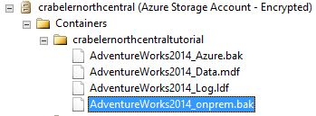

# <a name="lesson-5-backup-database-using-file-snapshot-backup"></a>Lezione 5: Backup del database con il backup di snapshot di file
In questa lezione si eseguirà il backup del database AdventureWorks2014 nella macchina virtuale di Azure usando il backup di snapshot di file per eseguire un backup quasi istantaneo con gli snapshot di Azure. Per altre informazioni sui backup di snapshot, vedere [Backup di snapshot di file per i file di database in Azure](../relational-databases/backup-restore/file-snapshot-backups-for-database-files-in-azure.md)  
  
Per eseguire il backup del database AdventureWorks2014 usando un backup di snapshot, eseguire queste operazioni:  
  
1.  Connettersi a SQL Server Management Studio.  
  
2.  Aprire una nuova finestra di query e connettersi all'istanza di SQL Server 2016 del motore di database nella macchina virtuale di Azure.  
  
3.  Copiare, incollare ed eseguire lo script Transact-SQL seguente nella finestra di query. Non chiudere questa finestra di query, lo script verrà eseguito di nuovo nel passaggio 5. Questa store procedure di sistema consente di visualizzare i backup di snapshot esistenti per ogni file che include un database specificato. Si noterà che non esistono backup di snapshot per questo database.  
  
    ```  
  
    -- Verify that no file snapshot backups exist  
    SELECT * FROM sys.fn_db_backup_file_snapshots ('AdventureWorks2014');  
  
    ```  
  
4.  Copiare e incollare lo script Transact-SQL seguente nella finestra della query. Modificare l'URL in modo appropriato per il nome di account di archiviazione e il contenitore specificato nella lezione 1 e quindi eseguire questo script. Si noti la rapidità con cui viene eseguito il backup.  
  
    ```  
  
    -- Backup the AdventureWorks2014 database with FILE_SNAPSHOT  
    BACKUP DATABASE AdventureWorks2014   
       TO URL = 'https://<mystorageaccountname>.blob.core.windows.net/<mystorageaccountcontainername>/AdventureWorks2014_Azure.bak'   
       WITH FILE_SNAPSHOT;  
  
    ```  
  
      
  
5.  Dopo aver verificato che lo script del passaggio 4 è stato eseguito correttamente, eseguire di nuovo lo script seguente. Si noti che l'operazione di backup di snapshot di file del passaggio 4 ha generato snapshot sia per il file di dati che per il file di log.  
  
    ```  
  
    -- Verify that two file-snapshot backups exist  
    SELECT * FROM sys.fn_db_backup_file_snapshots ('AdventureWorks2014');  
  
    ```  
  
      
  
6.  In Object Explorer, nell'istanza di SQL Server 2016 nella macchina virtuale di Azure, espandere il nodo Databases e verificare che il database AdventureWorks2014 sia stato ripristinato in questa istanza. Aggiornare il nodo in base alle esigenze.  
  
7.  In Esplora oggetti connettersi all'archiviazione di Azure.  
  
8.  Espandere il contenitore creato nella lezione 1 e verificare che AdventureWorks2014_Azure.bak del passaggio 4 appaia nel contenitore, insieme ai file di backup dalla lezione 3 e i file di database della lezione 4 (aggiornare il nodo in base alle esigenze).  
  
      
  
**Lezione successiva:**  
  
[Lezione 6: Generare attività e backup del log usando il backup di snapshot di file](../relational-databases/lesson-6-generate-activity-and-backup-log-using-file-snapshot-backup.md)  
  
## <a name="see-also"></a>Vedere anche  
[Backup di snapshot di file per i file di database in Azure](../relational-databases/backup-restore/file-snapshot-backups-for-database-files-in-azure.md)  
[sys.fn_db_backup_file_snapshots &#40;Transact-SQL&#41;](../relational-databases/system-functions/sys-fn-db-backup-file-snapshots-transact-sql.md)  
  
  
  

