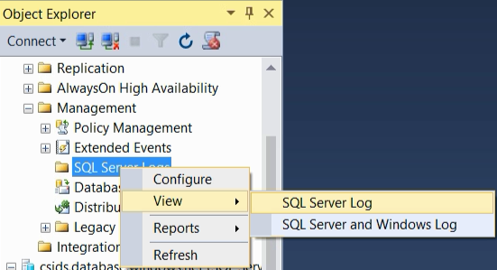

# Visualizzazione del log degli errori di SQL Server (SQL Server Management Studio)

Il log degli errori di [!INCLUDE[ssNoVersion](../../includes/ssnoversion-md.md)] contiene eventi definiti dall'utente e alcuni eventi di sistema necessari per la risoluzione dei problemi. 

## Come visualizzare i log

1.  In SSMS selezionare **Esplora oggetti**. Per **aprire** Esplora oggetti, la scelta rapida da tastiera è **F8**. In alternativa, nel menu principale fare clic su **Visualizza** e quindi selezionare **Esplora oggetti**:
    
     

2.  In **Esplora oggetti**connettersi a un'istanza di SQL Server e quindi espandere l'istanza.
  
3.  Trovare ed espandere la sezione **Gestione** (presupponendo di avere le autorizzazioni necessarie per visualizzarla).

4.  Fare clic con il pulsante destro del mouse su **Log di SQL Server**, scegliere **Visualizza** e quindi **Visualizza log di SQL Server**.

     
 
5.  Verrà visualizzato il Visualizzatore file di log (potrebbero essere necessari alcuni minuti), con un elenco dei log che è possibile visualizzare.
  
6. Diverse persone hanno consigliato l'utile post di [MSSQLTips.com](https://www.mssqltips.com/) [Identify location of the SQL Server Error Log file (Identificare la posizione del file di log degli errori di SQL Server)](https://www.mssqltips.com/sqlservertip/2506/identify-location-of-the-sql-server-error-log-file/). Assicurarsi di leggere questo post, in quanto contiene informazioni interessantissime.

