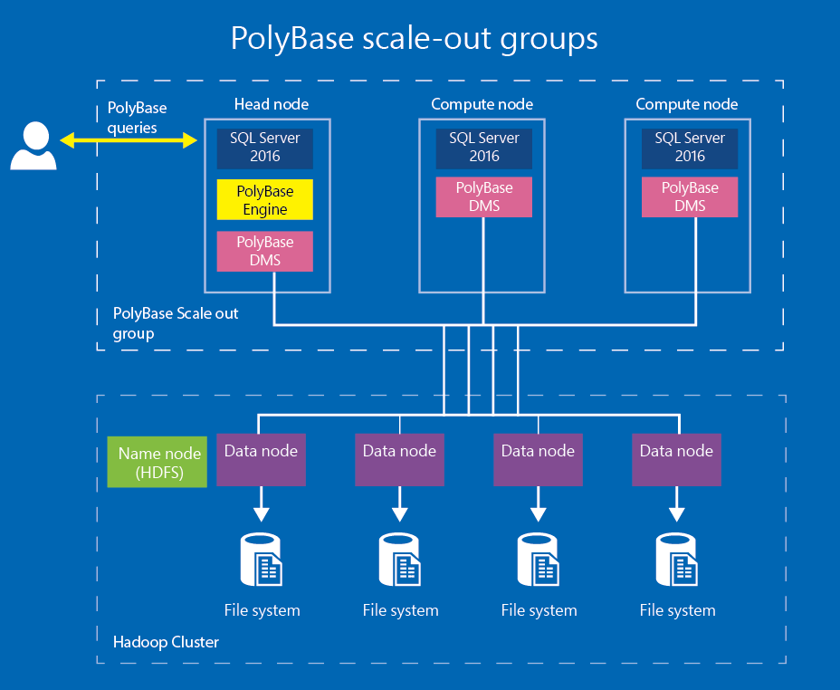

# <a name="polybase-scale-out-groups"></a>Gruppi con scalabilità orizzontale di PolyBase
[!INCLUDE[tsql-appliesto-ss2016-xxxx-xxxx-xxx_md](../../includes/tsql-appliesto-ss2016-xxxx-xxxx-xxx-md.md)]

  Un'istanza di SQL Server autonomo con PolyBase può diventare un collo di bottiglia in termini di prestazioni quando si lavora con grandi set di dati in Hadoop o in archiviazione BLOB di Azure. La funzionalità Gruppo di PolyBase consente di creare un cluster di istanze di SQL Server per elaborare grandi quantità di set di dati da origini dati esterne, come ad esempio Hadoop o archiviazione BLOB di Azure, in un meccanismo di scalabilità orizzontale che consente di migliorare le prestazioni delle query.  
  
 Vedere [Get started with PolyBase](../../relational-databases/polybase/get-started-with-polybase.md) (Introduzione a PolyBase) e [PolyBase Guide](../../relational-databases/polybase/polybase-guide.md)(Guida di Polybase).  
  
   
  
## <a name="overview"></a>Panoramica  
  
### <a name="head-node"></a>Nodo head  
 Il nodo head contiene l'istanza di SQL Server alla quale vengono inviate le query PolyBase. Ogni gruppo di PolyBase può avere un solo nodo head. Un nodo head è un gruppo logico costituito dal motore di database SQL, dal motore PolyBase e da PolyBase Data Movement Service nell'istanza di SQL Server.  
  
### <a name="compute-node"></a>Nodo di calcolo  
 Un nodo di calcolo contiene l'istanza di SQL Server che assiste nell'elaborazione delle query di scalabilità orizzontale sui dati esterni. Un nodo di calcolo è un gruppo logico costituito da SQL Server e da PolyBase Data Movement Service nell'istanza di SQL Server. Un gruppo di PolyBase può presentare più nodi di calcolo.  
  
### <a name="distributed-query-processing"></a>Elaborazione delle query distribuite  
 Le query PolyBase vengono inviate a SQL Server nel nodo head. La parte della query che fa riferimento a tabelle esterne viene passata al motore PolyBase.  
  
 Il motore PolyBase è il componente principale alla base delle query PolyBase. Il motore, infatti, analizza la query su dati esterni, genera il piano di query e distribuisce il lavoro al servizio di spostamento dati nei nodi di calcolo ai fini dell'esecuzione. Dopo il completamento del lavoro, riceve i risultati dei nodi di calcolo e li invia a SQL Server per l'elaborazione e la restituzione al client.  
  
 Il servizio di spostamento dati di PolyBase riceve istruzioni dal motore PolyBase e trasferisce i dati tra HDFS e SQL Server e tra istanze di SQL Server nei nodi head e di calcolo.  
  
### <a name="editions-availability"></a>Disponibilità delle edizioni  
 Dopo l'installazione di SQL Server, l'istanza può essere definita sia come nodo head sia come nodo di calcolo.  La scelta dipende dalla versione sulla quale è in esecuzione PolyBase di SQL Server. In un'installazione Enterprise Edition, l'istanza può essere definita sia come nodo head sia come nodo di calcolo. In una Standard Edition, l'istanza può essere definita solo come nodo di calcolo.  
  
## <a name="to-configure-a-polybase-group"></a>Per configurare un gruppo di PolyBase  
  
### <a name="prerequisites"></a>Prerequisiti  
  
-   N computer nello stesso dominio  
  
-   Un account utente di dominio per l'esecuzione dei servizi PolyBase  
  
### <a name="steps"></a>Passaggi  
  
1.  Installare SQL Server con PolyBase su N computer.  
  
2.  Selezionare un'istanza di SQL Server come nodo head. Un nodo head può essere definito solo in un'istanza di SQL Server Enterprise.  
  
3.  Aggiungere le istanze rimanenti di SQL Server come nodi di calcolo usando [sp_polybase_join_group](../../relational-databases/system-stored-procedures/polybase-stored-procedures-sp-polybase-join-group.md).  
  
4.  Monitorare i nodi nel gruppo usando [sys.dm_exec_compute_nodes &#40;Transact-SQL&#41;](../../relational-databases/system-dynamic-management-views/sys-dm-exec-compute-nodes-transact-sql.md).  
  
5.  Facoltativa. Rimuovere un nodo di calcolo usando [sp_polybase_leave_group &#40;Transact-SQL&#41;](../../relational-databases/system-stored-procedures/polybase-stored-procedures-sp-polybase-leave-group.md).  
  
## <a name="example-walk-through"></a>Procedura dettagliata di esempio  
 Di seguito vengono illustrati i passaggi per configurare un gruppo di PolyBase con:  
  
1.  Due macchine nel dominio *PQTH4A* . I nomi computer sono:  
  
    -   PQTH4A-CMP01  
  
    -   PQTH4A-CMP02  
  
2.  Account di dominio: *PQTH4A\PolybaseUse*r  
  
#### <a name="step-1-install-sql-server-with-polybase-on-all-machines"></a>Passaggio 1: Installare SQL Server con PolyBase su tutti i computer  
  
1.  Eseguire setup.exe.  
  
2.  Nella pagina Selezione funzionalità scegliere **Servizio query PolyBase per i dati esterni**.  
  
3.  Nella pagina Configurazione server usare l' **account di dominio** PQTH4A\PolybaseUser per il motore PolyBase di SQL Server e SQL Server PolyBase Data Movement Service.  
  
4.  Nella pagina di configurazione di PolyBase selezionare l'opzione **Usare questa istanza di SQL Server come parte del gruppo PolyBase con scalabilità orizzontale**. Verrà aperto il firewall per consentire le connessioni in ingresso ai servizi di PolyBase.  
  
5.  Al termine dell'installazione, eseguire **services.msc**. Verificare che SQL Server, il motore PolyBase e PolyBase Data Movement Service siano in esecuzione.  
  
       
  
#### <a name="step-2-select-one-sql-server-as-head-node"></a>Passaggio 2: Selezionare un SQL Server come nodo head  
  
-   Al termine dell'installazione, entrambi i computer possono fungere da nodi head del gruppo di PolyBase. In questo esempio, si sceglierà "MSSQLSERVER" in PQTH4A-CMP01 come nodo head.  
  
#### <a name="step-3-add-other-sql-server-instances-as-compute-nodes"></a>Passaggio 3: Aggiungere altre istanze di SQL Server come nodi di calcolo  
  
1.  Connettersi a SQL Server su PQTH4A-CMP02.  
  
2.  Eseguire la stored procedure [sp_polybase_join_group](../../relational-databases/system-stored-procedures/polybase-stored-procedures-sp-polybase-join-group.md).  
  
    ```  
    -- Enter head node details:   
    -- head node machine name, head node dms control channel port, head node sql server name  
    EXEC sp_polybase_join_group 'PQTH4A-CMP01', 16450, 'MSSQLSERVER';  
  
    ```  
  
3.  Eseguire services.msc sul nodo di calcolo, PQTH4A-CMP02.  
  
4.  Arrestare il motore PolyBase e riavviare PolyBase Data Movement Service.  
  
#### <a name="optional-remove-a-compute-node"></a>Facoltativo: Rimuovere un nodo di calcolo  
  
1.  Connettersi al nodo di calcolo PQTH4A-CMP02 per SQL Server.  
  
2.  Eseguire la stored procedure sp_polybase_leave_group.  
  
    ```  
    EXEC sp_polybase_leave_group;  
    ```  
  
3.  Eseguire services.msc sul nodo di calcolo da rimuovere, PQTH4A-CMP02.  
  
4.  Avviare il motore PolyBase. Riavviare PolyBase Data Movement Service.  
  
5.  Verificare che il nodo sia stato rimosso eseguendo la DMV sys.dm_exec_compute_nodes su PQTH4A-CMP01. A questo punto, PQTH4A-CMP02 funzionerà come un nodo head autonomo  
  
## <a name="next-steps"></a>Passaggi successivi  
 Per la risoluzione dei problemi, vedere [PolyBase troubleshooting with dynamic management views](http://msdn.microsoft.com/library/ce9078b7-a750-4f47-b23e-90b83b783d80).  
  
## <a name="see-also"></a>Vedere anche  
 [Get started with PolyBase](../../relational-databases/polybase/get-started-with-polybase.md)   
 [PolyBase Guide](../../relational-databases/polybase/polybase-guide.md)   
 [Configurazione della connettività di PolyBase &#40;Transact-SQL&#41;](../../database-engine/configure-windows/polybase-connectivity-configuration-transact-sql.md)  
  
  

