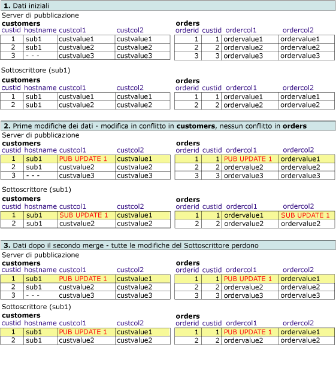
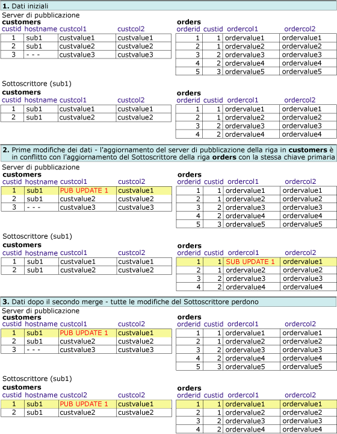

# Conflitti nella replica di tipo merge avanzata - Risoluzione nel record logico
  In questo argomento vengono illustrate le varie combinazioni di metodi possibili per il rilevamento e la risoluzione dei conflitti nell'utilizzo di record logici. Nella replica di merge si verificano conflitti quando più di un nodo modifica gli stessi dati oppure quando, durante la replica di modifiche, si riscontrano determinati tipi di errori, ad esempio la violazione di un vincolo. Per ulteriori informazioni sul rilevamento e sulla risoluzione dei conflitti, vedere [Advanced Merge Replication Conflict Detection and Resolution](../../../relational-databases/replication/merge/advanced-merge-replication-conflict-detection-and-resolution.md).  
  
 Per specificare il livello di rilevamento e risoluzione dei conflitti di un articolo, vedere [Specify the Conflict Tracking and Resolution Level for Merge Articles](../../../relational-databases/replication/publish/specify-the-conflict-tracking-and-resolution-level-for-merge-articles.md).  
  
## Rilevamento dei conflitti  
 La modalità con cui vengono rilevati i conflitti per i record logici è determinata da due proprietà degli articoli: **column_tracking** e **logical_record_level_conflict_detection**. [!INCLUDE[ssVersion2005](../../../includes/ssversion2005-md.md)] e versioni successive supportano anche rilevamento a livello di record logico.  
  
 La proprietà articolo **logical_record_level_conflict_detection** può essere impostata su TRUE o FALSE. Il valore deve essere impostato solo per l'articolo padre di livello principale e verrà ignorato per gli articoli figlio. Se questo valore è impostato su FALSE, nella replica di tipo merge i conflitti vengono rilevati come nelle precedenti versioni di [!INCLUDE[ssNoVersion](../../../includes/ssnoversion-md.md)], ovvero esclusivamente in base al valore della proprietà **column_tracking** dell'articolo. Se il valore è impostato su TRUE, la proprietà **column_tracking** dell'articolo viene ignorata e qualora vengano apportate modifiche in qualsiasi punto del record logico viene rilevato un conflitto. Ad esempio, si consideri lo scenario seguente:  
  
   
  
 Viene rilevato un conflitto se due utenti modificano uno qualsiasi dei valori del record logico Customer2 nelle tabelle **Customers**, **Orders**o **OrderItems** . In questo esempio vengono considerate modifiche apportate mediante un'istruzione UPDATE, tuttavia è possibile rilevare anche conflitti causati da modifiche apportate con istruzioni INSERT o DELETE.  
  
## Risoluzione dei conflitti  
 Per impostazione predefinita nella replica di tipo merge per risolvere i conflitti si utilizza logica basata su priorità. Se in due database di sottoscrizione viene apportata una modifica in conflitto, ha la priorità la modifica del Sottoscrittore con la priorità di sottoscrizione più elevata. Nel caso in cui la priorità sia uguale, viene applicata per prima la modifica che raggiunge il server di pubblicazione. Nel rilevamento a livello di riga e di colonna, la riga confermata sovrascrive interamente la riga non confermata.  
  
 La proprietà articolo **logical_record_level_conflict_resolution** può essere impostata su TRUE o FALSE. Il valore deve essere impostato solo per l'articolo padre di livello principale e verrà ignorato per gli articoli figlio. Se il valore è impostato su TRUE, il record logico confermato sovrascrive interamente il record logico non confermato. Se il valore è impostato su FALSE, le singole righe confermate possono provenire da diversi Sottoscrittori o server di pubblicazione. Ad esempio, il Sottoscrittore A può prevalere in un conflitto in una riga della tabella **Orders** , mentre il Sottoscrittore B può prevalere in una riga correlata nella tabella **OrderItems** . Il risultato è un record logico contenente la riga **Orders** del Sottoscrittore A e la riga **OrderItems** del Sottoscrittore B.  
  
## Interazione delle impostazioni di rilevamento e risoluzione dei conflitti  
 Il risultato dei conflitti dipende dall'interazione delle impostazioni di rilevamento e risoluzione dei conflitti. Negli esempi seguenti si presuppone l'utilizzo della risoluzione dei conflitti basata sulle priorità. Nel caso di record logici esistono le possibilità seguenti:  
  
-   Rilevamento a livello di riga o di colonna, risoluzione a livello di riga  
  
-   Rilevamento a livello di colonna, risoluzione a livello di record logico  
  
-   Rilevamento a livello di riga, risoluzione a livello di record logico  
  
-   Rilevamento a livello di record logico, risoluzione a livello di record logico  
  
### Rilevamento a livello di riga o di colonna, risoluzione a livello di riga  
 In questo esempio, la pubblicazione è configurata come segue:  
  
-   **column_tracking** è impostata su TRUE o FALSE  
  
-   **logical_record_level_conflict_detection** è impostata su FALSE  
  
-   **logical_record_level_conflict_resolution** è impostata su FALSE  
  
 In questo caso, il rilevamento è a livello di riga o di colonna e la risoluzione è a livello di riga. Queste impostazioni consentono di replicare tutte le modifiche apportate a un record logico come singola unità, senza rilevare o risolvere conflitti a livello del record logico.  
  
### Rilevamento a livello di colonna, risoluzione a livello di record logico  
 In questo esempio, la pubblicazione è configurata come segue:  
  
-   **column_tracking** è impostata su TRUE  
  
-   **logical_record_level_conflict_detection** è impostata su FALSE  
  
-   **logical_record_level_conflict_resolution** è impostata su TRUE  
  
 Un server di pubblicazione e un Sottoscrittore dispongono dello stesso set di dati iniziale e tra le tabelle **orders** e **customers** viene definito un record logico. Il server di pubblicazione modifica la colonna **custcol1** della tabella **customers** e la colonna **ordercol1** della tabella **orders** . Il Sottoscrittore modifica la stessa riga della colonna **custcol1** nella tabella **customers** e la stessa riga della colonna **ordercol2** nella tabella **orders** . Le modifiche apportate alla stessa colonna della tabella **customers** risultano in conflitto, mentre le modifiche apportate alla tabella **orders** non lo sono.  
  
 Dato che i conflitti vengono risolti a livello dei record logici, le modifiche confermate apportate nel server di pubblicazione sostituiscono le modifiche inserite nelle tabelle del Sottoscrittore durante l'elaborazione della replica.  
  
   
  
### Rilevamento a livello di riga, risoluzione a livello di record logico  
 In questo esempio, la pubblicazione è configurata come segue:  
  
-   **column_tracking** è impostata su FALSE  
  
-   **logical_record_level_conflict_detection** è impostata su FALSE  
  
-   **logical_record_level_conflict_resolution** è impostata su TRUE  
  
 Un server di pubblicazione e un Sottoscrittore dispongono dello stesso set di dati iniziale. Il server di pubblicazione modifica la colonna **custcol1** della tabella **customers** . Il Sottoscrittore modifica la colonna **custcol12** della tabella **customers** e la colonna **ordercol2** della tabella **orders** . Le modifiche apportate alla stessa riga della tabella **customers** risultano in conflitto, mentre le modifiche apportate nel Sottoscrittore alla tabella **orders** non lo sono.  
  
 Dato che i conflitti vengono risolti a livello dei record logici, le modifiche confermate apportate nel server di pubblicazione sostituiscono le modifiche inserite nelle tabelle del Sottoscrittore durante la sincronizzazione.  
  
   
  
### Rilevamento a livello di record logico, risoluzione a livello di record logico  
 In questo esempio, la pubblicazione è configurata come segue:  
  
-   **logical_record_level_conflict_detection** è impostata su TRUE  
  
-   **logical_record_level_conflict_resolution** è impostata su TRUE  
  
 Un server di pubblicazione e un Sottoscrittore dispongono dello stesso set di dati iniziale. Il server di pubblicazione modifica la colonna **custcol1** della tabella **customers** . Il Sottoscrittore modifica la colonna **ordercol1** della tabella **orders** . Non vi sono modifiche alla stessa riga o colonna. Tuttavia, dato che le modifiche sono state apportate allo stesso record logico per **custid**=1, le modifiche vengono rilevate come conflitto a livello dei record logici.  
  
 Dato che i conflitti vengono ugualmente risolti a livello dei record logici, la modifica confermata apportata nel server di pubblicazione sostituisce la modifica inserita nelle tabelle del Sottoscrittore durante la sincronizzazione.  
  
   
  
## Vedere anche  
 [Raggruppare modifiche alle righe correlate con record logici](../../../relational-databases/replication/merge/group-changes-to-related-rows-with-logical-records.md)  
  
  
