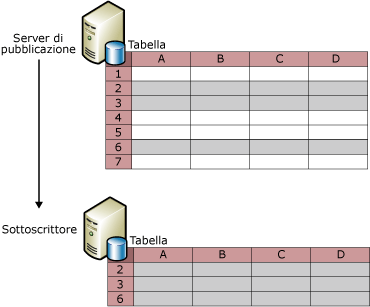
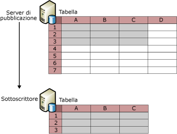

# Filtro dei dati pubblicati
  L'applicazione di filtri agli articoli di una tabella consente di creare partizioni di dati da pubblicare. Tramite l'applicazione di filtri ai dati pubblicati è possibile:  
  
-   Ridurre al minimo la quantità di dati inviati in rete.  
  
-   Ridurre la quantità di spazio di archiviazione necessaria nel Sottoscrittore.  
  
-   Personalizzare le pubblicazioni e le applicazioni in base ai requisiti dei singoli Sottoscrittori.  
  
-   Evitare o limitare i conflitti in caso di aggiornamento dei dati da parte dei Sottoscrittori grazie alla possibilità di inviare partizioni di dati diverse a Sottoscrittori diversi. In due Sottoscrittori pertanto non verranno mai aggiornati gli stessi valori di dati.  
  
-   Evitare la trasmissione di dati riservati. È possibile utilizzare i filtri di riga e di colonna per limitare l'accesso ai dati da parte dei Sottoscrittori. Nella replica di tipo merge è necessario tenere in considerazione alcuni aspetti relativi alla sicurezza se si utilizza un filtro con parametri che include HOST_NAME(). Per ulteriori informazioni, vedere la sezione "Applicazione di filtri con HOST_NAME ()" in [i filtri di riga con parametri](../../../relational-databases/replication/merge/parameterized-row-filters.md).  
  
 La replica include quattro tipi di filtro:  
  
-   Filtri di riga statici, disponibili con tutti i tipi di replica.  
  
     L'utilizzo di questo tipo di filtro consente di scegliere un subset di righe da pubblicare. Tutti i Sottoscrittori di una pubblicazione filtrata ricevono lo stesso subset di righe per la tabella filtrata. Per ulteriori informazioni, vedere la sezione "Filtri di riga statici" di questo argomento.  
  
-   Filtri di colonna, disponibili con tutti i tipi di replica.  
  
     L'utilizzo di questo tipo di filtro consente di scegliere un subset di colonne da pubblicare. Per ulteriori informazioni, vedere la sezione "Filtri di colonna" in questo argomento.  
  
-   Filtri di riga con parametri, disponibili solo con la replica di tipo merge.  
  
     L'utilizzo di questo tipo di filtro consente di scegliere un subset di righe da pubblicare. Diversamente dai filtri statici che inviano lo stesso subset di righe a ogni Sottoscrittore, i filtri di riga con parametri utilizzano un valore di dati fornito dal Sottoscrittore per inviare ai Sottoscrittori subset di righe differenti. Per altre informazioni, vedere [Parameterized Row Filters](../../../relational-databases/replication/merge/parameterized-row-filters.md).  
  
-   Filtri join, disponibili solo con la replica di tipo merge.  
  
     I filtri join consentono di estendere un filtro di riga da una tabella pubblicata a un'altra. Per ulteriori informazioni, vedere [filtri Join](../../../relational-databases/replication/merge/join-filters.md).  
  
## Filtri di riga statici  
 Nella figura seguente viene illustrata una tabella pubblicata, filtrata in modo che solo le righe 2, 3 e 6 siano incluse nella pubblicazione.  
  
   
  
 Un filtro di riga statico utilizza una clausola WHERE per selezionare i dati appropriati da pubblicare. La parte finale di tale clausola viene specificata dall'utente. Si consideri il **prodotto tabella** nel database di esempio Adventure Works, che contiene la colonna **ProductLine**. Per pubblicare solo le righe contenenti dati su prodotti correlati alle mountain bike, specificare `ProductLine = 'M'`.  
  
 Un filtro di riga statico restituisce un singolo set di dati per ogni pubblicazione. Nell'esempio precedente tutti i Sottoscrittori riceverebbero solo le righe contenenti dati su prodotti correlati alle mountain bike. Se un altro Sottoscrittore richiede solo le righe contenenti dati su prodotti correlati alle biciclette da strada:  
  
-   Con la replica snapshot o transazionale, è possibile creare un'altra pubblicazione e includere la tabella in entrambe le pubblicazioni (nella clausola di filtro relativa all'articolo di tale pubblicazione, specificare `ProductLine = 'R')`.  
  
    > [!NOTE]  
    >  Nelle pubblicazioni transazionali i filtri di riga comportano un notevole aumento dell'overhead in quanto la clausola di filtro per l'articolo viene valutata per ogni riga del log di una tabella pubblicata per stabilire se deve essere replicata. È consigliabile evitare l'uso dei filtri di riga nelle pubblicazioni transazionali se ogni nodo di replica può supportare il carico completo dei dati e se il set di dati complessivo è relativamente ridotto.  
  
-   Con la replica di tipo merge, utilizzare i filtri di riga con parametri anziché creare più pubblicazioni con filtri di riga statici. Per altre informazioni, vedere [Parameterized Row Filters](../../../relational-databases/replication/merge/parameterized-row-filters.md).  
  
 Per definire o modificare un filtro di riga statico, vedere [definire e modificare un filtro di riga statico](../../../relational-databases/replication/publish/define-and-modify-a-static-row-filter.md).  
  
## Filtri colonne  
 Nella figura seguente viene illustrata una pubblicazione in cui la colonna C viene esclusa tramite un filtro.  
  
   
  
 È inoltre possibile utilizzare contemporaneamente il filtro di riga e di colonna, come illustrato di seguito.  
  
   
  
 Dopo aver creato una pubblicazione, è possibile utilizzare il filtro di colonna per eliminare una colonna da una pubblicazione esistente, mantenendola nella tabella del server di pubblicazione, nonché includere una colonna esistente nella pubblicazione. Per altre modifiche, ad esempio l'aggiunta di una nuova colonna a una tabella e quindi all'articolo pubblicato, utilizzare la replica di modifica dello schema. Per ulteriori informazioni, vedere le sezioni "Aggiunta di colonne" e "Eliminazione di colonne" nell'argomento [apportare le modifiche dello Schema nei database di pubblicazione](../../../relational-databases/replication/publish/make-schema-changes-on-publication-databases.md).  
  
 Non è possibile escludere tramite filtro determinati tipi di pubblicazioni nei tipi di colonna elencati nella tabella seguente.  
  
|Tipo di colonna|Tipo di pubblicazione e opzioni|  
|-----------------|-------------------------------------|  
|Colonna chiave primaria|Nelle pubblicazioni transazionali tutte le tabelle devono contenere una colonna chiave primaria. Le chiavi primarie non sono necessarie per le tabelle delle pubblicazioni di tipo merge, ma se è presente una colonna chiave primaria, non sarà possibile filtrarla.|  
|Colonna chiave esterna|Tutte le pubblicazioni create mediante la Creazione guidata nuova pubblicazione. È possibile filtrare le colonne chiave esterna mediante le stored procedure Transact-SQL. Per ulteriori informazioni, [definire e modificare un filtro di colonna](../../../relational-databases/replication/publish/define-and-modify-a-column-filter.md).|  
|Il **rowguid** colonna|Pubblicazioni di tipo merge*|  
|Il **msrepl_tran_version** colonna|Pubblicazioni snapshot o transazionali che consentono sottoscrizioni aggiornabili|  
|Colonne che non consentono valori NULL e non contengono valori predefiniti o il set di proprietà IDENTITY.|Pubblicazioni snapshot o transazionali che consentono sottoscrizioni aggiornabili|  
|Colonne con indici o vincoli univoci|Pubblicazioni snapshot o transazionali che consentono sottoscrizioni aggiornabili|  
|Tutte le colonne in una pubblicazione di tipo merge SQL Server 7.0|Non è possibile filtrare le colonne in pubblicazioni di tipo merge SQL Server 7.0.|  
|Timestamp|SQL Server 7.0 pubblicazioni snapshot o transazionali che consentono sottoscrizioni aggiornabili|  
  
 \*Se si pubblica una tabella in una pubblicazione di tipo merge e tale tabella contiene già una colonna di tipo di dati **uniqueidentifier** con il **ROWGUIDCOL** set di proprietà, la replica può utilizzare questa colonna anziché creare una colonna aggiuntiva denominata **rowguid**. In questo caso è necessario pubblicare la colonna esistente.  
  
 Per definire o modificare un filtro di colonna, vedere [definire e modificare un filtro di colonna](../../../relational-databases/replication/publish/define-and-modify-a-column-filter.md).  
  
## Considerazioni sull'applicazione di filtri  
 Durante l'applicazioni di filtri ai dati tenere presente quanto segue:  
  
-   È necessario includere nella pubblicazione tutte le colonne a cui viene fatto riferimento nei filtri di riga. In altre parole, non è possibile utilizzare un filtro di colonna per escludere una colonna utilizzata in un filtro di riga.  
  
-   Se si aggiunge o si modifica un filtro in seguito all'inizializzazione delle sottoscrizioni, sarà necessario reinizializzarle.  
  
-   Il numero massimo di byte consentiti per una colonna utilizzata in un filtro è pari a 1024 per un articolo di una pubblicazione di tipo merge e a 8000 per un articolo di una pubblicazione transazionale.  
  
-   Nei filtri di riga o join non è possibile fare riferimento alle colonne con i tipi di dati seguenti:  
  
    -   **varchar(max) e nvarchar(max)**  
  
    -   **varbinary(max)**  
  
    -   **text e ntext**  
  
    -   **image**  
  
    -   **XML**  
  
    -   **UDT (tipo definito dall'utente)**  
  
-   La replica transazionale consente di replicare una vista indicizzata come vista o come tabella. Se la vista viene replicata come tabella, non sarà possibile filtrare le colonne dalla tabella.  
  
 I filtri di riga non sono progettati per funzionare nei database. [!INCLUDE[ssNoVersion](../../../includes/ssnoversion-md.md)] limitata intenzionalmente l'esecuzione di **sp_replcmds** (che vengono eseguiti i filtri) al proprietario del database (**dbo**). Il **dbo** non sono associati privilegi tra database. Con l'aggiunta di CDC (Change Data Capture) in [!INCLUDE[ssKatmai](../../../includes/sskatmai-md.md)] di **sp_replcmds** logica consente di popolare le tabelle con le informazioni che l'utente può ripristinare ed eseguire una query di rilevamento delle modifiche. Per motivi di sicurezza [!INCLUDE[ssNoVersion](../../../includes/ssnoversion-md.md)] limitata l'esecuzione di questa logica in modo che un malintenzionato **dbo** non possa rubare il percorso di esecuzione. Ad esempio, un malintenzionato **dbo** potrebbe aggiungere trigger nelle tabelle CDC che quindi verrebbero eseguite nel contesto del chiamante utente **sp_replcmds**, in questo caso, l'agente di lettura log.  Se l'account in cui è in esecuzione l'agente dispone di privilegi superiore il dannoso **dbo** Impossibile riassegnare i suoi privilegi.  
  
## Vedere anche  
 [Pubblicazione di dati e oggetti di database](../../../relational-databases/replication/publish/publish-data-and-database-objects.md)  
  
  