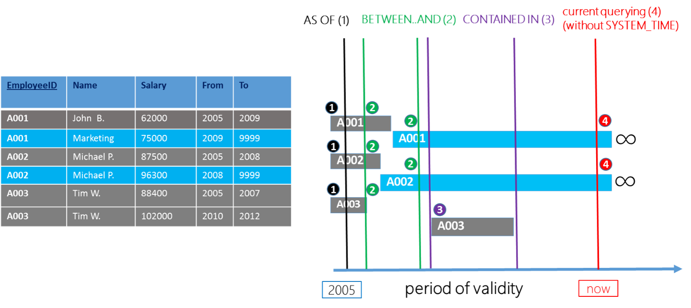
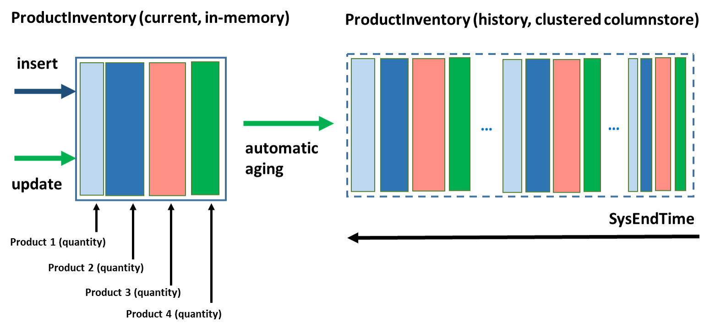
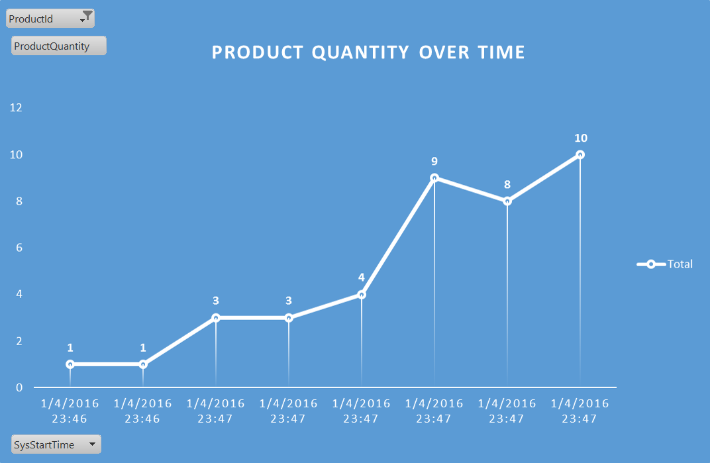
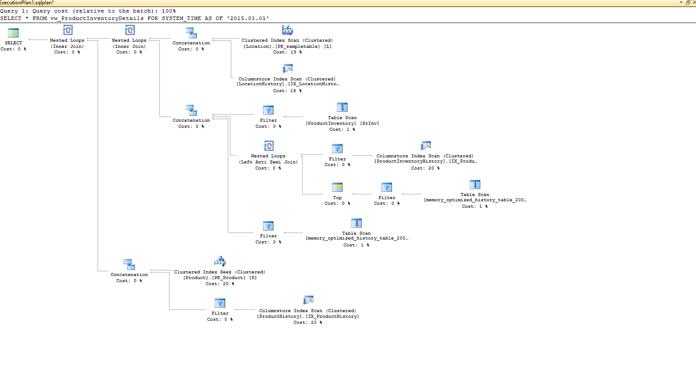
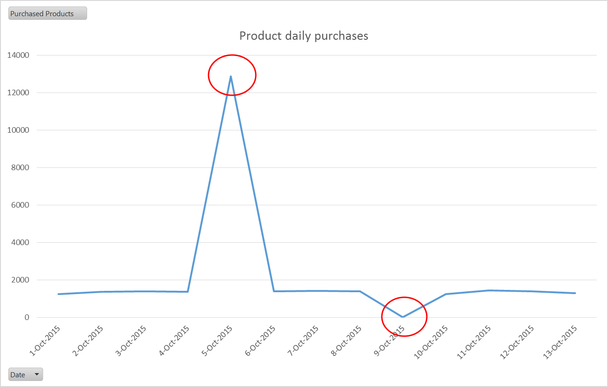
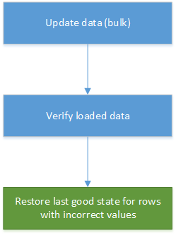

# Scenari di utilizzo delle tabelle temporali
[!INCLUDE[tsql-appliesto-ss2016-asdb-xxxx-xxx_md](../../includes/tsql-appliesto-ss2016-asdb-xxxx-xxx-md.md)]

  Le tabelle temporali sono in genere utili negli scenari che richiedono il rilevamento della cronologia delle modifiche dei dati.    
È consigliabile prendere in considerazione le tabelle temporali nei seguenti casi d'uso, per gli enormi vantaggi di produttività che offre:  
  
-   [Controllo dei dati](https://msdn.microsoft.com/library/mt631669.aspx#Anchor_0)  
  
-   [Analisi temporizzate (spostamento cronologico)](https://msdn.microsoft.com/library/mt631669.aspx#Anchor_1)  
  
-   [Rilevamento di anomalie](https://msdn.microsoft.com/library/mt631669.aspx#Anchor_2)  
  
-   [Dimensioni a modifica lenta](https://msdn.microsoft.com/library/mt631669.aspx#Anchor_3)  
  
-   [Ripristino dal danneggiamento dei dati a livello di riga](https://msdn.microsoft.com/library/mt631669.aspx#Anchor_4)  
  
## Controllo dei dati  
 Usare il controllo delle versioni di sistema temporale nelle tabelle che archiviano informazioni critiche per le quali è necessario tenere traccia di cosa è stato modificato, quando e da chi ed eseguire analisi scientifiche dei dati in qualsiasi momento.    
Le tabelle temporali con controllo delle versioni di sistema consentono di pianificare scenari di controllo dei dati nelle prime fasi del ciclo di sviluppo o di aggiungere il controllo dei dati alle applicazioni o soluzioni esistenti quando necessario.  
  
 Il diagramma seguente mostra lo scenario di una tabella Employee con il campione di dati che include versioni di riga correnti, contrassegnate dal colore blu, e versioni di riga cronologiche, contrassegnate dal colore grigio.   
La parte destra del diagramma visualizza le versioni di riga sull'asse temporale e quali sono le righe selezionate con diversi tipi di query sulla tabella temporale con o. senza la clausola SYSTEM_TIME.  
  
   
  
### Abilitazione del controllo delle versioni di sistema in una nuova tabella per il controllo dei dati  
 Se sono state identificate le informazioni che richiedono il controllo dei dati, creare tabelle di database come tabelle temporali con controllo delle versioni di sistema. L'esempio seguente illustra uno scenario con informazioni su Employee in un ipotetico database delle risorse umane:  
  
```  
CREATE TABLE Employee   
(    
  [EmployeeID] int NOT NULL PRIMARY KEY CLUSTERED   
  , [Name] nvarchar(100) NOT NULL  
  , [Position] varchar(100) NOT NULL   
  , [Department] varchar(100) NOT NULL  
  , [Address] nvarchar(1024) NOT NULL  
  , [AnnualSalary] decimal (10,2) NOT NULL  
  , [ValidFrom] datetime2 (2) GENERATED ALWAYS AS ROW START  
  , [ValidTo] datetime2 (2) GENERATED ALWAYS AS ROW END  
  , PERIOD FOR SYSTEM_TIME (ValidFrom, ValidTo)  
 )    
 WITH (SYSTEM_VERSIONING = ON (HISTORY_TABLE = dbo.EmployeeHistory));  
```  
  
 In [Creating a System-Versioned Temporal Table](../../relational-databases/tables/creating-a-system-versioned-temporal-table.md) (Creazione di una tabella temporale con controllo delle versioni di sistema) sono descritte varie opzioni per creare una tabella temporale con controllo delle versioni di sistema.  
  
### Abilitazione del controllo delle versioni di sistema in una tabella esistente per il controllo dei dati  
 Se è necessario eseguire il controllo dei dati nei database esistenti, usare ALTER TABLE per estendere le tabelle non temporali in modo che diventino tabelle con controllo delle versioni di sistema. Per evitare modifiche di rilievo nell'applicazione, aggiungere le colonne del periodo come HIDDEN, come descritto in [Alter Non-Temporal Table to be System-Versioned Temporal Table](https://msdn.microsoft.com/library/mt590957.aspx#Anchor_3) (Modifica di una tabella non temporale in tabella temporale con controllo delle versioni di sistema). L'esempio seguente illustra l'abilitazione del controllo delle versioni di sistema in una tabella Employee esistente in un ipotetico database delle risorse umane:  
  
```  
/*   
Turn ON system versioning in Employee table in two steps   
(1) add new period columns (HIDDEN)   
(2) create default history table   
*/   
ALTER TABLE Employee   
ADD   
    ValidFrom datetime2 (2) GENERATED ALWAYS AS ROW START HIDDEN    
        constraint DF_ValidFrom DEFAULT DATEADD(second, -1, SYSUTCDATETIME())  
    , ValidTo datetime2 (2)  GENERATED ALWAYS AS ROW END HIDDEN     
        constraint DF_ValidTo DEFAULT '9999.12.31 23:59:59.99'  
    , PERIOD FOR SYSTEM_TIME (ValidFrom, ValidTo);   
  
ALTER TABLE Employee    
    SET (SYSTEM_VERSIONING = ON (HISTORY_TABLE = dbo.Employee_History));  
```  
  
 Dopo avere eseguito lo script precedente, tutte le modifiche dei dati verranno raccolte in modo trasparente nella tabella di cronologia.    
In un tipico scenario di controllo dei dati si eseguono query per tutte le modifiche dei dati applicate a una singola riga in un periodo di tempo di interesse. La tabella di cronologia predefinita viene creata con albero B con rowstore cluster, per risolvere in modo efficiente questo caso d'uso.  
  
### Esecuzione di analisi dei dati  
 Dopo l'abilitazione del controllo delle versioni di sistema con uno dei metodi precedenti, per il controllo dei dati è sufficiente eseguire una query. La query seguente esegue la ricerca di versioni delle righe del record Employee con EmployeeID = 1000 attive almeno per una parte del periodo compreso tra il 1° gennaio 2014 e il 1° gennaio 2015, incluso il limite superiore:  
  
```  
SELECT * FROM Employee   
    FOR SYSTEM_TIME    
        BETWEEN '2014-01-01 00:00:00.0000000' AND '2015-01-01 00:00:00.0000000'   
            WHERE EmployeeID = 1000 ORDER BY ValidFrom;  
```  
  
 Sostituire FOR SYSTEM_TIME BETWEEN...AND con FOR SYSTEM_TIME ALL per analizzare l'intera cronologia delle modifiche dei dati per il dipendente specifico:  
  
```  
SELECT * FROM Employee   
    FOR SYSTEM_TIME ALL WHERE    
        EmployeeID = 1000 ORDER BY ValidFrom;  
```  
  
 Per cercare le versioni delle righe attive solo all'interno di un periodo, e non al di fuori, usare CONTAINED IN. Questa query è molto efficiente perché viene eseguita solo sulla tabella di cronologia:  
  
```  
SELECT * FROM Employee FOR SYSTEM_TIME    
    CONTAINED IN ('2014-01-01 00:00:00.0000000', '2015-01-01 00:00:00.0000000')   
        WHERE EmployeeID = 1000 ORDER BY ValidFrom;  
```  
  
 Infine, in alcuni scenari di controllo è possibile vedere l'aspetto che aveva l'intera tabella in un momento qualsiasi nel passato:  
  
```  
SELECT * FROM Employee FOR SYSTEM_TIME AS OF '2014-01-01 00:00:00.0000000' ;  
```  
  
 Le tabelle temporali con controllo delle versioni di sistema archiviano i valori per le colonne del periodo con il fuso orario UTC, mentre è sempre più pratico utilizzare il fuso orario locale per filtrare i dati e visualizzare i risultati. L'esempio di codice seguente illustra come applicare una condizione di filtro specificata in origine nel fuso orario locale e quindi convertita nell'ora UTC con AT TIME ZONE introdotta in SQL Server 2016:  
  
```  
/*Add offset of the local time zone to current time*/  
DECLARE @asOf DATETIMEOFFSET = GETDATE() AT TIME ZONE 'Pacific Standard Time'  
/*Convert AS OF filter to UTC*/  
SET @asOf = DATEADD (MONTH, -9, @asOf) AT TIME ZONE 'UTC';  
  
SELECT   
    EmployeeID  
    , Name  
    , Position  
    , Department  
    , [Address]  
    , [AnnualSalary]  
    , ValidFrom AT TIME ZONE 'Pacific Standard Time' AS ValidFromPT   
    , ValidTo AT TIME ZONE 'Pacific Standard Time' AS ValidToPT  
FROM Employee   
    FOR SYSTEM_TIME AS OF @asOf where EmployeeId = 1000  
  
```  
  
 L'uso di AT TIME ZONE è utile in tutti gli altri scenari in cui vengono usate tabelle con controllo delle versioni di sistema.  
  
> [!TIP]  
>  Le condizioni del filtro specificate nelle clausole temporali con FOR SYSTEM_TIME hanno requisiti SARG-able (Search ARGument ABLE), ovvero SQL Server può usare l'indice cluster sottostante per eseguire una ricerca anziché un'operazione di analisi.   
> Se si esegue direttamente una query sulla tabella di cronologia, assicurarsi che la condizione di filtro abbia i requisiti SARGable specificando i filtri nel formato \<colonna PERIOD>  {\< | > | =, …} date_condition AT TIME ZONE 'UTC'.  
> Se si applica AT TIME ZONE alle colonne del periodo, SQL Server esegue un'analisi di tabella/indice, che può risultare molto costosa. Per ovviare a questo tipo di condizione nelle query:  
> \<colonna PERIOD>  AT TIME ZONE '\<fuso orario>'  >  {\< | > | =, …} date_condition.  
  
 Vedere anche: [Querying Data in a System-Versioned Temporal Table](../../relational-databases/tables/querying-data-in-a-system-versioned-temporal-table.md) (Esecuzione di query sui dati in una tabella temporale con controllo delle versioni di sistema).  
  
## Analisi temporizzate (spostamento cronologico)  
 A differenza del controllo dei dati, in cui lo stato attivo è in genere sulle modifiche apportate ai singoli record, negli scenari di spostamento cronologico gli utenti vogliono visualizzare le modifiche di interi set di dati nel tempo. A volte lo spostamento cronologico include diverse tabelle temporali correlate, ognuna delle quali viene modificata con una frequenza diversa, per cui si vogliono analizzare:  
  
-   Tendenze degli indicatori importanti in dati storici e correnti.  
  
-   Snapshot esatto di tutti i dati "a partire da" qualsiasi punto nel tempo nel passato, ad esempio ieri, un mese fa e così via.  
  
-   Differenze tra due punti nel tempo di interesse, ad esempio un mese fa rispetto a tre mesi fa.  
  
 Esistono molti scenari reali che richiedono l'analisi dello spostamento cronologico. Per illustrare questo scenario di utilizzo, si esaminerà OLTP con la cronologia generata automaticamente.  
  
### OLTP con la cronologia dei dati generata automaticamente  
 Nei sistemi di elaborazione delle transazioni non è insolito analizzare l'importanza del cambiamento delle metriche nel tempo. Idealmente, l'analisi della cronologia non deve compromettere le prestazioni dell'applicazione OLTP in cui l'accesso allo stato più recente dei dati deve verificarsi con latenza e blocco dei dati minimi.  Le tabelle temporali con controllo delle versioni di sistema sono progettate per consentire agli utenti di mantenere in modo trasparente l'intera cronologia delle modifiche per analisi successive, separatamente dai dati correnti, con un impatto minimo sul carico di lavoro OLTP principale.  
Per i carichi di lavoro con elaborazione delle transazioni elevata, è consigliabile usare [tabelle temporali con controllo delle versioni di sistema con tabelle con ottimizzazione per la memoria](../../relational-databases/tables/system-versioned-temporal-tables-with-memory-optimized-tables.md) che consentono di archiviare i dati correnti in memoria e l'intera cronologia delle modifiche su disco, in modo economicamente conveniente.  
  
 Per la tabella di cronologia è consigliabile usare un indice columnstore cluster per i motivi seguenti:  
  
-   Le analisi delle tendenze tipiche sfruttano i vantaggi dalle prestazioni di query fornite da un indice columnstore cluster.  
  
-   L'attività di scaricamento dei dati con tabelle con ottimizzazione per la memoria offre prestazioni migliori con un carico di lavoro OLTP impegnativo, se la tabella di cronologia include un indice columnstore cluster.  
  
-   Un indice columnstore cluster offre un'eccellente compressione, specialmente negli scenari in cui non tutte le colonne vengono modificate contemporaneamente.  
  
 L'uso di tabelle temporali con OLTP in memoria riduce la necessità di mantenere in memoria l'intero set di dati e consente di distinguere facilmente i dati più usati da quelli usati meno di frequente.  
La gestione dell'inventario o il trading valutario sono, tra gli altri, esempi di scenari reali che rientrano in questa categoria.  
  
 Il diagramma seguente illustra il modello di dati semplificato usato per la gestione dell'inventario:  
  
   
  
 L'esempio di codice seguente crea ProductInventory come tabella temporale con controllo delle versioni di sistema in memoria con un indice columnstore cluster nella tabella di cronologia, che in effetti sostituisce l'indice rowstore creato per impostazione predefinita:  
  
> [!NOTE]  
>  Assicurarsi che il database consenta la creazione di tabelle con ottimizzazione per la memoria. Vedere [Creazione di una tabella con ottimizzazione per la memoria e di una stored procedure compilata in modo nativo](../../relational-databases/in-memory-oltp/creating-a-memory-optimized-table-and-a-natively-compiled-stored-procedure.md).  
  
```  
USE TemporalProductInventory  
GO  
  
BEGIN  
    --If table is system-versioned, SYSTEM_VERSIONING must be set to OFF first   
    IF ((SELECT temporal_type FROM SYS.TABLES WHERE object_id = OBJECT_ID('dbo.ProductInventory', 'U')) = 2)  
    BEGIN  
        ALTER TABLE [dbo].[ProductInventory] SET (SYSTEM_VERSIONING = OFF)  
    END  
    DROP TABLE IF EXISTS [dbo].[ProductInventory]  
       DROP TABLE IF EXISTS [dbo].[ProductInventoryHistory]  
END  
GO  
  
CREATE TABLE [dbo].[ProductInventory]  
(  
    ProductId int NOT NULL,  
    LocationID INT NOT NULL,  
    Quantity int NOT NULL CHECK (Quantity >=0),  
  
    SysStartTime datetime2(0) GENERATED ALWAYS AS ROW START  NOT NULL ,  
    SysEndTime datetime2(0) GENERATED ALWAYS AS ROW END  NOT NULL ,  
    PERIOD FOR SYSTEM_TIME(SysStartTime,SysEndTime),  
  
    --Primary key definition  
    CONSTRAINT PK_ProductInventory PRIMARY KEY NONCLUSTERED (ProductId, LocationId)  
)  
WITH  
(  
    MEMORY_OPTIMIZED=ON,      
    SYSTEM_VERSIONING = ON   
    (          
        HISTORY_TABLE = [dbo].[ProductInventoryHistory],          
        DATA_CONSISTENCY_CHECK = ON  
    )  
)  
  
CREATE CLUSTERED COLUMNSTORE INDEX IX_ProductInventoryHistory ON [ProductInventoryHistory]  
WITH (DROP_EXISTING = ON);  
```  
  
 Per il modello precedente, ecco come potrebbe apparire la stored procedure per la gestione dell'inventario:  
  
```  
CREATE PROCEDURE [dbo].[spUpdateInventory]  
@productId int,  
@locationId int,  
@quantityIncrement int  
  
WITH NATIVE_COMPILATION, SCHEMABINDING  
AS  
BEGIN ATOMIC WITH (TRANSACTION ISOLATION LEVEL=SNAPSHOT, LANGUAGE=N'English')  
    UPDATE dbo.ProductInventory  
        SET Quantity = Quantity + @quantityIncrement   
            WHERE ProductId = @productId AND LocationId = @locationId  
  
/*If zero rows were updated than this is insert of the new product for a given location*/  
    IF @@rowcount = 0  
        BEGIN  
            IF @quantityIncrement < 0  
                SET @quantityIncrement = 0  
            INSERT INTO [dbo].[ProductInventory]  
                (  
                    [ProductId]  
                    ,[LocationID]  
                    ,[Quantity]  
                )  
                VALUES  
                   (  
                        @productId  
                       ,@locationId  
                       ,@quantityIncrement  
        END  
END;  
```  
  
 La stored procedure spUpdateInventory inserisce un nuovo prodotto nell'inventario o aggiorna la quantità del prodotto per l'ubicazione specifica. La logica di business è molto semplice e incentrata sul mantenimento continuo e accurato dello stato più recente mediante l'incremento o il decremento del campo Quantity attraverso l'aggiornamento della tabella, mentre le tabelle con controllo delle versioni di sistema aggiungono in modo trasparente le dimensioni della cronologia ai dati, come illustrato nel diagramma seguente:  
  
   
  
 A questo punto, la query per ottenere lo stato più recente può essere eseguita in modo efficiente dal modulo compilato in modo nativo:  
  
```  
CREATE PROCEDURE [dbo].[spQueryInventoryLatestState]  
WITH NATIVE_COMPILATION, SCHEMABINDING  
AS  
BEGIN ATOMIC WITH (TRANSACTION ISOLATION LEVEL=SNAPSHOT, LANGUAGE=N'English')  
    SELECT ProductId, LocationID, Quantity, SysStartTime  
      FROM dbo.ProductInventory  
    ORDER BY ProductId, LocationId  
END;  
GO  
EXEC [dbo].[spQueryInventoryLatestState];  
```  
  
 L'analisi delle modifiche dei dati nel corso del tempo diventa estremamente semplice con la clausola FOR SYSTEM_TIME ALL, come illustrato nell'esempio seguente:  
  
```  
DROP VIEW IF EXISTS vw_GetProductInventoryHistory;  
GO  
CREATE VIEW vw_GetProductInventoryHistory  
AS  
   SELECT ProductId, LocationId, Quantity, SysStartTime, SysEndTime   
   FROM [dbo].[ProductInventory]  
   FOR SYSTEM_TIME ALL;  
GO  
SELECT * FROM vw_GetProductInventoryHistory   
    WHERE ProductId = 2;  
```  
  
 Il diagramma seguente mostra la cronologia dei dati per un prodotto, che può essere riprodotta facilmente importando la vista precedente in Power Query, Power BI o uno strumento di Business Intelligence simile:  
  
   
  
 Le tabelle temporali possono essere usate in questo scenario per eseguire altri tipi di analisi di spostamento cronologico, ad esempio la ricostruzione dello stato dell'inventario AS OF qualsiasi punto nel tempo nel passato o il confronto di snapshot appartenenti a momenti diversi.  
  
 Per questo scenario di utilizzo, è anche possibile estendere le tabelle Product e Location perché diventino tabelle temporali, consentendo l'analisi successiva della cronologia delle modifiche di UnitPrice e NumberOfEmployee.  
  
```  
ALTER TABLE Product   
ADD   
    SysStartTime datetime2 (2) GENERATED ALWAYS AS ROW START HIDDEN    
        constraint DF_ValidFrom DEFAULT DATEADD(second, -1, SYSUTCDATETIME())  
    , SysEndTime datetime2 (2)  GENERATED ALWAYS AS ROW END HIDDEN     
        constraint DF_ValidTo DEFAULT '9999.12.31 23:59:59.99'  
    , PERIOD FOR SYSTEM_TIME (SysStartTime, SysEndTime);   
  
ALTER TABLE Product    
    SET (SYSTEM_VERSIONING = ON (HISTORY_TABLE = dbo.ProductHistory));  
  
ALTER TABLE [Location]  
ADD   
    SysStartTime datetime2 (2) GENERATED ALWAYS AS ROW START HIDDEN    
        constraint DF_ValidFrom DEFAULT DATEADD(second, -1, SYSUTCDATETIME())  
    , SysEndTime datetime2 (2)  GENERATED ALWAYS AS ROW END HIDDEN     
        constraint DF_ValidTo DEFAULT '9999.12.31 23:59:59.99'  
    , PERIOD FOR SYSTEM_TIME (SysStartTime, SysEndTime);  
  
ALTER TABLE [Location]    
    SET (SYSTEM_VERSIONING = ON (HISTORY_TABLE = dbo.LocationHistory));  
```  
  
 Poiché il modello di dati prevede ora più tabelle temporali, la procedura consigliata per l'analisi AS OF consiste nel creare una vista che estrae i dati necessari dalle tabelle correlate e applica FOR SYSTEM_TIME AS OF alla vista, semplificando significativamente la ricostruzione dello stato dell'intero modello di dati:  
  
```  
DROP VIEW IF EXISTS vw_ProductInventoryDetails;  
GO  
  
CREATE VIEW vw_ProductInventoryDetails  
AS  
    SELECT PrInv.ProductId ,PrInv.LocationId, P.ProductName, L.LocationName, PrInv.Quantity  
    , P.UnitPrice, L.NumberOfEmployees  
    , P.SysStartTime AS ProductStartTime, P.SysEndTime AS ProductEndTime  
    , L.SysStartTime AS LocationStartTime, L.SysEndTime AS LocationEndTime  
    , PrInv.SysStartTime AS InventoryStartTime, PrInv.SysEndTime AS InventoryEndTime  
FROM dbo.ProductInventory as PrInv  
JOIN dbo.Product AS P ON PrInv.ProductId = P.ProductID  
JOIN dbo.Location AS L ON PrInv.LocationId = L.LocationID;  
GO  
SELECT * FROM vw_ProductInventoryDetails  
    FOR SYSTEM_TIME AS OF '2015.01.01';   
```  
  
 L'immagine seguente illustra il piano di esecuzione generato per la query SELECT. Mostra che tutta la complessità della gestione delle relazioni temporali viene completamente controllata dal motore di SQL Server:  
  
   
  
 Usare il codice seguente per confrontare lo stato dell'inventario dei prodotti tra due punti nel tempo (un giorno fa e un mese fa):  
  
```  
DECLARE @dayAgo datetime2 (0) = DATEADD (day, -1, SYSUTCDATETIME());  
DECLARE @monthAgo datetime2 (0) = DATEADD (month, -1, SYSUTCDATETIME());  
  
SELECT   
    inventoryDayAgo.ProductId  
    , inventoryDayAgo.ProductName  
    , inventoryDayAgo.LocationName  
    , inventoryDayAgo.Quantity AS QuantityDayAgo,inventoryMonthAgo.Quantity AS QuantityMonthAgo  
    , inventoryDayAgo.UnitPrice AS UnitPriceDayAgo, inventoryMonthAgo.UnitPrice AS UnitPriceMonthAgo  
FROM vw_ProductInventoryDetails  
FOR SYSTEM_TIME AS OF @dayAgo AS inventoryDayAgo  
JOIN vw_ProductInventoryDetails FOR SYSTEM_TIME AS OF @monthAgo AS inventoryMonthAgo  
    ON inventoryDayAgo.ProductId = inventoryMonthAgo.ProductId AND inventoryDayAgo.LocationId = inventoryMonthAgo.LocationID;  
```  
  
## Rilevamento di anomalie  
 Il rilevamento di anomalie, o rilevamento di outlier, è l'identificazione di elementi che non sono conformi a un modello previsto o altri elementi in un set di dati.   
È possibile usare le tabelle temporali con controllo delle versioni di sistema per rilevare le anomalie che si verificano periodicamente o irregolarmente, perché è possibile usare query temporali per trovare rapidamente modelli specifici.  
Il tipo di anomalie dipende dal tipo di dati raccolti e dalla logica di business.  
  
 L'esempio seguente illustra la logica semplificata per rilevare "picchi" nelle cifre relative alle vendite. Si supponga di utilizzare una tabella temporale che raccoglie la cronologia dei prodotti acquistati:  
  
```  
CREATE TABLE [dbo].[Product]  
                (  
            [ProdID] [int] NOT NULL PRIMARY KEY CLUSTERED  
        , [ProductName] [varchar](100) NOT NULL  
        , [DailySales] INT NOT NULL  
        , [ValidFrom] [datetime2](7) GENERATED ALWAYS AS ROW START NOT NULL  
        , [ValidTo] [datetime2](7) GENERATED ALWAYS AS ROW END NOT NULL  
        , PERIOD FOR SYSTEM_TIME ([ValidFrom], [ValidTo])  
    )  
    WITH( SYSTEM_VERSIONING = ON (HISTORY_TABLE = [dbo].[ProductHistory]   
        , DATA_CONSISTENCY_CHECK = ON ))  
  
```  
  
 Il diagramma illustra gli acquisti nel tempo:  
  
   
  
 Presupponendo che nei giorni normali il numero di prodotti acquistati presenta una varianza ridotta, la query seguente identifica gli outlier singleton, ovvero campioni la cui differenza rispetto ai relativi vicini più prossimi è significativa (2x), mentre i campioni circostanti non presentano differenze significative (inferiori al 20%):  
  
```  
WITH CTE (ProdId, PrevValue, CurrentValue, NextValue, ValidFrom, ValidTo)  
AS  
    (  
        SELECT   
            ProdId, LAG (DailySales, 1, 1) over (partition by ProdId order by ValidFrom) as PrevValue  
            , DailySales, LEAD (DailySales, 1, 1) over (partition by ProdId order by ValidFrom) as NextValue   
             , ValidFrom, ValidTo from Product  
        FOR SYSTEM_TIME ALL  
)  
  
SELECT   
    ProdId  
    , PrevValue  
    , CurrentValue  
    , NextValue  
    , ValidFrom  
    , ValidTo  
    , ABS (PrevValue - NextValue) / convert (float, (CASE WHEN NextValue > PrevValue THEN PrevValue ELSE NextValue END)) as PrevToNextDiff  
    , ABS (CurrentValue - PrevValue) / convert (float, (CASE WHEN CurrentValue > PrevValue THEN PrevValue ELSE CurrentValue END)) as CurrentToPrevDiff  
    , ABS (CurrentValue - NextValue) / convert (float, (CASE WHEN CurrentValue > NextValue THEN NextValue ELSE CurrentValue END)) as CurrentToNextDiff  
FROM CTE   
    WHERE   
        ABS (PrevValue - NextValue) / (CASE WHEN NextValue > PrevValue THEN PrevValue ELSE NextValue END) < 0.2  
            AND ABS (CurrentValue - PrevValue) / (CASE WHEN CurrentValue > PrevValue THEN PrevValue ELSE CurrentValue END) > 2  
            AND ABS (CurrentValue - NextValue) / (CASE WHEN CurrentValue > NextValue THEN NextValue ELSE CurrentValue END) > 2;  
```  
  
> [!NOTE]  
>  Questo esempio è intenzionalmente semplificato. Negli scenari di produzione si useranno probabilmente metodi statistici avanzati per identificare i campioni che non seguono il modello comune.  
  
## Dimensioni a modifica lenta  
 Le dimensioni nel data warehousing in genere contengono dati relativamente statici sulle entità, ad esempio posizioni geografiche, clienti o prodotti. Tuttavia, alcuni scenari richiedono di tenere traccia anche delle modifiche dei dati nelle tabelle delle dimensioni. Considerato che la modifica nelle dimensioni avviene meno frequentemente, in modo imprevedibile e al di fuori della normale pianificazione degli aggiornamenti che si applica alle tabelle dei fatti, questi tipi di tabelle delle dimensioni sono dette dimensioni a modifica lenta.  
  
 Esistono diverse categorie di dimensioni a modifica lenta basate sulla modalità di mantenimento della cronologia delle modifiche:  
  
-   Tipo 0: la cronologia non viene mantenuta. Gli attributi delle dimensioni riflettono i valori originali.  
  
-   Tipo 1: gli attributi delle dimensioni riflettono i valori più recenti. I valori precedenti vengono sovrascritti.  
  
-   Tipo 2: ogni versione del membro di dimensione è rappresentato con una riga separata nella tabella, in genere con colonne che rappresentano il periodo di validità.  
  
-   Tipo 3: mantenimento di una cronologia limitata per gli attributi selezionati, usando colonne aggiuntive nella stessa riga.  
  
-   Tipo 4: mantenimento della cronologia nella tabella separata, mentre la tabella delle dimensioni originale mantiene le versioni dei membri di dimensione più recenti (correnti).  
  
 Quando si sceglie una strategia basata su dimensioni a modifica lenta, è responsabilità del livello ETL (Extract-Transform-Load) mantenere tabelle delle dimensioni accurate, che in genere richiedono una notevole quantità di codice e una manutenzione complessa.  
  
 Le tabelle temporali con controllo delle versioni di sistema in SQL Server 2016 possono essere usate per ridurre significativamente la complessità del codice, perché la cronologia dei dati viene mantenuta automaticamente. Considerato che per la relativa implementazione si usano due tabelle, le tabelle temporali in SQL Server 2016 si avvicinano alle dimensioni a modifica lenta di tipo 4. Tuttavia, poiché le query temporali consentono di fare riferimento solo alla tabella corrente, è anche possibile prendere in considerazione le tabelle temporali in ambienti in cui si prevede di usare dimensioni a modifica lenta di tipo 2.  
  
 Per convertire una dimensione normale in dimensioni a modifica lenta, è sufficiente crearne una nuova o modificarne una esistente perché diventi una tabella temporale con controllo delle versioni di sistema. Se la tabella delle dimensioni esistente contiene dati cronologici, creare una tabella separata e spostare i dati cronologici in tale tabella mantenendo le versioni delle dimensioni correnti (effettive) nella tabella delle dimensioni originale. Usare quindi la sintassi ALTER TABLE per convertire la tabella delle dimensioni in una tabella temporale con controllo delle versioni di sistema con una tabella di cronologia predefinita.  
  
 L'esempio seguente illustra il processo presupponendo che la tabella delle dimensioni DimLocation abbia già ValidFrom e ValidTo come colonne datetime2, che non ammettono i valori Null, popolate dal processo ETL:  
  
```  
/*Move “closed” row versions into newly created history table*/  
SELECT * INTO  DimLocationHistory  
    FROM DimLocation  
        WHERE ValidTo < '9999-12-31 23:59:59.99';  
GO  
/*Create clustered columnstore index which is a very good choice in DW scenarios*/  
CREATE CLUSTERED COLUMNSTORE INDEX IX_DimLocationHistory ON DimLocationHistory  
/*Delete previous versions from DimLocation which will become current table in temporal-system-versioning configuration*/  
DELETE FROM DimLocation  
    WHERE ValidTo < '9999-12-31 23:59:59.99';  
/*Add period definition*/  
ALTER TABLE DimLocation ADD PERIOD FOR SYSTEM_TIME (ValidFrom, ValidTo);  
/*Enable system-versioning and bind histiory table to the DimLocation*/  
ALTER TABLE DimLocation SET (SYSTEM_VERSIONING = ON (HISTORY_TABLE = dbo.DimLocationHistory));  
```  
  
 Si noti che non è necessario codice aggiuntivo per mantenere le dimensioni a modifica lenta durante il processo di caricamento del data warehouse dopo che è stato creato.  
  
 L'illustrazione seguente mostra come usare le tabelle temporali in uno scenario semplice che include 2 dimensioni a modifica lenta (DimLocation e DimProduct) e una tabella dei fatti.  
  
   
  
 Per usare le precedenti dimensioni a modifica lenta nei report, è necessario modificare in modo efficace l'esecuzione delle query. Ad esempio, è possibile calcolare l'importo totale delle vendite e il numero medio dei prodotti venduti pro capite per gli ultimi sei mesi.  Si noti che entrambe le metriche richiedono la correlazione dei dati tra la tabella dei fatti e le dimensioni i cui attributi importanti per l'analisi (DimLocation.NumOfCustomers, DimProduct.UnitPrice) potrebbero essere stati modificati.  La query seguente calcola correttamente le metriche necessarie:  
  
```  
DECLARE @now datetime2 = SYSUTCDATETIME()  
DECLARE @sixMonthsAgo datetime2 SET   
    @sixMonthsAgo = DATEADD (month, -12, SYSUTCDATETIME())   
  
SELECT DimProduct_History.ProductId  
   , DimLocation_History.LocationId  
    , SUM(F.Quantity * DimProduct_History.UnitPrice) AS TotalAmount  
    , AVG (F.Quantity/DimLocation_History.NumOfCustomers) AS AverageProductsPerCapita   
FROM FactProductSales F   
/* find corresponding record in SCD history in last 6 months, based on matching fact */  
JOIN DimLocation FOR SYSTEM_TIME BETWEEN @sixMonthsAgo AND @now AS DimLocation_History   
    ON DimLocation_History.LocationId = F.LocationId   
        AND F.FactDate BETWEEN DimLocation_History.ValidFrom AND DimLocation_History.ValidTo   
/* find corresponding record in SCD history in last 6 months, based on matching fact */  
JOIN DimProduct FOR SYSTEM_TIME BETWEEN @sixMonthsAgo AND @now AS DimProduct_History   
    ON DimProduct_History.ProductId = F.ProductId  
        AND F.FactDate BETWEEN DimProduct_History.ValidFrom AND DimProduct_History.ValidTo   
    WHERE F.FactDate BETWEEN @sixMonthsAgo AND @now   
GROUP BY DimProduct_History.ProductId, DimLocation_History.LocationId ;  
```  
  
 **Considerazioni:**  
  
-   L'uso di tabelle temporali con controllo delle versioni di sistema per le dimensioni a modifica lenta è accettabile se il periodo di validità calcolato in base all'ora della transazione di database è appropriato per la logica di business. Se si caricano dati con un ritardo significativo, l'ora della transazione potrebbe non essere accettabile.  
  
-   Per impostazione predefinita, le tabelle temporali con controllo delle versioni di sistema non consentono la modifica dei dati cronologici dopo il caricamento. È possibile modificare la cronologia dopo l'impostazione dell'attributo SYSTEM_VERSIONING su OFF. Potrebbe essere una limitazione nei casi in cui la modifica dei dati cronologici viene eseguita regolarmente.  
  
-   Le tabelle temporali con controllo delle versioni di sistema generano una versione di riga a seguito di qualsiasi modifica della colonna. Se si vuole evitare la generazione di nuove versioni per determinate modifiche della colonna, è necessario incorporare tale limitazione nella logica di ETL.  
  
-   Se si prevede un numero significativo di righe della cronologia nelle tabelle di dimensioni a modifica lenta, considerare l'uso di un indice columnstore cluster come opzione di archiviazione principale per la tabella di cronologia. In questo modo si ridurrà l'impatto l'impatto sulla tabella di cronologia, velocizzando le query analitiche.  
  
## Ripristino dal danneggiamento dei dati a livello di riga  
 È possibile basarsi su dati cronologici nelle tabelle temporali con controllo delle versioni di sistema per ripristinare rapidamente singole righe a uno degli stati acquisiti in precedenza. Questa proprietà delle tabelle temporali è molto utile quando è possibile trovare le righe interessate e/o quando si conosce l'ora della modifica indesiderata dei dati, per eseguire un ripristino in modo molto efficiente senza usare backup.  
  
 Questo approccio presenta diversi vantaggi:  
  
-   È possibile controllare con grande precisione l'ambito del ripristino. I record non interessati devono essere mantenuti nello stato più recente, che è spesso un requisito fondamentale.  
  
-   L'operazione è molto efficiente e il database rimane online per tutti i carichi di lavoro che usano i dati.  
  
-   Alla stessa operazione di ripristino viene applicato il controllo delle versioni. È disponibile l'audit trail per l'operazione di ripristino, quindi è possibile analizzare cosa avviene successivamente, se necessario.  
  
 L'azione di ripristino può essere automatizzata in modo relativamente semplice. Ecco l'esempio di codice della stored procedure che esegue il ripristino dei dati per la tabella Employee usata nello scenario di controllo dei dati.  
  
```  
DROP PROCEDURE IF EXISTS sp_RepairEmployeeRecord;  
GO  
  
CREATE PROCEDURE sp_RepairEmployeeRecord   
    @EmployeeID INT,  
    @versionNumber INT = 1  
AS  
  
;WITH History  
AS  
(  
        /* Order historical rows by tehir age in DESC order*/  
        SELECT ROW_NUMBER () OVER (PARTITION BY EmployeeID ORDER BY [ValidTo] DESC) AS RN, *  
        FROM Employee FOR SYSTEM_TIME ALL WHERE YEAR (ValidTo) < 9999 AND Employee.EmployeeID = @EmployeeID  
)  
  
/*Update current row by using N-th row version from history (default is 1 - i.e. last version)*/  
UPDATE Employee   
    SET [Position] = H.[Position], [Department] = H.Department, [Address] = H.[Address], AnnualSalary = H.AnnualSalary  
    FROM Employee E JOIN History H ON E.EmployeeID = H.EmployeeID AND RN = @versionNumber  
    WHERE E.EmployeeID = @EmployeeID  
  
```  
  
 Questa stored procedure accetta @EmployeeID e @versionNumber come parametri di input. Per impostazione predefinita, questa stored procedure consente di ripristinare lo stato della riga all'ultima versione dalla cronologia (@versionNumber = 1).  
  
 L'immagine seguente mostra lo stato della riga prima e dopo la chiamata della stored procedure. Il rettangolo rosso contrassegna la versione della riga corrente non corretta, mentre il rettangolo verde contrassegna la versione corretta dalla cronologia.  
  
   
  
```  
EXEC sp_RepairEmployeeRecord @EmployeeID = 1, @versionNumber = 1  
```  
  
   
  
 Questa stored procedure di ripristino può essere definita in modo che accetti un timestamp esatto invece della versione di riga. Ripristinerà la riga a una qualsiasi versione attiva per il punto nel tempo specificato, ovvero AS OF punto nel tempo.  
  
```  
DROP PROCEDURE IF EXISTS sp_RepairEmployeeRecordAsOf;  
GO  
  
CREATE PROCEDURE sp_RepairEmployeeRecordAsOf   
    @EmployeeID INT,  
    @asOf datetime2  
AS  
  
/*Update current row to the state that was actual AS OF provided date*/  
UPDATE Employee   
    SET [Position] = History.[Position], [Department] = History.Department, [Address] = History.[Address], AnnualSalary = History.AnnualSalary  
    FROM Employee AS E JOIN Employee FOR SYSTEM_TIME AS OF @asOf AS History  ON E.EmployeeID = History.EmployeeID  
    WHERE E.EmployeeID = @EmployeeID  
  
```  
  
 Per lo stesso campione di dati l'immagine seguente illustra uno scenario di ripristino con una condizione temporale. Sono evidenziati il parametro @asOf, la riga selezionata nella cronologia effettiva al punto nel tempo specificato e la nuova versione di riga nella tabella corrente dopo l'operazione di ripristino:  
  
   
  
 La correzione dei dati può diventare una parte automatizzata del caricamento dei dati nei sistemi di data warehousing e segnalazione.  
Se un valore appena aggiornato non è corretto, in molti scenari il ripristino della versione precedente dalla cronologia è una soluzione adeguata. Il diagramma seguente illustra come è possibile automatizzare il processo:  
  
   
  
## Vedere anche  
 [Tabelle temporali](../../relational-databases/tables/temporal-tables.md)   
 [Introduzione alle tabelle temporali con controllo delle versioni di sistema](../../relational-databases/tables/getting-started-with-system-versioned-temporal-tables.md)   
 [Verifiche di coerenza del sistema della tabella temporale](../../relational-databases/tables/temporal-table-system-consistency-checks.md)   
 [Partizionamento con le tabelle temporali](../../relational-databases/tables/partitioning-with-temporal-tables.md)   
 [Considerazioni e limitazioni delle tabelle temporali](../../relational-databases/tables/temporal-table-considerations-and-limitations.md)   
 [Sicurezza di una tabella temporale](../../relational-databases/tables/temporal-table-security.md)   
 [Tabelle temporali con controllo delle versioni di sistema con tabelle con ottimizzazione per la memoria](../../relational-databases/tables/system-versioned-temporal-tables-with-memory-optimized-tables.md)   
 [Funzioni e viste per i metadati delle tabelle temporali](../../relational-databases/tables/temporal-table-metadata-views-and-functions.md)  
  
  