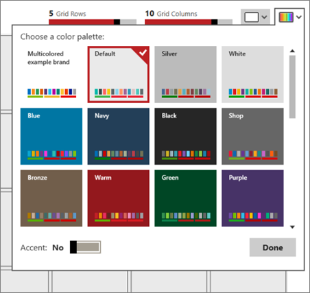
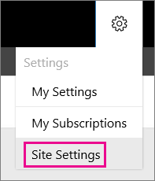
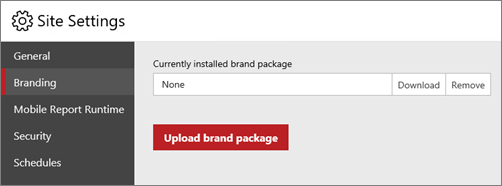

# Personalizzazione del portale Web

[!INCLUDE[ssrs-appliesto](../includes/ssrs-appliesto.md)] [!INCLUDE[ssrs-appliesto-2016-and-later](../includes/ssrs-appliesto-2016-and-later.md)] [!INCLUDE[ssrs-appliesto-pbirsi](../includes/ssrs-appliesto-pbirs.md)]

È possibile modificare l'aspetto del portale Web personalizzandolo in base all'azienda. Questa operazione viene eseguita tramite un pacchetto del marchio. Il pacchetto del marchio è stato progettato in modo non sia necessaria una conoscenza approfondita dei fogli di stile CSS per poterlo creare.  
  
<iframe width="560" height="315" src="https://www.youtube.com/embed/m08kLuofwFA?list=PLv2BtOtLblH3F--8WmK9QcLbx6dV_lVkL" frameborder="0" allowfullscreen></iframe>  
   
## Creazione del pacchetto del marchio  
  
Un pacchetto del marchio per Reporting Services consiste di tre elementi e presenta la forma di un file ZIP.   
  
- color.json  
- metadata.xml  
- logo.png (facoltativo)  
  
I file devono avere i nomi elencati sopra. Al file ZIP è possibile assegnare il nome che si vuole.  
  
### metadata.xml  
  
Il file metadata.xml consente di impostare il nome del pacchetto del marchio e ha una voce di riferimento sia per il file colors.json che per il file logo.png.  
  
Per cambiare il nome del pacchetto del marchio, modificare l'attributo **name** dell'elemento **SystemResourcePackage** .  
  
    name="Multicolored example brand"  
  
Nel pacchetto del marchio è possibile includere facoltativamente l'immagine del logo. Questo elemento sarà elencato all'interno dell'elemento Contents.  
  
Esempio senza un file del logo.  
  
    <Contents>  
      <Item key="colors" path="colors.json" />  
    </Contents>  
  
Esempio con un file del logo.  
  
    <Contents>  
      <Item key="colors" path="colors.json" />  
      <Item key="logo" path="logo.png" />  
    </Contents>  
  
### Colors.json  
  
Quando viene caricato il pacchetto del marchio, il server estrae le coppie nome/valore appropriate dal file colors.json e le unisce con il foglio di stile LESS master, brand.less. Questo file LESS viene quindi elaborato e il file CSS risultante viene servito al client. Tutti i colori del foglio di stile sono indicati nel formato esadecimale e sei caratteri.  
  
Il foglio di stile LESS contiene blocchi che fanno riferimento ad alcune variabili LESS predefinite come le seguenti.  
  
    /* primary buttons */   
    .btn-primary {   
        color:@primaryButtonColor;   
        background-color:@primaryButtonBg;   
    }  
  
Mentre questo è simile alla sintassi CSS, i valori colore, preceduti dal prefisso di @symbol, sono esclusivi di LESS. Si tratta di variabili i cui valori sono impostati dal file json.  
  
Ad esempio, se il file colors.json avesse i valori seguenti.  
  
    "primary":"#009900",   
    "primaryContrast":"#ffffff"   
  
L'output elaborato ricercherebbe la variabile LESS **@primaryButtonBg** e riscontrerebbe che è mappata alla proprietà json denominata **primary**, che in questo esempio è #009900. Pertanto genererebbe il CSS corretto.  
  
    .btn-primary {   
        color:#ffffff;   
        background-color:#009900;   
    }  
  
Tutti i pulsanti con la proprietà primary sarebbero mostrati in verde scuro con testo bianco.  
  
Il file colors.json, per Reporting Services, ha due categorie principali i cui elementi sono raggruppati.  
  
- **Interfaccia**: include gli elementi che sono specifici del portale Web di Reporting Services.  
- **Tema**: include gli elementi che sono specifici dei report mobili creati dall'utente.  
  
La sezione dell'interfaccia è suddivisa nei raggruppamenti seguenti.  
  
|Sezione|Description|  
|---|---|  
|primary|Colori dei pulsanti e colori mostrati al passaggio del mouse.|  
|Secondaria|Colore della barra del titolo, della barra di ricerca, del menu del lato sinistro (se mostrato) e del testo per questi elementi|  
|Neutro primario|Sfondi dell'area home e report.|  
|Neutro secondario|Sfondi delle caselle di testo e delle opzioni di cartella, menu delle impostazioni.|  
|Neutro terziario|Sfondi delle impostazioni del sito.|  
|Messaggi di pericolo/avviso/operazione riuscita|Colori per questi messaggi.|  
|Indicatore KPI|Controlla i colori che rappresentano un valore positivo (1), neutro (0), negativo (-1) e nessuno.|  
  
La prima volta che ci si connette a un server con Mobile Report Publisher dove è distribuito un pacchetto del marchio, il tema verrà aggiunto a quelli disponibili e utilizzabili, nel menu in alto a destra dell'applicazione.  
  
  
  
È quindi possibile usare quel tema nei report per dispositivi mobili che verranno creati, anche se non sono per lo stesso server su cui il tema è distribuito.   
  
### Uso di un logo  
  
Se si include un logo nel pacchetto del marchio, esso apparirà nel portale Web al posto del nome che è stato specificato per il portale Web nel menu Impostazioni sito.  
  
Il file che si include per il logo deve usare il formato di file PNG. Le dimensioni del file saranno scalate dopo il caricamento sul server. Dovrebbe essere scalato a circa 290 x 60 px.  
   
## Applicazione del pacchetto del marchio al portale Web  
  
Per aggiungere, scaricare o rimuovere un pacchetto del marchio, è possibile eseguire le operazioni seguenti.  
  
1.  Selezionare l' **ingranaggio** in alto a destra.  
  
2.  Selezionare **Impostazioni sito**.  
  
      
  
3.  Selezionare **Personalizzazione**.  
  
      
  
**Pacchetto del marchio attualmente installato** mostrerà il nome del pacchetto che è stato caricato o mostrerà Nessuno.  
  
**Carica pacchetto del marchio** applicherà il pacchetto al portale Web. Le modifiche saranno visibili immediatamente.  
  
È anche possibile **scaricare** o **rimuovere** il pacchetto. Rimuovendo il pacchetto, il portale Web sarà reimpostato immediatamente sul marchio predefinito.  
  
## Esempio metadata.xml  
  
    \<?xml version="1.0" encoding="utf-8"?>  
    <SystemResourcePackage xmlns="http://schemas.microsoft.com/sqlserver/reporting/2016/01/systemresourcepackagemetadata"  
        type="UniversalBrand"  
        version="2.0.2"  
        name="Multicolored example brand"  
        >  
        <Contents>  
            <Item key="colors" path="colors.json" />  
            <Item key="logo" path="logo.png" />  
        </Contents>  
    </SystemResourcePackage>  
   
## Esempio colors.json  
  
    {  
        "name":"Multicolored example brand",  
        "version":"1.0",  
        "interface":{  
            "primary":"#b31e1e",  
            "primaryAlt":"#ca0806",  
            "primaryAlt2":"#621013",  
            "primaryAlt3":"#e40000",  
            "primaryAlt4":"#e14e50",  
            "primaryContrast":"#fff",  
  
            "secondary":"#042200",  
            "secondaryAlt":"#0f4400",  
            "secondaryAlt2":"#155500",  
            "secondaryAlt3":"#217700",  
            "secondaryContrast":"#49e63c",  
  
            "neutralPrimary":"#d8edff",  
            "neutralPrimaryAlt":"#c9e6ff",  
            "neutralPrimaryAlt2":"#aedaff",  
            "neutralPrimaryAlt3":"#88c8ff",  
            "neutralPrimaryContrast":"#0a2b4c",  
  
            "neutralSecondary":"#e9d8eb",  
            "neutralSecondaryAlt":"#d9badc",  
            "neutralSecondaryAlt2":"#b06cb5",  
            "neutralSecondaryAlt3":"#a75bac",  
            "neutralSecondaryContrast":"#250a26",  
  
            "neutralTertiary":"#f79220",  
            "neutralTertiaryAlt":"#f8a54b",  
            "neutralTertiaryAlt2":"#facc9b",  
            "neutralTertiaryAlt3":"#fce3c7",  
            "neutralTertiaryContrast":"#391d00",  
  
            "danger":"#ff0000",  
            "success":"#00ff00",  
            "warning":"#ff8800",  
            "info":"#00ff",  
            "dangerContrast":"#fff",  
            "successContrast":"#fff",  
            "warningContrast":"#fff",  
            "infoContrast":"#fff",  
  
            "kpiGood":"#4fb443",  
            "kpiBad":"#de061a",  
            "kpiNeutral":"#d9b42c",  
            "kpiNone":"#333",  
            "kpiGoodContrast":"#fff",  
            "kpiBadContrast":"#fff",  
            "kpiNeutralContrast":"#fff",  
            "kpiNoneContrast":"#fff"  
           },  
           "theme":{  
            "dataPoints":[  
                "#0072c6",  
                "#f68c1f",  
                "#269657",  
                "#dd5900",  
                "#5b3573",  
                "#22bdef",  
                "#b4009e",  
                "#008274",  
                "#fdc336",  
                "#ea3c00",  
                "#00188f",  
                "#9f9f9f"  
            ],  
  
            "good":"#85ba00",  
            "bad":"#e90000",  
            "neutral":"#edb327",  
            "none":"#333",  
  
            "background":"#fff",  
            "foreground":"#222",  
            "mapBase":"#00aeef",  
            "panelBackground":"#f6f6f6",  
            "panelForeground":"#222",  
            "panelAccent":"#00aeef",  
            "tableAccent":"#00aeef",  
  
            "altBackground":"#f6f6f6",  
            "altForeground":"#000",  
            "altMapBase":"#f68c1f",  
            "altPanelBackground":"#235378",  
            "altPanelForeground":"#fff",  
            "altPanelAccent":"#fdc336",  
            "altTableAccent":"#fdc336"  
        }  
    }  

Ulteriori domande? [Provare a porre il forum di Reporting Services](http://go.microsoft.com/fwlink/?LinkId=620231)

