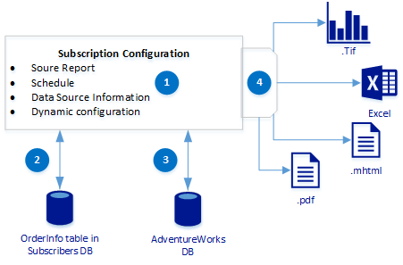

# Creare una sottoscrizione guidata dai dati (esercitazione su SSRS)
Questa esercitazione di [!INCLUDE[ssRSnoversion](../includes/ssrsnoversion-md.md)] illustra i concetti di sottoscrizioni guidate dai dati attraverso un semplice esempio che crea una sottoscrizione guidata dai dati per generare e salvare l'output di un report filtrato in una condivisione di file. 
[!INCLUDE[ssRSnoversion](../includes/ssrsnoversion-md.md)] Le sottoscrizioni guidate dai dati consentono di personalizzare e automatizzare la distribuzione di un report basato su dati dinamici del Sottoscrittore. Le sottoscrizioni guidate dai dati sono progettate per i tipi di scenari seguenti:  
  
-   Per la distribuzione di report a un ampio pool di destinatari la cui appartenenza può cambiare in base alla distribuzione. Ad esempio, inviare un report mensile a tutti i clienti correnti tramite posta elettronica.  
  
-   Per la distribuzione di report a un gruppo specifico di destinatari in base a criteri predefiniti. Ad esempio, inviare un report sulle prestazioni delle vendite a tutti i responsabili delle vendite in un'organizzazione.
+ Automatizzare la generazione di report in un'ampia gamma di formati, ad esempio file xlsx e PDF.  
  
## Lezioni dell'esercitazione  
 L'esercitazione è suddivisa in tre lezioni:  
 Lezione | Commenti
 ------- | --------------
 [Lezione 1: Creare un database di esempio del Sottoscrittore](../reporting-services/lesson-1-creating-a-sample-subscriber-database.md) | In questa lezione verrà creato un database [!INCLUDE[ssNoVersion](../includes/ssnoversion-md.md)] locale di tabelle che contiene informazioni sul Sottoscrittore. Le informazioni su numeri di ordine da usare per il filtro e i formati del file di output.
[Lezione 2: Configurare le proprietà dell'origine dati del report](../reporting-services/lesson-2-modifying-the-report-data-source-properties.md) |In questa lezione, verrà configurata un'origine dati del report in modo che il report possa essere eseguito in modalità automatica secondo una pianificazione. Le credenziali archiviate sono necessarie per l'elaborazione automatica. Inoltre, verrà modificato il set di dati del report per includere un parametro fornito dai dati del sottoscrittore. Questo parametro viene usato per filtrare i dati del report basati su numeri di ordine.
 [Lezione 3: Definire una sottoscrizione guidata dai dati](../reporting-services/lesson-3-defining-a-data-driven-subscription.md) | In questa lezione verrà creata una sottoscrizione guidata dai dati. In questa lezione viene introdotta la procedura guidata che consente di eseguire in modo semplificato i passaggi necessari per creare sottoscrizioni guidate dai dati.

 Il diagramma seguente illustra la struttura dell'esercitazione

Passaggio  |Description 
---------|---------
(1)     |  La configurazione della sottoscrizione nota il report di origine, la pianificazione e il campo che eseguono il mapping al database del Sottoscrittore.        
(2)     | La tabella OrderInfo contiene 4 numeri di ordine da usare per i filtri , 1 per i file. La tabella contiene anche i formati di file per i report generati.
(3)     | Le informazioni dal database Adventureworks vengono filtrate e restituite al report. 
(4)     | I report vengono creati nei formati di file specificati nella tabella Orderinfo.

 
 
    
  
## Requisiti  
Le sottoscrizioni guidate dai dati vengono in genere create e gestite da amministratori di server di report. I passaggi per creare le sottoscrizioni guidate dai dati richiedono la creazione di query, conoscenza delle origini dati che contengono i dati del Sottoscrittore e autorizzazioni elevate in un server di report.  
  
L'esercitazione usa il report *SalesOrder* creato nell'esercitazione [Creare un report di tabelle semplice &#40;Esercitazione su SSRS&#41;](../reporting-services/create-a-basic-table-report-ssrs-tutorial.md) e i dati dal database di esempio **AdventureWorks2014**.  
  
Per utilizzare l'esercitazione è necessario che nel computer sia installato quanto segue:  
  
-   Un'edizione di [!INCLUDE[ssNoVersion](../includes/ssnoversion-md.md)] che supporta sottoscrizioni guidate dai dati. Per altre informazioni, vedere [Edizioni e componenti di SQL Server 2016](../sql-server/editions-and-components-of-sql-server-2016.md).  
  
-   Il server di report deve essere eseguito in modalità nativa. L'interfaccia utente descritta in questa esercitazione è basata su un server di report in modalità nativa. Le sottoscrizioni sono supportate in server di report in modalità SharePoint ma l'interfaccia utente sarà diversa da quella descritta in questa esercitazione.  
  
-   È necessario che il servizio SQL Server Agent sia in esecuzione.  
  
-   Un report con parametri. In questa esercitazione si presuppone l'uso del report di esempio `Sales Orders` creato durante l'esercitazione [Creare un report di tabelle semplice &#40;Esercitazione su SSRS&#41;](../reporting-services/create-a-basic-table-report-ssrs-tutorial.md).  
  
-   Il database di esempio **AdventureWorks2014** che contiene i dati per il report di esempio.  
  
-   Un'assegnazione di ruolo [!INCLUDE[ssRSnoversion_md](../includes/ssrsnoversion-md.md)] che include l'attività Gestione di tutte le sottoscrizioni nel report di esempio. Questa attività è necessaria per la definizione di una sottoscrizione guidata dai dati. Per gli amministratori del computer, l'assegnazione di ruolo predefinita per gli amministratori locali fornisce le autorizzazioni necessarie per la creazione di sottoscrizioni guidate dai dati. Per altre informazioni, vedere [Granting Permissions on a Native Mode Report Server](../reporting-services/security/granting-permissions-on-a-native-mode-report-server.md).  
  
-   Una cartella condivisa per la quale si dispone di autorizzazioni di scrittura. La cartella condivisa deve essere accessibile su una connessione di rete.  
  
**Tempo previsto per il completamento dell'esercitazione:** 30 minuti. Ulteriori 30 minuti qualora l'esercitazione sul report di base non venga completata.  
  
## Vedere anche  
[Data-Driven Subscriptions](../reporting-services/subscriptions/data-driven-subscriptions.md)  
[Creare un report di tabelle semplice &#40;Esercitazione su SSRS&#41;](../reporting-services/create-a-basic-table-report-ssrs-tutorial.md)
 

