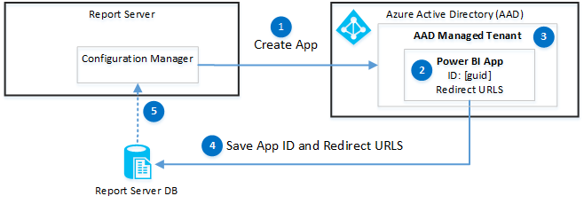
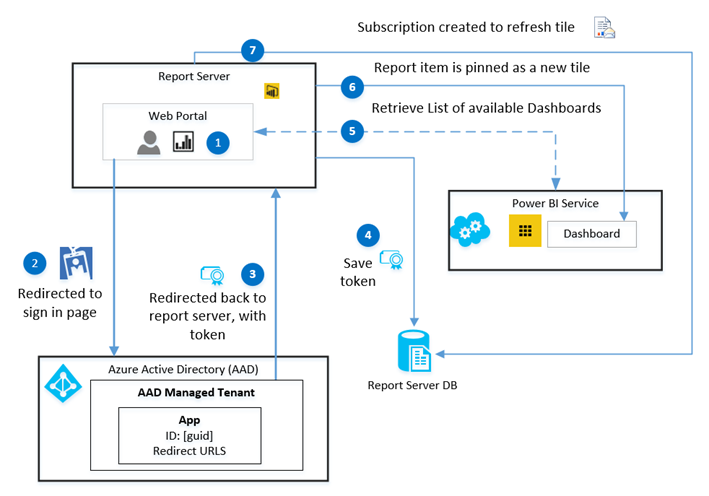
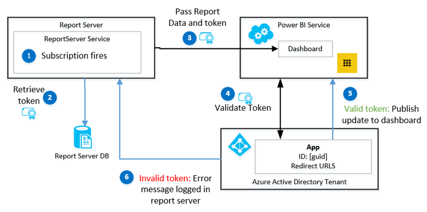

# Integrazione del server di report e di Power BI (Gestione configurazione)

[!INCLUDE[ssrs-appliesto](../../includes/ssrs-appliesto.md)] [!INCLUDE[ssrs-appliesto-2016-and-later](../../includes/ssrs-appliesto-2016-and-later.md)] [!INCLUDE[ssrs-appliesto-pbirsi](../../includes/ssrs-appliesto-pbirs.md)]

La pagina  **Integrazione di Power BI** in Gestione configurazione [!INCLUDE[ssRSnoversion](../../includes/ssrsnoversion-md.md)] viene usata per registrare il server di report con il tenant gestito di Azure Active Directory (AD) per consentire agli utenti del server di report di aggiungere gli elementi del report supportati ai dashboard di [!INCLUDE[sspowerbi](../../includes/sspowerbi-md.md)] . Per un elenco di elementi supportati che è possibile aggiungere, vedere [Aggiungere elementi di Reporting Services ai dashboard di Power BI](../../reporting-services/pin-reporting-services-items-to-power-bi-dashboards.md).

##   Requisiti per l'integrazione di Power BI

Oltre a una connessione Internet attiva per passare al servizio [!INCLUDE[sspowerbi](../../includes/sspowerbi-md.md)] , i requisiti per l'integrazione di [!INCLUDE[sspowerbi](../../includes/sspowerbi-md.md)]sono i seguenti.

- **Azure Active Directory:** l'organizzazione deve usare Azure Active Directory, che consente la gestione di identità e directory per applicazioni Web e servizi Azure. Per ulteriori informazioni, vedere [che cos'è Azure Active Directory?](https://azure.microsoft.com/documentation/articles/active-directory-whatis/)

- **Tenant gestito:** il dashboard di [!INCLUDE[sspowerbi](../../includes/sspowerbi-md.md)] al quale si desidera aggiungere gli elementi del report deve far parte di un tenant gestito di Azure AD.  Un tenant gestito viene creato automaticamente la prima volta che l'organizzazione sottoscrive i servizi di Azure, ad esempio Office 365 e Microsoft Intune.   I tenant virali attualmente non supportati.  Per altre informazioni vedere le sezioni "Che cos'è un tenant di Azure AD" e "Come ottenere una directory di Azure AD" in [Che cos'è una directory di Azure AD?](https://msdn.microsoft.com/library/azure/jj573650.aspx#BKMK_WhatIsAnAzureADTenant)

- L'utente che esegue l'integrazione di [!INCLUDE[sspowerbi](../../includes/sspowerbi-md.md)] deve essere un membro del tenant di Azure AD, un amministratore di sistema di [!INCLUDE[ssRSnoversion](../../includes/ssrsnoversion-md.md)] e un amministratore di sistema per il database del catalogo ReportServer.

- L'utente che esegue l'integrazione di [!INCLUDE[sspowerbi](../../includes/sspowerbi-md.md)] deve avviare Gestione configurazione [!INCLUDE[ssRSnoversion](../../includes/ssrsnoversion-md.md)] con l'account usato per installare [!INCLUDE[ssRSnoversion](../../includes/ssrsnoversion-md.md)]o con l'account con il quale è in esecuzione il servizio [!INCLUDE[ssRSnoversion](../../includes/ssrsnoversion-md.md)]

- I report che si desidera aggiungere devono usare credenziali archiviate. Questo non è un requisito per l'integrazione di [!INCLUDE[sspowerbi](../../includes/sspowerbi-md.md)] , bensì per il processo di aggiornamento degli elementi aggiunti.  L'azione di aggiunta di un elemento del report crea una sottoscrizione di [!INCLUDE[ssRSnoversion](../../includes/ssrsnoversion-md.md)] per gestire la pianificazione dell'aggiornamento dei riquadri in [!INCLUDE[sspowerbi](../../includes/sspowerbi-md.md)]. [!INCLUDE[ssRSnoversion](../../includes/ssrsnoversion-md.md)] richiedono credenziali archiviate. Se un report non usa le credenziali archiviate, un utente può comunque aggiungere gli elementi del report, ma quando la sottoscrizione associata tenta di aggiornare i dati di [!INCLUDE[sspowerbi](../../includes/sspowerbi-md.md)]viene generato un messaggio di errore simile al seguente nella pagina **Sottoscrizioni personali** .

        PowerBI Delivery error: dashboard: IT Spend Analysis Sample, visual: Chart2, error: The current action cannot be completed. The user data source credentials do not meet the requirements to run this report or shared dataset. Either the user data source credential.

Per ulteriori informazioni su come archiviare le credenziali, vedere la sezione "configurare le credenziali archiviate per un'origine dati specifica del report" in [archiviare le credenziali in un'origine dati di Reporting Services](../../reporting-services/report-data/store-credentials-in-a-reporting-services-data-source.md).

Per altre informazioni l'amministratore può leggere i file di registro di  [!INCLUDE[ssRSnoversion](../../includes/ssrsnoversion-md.md)] .  Vedrà messaggi simili al seguente. Un ottimo modo per esaminare e monitorare i file di registro di [!INCLUDE[ssRSnoversion](../../includes/ssrsnoversion-md.md)] è applicare [!INCLUDE[msCoName](../../includes/msconame-md.md)] Power Query sui file.  Per altre informazioni e un breve filmato vedere [Report Server Service Trace Log](../../reporting-services/report-server/report-server-service-trace-log.md).

    subscription!WindowsService_1!1458!09/24/2015-00:09:27:: e ERROR: PowerBI Delivery error: dashboard: IT Spend Analysis Sample, visual: Chart2, error: The current action cannot be completed. The user data source credentials do not meet the requirements to run this report or shared dataset. Either the user data source credentials are not stored in the report server database, or the user data source is configured not to require credentials but the unattended execution account is not specified.

    notification!WindowsService_1!1458!09/24/2015-00:09:27:: e ERROR: Error occurred processing subscription fcdb8581-d763-4b3b-ba3e-8572360df4f9: PowerBI Delivery error: dashboard: IT Spend Analysis Sample, visual: Chart2, error: The current action cannot be completed. The user data source credentials do not meet the requirements to run this report or shared data set. Either the user data source credentials are not stored in the report server database, or the user data source is configured not to require credentials but the unattended execution account is not specified.

##   Per integrare e registrare il server di report

Completare i passaggi seguenti da Gestione configurazione [!INCLUDE[ssRSnoversion](../../includes/ssrsnoversion-md.md)] . Per ulteriori informazioni, vedere [Gestione configurazione Reporting Services](../../reporting-services/install-windows/reporting-services-configuration-manager-native-mode.md).

1. Selezionare la pagina di integrazione di [!INCLUDE[sspowerbi](../../includes/sspowerbi-md.md)] .

2. Selezionare **Registra con Power BI**.

3. Nella finestra di accesso di [!INCLUDE[msCoName](../../includes/msconame-md.md)] immettere le credenziali usate per accedere a [!INCLUDE[sspowerbi](../../includes/sspowerbi-md.md)].

4. Al termine della registrazione, la sezione **Dettagli di registrazione di Power BI** annoterà l'ID tenant di Azure e gli URL di reindirizzamento.  Gli URL vengono usati nell'ambito del processo di accesso e di comunicazione in modo che il dashboard di [!INCLUDE[sspowerbi](../../includes/sspowerbi-md.md)] comunichi con il server di report registrato.

5. Fare clic sul pulsante **Copia** nella finestra **Risultati** per copiare i dettagli di registrazione negli Appunti di Windows in modo da salvarli come riferimento futuro.

##   Annullare la registrazione su Power BI

**Annulla registrazione** : l'annullamento della registrazione del server di report da Azure Active Directory avrà le conseguenze seguenti:

- Il **impostazioni personali** collegamento non sarà visibile nella barra dei menu del portale web.

- Gli elementi del report già aggiunti rimarranno comunque aggiunti ai dashboard, ma i riquadri nel dashboard non verranno più aggiornati.

- Le sottoscrizioni di [!INCLUDE[ssRSnoversion](../../includes/ssrsnoversion-md.md)] che aggiornavano i riquadri continuano a esistere nel server di report, ma quando vengono eseguite in una pianificazione configurata viene visualizzato un messaggio di errore simile al seguente.

    **Impossibile caricare l'estensione per il recapito per questa sottoscrizione.**

Dalla pagina **Power BI** di Gestione configurazione fare clic sul pulsante **Annulla registrazione con Power BI** .

##   Aggiornare la registrazione

Utilizzare la funzione **Aggiorna registrazione** se la configurazione del server di report è stata modificata, ad esempio se si vuole aggiungere o rimuovere gli URL usati dagli utenti per passare al [!INCLUDE[ssRSWebPortal](../../includes/ssrswebportal.md)].

- In Gestione configurazione [!INCLUDE[ssRSnoversion](../../includes/ssrsnoversion-md.md)] , selezionare l' **URL del portale Web**

     Fare clic su **Avanzate**.

- Selezionare **Aggiungi** per aggiungere una nuova identità HTTP per il [!INCLUDE[ssRSWebPortal](../../includes/ssrswebportal.md)] e quindi selezionare **OK**.

     L'icona di [!INCLUDE[sspowerbi](../../includes/sspowerbi-md.md)] cambierà, ad indicare che la configurazione del server è stata modificata.  

- Nella pagina **Integrazione di Power BI** selezionare **Aggiorna registrazione**.

     Verrà richiesto di accedere ad Azure AD. La pagina verrà aggiornata e il nuovo URL verrà elencato tra gli **URL di reindirizzamento**.

##   Riepilogo del processo di integrazione e di aggiunta di Power BI

In questa sezione vengono riepilogati i passaggi di base e le tecnologie usate per l'integrazione del server di report con [!INCLUDE[sspowerbi](../../includes/sspowerbi-md.md)] e l'aggiunta di un elemento del report a un dashboard.

 **Integrazione:**

1. In Gestione configurazione quando si fa clic sul pulsante **Registra con Power BI** verrà richiesto di accedere ad Azure Active Directory.

2. L'app client [!INCLUDE[sspowerbi](../../includes/sspowerbi-md.md)] viene registrata sul tenant gestito.

3. Il tenant gestito all'interno di Azure Active Directory è quello in cui viene creata l'applicazione Client di Power BI.

4. La registrazione include uno o più URL di reindirizzamento che vengono usati quando gli utenti accedono dal server di report.  L'ID dell'app e gli URL vengono salvati nel database ReportServer. L'URL di reindirizzamento viene usato durante le chiamate di autenticazione ad Azure in modo che la chiamata possa tornare al server di report, Ad esempio, quando gli utenti accedono o aggiungere elementi a un dashboard.

5. L'ID dell'App e gli URL vengono visualizzati in Configuration Manager.

 

 **Quando un utente aggiunge un elemento del report a un dashboard:**

1. Gli utenti visualizzano i report in anteprima nel [!INCLUDE[ssRSnoversion](../../includes/ssrsnoversion-md.md)] [!INCLUDE[ssRSWebPortal](../../includes/ssrswebportal.md)] e la prima volta che fanno clic per aggiungere un elemento del report dal [!INCLUDE[ssRSWebPortal](../../includes/ssrswebportal.md)].

2. Vengono reindirizzati alla pagina di accesso di Azure AD. Possono anche accedere dalla pagina [!INCLUDE[ssRSWebPortal](../../includes/ssrswebportal.md)] **My Settings** page. Quando gli utenti accedono al tenant gestito di Azure, viene stabilita una relazione tra il loro account Azure e le autorizzazioni di [!INCLUDE[ssRSnoversion](../../includes/ssrsnoversion-md.md)] .  Per altre informazioni, vedere [Impostazioni personali per Integrazione di Power BI &#40;portale Web&#41;](http://msdn.microsoft.com/85c2fac7-80bf-45b7-8654-764b5f5231f5).

3. Un token di sicurezza utente viene restituito al server di report.

4. Il token di sicurezza utente viene salvato nel database ReportServer.

5. Dal servizio [!INCLUDE[sspowerbi](../../includes/sspowerbi-md.md)] viene recuperato un elenco di gruppi e dashboard ai quali l'utente può accedere.  L'utente seleziona il gruppo e il dashboard di destinazione e configura la frequenza con cui aggiornare i dati nel riquadro [!INCLUDE[sspowerbi](../../includes/sspowerbi-md.md)] .

6. L'elemento del report viene aggiunto al dashboard.

7. Viene creata una sottoscrizione di [!INCLUDE[ssRSnoversion](../../includes/ssrsnoversion-md.md)] per gestire l'aggiornamento pianificato dell'elemento del report nel riquadro del dashboard. La sottoscrizione usa il token di sicurezza che è stato creato quando l'utente ha eseguito l'accesso.

     Il token è utile per **90 giorni**, dopodiché gli utenti che devono accedere di nuovo per creare un nuovo token utente. Alla scadenza del token i riquadri aggiunti vengono comunque visualizzati nel dashboard, ma non i dati vengono più aggiornati.  Le sottoscrizioni di [!INCLUDE[ssRSnoversion](../../includes/ssrsnoversion-md.md)] usate per gli elementi aggiunti genereranno un errore fino alla creazione di un nuovo token utente. Vedere [impostazioni personali per integrazione di Power BI &#40; portale web &#41;](http://msdn.microsoft.com/85c2fac7-80bf-45b7-8654-764b5f5231f5). per ulteriori informazioni.

La seconda volta che un utente aggiunge un elemento vengono ignorati i passaggi 1-4 e vengono invece recuperati l'ID dell'app e gli URL dal database ReportServer. Il flusso procede con il passaggio 5.

 **Quando si attiva una sottoscrizione per aggiornare un riquadro di dashboard:**

1. Quando si attiva una sottoscrizione a [!INCLUDE[ssRSnoversion](../../includes/ssrsnoversion-md.md)] , viene visualizzato il report.

2. Il token dell'utente verrà recuperato dal database ReportServer.

3. Lo stato e i dati dell'elemento del report vengono inviati insieme al token al servizio [!INCLUDE[sspowerbi](../../includes/sspowerbi-md.md)].

4. Il token viene inviato ad Azure AD per la convalida. Se il token è valido, i dati dell'elemento del report vengono inviati al riquadro del dashboard e la proprietà data del riquadro viene aggiornata.

5. Se il token non è valido, un errore viene restituito e registrato con il server di report.  Al dashboard non vengono inviati né lo stato né altre informazioni.

<iframe width="560" height="315" src="https://www.youtube.com/embed/QhPQObqmMPc" frameborder="0" allowfullscreen></iframe>

## Passaggi successivi

[Impostazioni personali per integrazione di Power BI](http://msdn.microsoft.com/85c2fac7-80bf-45b7-8654-764b5f5231f5)  
[Aggiungere elementi di Reporting Services ai dashboard di Power BI](../../reporting-services/pin-reporting-services-items-to-power-bi-dashboards.md)   
[Dashboard in Power BI](https://powerbi.microsoft.com/documentation/powerbi-service-dashboards/)  

Altre domande? [Visitare il forum su Reporting Services](http://go.microsoft.com/fwlink/?LinkId=620231)
