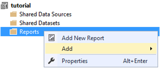

# Lezione 1: Creazione di un progetto server report (Reporting Services)

 > Per contenuti relativi a versioni precedenti di SQL Server, vedere [lezione 1: creazione di un progetto Server di Report (Reporting Services)](https://msdn.microsoft.com/en-US/library/ms167559(SQL.120).aspx).

In questa lezione si creerà un *progetto server report* e un file di *definizione del report (con estensione rdl)* in [!INCLUDE[ssBIDevStudio_md](../includes/ssbidevstudio-md.md)] all'interno di Visual Studio. 

Per creare un report con [!INCLUDE[ssBIDevStudioFull](../includes/ssbidevstudiofull-md.md)], è innanzitutto necessario creare un progetto server di report in cui è possibile salvare il file della definizione del report (con estensione rdl) e altri file di risorse necessari per il report. 

Nelle lezioni successive verranno definiti un'origine dati per il report, un set di dati e il layout del report. Quando si esegue il report, i dati vengono recuperati e combinati con il layout, quindi visualizzati sullo schermo, da dove sarà possibile esportarli, stamparli o salvarli.  
  
  
  
## Per creare un progetto server di report  
  
1.  Aprire [!INCLUDE[ssBIDevStudio_md](../includes/ssbidevstudio-md.md)].  
  
2.  Nel menu **File** > **Nuovo** > **Progetto**.  

    
  
3.  In **Installato** > **Modelli** > **Business Intelligence**fare clic su **Reporting Services**.

    

5. Fare clic su **Progetto server di report** . 

   >**Nota**: se non viene visualizzato il **Business Intelligence** o **progetto Server Report** opzioni, è necessario aggiornare SSDT con i modelli di Business Intelligence. Vedere [Scaricare SQL Server Data Tools (SSDT)](https://msdn.microsoft.com/library/mt204009.aspx)  
  
5.  In **Nome**digitare **Esercitazione**.  

    Per impostazione predefinita, viene creato nella cartella Visual Studio 2015\Projects in una nuova directory.
    
    
  
6.  Fare clic su **OK** per creare il progetto.  
  
    Il progetto Esercitazione viene visualizzato sul lato destro del riquadro Esplora soluzioni.  
  
## Per creare un nuovo file di definizione del report  
  
1.  Nel riquadro **Esplora soluzioni** fare clic con il pulsante destro del mouse su **Report** > **Aggiungi** > **Nuovo elemento**. 

    >**Suggerimento**: se non viene visualizzato il riquadro **Esplora soluzioni** , scegliere **Esplora soluzioni** dal menu **Visualizza**. 

    
  
2.  Nella finestra **Aggiungi nuovo elemento** fare clic su **Report** .  
  
3.  Digitare **Sales Orders.rdl**in **Nome** , quindi fare clic su **Aggiungi**.  
  
    Verranno visualizzati Progettazione report e il nuovo file con estensione rdl nella visualizzazione Progettazione.  
    
    
  
     Progettazione report è il componente di [!INCLUDE[ssRSnoversion](../includes/ssrsnoversion-md.md)] eseguito in [!INCLUDE[ssBIDevStudioFull](../includes/ssbidevstudiofull-md.md)] e ha due viste: **Progettazione** e **Anteprima**. Fare clic sulla scheda corrispondente per cambiare la vista.  
  
    I dati vengono definiti nel riquadro **Dati report** . Il layout dei report viene definito nella vista **Progettazione** . Dopo aver eseguito il report, è possibile vederne l'aspetto nella vista **Anteprima** .  
  
## Lezione successiva  
In questo modo è stato creato un progetto di report denominato Esercitazione, cui è stato aggiunto un file di definizione del report (con estensione rdl). Il passaggio successivo consiste nello specificare un'origine dei dati per il report. Vedere [Lezione 2: Specifica delle informazioni di connessione &#40;Reporting Services&#41;](../reporting-services/lesson-2-specifying-connection-information-reporting-services.md).  
  
## Vedere anche  
[Creare un report tabella semplice &#40;esercitazione su SSRS&#41;](../reporting-services/create-a-basic-table-report-ssrs-tutorial.md)  
  

