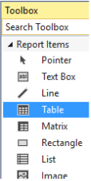

# Lezione 4: Aggiunta di una tabella al report (Reporting Services)
Dopo aver definito il set di dati, è possibile iniziare la progettazione del report. È possibile creare un layout del report trascinando le aree dati, le caselle di testo, le immagini e altri elementi che si desidera includere nel report e rilasciandoli nell'area di progettazione.  
  
Le *aree dati*sono elementi che contengono righe ripetute di dati provenienti dai set di dati sottostanti. In un report di base è disponibile una sola area dati, tuttavia è possibile aggiungerne altre, ad esempio se si desidera aggiungere un grafico al report tabulare. Dopo avere aggiunto un'area dati, è possibile aggiungervi dei campi.  
  
### Per aggiungere un'area dati tabella e campi a un layout del report  
  
1.  Nella **casella degli strumenti**fare clic su **Tabella**, fare clic sull'area di progettazione e trascinare il mouse. In Progettazione report verrà disegnata un'area dati tabella composta da tre colonne al centro dell'area di progettazione. È possibile che la **casella degli strumenti** venga visualizzata come scheda sul lato sinistro del riquadro **Dati report** . Per aprire la **casella degli strumenti**, spostare il puntatore sulla scheda **Casella degli strumenti** . Se la **casella degli strumenti** non è visibile, nel menu **Visualizza** scegliere **Casella degli strumenti**.
  
      
  
  È anche possibile aggiungere una tabella al report dall'area di progettazione.  Fare clic con il pulsante destro del mouse nell'area di progettazione, scegliere **Inserisci** e fare clic su **Tabella**.
2.  Nel riquadro **Dati report** espandere il set di dati **AdventureWorksDataset** per visualizzare i campi.  
  
3.  Trascinare il campo *Date* dal riquadro **Dati report** alla prima colonna della tabella.  
  
    Quando si rilascia il campo nella prima colonna, si verificano i due eventi indicati di seguito. Inizialmente nella cella di dati verrà visualizzato il nome del campo, noto come *espressione di campo*, tra parentesi: `[Date]`. In secondo luogo un valore di intestazione di colonna verrà aggiunto automaticamente alla riga Intestazione, proprio sopra l'espressione di campo. Per impostazione predefinita, il nome della colonna rappresenta il nome del campo. È possibile selezionare il testo della riga Intestazione e digitare un nuovo nome.  
  
4.  Trascinare il campo *Order* dal riquadro **Dati report** alla seconda colonna della tabella.  
  
5.  Trascinare il campo *Product* dal riquadro **Dati report** alla terza colonna della tabella.  
  
6.  Trascinare il campo Qty nel bordo destro della terza colonna fino a quando non si ottiene un cursore verticale e il puntatore del mouse assume l'aspetto del segno più [+]. Quando si rilascia il pulsante del mouse, viene creata una quarta colonna per `[Qty]`.  
  
  
7.  Aggiungere il campo LineTotal con la stessa procedura, creando una quinta colonna. L'intestazione di colonna è Totale riga. Progettazione report crea automaticamente un nome descrittivo per la colonna suddividendo LineTotal in due parole.  
  
  
Nel diagramma riportato di seguito è illustrata un'area dati della tabella popolata con i campi seguenti: Date, Order, Product, Qty e Line Total.  
  
  
## Visualizzazione in anteprima di un report  
Mediante la visualizzazione in anteprima di un report è possibile visualizzare il report visualizzabile senza la necessità di pubblicarlo in un server di report. In fase di progettazione può risultare utile visualizzare il report in anteprima con una certa frequenza. Tramite la visualizzazione in anteprima del report verrà inoltre eseguita la convalida nelle connessioni dati e alla progettazione in modo che sia possibile correggere eventuali errori prima di pubblicare il report in un server di report.  
  
#### Per visualizzare l'anteprima di un report  
  
-   Fare clic sulla scheda **Anteprima** . Il report verrà eseguito in Progettazione report e l'anteprima verrà visualizzata nella visualizzazione Anteprima.
  
  
    Nel diagramma seguente viene mostrata parte del report in visualizzazione Anteprima.  
  
      
  
    Si noti che per la valuta (nella colonna Line Total) sono presenti sei posizioni dopo il numero decimale e per la data è incluso un timestamp. Nella lezione successiva verrà illustrato come correggere questa formattazione.  
  
> [!NOTE]  
> Per salvare il report, scegliere **Salva tutti** nel menu **File** .  
  
## Passaggi successivi  
È stata aggiunta un'area dati tabella al report, all'area dati sono stati aggiunti campi ed è stato visualizzato in anteprima il report. Il passaggio successivo consiste nella formattazione delle intestazioni di colonna e dei valori di data e valuta. Vedere [Lezione 5: Formattazione di un report &#40;Reporting Services&#41;](../reporting-services/lesson-5-formatting-a-report-reporting-services.md).  
  
## Vedere anche  
[Tabelle &#40;Generatore report e SSRS&#41;](../reporting-services/report-design/tables-report-builder-and-ssrs.md)  
[Raccolta di campi del set di dati &#40;Generatore report e SSRS&#41;](../reporting-services/report-data/dataset-fields-collection-report-builder-and-ssrs.md)  
