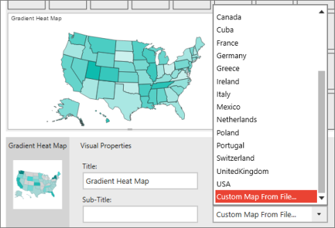
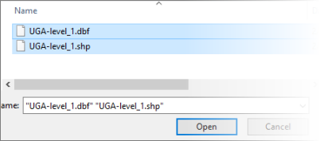

# Aggiungere una mappa personalizzata a un report di Reporting Services per dispositivi mobili
Le mappe personalizzate richiedono due file:  
* Un file SHP per geometrie di forma  
* Un file DBF per i metadati  
  
Altre informazioni sulle [mappe personalizzate nei report di Reporting Services per dispositivi mobili](../../reporting-services/mobile-reports/custom-maps-in-reporting-services-mobile-reports.md).  
  
Archiviare i due file nella stessa cartella. I nomi dei due file devono corrispondere (ad esempio, canada.shp e canada.dbf). I metadati (file DBF) devono includere il campo "NAME" con il valore del nome della forma corrispondente (chiave), che verrà usato durante il popolamento dei dati nella mappa.   
  
## Caricare una mappa personalizzata  
  
1. Nella scheda **Layout** selezionare un tipo di mappa tra **Mappa termica con sfumature**, **Mappa termica con interruzioni intervallo**o **Mappa a bolle**, trascinarla nell'area di progettazione e impostare le dimensioni desiderate.  
  
     
  
2. Nella vista **Layout** > riquadro **Proprietà visive** > **Mappa** selezionare **Mappa personalizzata da file**.   
  
     
  
3. Nella finestra di dialogo **Apri** selezionare il percorso dei file SHP e DBF e selezionarli entrambi.   
  
     
  
## Connettere i dati a una mappa personalizzata  
Quando si aggiunge la mappa personalizzata al report per la prima volta, [!INCLUDE[SS_MobileReptPub_Short](../../includes/ss-mobilereptpub-short.md)] lo popola con dati geografici simulati.  
  
  
  
La visualizzazione di dati reali nella mappa personalizzata è uguale alla visualizzazione dei dati nelle mappe predefinite. Per visualizzare i dati, seguire la procedura in [Eseguire il mapping nei report di Reporting Services per dispositivi mobili](../../reporting-services/mobile-reports/maps-in-reporting-services-mobile-reports.md) .  
  
### Vedere anche  
- [Custom maps in Reporting Services mobile reports](../../reporting-services/mobile-reports/custom-maps-in-reporting-services-mobile-reports.md)  
- [Eseguire il mapping nei report di Reporting Services per dispositivi mobili](../../reporting-services/mobile-reports/maps-in-reporting-services-mobile-reports.md)  
- [Creare e pubblicare report per dispositivi mobili con SQL Server Mobile Report Publisher](../../reporting-services/mobile-reports/create-mobile-reports-with-sql-server-mobile-report-publisher.md)   
  
  
  
  
