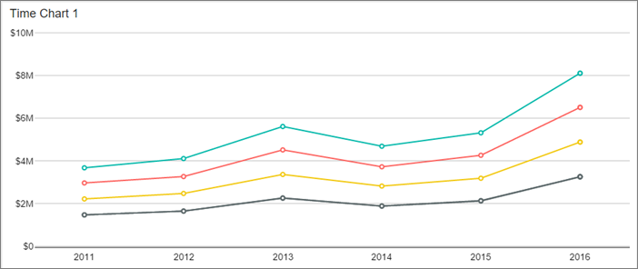
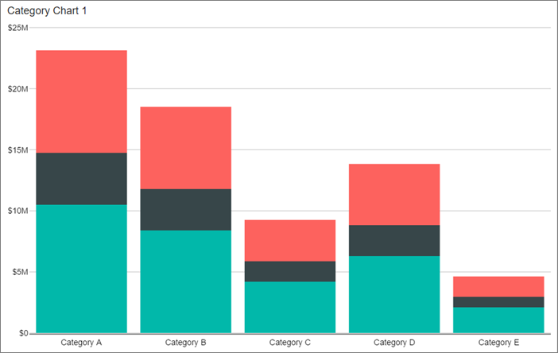
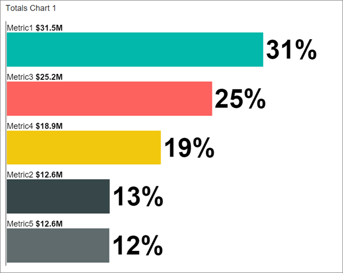
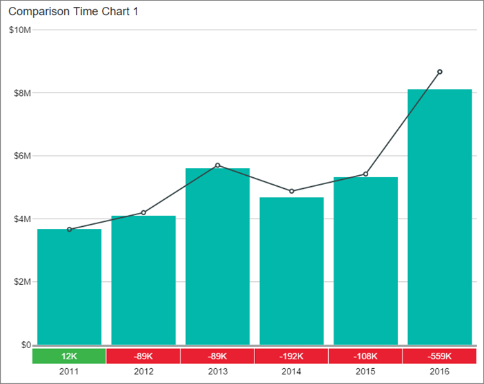
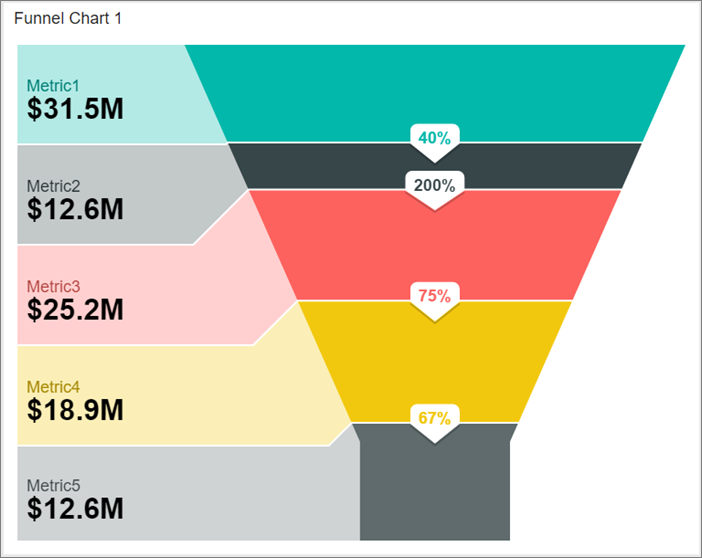
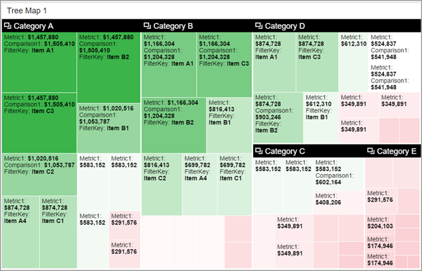
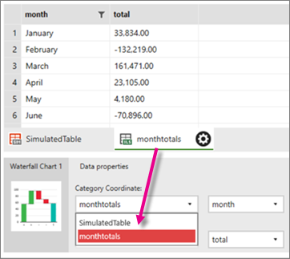
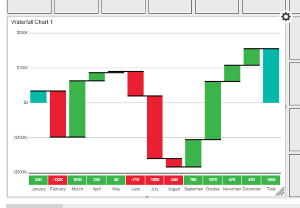

# Aggiungere visualizzazioni nei report per dispositivi mobili di Reporting Services
I grafici sono una parte essenziale della visualizzazione dati. Informazioni sui grafici da usare nei report per dispositivi mobili di [!INCLUDE[ssRSnoversion_md](../../includes/ssrsnoversion-md.md)] per coprire una gamma di scenari. 

[!INCLUDE[SS_MobileReptPub_Short](../../includes/ss-mobilereptpub-long.md)] offre tre tipi di grafici di base: temporale, categorie e totali. A questi tre tipi di grafico corrispondono grafici di confronto, utili per il confronto di due set distinti di serie.  

## Proprietà condivise dei grafici

Alcune proprietà si applicano a tutti i grafici, altre invece solo a grafici specifici. Di seguito sono illustrate alcune proprietà condivise.

### Formato dei numeri
È possibile assegnare vari formati ai numeri di un grafico in [!INCLUDE[SS_MobileReptPub_Short](../../includes/ss-mobilereptpub-short.md)] , ad esempio generale, valuta con o senza cifre decimali, percentuali con e senza cifre decimali e così via. In un grafico la formattazione dei numeri verrà applicata alle annotazioni assi, oltre che ai popup dei punti dati. Impostare la formattazione dei numeri singolarmente per ogni grafico e non per l'intero report per dispositivi mobili. 

* Per impostare il formato dei numeri, selezionare la scheda **Layout** , scegliere un grafico nell'area di progettazione e quindi nel riquadro **Proprietà visive** selezionare un **Formato numero**. 
  
### Legenda
* Per visualizzare la legenda di un grafico, selezionare la scheda **Layout** , scegliere un grafico nell'area di progettazione e quindi nel riquadro **Proprietà visive** impostare **Mostra legenda** su **On**
  
### Serie
Ogni singola metrica, o valore, visualizzata in un grafico viene detta serie. Più serie possono condividere un asse x comune e un asse y comune, come di fatto avviene. Le serie vengono definite nel pannello della vista dati selezionando una o più tabelle e campi dati. Ogni campo restituirà una singola serie di punti dati nella visualizzazione grafico con il relativo colore.  

### Modifica dell'aggregazione 
Per i campi numerici nel grafico la funzione di aggregazione predefinita è la somma. È possibile modificarla in media, conteggio, minimo, massimo, primo o ultimo.

* Selezionare la scheda **Dati** e in **Proprietà dati** selezionare **Opzioni** accanto al campo numerico e quindi scegliere un'aggregazione diversa.

### Impostare o cancellare i filtri

Se si aggiunge uno strumento di navigazione per filtrare il report per dispositivi mobili, è possibile decidere quali grafici filtrare.

1. Selezionare la scheda **Dati** e in **Proprietà dati**selezionare **Opzioni**.

2. In **Filtrato per**verranno visualizzati gli strumenti di navigazione che è possibile selezionare o deselezionare.

Per altre informazioni, vedere l'articolo relativo all' [aggiunta di strumenti di navigazione per filtrare un report per dispositivi mobili](../../reporting-services/mobile-reports/add-navigators-to-reporting-services-mobile-reports.md).
   
## Grafici temporali  
  
Il grafico temporale è il tipo di grafico più semplice in [!INCLUDE[SS_MobileReptPub_Short](../../includes/ss-mobilereptpub-short.md)]. L'asse dell'ora (e della data) del grafico viene automaticamente impostato sul primo campo di data/ora valido nella tabella dati.  

1. Trascinare un **Grafico temporale** dalla scheda **Layout** nell'area di progettazione e ridimensionarlo.

2. Per impostazione predefinita, è un grafico a barre in pila. È possibile modificare questa impostazione in **Visualizzazione serie**.

3. Se per il grafico sono necessari dati che non sono già presenti nel report, selezionare la scheda **Dati** e quindi **Aggiungi dati** per [ottenere dati da Excel o da un set di dati condiviso](../../reporting-services/mobile-reports/data-for-reporting-services-mobile-reports.md).

3. Nel riquadro **Proprietà dati** **Serie principale** corrisponde a **SimulatedTable**. Selezionare la freccia nella casella e selezionare la tabella.

5. Se si imposta **Struttura dei dati** su **Per colonne** (nel riquadro **Proprietà visive** della scheda **Layout**), nel riquadro **Proprietà dati** è possibile selezionare più colonne di valori numerici.

   Se si imposta **Struttura dei dati** su **Per righe**, nel riquadro **Proprietà dati** è possibile selezionare un **Campo del nome della serie** e una colonna di valori numerici.
   
Per altre informazioni, vedere l'articolo relativo al [raggruppamento di dati per colonne o righe](../../reporting-services/mobile-reports/group-data-by-columns-or-rows-in-a-mobile-report-reporting-services.md).
  
## Grafico categorie  
  
A differenza dei grafici temporali, nei grafici categorie il raggruppamento avviene in base a un campo diverso da un campo data/ora sull'asse x. Tale raggruppamento, detto *coordinata categoria*, deve essere basato su un campo stringa e non su un campo numerico.

   

1. Trascinare un **grafico categorie** dalla scheda **Layout** nell'area di progettazione e, se necessario, [ottenere dati per il grafico](../../reporting-services/mobile-reports/data-for-reporting-services-mobile-reports.md).

2. Selezionare la scheda **Dati** e in **Category Coordinate** (Coordinata Categoria) nel riquadro **Proprietà dati**selezionare una tabella e un campo in base ai quali eseguire il raggruppamento. Questo campo verrà visualizzato sull'asse x del grafico risultante.

3. In **Serie principale**selezionare la tabella e i campi numerici da aggregare per ogni categoria. 
  
## Grafico totali  

  
Il grafico totali offre due funzionalità distinte: 
* Non presenta più serie, ma solo la somma o il totale della serie principale definita. 
* Consente di raggruppare i dati per colonne o per righe. Il raggruppamento per colonne può essere utile quando si devono gestire dati resi flat. Nel raggruppamento per colonne è disponibile solo la proprietà della serie principale perché la colonna per la categoria viene automaticamente determinata dal numero di campi selezionati per la proprietà della serie principale.  

Per altre informazioni, vedere l'articolo relativo al [raggruppamento di dati per colonne o righe](../../reporting-services/mobile-reports/group-data-by-columns-or-rows-in-a-mobile-report-reporting-services.md). 
  
## Grafici di confronto  
  
I grafici temporali, categorie e totali sono disponibili anche come *grafici di confronto*. In un grafico di confronto è possibile specificare non solo una serie principale, ma anche una seconda serie di confronto. Le serie principale e di confronto possono essere visualizzate in tre modi diversi.

1. Trascinare uno dei **grafici di confronto** (temporali, categorie o totali) dalla scheda **Layout** nell'area di progettazione, ridimensionarlo e, se necessario, [ottenere dati per il grafico](../../reporting-services/mobile-reports/data-for-reporting-services-mobile-reports.md).

2. In **Visualizzazione serie** , nel riquadro **Proprietà visive**, selezionare una delle opzioni seguenti: 
   * Barre rispetto a barre sottili
   * Linee rispetto a barre
   * Barre rispetto a gradini 

Nei grafici di confronto è possibile scegliere gli stessi colori per i valori principali e di confronto di una serie.

* Nel riquadro **Proprietà visive** impostare **Riusa colori per le serie di confronto** su **On**.

   Se si imposta l'opzione su **On**, la tavolozza dei colori viene riavviata tra il disegno della serie principale e il disegno della serie di confronto, in modo che i valori correlati nella serie principale e nella serie di confronto siano uguali. 

   Se viene impostata su **Off**, la tavolozza dei colori continua la normale rotazione quando si disegna la serie principale dopo la serie di confronto, evitando un coordinamento di colori potenzialmente fuorviante tra i due set di serie.  
  
## Grafici a torta e a imbuto  
  
I grafici a torta e a imbuto sono tra le visualizzazioni più semplici. È possibile strutturare i dati per righe o per colonne. 
* I **grafici a torta** nei report per dispositivi mobili di [!INCLUDE[ssRSnoversion_md](../../includes/ssrsnoversion-md.md)] possono essere a torta, ad anello o ad anello con un totale al centro. I grafici a torta sono utili per visualizzare le dimensioni relative delle varie parti di un intero. Se è presente un numero eccessivo di sezioni, risultano difficili da leggere.
* I**grafici a imbuto** vengono spesso usati per mostrare le fasi di un processo, ad esempio le vendite.

### Strutturare i dati dei grafici a torta e a imbuto per righe o per colonne
1. Trascinare un **grafico a torta** o un **grafico a imbuto** dalla scheda **Layout** nell'area di progettazione, ridimensionarlo e, se necessario, [ottenere dati per il grafico](../../reporting-services/mobile-reports/data-for-reporting-services-mobile-reports.md).
2. In **Struttura dei dati** del riquadro **Proprietà visive**selezionare una delle due opzioni seguenti:
   * **Per colonne**
   * **Per righe**
3. Se è stata selezionata l'opzione **Per colonne**, selezionare la scheda **Dati** e in **Serie principale** del riquadro **Proprietà dati**selezionare la tabella e tutti i campi da aggregare nel grafico a torta o a imbuto. I nomi di campo verranno usati per assegnare un'etichetta a ogni area del grafico risultante.

   Se è stata selezionata l'opzione **Per righe**, selezionare la scheda **Dati** e in **Category Column** (Colonna Categoria) del riquadro **Proprietà dati**selezionare la tabella e la colonna con i valori da usare per il raggruppamento e le etichette della torta. Nella colonna Serie principale selezionare un campo numerico per i valori del grafico.

Per altre informazioni, vedere l'articolo relativo al [raggruppamento di dati per colonne o righe](../../reporting-services/mobile-reports/group-data-by-columns-or-rows-in-a-mobile-report-reporting-services.md). 

## Mappe ad albero  
  
La mappa ad albero visualizza le metriche applicandone i valori alle dimensioni e il colore dei riquadri in una griglia rettangolare. 

1. Trascinare una **mappa ad albero** dalla scheda **Layout** nell'area di progettazione, ridimensionarla e, se necessario, [ottenere dati per la mappa](../../reporting-services/mobile-reports/data-for-reporting-services-mobile-reports.md).
2.  Selezionare la scheda **Dati** e nel riquadro **Proprietà dati** : 

     * In **Le dimensioni rappresentano** selezionare un campo numerico per le dimensioni dei riquadri.
     * In **Il colore rappresenta** selezionare un campo numerico per il colore dei riquadri. 
     * [facoltativo] **Valore centrale personalizzato**: è possibile usare **Valore centrale personalizzato** solo se il tipo di visualizzazione è HeatMapWithCustomCenterValue.
     
         Il valore centrale decide il colore di una casella. Più la metrica si avvicina al valore centrale, più il colore è verde. Più la metrica è distante dal valore centrale, più il colore è rosso.
     
     * [facoltativo] Per visualizzare un popup quando viene selezionato un riquadro nella griglia, selezionare uno o più campi in **Etichette popup** . I popup delle mappe ad albero possono contenere sia testo sia campi numerici.  

Per impostazione predefinita, le mappe ad albero sono gerarchiche, pertanto eseguono prima il raggruppamento per categoria e quindi per dimensione e per colore.
* Sempre nella scheda **Dati** , in **Raggruppa per** , selezionare una tabella e un campo.

È possibile disattivare il raggruppamento in modo che i riquadri siano disposti solo in base alle dimensioni e al colore. 

* Selezionare la scheda **Layout** e impostare **Two-level treemap** (Mappa ad albero a due livelli) su **Off**.   

## Grafici a cascata

Il grafico a cascata mostra il totale parziale quando i valori vengono aggiunti o sottratti. Il grafico è utile per comprendere l'impatto di una serie di modifiche positive e negative sul valore iniziale, ad esempio il reddito netto.

Le colonne presentano codifica a colori: quelle verdi indicano gli incrementi e quelle rosse indicano le riduzioni. In questo modo, l'individuazione è più semplice. Le colonne relative al valore iniziale e finale spesso iniziano da zero, mentre i valori intermedi sono rappresentati da colonne mobili. Per questo aspetto, i "grafici a cascata" prendono anche il nome di "grafici a ponte".

### Quando usare un grafico a cascata

I grafici a cascata rappresentano una buona soluzione:
* Quando si notano modifiche alla misura nella serie temporale o nelle diverse categorie, al fine di verificare le modifiche principali che hanno contribuito al valore totale.
* Per pianificare il profitto annuale dell'azienda, evidenziando le diverse fonti di entrata e calcolare il profitto o la perdita totale.
* Per illustrare l'organico iniziale e finale dell'azienda su un anno.
* Per visualizzare gli importi generati e investiti ogni mese e il saldo effettivo del conto. 

### Creare un grafico a cascata

1. Trascinare un **grafico a cascata** dalla scheda **Layout** nell'area di progettazione, ridimensionarlo e, se necessario, [ottenere dati per il grafico](../../reporting-services/mobile-reports/data-for-reporting-services-mobile-reports.md).

    
    
2.  Selezionare la scheda **Dati** e, nel riquadro **Proprietà dati** , scegliere un campo categoria dei dati per **Category Coordinate**(Coordinata categoria) e un campo numerico per **Serie principale**: 

    
    
3. Selezionare la scheda **Layout** per visualizzare il grafico a cascata in anteprima.

   
   
   I mesi in cui si è registrata una perdita, come febbraio, giugno e luglio, sono visualizzati in rosso. 
   I mesi in cui si è registrato un guadagno, come settembre, ottobre e novembre, sono visualizzati in verde. 

## Vedere anche 
* [Esegue il mapping nei report di Reporting Services per dispositivi mobili](../../reporting-services/mobile-reports/maps-in-reporting-services-mobile-reports.md)
* [Aggiungere gli strumenti di navigazione ai report di Reporting Services per dispositivi mobili](../../reporting-services/mobile-reports/add-navigators-to-reporting-services-mobile-reports.md)
* [Aggiungere griglie dei dati al report per dispositivi mobili](../../reporting-services/mobile-reports/add-data-grids-to-mobile-reports-reporting-services.md)
* [Aggiungere indicatori ai report per dispositivi mobili | Reporting Services](../../reporting-services/mobile-reports/add-gauges-to-mobile-reports-reporting-services.md)
  

