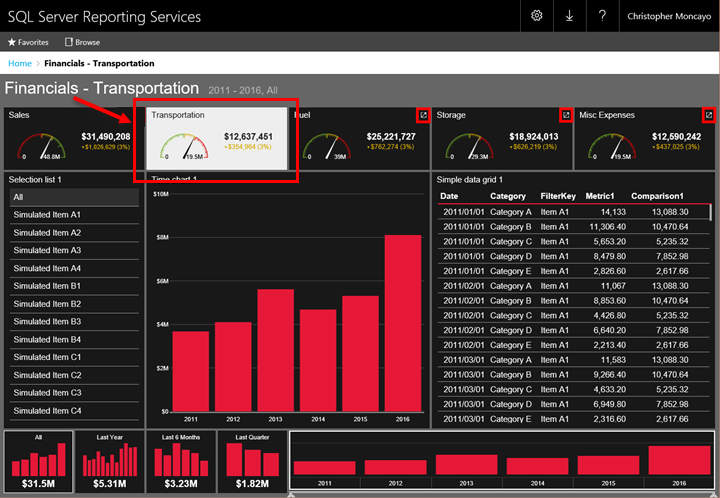

# Creare un report per dispositivi mobili a schede tramite il drill-through
Informazioni su come creare un report per dispositivi mobili di [!INCLUDE[ssRSnoversion_md](../../includes/ssrsnoversion-md.md)] analogo a un report a schede in termini di aspetto e funzionamento usando il drill-through e parametri.

In questo report, ad esempio, i misuratori nella parte superiore si comportano come le schede. Quando si sceglie il misuratore relativo ai trasporti, i dati nella parte restante del grafico vengono filtrati in base ai dati dei trasporti.

In realtà si tratta di un set di cinque report separati, ognuno con un parametro diverso che filtra il report in modo che corrisponda al misuratore selezionato nella parte superiore del report. Si crea innanzitutto tutti i cinque report, quindi per ognuno dei cinque report, rendere le altri quattro misuratori drillthroughs quattro report.

Ecco i passaggi per questo esempio.

## Creare report di base

1. Creare un report denominato Sales con cinque misuratori:

    * Sales
    * Trasporti
    * Carburante
    * Archiviazione
    * Spese varie

   
    
2. Impostare **accento** a **su** per il misuratore di vendite, pertanto confronteranno con l'il resto del report, ma in questo caso, bianco su sfondo nero.

    
    
3. Salvare in un [!INCLUDE[ssRSnoversion_md](../../includes/ssrsnoversion-md.md)] server di report.

## Creare copie del report

1. Quattro copie del report di vendite e assegnare loro un nome: 

    * Trasporti
    * Carburante
    * Archiviazione
    * Spese varie

3. Per salvare il [!INCLUDE[ssRSnoversion_md](../../includes/ssrsnoversion-md.md)] server di report.

## Impostare il misuratore come un drill-through

In questa sezione, impostare ogni misuratore (ad eccezione del misuratore Sales) come un drill-through per il report corrispondente.

1. Nel report delle vendite, selezionare il misuratore di trasporto.

    

2. Con il **Layout** selezionata, nella scheda il **proprietà visive** riquadro selezionare **destinazione drill-through**.

3. Selezionare **report per dispositivi mobili**.

4. Individuare e selezionare il report che sarà la destinazione per il drill-through, in questo caso, "Financials - trasporto".

    

5. In **configurare i report di destinazione**, selezionare il parametro per filtrare il report e selezionare **applica**.

   
   
6. Ripetere questi passaggi per ognuna delle altri misuratori del report di vendite. 

## Impostare i misuratori per gli altri report

1.  Aprire il report di trasporto, impostare il misuratore Sales come un drill-through per il report di vendite e gli altri tre misuratori come drillthroughs ai rispettivi report.

2. Ancora nel rapporto di trasporto, impostare **accento** del misuratore di trasporto per **su**, si differenzia il resto del report.

3. Ripetere questi passaggi per i report di carburante, archiviazione e le spese varie. 

## Visualizzare il report nel portale web

1. Passare al [!INCLUDE[ssRSnoversion_md](../../includes/ssrsnoversion-md.md)] server di report e aprire uno dei report. 

2. Si noti che ogni i misuratori è associata un'icona di drill-through nell'angolo superiore destro.

    

3. Selezionare uno dei misuratori per passare al report filtrato in base ai dati che del misuratore.

   

### Vedere anche
    
* [Aggiungere parametri a un report per dispositivi mobili](../../reporting-services/mobile-reports/add-parameters-to-a-mobile-report-reporting-services.md)
* [Aggiungere il drill-through da un report per dispositivi mobili ad altri report per dispositivi mobili o URL](../../reporting-services/mobile-reports/add-drillthrough-from-a-mobile-report-to-other-mobile-reports-or-urls.md)

  

