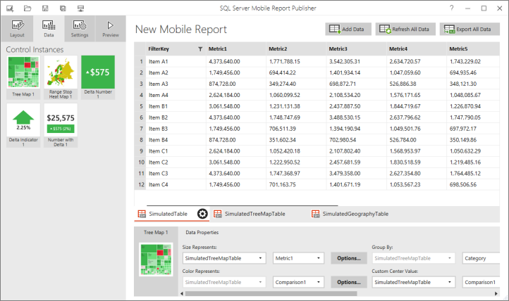

# Iniziare con la progettazione o con i dati durante la creazione di report per dispositivi mobili di Reporting Services
  
Con [!INCLUDE[PRODUCT_NAME](../../includes/ss-mobilereptpub-long.md)], è possibile creare rapidamente report per dispositivi mobili che si adattano a tutte le dimensioni dello schermo, in un'area di progettazione con righe e colonne della griglia regolabili ed elementi flessibili del report per dispositivi mobili.   
  
Durante la creazione di report per dispositivi mobili è possibile scegliere di due approcci di base: iniziare prima con i dati oppure iniziare prima con la progettazione. [!INCLUDE[SS_MobileReptPub_Long](../../includes/ss-mobilereptpub-short.md)] supporta entrambi.   
  
## Prima la progettazione  
  
Il diagramma seguente illustra i componenti della visualizzazione layout [!INCLUDE[SS_MobileReptPub_Long](../../includes/ss-mobilereptpub-short.md)] :   
  
  
  
Nell'approccio diretto prima alla progettazione, è possibile creare un layout del report per dispositivi mobili senza importare alcun dato. È un buon metodo per creare un report per dispositivi mobili quando non si è certi che i dati siano formattati correttamente. Senza dati reali, gli elementi della raccolta vengono associati automaticamente ai dati simulati generati, che è possibile esportare e usare come modello per descrivere i dati richiesti.  
  
## Prima i dati  
L'approccio diretto prima ai dati consiste nell'importare in primo luogo tutti i dati richiesti, quindi progettare il report per dispositivi mobili e impostare le proprietà dei dati negli elementi del report. Ciò offre il vantaggio di poter connettere ogni elemento ai dati reali quando si aggiungono al layout. Quando si usa un approccio diretto prima ai dati, assicurarsi che i dati reali siano formattati correttamente per l'uso con [!INCLUDE[SS_MobileReptPub_Long](../../includes/ss-mobilereptpub-short.md)].   
  
 Il diagramma seguente illustra tutti i componenti della visualizzazione dati [!INCLUDE[SS_MobileReptPub_Long](../../includes/ss-mobilereptpub-short.md)] :  
  
  
  
### Vedere anche  
- [Creare e pubblicare report per dispositivi mobili con SQL Server Mobile Report Publisher](../../reporting-services/mobile-reports/create-mobile-reports-with-sql-server-mobile-report-publisher.md)  
-  Vedere [Visualizzare report per dispositivi mobili e indicatori KPI di SQL Server nell'app iPad](https://pbiwebprod-docs.azurewebsites.net/en-us/documentation/powerbi-mobile-ipad-kpis-mobile-reports)  (Power BI per iOS)  
-  [Visualizzare report per dispositivi mobili e indicatori KPI di SQL Server nell'app iPhone](https://pbiwebprod-docs.azurewebsites.net/en-us/documentation/powerbi-mobile-iphone-kpis-mobile-reports) (Power BI per iOS)  
  
  
  
  

