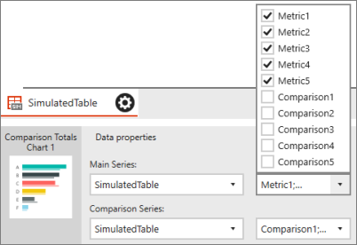
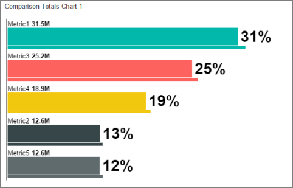
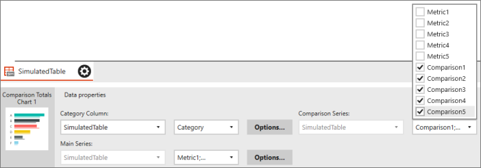
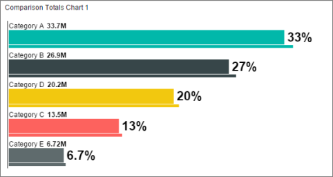

# Raggruppare i dati in colonne o righe in un report per dispositivi mobili | Reporting Services
È possibile organizzare i dati per colonne o per righe in diversi tipi di grafici in [!INCLUDE[SS_MobileReptPub_Short](../../includes/ss-mobilereptpub-short.md)]. Seguire questa procedura dettagliata.

Nei grafici temporali, totali, a torta e a imbuto è possibile organizzare i dati per righe o per colonne. 
* L'organizzazione per colonne è utile se una tabella ha diverse colonne di dati da confrontare. 
* L'organizzazione per righe è più appropriata se una colonna della tabella contiene i nomi delle varie categorie. 

La procedura seguente usa una tabella di confronto dei totali con i dati simulati in [!INCLUDE[SS_MobileReptPub_Short](../../includes/ss-mobilereptpub-short.md)] , per illustrare la differenza tra la strutturazione dei dati per righe o per colonne in un grafico.  

1. Trascinare un **grafico totali di confronto** dalla scheda **Layout** nell'area di progettazione e ingrandirlo.

2. Selezionare la scheda **Dati** . Si noterà che la tabella SimulatedTable contiene una serie di colonne, da **Metrica1** a **Metrica5** e da **Confronto1** a **Confronto5**. 

   

3. Nel riquadro **Proprietà dati** **Serie principale** corrisponde a **SimulatedTable**. Selezionare la freccia nella casella accanto a **Serie principale**e verranno selezionate le colonne da **Metrica1** a **Metrica5** .

   

   Allo stesso modo, per il valore **Serie di confronto** --  verranno selezionate le colonne da **Confronto1** a **Confronto5**.
   
4. Selezionare **Anteprima**.

   

   Ogni barra nel grafico rappresenta una colonna della tabella. Le barre più spesse rappresentano le metriche e le barre più sottili rappresentano le colonne di confronto.

5. Selezionare la freccia Indietro nell'angolo in alto a sinistra per uscire dalla modalità di anteprima.

6. Nella riquadro **Proprietà visive** della scheda **Layout** modificare il valore **Struttura dei dati** da **Per colonne** a **Per righe**.  

7. Selezionare la scheda **Dati** . A questo punto la tabella SimulatedTable contiene una colonna **Categoria** oltre alle colonne **Metrica** e **Confronto** , con categorie dalla A alla E. 

   

8.  Nel riquadro **Proprietà dati** è ora presente una casella Category Column (Colonna Categoria) in cui viene visualizzata la colonna Categoria di SimulatedTable. In Serie principale è possibile selezionare la colonna da usare per i valori. Per impostazione predefinita, [!INCLUDE[SS_MobileReptPub_Short](../../includes/ss-mobilereptpub-short.md)] seleziona le colonne da Metrica1 a Metrica5 per la serie principale e da Confronto1 a Confronto5 per la serie di confronto. 

    

9. Selezionare **Anteprima**.

   

   Ogni barra nel grafico rappresenta ora i valori per ogni categoria presente nella colonna Categoria.

### Vedere anche
* [Visualizations to Reporting Services mobile reports (Visualizzazioni nei report per dispositivi mobili di Reporting Services)](../../reporting-services/mobile-reports/add-visualizations-to-reporting-services-mobile-reports.md)
