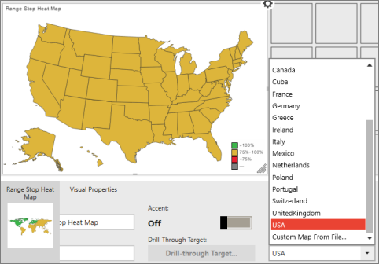
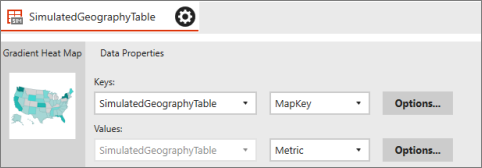

# Eseguire il mapping nei report di Reporting Services per dispositivi mobili
Le mappe sono un ottimo modo per visualizzare dati geografici. [!INCLUDE[SS_MobileReptPub_Long](../../includes/ss-mobilereptpub-long.md)] include tre diversi tipi di viste mappa e mappe predefinite per i continenti e per alcuni paesi singoli. È anche possibile [caricare e usare mappe personalizzate](../../reporting-services/mobile-reports/custom-maps-in-reporting-services-mobile-reports.md).   
  
## Tipi di mappe  
  
Per i report per dispositivi mobili di SQL Server sono disponibili tre diversi tipi di mappe, utili in varie circostanze.  
  
  
  
**Mappa termica con sfumature** Il campo nella proprietà Valori viene visualizzato con sfumature di un singolo colore a riempire ogni area geografica in una mappa. È possibile specificare se i valori maggiori o minori sono più scuri nella casella **Direzione valori**.  
  
**Mappa a bolle** La proprietà Valori determina il raggio di una visualizzazione a bolle visualizzata sopra l'area geografica associata. È possibile specificare se tutte le bolle hanno colori identici o diversi.   
  
**Mappa termica con interruzioni intervallo** Mostra un valore in relazione a una destinazione. La proprietà **Destinazioni** determina il delta tra un campo di confronto e il campo dei valori. Il delta risultante determina il colore usato per riempire l'area geografica associata della mappa, da verde a giallo a rosso. È possibile specificare se sono verdi i valori maggiori o quelli minori nella casella **Direzione valori**.  
  
## Selezionare il tipo di mappa e l'area geografica  
  
1. Nella scheda **Layout** selezionare un tipo di mappa, trascinarla nell'area di progettazione e impostare le dimensioni desiderate.  
  
2. Nella visualizzazione **Layout** > pannello **Proprietà visive** > **Mappa** selezionare l'area geografica della mappa specifica necessaria.  
  
     
  
3. Sia per le mappe termiche con sfumature che per le mappe termiche con interruzioni intervallo, specificare se sono preferibili valori maggiori o minori nella casella **Direzione valori** in **Proprietà visive**.  
  
7. Per le mappe a bolle, in **Proprietà visive** impostare **Usa colori diversi** su **Attivato** o su **Disattivato** per usare lo stesso colore o colori diversi per le bolle.  
  
## Selezionare i dati della mappa  
Quando si aggiunge la mappa al report per la prima volta, [!INCLUDE[SS_MobileReptPub_Short](../../includes/ss-mobilereptpub-short.md)] la popola con dati geografici simulati.  
  
  
  
Per visualizzare i dati reali nella mappa, è necessario impostare i valori per almeno due delle proprietà dei dati della mappa:   
* La proprietà **Chiavi** connette i dati ad aree geografiche specifiche della mappa, ad esempio gli stati negli USA o i paesi in Africa.  
* La proprietà **Valori** è un campo numerico nella stessa tabella del campo delle chiavi selezionate. Questi valori sono rappresentati in modo diverso in mappe diverse. La **mappa con sfumature** usa questi valori per applicare un colore a ogni area geografica con sfumature diverse in base all'intervallo di valori. La **mappa a bolle** basa le dimensioni della visualizzazione di una bolla su ogni area geografica sulla proprietà Valori.   
* Per le mappe termiche con interruzioni di valore è necessario impostare anche la proprietà **Destinazioni**.  
  
### Impostare le proprietà dei dati della mappa  
  
1. Selezionare la scheda **Dati** nell'angolo in alto a sinistra.  
  
2. Selezionare **Aggiungi dati** e quindi **Excel locale** o **Server SSRS**.  
  
   > **Suggerimento**: assicurarsi che i [dati siano in un formato adatto per i report per dispositivi mobili](../../reporting-services/mobile-reports/prepare-data-for-reporting-services-mobile-reports.md).  
  
3. Selezionare i fogli di lavoro desiderati e selezionare **Importa**.  
   I dati verranno visualizzati in [!INCLUDE[SS_MobileReptPub_Short](../../includes/ss-mobilereptpub-short.md)].  
  
4. Nella vista **Dati** > pannello **Proprietà dati** > in **Chiavi**, nella casella a sinistra selezionare la tabella che contiene i dati della mappa e quindi nella casella a destra selezionare il campo chiave corrispondente alle aree geografiche nella mappa.  
  
5. In **Valori** la stessa tabella è già indicata nella casella di sinistra. Selezionare il campo numerico di cui visualizzare i valori sulla mappa.   
  
6. Nel caso di una mappa termica con interruzioni di intervallo, la stessa tabella è indicata nella casella a sinistra in **Destinazioni**. Nella casella a destra selezionare il campo numerico i cui valori devono essere usati come destinazione.   
  
     
  
7. Selezionare **Anteprima** nell'angolo in alto a sinistra.  
  
     
     
8. Selezionare l'icona **Salva** nell'angolo in alto a sinistra e quindi selezionare **Salva in locale** nel computer o **Salva nel server**.  
  
### Vedere anche  
-  [Esegue il mapping personalizzato nei report di Reporting Services per dispositivi mobili](../../reporting-services/mobile-reports/custom-maps-in-reporting-services-mobile-reports.md)  
- [Creare e pubblicare report per dispositivi mobili con SQL Server Mobile Report Publisher](../../reporting-services/mobile-reports/create-mobile-reports-with-sql-server-mobile-report-publisher.md)  
  
  
