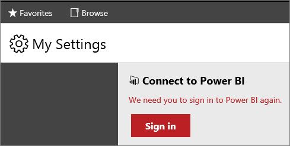

# Impostazioni personali per Integrazione di Power BI (portale Web)

[!INCLUDE[ssrs-appliesto](../includes/ssrs-appliesto.md)] [!INCLUDE[ssrs-appliesto-2016-and-later](../includes/ssrs-appliesto-2016-and-later.md)] [!INCLUDE[ssrs-appliesto-pbirsi](../includes/ssrs-appliesto-pbirs.md)]

La pagina **Impostazioni personali** di [!INCLUDE[ssRSnoversion](../includes/ssrsnoversion-md.md)] [!INCLUDE[ssRSWebPortal](../includes/ssrswebportal.md)] viene usata dai singoli utenti per gestire l'accesso con [!INCLUDE[sspowerbi](../includes/sspowerbi-md.md)]. Quando si eseguono i passaggi per aggiungere un elemento del report, viene richiesto automaticamente di eseguire l'accesso.  Tuttavia, è possibile usare la pagina **Impostazioni personali** per accedere manualmente o per disconnettersi.  Se l'opzione del menu **Impostazioni personali** non è visibile, il server di report non è stato integrato con  [!INCLUDE[sspowerbi](../includes/sspowerbi-md.md)].  Per altre informazioni, vedere [Integrazione del server di report e di Power BI &#40;Gestione configurazione&#41;](../reporting-services/install-windows/power-bi-report-server-integration-configuration-manager.md).  
  
  
  
## Perché eseguire l'accesso

 Quando si accede, viene stabilita una relazione tra l'account utente [!INCLUDE[ssRSnoversion](../includes/ssrsnoversion-md.md)] e l'account [!INCLUDE[sspowerbi](../includes/sspowerbi-md.md)] .  L'accesso crea un token di sicurezza valido per 90 giorni. Se il token scade e sono presenti elementi bloccati di Power BI, verrà visualizzata una notifica.  
   
     
   
I riquadri dei dashboard di [!INCLUDE[sspowerbi](../includes/sspowerbi-md.md)] non verranno aggiornati fino a quando non si accede nuovamente mediante **Impostazioni personali**.  
  
  
  
Dopo aver eseguito l'accesso, verrà creato un nuovo token di sicurezza.  Dopo l'accesso, viene iniziato l'aggiornamento dei riquadri dei dashboard sulla base delle pianificazioni configurate in precedenza.  

## Passaggi successivi

[Integrazione di Power BI Report Server](../reporting-services/install-windows/power-bi-report-server-integration-configuration-manager.md)   
[Aggiungere elementi di Reporting Services ai dashboard di Power BI](../reporting-services/pin-reporting-services-items-to-power-bi-dashboards.md)   
[Dashboard in Power BI](https://powerbi.microsoft.com/documentation/powerbi-service-dashboards/)  
[Portale Web](../reporting-services/web-portal-ssrs-native-mode.md)  

Ulteriori domande? [Provare a porre il forum di Reporting Services](http://go.microsoft.com/fwlink/?LinkId=620231)
