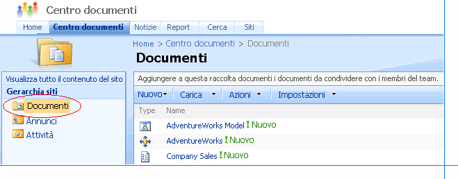
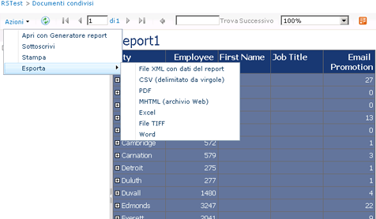
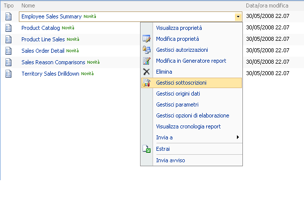

# Ricerca, visualizzazione e gestione dei report (Generatore report SSRS)
  In Generatore report è possibile esplorare le cartelle di un server di report o di un sito di SharePoint per trovare report, origini dati condivise, modelli e altri elementi del report correlati, nonché esplorare il computer per individuare i report locali. Per semplificare la ricerca dei report, in Generatore report viene mantenuto un elenco dei server e dei siti utilizzati recentemente e fornito un accesso diretto alle cartelle Desktop, Documenti e Risorse del computer nel file system del computer.  
  
 In Progettazione report è possibile esplorare anche il computer per trovare report locali. Dopo aver distribuito report in un server di report o in un sito di SharePoint, è possibile esplorare il server di report tramite Gestione report o eseguire ricerche nel sito di SharePoint per trovare report. I report e gli elementi correlati rimangono disponibili in locale dopo la distribuzione.  
  
> [!NOTE]  
>  È possibile utilizzare Generatore report in modalità locale o in connessione a un server di report. Se non si dispone di una connessione attiva a un server di report, vengono applicate determinate limitazioni.  
  
 Per individuare un report in un server di report o in un sito di SharePoint da Generatore report, è necessario indicare l'URL del server di report o del sito di SharePoint. Quando si installa la prima volta Generatore report, è possibile specificare l'URL da utilizzare, ossia il server o il sito a cui, per impostazione predefinita, viene effettuata la connessione da parte di Generatore report al salvataggio o all'apertura dei report.  
  
 È possibile visualizzare in anteprima i report in Generatore report e Progettazione report quando vengono creati o aggiornati, nonché visualizzarli e gestirli in un server di report tramite Gestione report o in un sito di SharePoint integrato con Reporting Services tramite le funzionalità e gli strumenti di SharePoint predefiniti dopo la pubblicazione dei report. Per altre informazioni, vedere [Anteprima di report in Generatore report](../../reporting-services/report-builder/previewing-reports-in-report-builder.md) e [Anteprima dei report](../../reporting-services/reports/previewing-reports.md).  
  
 Quando i report vengono visualizzati in anteprima in Generatore report e Progettazione report o vengono visualizzati in Gestione report o in un sito di SharePoint, i dati vengono aggiornati e nei report vengono visualizzati i dati correnti dell'origine dati utilizzata dal report. Se si desidera visualizzare un report senza aggiornarne i dati, è possibile utilizzare la cronologia del report e i dati memorizzati nella cache con i report pubblicati. Queste funzionalità non sono disponibili per la visualizzazione in anteprima dei report in Generatore report e Progettazione report.  
  
> [!NOTE]  
>  [!INCLUDE[ssRBRDDup](../../includes/ssrbrddup-md.md)]  
  
##   Ricerca e visualizzazione di report in Generatore report  
 Per trovare un report che si desidera utilizzare o per selezionare un'origine dati condivisa, un'immagine o un sottoreport da utilizzare in un report, esplorare il computer, le cartelle in un server di report o il sito di SharePoint integrato con Reporting Services.  
  
 Per trovare i report su un server di report, è necessario specificare un URL per il server di report e disporre delle autorizzazioni appropriate nelle cartelle in modo da poter leggere e salvare gli elementi del report. Per ottenere l'URL e le autorizzazioni necessarie, rivolgersi all'amministratore di sistema del server di report.  
  
 Dopo aver individuato e aperto il report in Generatore report, è possibile visualizzarlo in anteprima e apportare delle modifiche. Nella visualizzazione in anteprima vengono mostrati i dati correnti. Per altre informazioni, vedere [Previewing Reports in Report Builder](../../reporting-services/report-builder/previewing-reports-in-report-builder.md).  
  
 Generatore report consente di effettuare le attività seguenti:  
  
-   **Ricerca di report** Quando si cerca un report, è possibile usare la nota finestra di dialogo **Apri file** in stile Microsoft Office, ma personalizzata per Generatore report. È possibile esplorare le cartelle su un server di report o su un file system, incluse le cartelle Report personali, Siti e server recenti, Desktop, Documenti e Risorse del computer. Nella cartella Siti e server recenti è contenuto un elenco di server usati di recente.  
  
-   **Ricerca di origini dati condivise** Quando si cerca un'origine dati condivisa, è possibile effettuare una selezione in un elenco di voci di uso recente o passare a un'altra cartella sullo stesso server di report in cui è contenuto il report.  
  
-   **Visualizzazione dei report** Un report viene visualizzato in anteprima in Generatore report durante la creazione o l'aggiornamento di report. Quando Generatore report è connesso a un server di report, quest'ultimo carica ed elabora il report; in caso contrario, i report vengono elaborati in locale. Il report visualizzabile viene mostrato nel visualizzatore di report di Generatore report.  
  
 
##   Visualizzazione e gestione dei report in un server di report  
 È possibile utilizzare Gestione report per visualizzare e gestire i report nel server di report. Sfogliare le cartelle sul server per individuare i report, eseguire i report in modo da visualizzarli in un browser ed eseguire attività di gestione.  
  
 Gestione report consente di effettuare le seguenti attività di gestione:  
  
-   Visualizzare e aggiornare le proprietà di report, le origini dati condivise e altri elementi del report.  
  
-   Caricare report e creare nuove origini dati condivise per i report.  
  
-   Creare pianificazioni per eseguire i report a orari e intervalli specificati.  
  
-   Creare, modificare o eliminare sottoscrizioni di report.  
  
-   Creare una cronologia dei report e specificare il numero di snapshot dei report da conservare nella cronologia.  
  
-   Creare nuove cartelle nel server per organizzare i report nella modalità desiderata.  
  
 Alcune di queste attività potrebbero essere eseguite per conto dell'utente dall'amministratore del server di report. Per altre informazioni sulle attività eseguite in un server di report, vedere [Server di report di Reporting Services &#40;modalità nativa&#41;](../../reporting-services/report-server/reporting-services-report-server-native-mode.md).  
  
 In Gestione report sono inclusi in genere cartelle, report, origini dati e modelli di report, nonché la cartella Report personali. Report personali è un'area di lavoro personale utilizzabile per archiviare e gestire i report di cui si è proprietari. Le altre cartelle del server di report sono pubbliche e in genere è necessario disporre di autorizzazioni avanzate per aggiungere o modificare contenuto in tali cartelle. È possibile creare cartelle all'interno di Report personali per migliorare l'organizzazione dei report. Per altre informazioni, vedere [Uso della cartella Report personali &#40;Generatore report e SSRS&#41;](../../reporting-services/report-builder/using-my-reports-report-builder-and-ssrs.md).  
  
 Tramite Gestione report, i report vengono visualizzati nel Visualizzatore HTML di Reporting Services. Il Visualizzatore HTML fornisce un framework per la visualizzazione di report in HTML e include una barra degli strumenti dei report, una sezione relativa ai parametri, una relativa alle credenziali e una mappa documento. Nella barra degli strumenti dei report sono disponibili funzionalità di navigazione, zoom, aggiornamento, ricerca, esportazione, stampa e feed di dati per la pagina. La barra degli strumenti dei report viene inoltre visualizzata in una finestra del browser nella parte superiore dei report quando si accede ad essi tramite un URL. La funzionalità di stampa è facoltativa e deve essere attivata dall'amministratore. Se disponibile, sulla barre degli strumenti dei report viene visualizzata l'icona di una stampante. Nelle illustrazioni seguenti la barra degli strumenti dei report in una finestra Gestione report e le relative funzionalità vengono mostrate in primo piano.  
  
   
Finestra Gestione report  
  
   
Barra degli strumenti dei report  
  
 Dopo aver eseguito un report, è possibile esportarlo in un altro formato, ad esempio [!INCLUDE[msCoName](../../includes/msconame-md.md)] Excel o PDF. Inoltre è possibile esportare il report utilizzando un'estensione per il rendering dei dati, ad esempio valori delimitati da virgole (CSV, Comma-Separated Value), e utilizzare quindi il file di dati CSV come input per un'altra applicazione. Per altre informazioni sull'esportazione dei report, vedere [Esportare report &#40;Generatore Report e SSRS&#41;](../../reporting-services/report-builder/export-reports-report-builder-and-ssrs.md) ed [Esportare un report in un altro tipo di file &#40;Generatore report e SSRS&#41;](http://msdn.microsoft.com/library/b577568b-ecbd-44c3-be88-31dab6fc38a2).  
  
 Il modo più semplice per selezionare ed eseguire un report consiste nell'aprire Gestione report e, successivamente, nel cercare o selezionare il report desiderato. Per istruzioni dettagliate su come aprire un report, vedere [Aprire e chiudere un report &#40;Gestione report&#41;](../../reporting-services/reports/open-and-close-a-report-report-manager.md).  
  
 Dopo aver eseguito un report, è possibile aggiornarlo per visualizzare i nuovi dati.  
  
### Aggiornamento di report  
 I dati dei report vengono modificati frequentemente ed è necessario aggiornare il report per visualizzare quelli più recenti. È possibile aggiornare un report in tre modi diversi.  
  
|Opzione|Risultato|  
|------------|------------|  
|Pulsante**Aggiorna** nella finestra del browser|Visualizza il report archiviato nella cache della sessione. Un cache della sessione viene creata quando un utente apre un report. [!INCLUDE[ssRSnoversion](../../includes/ssrsnoversion-md.md)] vengono usate le sessioni del browser per garantire una visualizzazione coerente quando un report è aperto.|  
||Quando si fa clic sul pulsante **Aggiorna** sulla barra degli strumenti dei report, il server di report consente di ripetere la query e di aggiornare i dati del report se quest'ultimo viene eseguito su richiesta. Se il report è memorizzato nella cache oppure è uno snapshot, il pulsante **Aggiorna** consente di visualizzare il report archiviato nel database del server di report.|  
|Combinazione di tasti CTRL+F5|Produce lo stesso risultato che si ottiene facendo clic sul pulsante **Aggiorna** sulla barra degli strumenti dei report.|  
  
  
##   Visualizzazione e gestione degli elementi di un server di report da un sito di SharePoint  
 La configurazione di un server di report da parte dell'amministratore di sistema per l'esecuzione nella modalità integrata SharePoint consente di visualizzare e gestire i report e altri elementi del server di report da un sito di SharePoint.  
  
 Nel sito di SharePoint sono incluse pagine per l'impostazione di proprietà delle origini dati, della cronologia dei report, di opzioni relative all'elaborazione dei report, di pianificazioni, di sottoscrizioni e di parametri dei report, nonché per la creazione di pianificazioni condivise. È possibile creare e gestire elementi di un server di report in un sito di SharePoint esattamente come avviene con gli altri strumenti di [!INCLUDE[ssNoVersion](../../includes/ssnoversion-md.md)].  
  
 Per accedere alle pagine dell'applicazione, selezionare azioni specifiche dell'elemento da un menu a discesa in un report o in un altro elemento del server di report in precedenza aggiunto a una raccolta di SharePoint. A seconda dell'elemento selezionato e delle autorizzazioni di cui dispone, l'utente ha la possibilità di creare report in Generatore report, generare modelli e configurare la sicurezza degli elementi dei modelli.  
  
 Per altre informazioni su Reporting Services e la tecnologia SharePoint, vedere [Configurazione e amministrazione di un server di report &#40;modalità SharePoint di Reporting Services&#41;](../../reporting-services/report-server-sharepoint/configuration-and-administration-of-a-report-server.md) nella [documentazione online](http://go.microsoft.com/fwlink/?LinkId=154888) di [!INCLUDE[ssNoVersion](../../includes/ssnoversion-md.md)] nel sito msdn.microsoft.com.  
  
### Ricerca di elementi di un server di report in un sito di SharePoint  
 Per impostare le proprietà, è prima necessario individuare l'elemento desiderato. Gli elementi dei server di report sono sempre archiviati in raccolte o in una cartella all'interno di una raccolta.  
  
 Quando si accede al sito di SharePoint, viene visualizzata la pagina Sfoglia e la scheda Strumenti raccolta. Nella pagina Sfoglia sono elencate le raccolte e il contenuto della raccolta selezionata. È possibile visualizzare il report, i modelli di report e altri elementi nella raccolta, esplorare cartelle ed eseguire ricerche nel sito per individuare elementi.  
  
 Per distinguere gli elementi del server di report dagli altri elementi di un sito di SharePoint, è possibile usare l'icona per identificare visivamente un elemento oppure lasciare per qualche istante il puntatore del mouse sull'elemento e leggere l'estensione del file. Nella figura seguente vengono illustrati cartelle, un modello di report e una definizione di report nella raccolta **Documenti** :  
  
   
  
### Visualizzazione dei report  
 Le definizioni di report (file con estensione rdl) caricate in una raccolta di SharePoint vengono visualizzate tramite una web part Visualizzatore report installata dal componente aggiuntivo di Reporting Services. L'associazione per i file con estensione rdl viene definita automaticamente al momento dell'installazione del componente aggiuntivo. Quando si seleziona un report, questo viene aperto automaticamente nella web part. Dopo l'apertura di un report è possibile usare la barra degli strumenti per report inclusa nella web part per navigare tra le pagine, effettuare ricerche, usare lo zoom, nonché stampare il report. Nella barra degli strumenti è inclusa l'opzione Esporta in feed di dati che consente di esportare il report sotto forma di feed di dati Atom e un menu **Azioni** contenente le opzioni per stampare, sottoscrivere ed esportare il report in formati diversi quali PDF, Word ed Excel. Dal menu **Azioni** è inoltre possibile aprire il report in Generatore report. Nell'immagine seguente vengono illustrati un report e le opzioni di esportazione contenute nel menu **Azione** .  
  
   
  
### Gestione di elementi tramite azioni  
 Le attività di gestione vengono supportate tramite azioni disponibili in un menu a discesa associato a ogni elemento. A seconda delle autorizzazioni concesse all'utente, per ogni elemento sono disponibili azioni comuni quali**Visualizza proprietà** e **Modifica proprietà** , che sono standard per tutti gli elementi archiviati in una raccolta di SharePoint, oltre ad azioni personalizzate, che forniscono funzionalità di gestione specifiche dell'elemento. Nella figura seguente vengono illustrate le azioni disponibili per una definizione di report. Per una definizione di report sono disponibili azioni personalizzate quali **Gestisci sottoscrizioni** e **Gestisci opzioni elaborazione**.  
  
   
  
  
##   Visualizzazione di report in un'applicazione desktop  
 È possibile saltare completamente il passaggio di visualizzazione nel browser e usare direttamente un'applicazione desktop, ad esempio [!INCLUDE[msCoName](../../includes/msconame-md.md)] Excel, come visualizzatore di report. A tale scopo, definire una sottoscrizione che specifichi un formato di applicazione desktop e una cartella condivisa di destinazione. Il server di report genererà il report come file di applicazione, aggiungerà un'estensione di file e salverà il report come file sul disco rigido. Sarà quindi possibile usare [!INCLUDE[msCoName](../../includes/msconame-md.md)] Excel (o un'altra applicazione) invece di un browser per visualizzare il report.  
  
  
##   Informazioni sulle sessioni utente  
 [!INCLUDE[ssRSnoversion](../../includes/ssrsnoversion-md.md)] vengono usate le sessioni del browser per garantire la coerenza durante la visualizzazione dei report. Le sessioni si basano sulle connessioni tramite browser, non sugli utenti autenticati. Ogni volta che un utente apre un report in una nuova finestra del browser, viene creata una nuova sessione. Dopo aver stabilito una sessione del browser, si continuerà a utilizzare la versione del report aperta all'inizio della sessione, anche se in seguito il report viene modificato nel server di report. Se ad esempio si apre un report alle 23.00 e l'autore del report pubblica nuovamente lo stesso report alle 23.01, per tutta la durata della sessione sarà disponibile la versione del report aperta alle 23.00.  
  
 Se si aggiorna un report all'interno della stessa sessione tramite il pulsante **Aggiorna** del browser, verrà visualizzata la versione del report della sessione originale. Se si aggiorna un report su richiesta tramite il pulsante **Aggiorna** sulla barra degli strumenti del report, il report verrà eseguito nuovamente e verranno visualizzati gli eventuali nuovi dati.  
  
 Le informazioni sulle sessioni vengono archiviate nel database temporaneo del server di report. Per il server di report non viene usata la gestione delle sessioni di [!INCLUDE[vstecasp](../../includes/vstecasp-md.md)] . Se si riavvia il server oppure si esegue un'operazione di recupero del database, lo stato delle sessioni non verrà ripristinato. Per altre informazioni sulla gestione delle sessioni, vedere [Identificazione dello stato di esecuzione](../../reporting-services/report-server-web-service-net-framework-soap-headers/identifying-execution-state.md).  
  
 
##   Argomenti della sezione  
 Negli argomenti seguenti vengono fornite ulteriori informazioni sulla visualizzazione e sulla gestione dei report.  
  
  [Trovare, visualizzare e gestire report](../../reporting-services/report-builder/finding-viewing-and-managing-reports-report-builder-and-ssrs.md)
  
 [Ricerca e visualizzazione di report con un browser &#40;Generatore report e SSRS&#41;](../../reporting-services/report-builder/finding-and-viewing-reports-with-a-browser-report-builder-and-ssrs.md)  
 Viene descritto l'utilizzo di un URL al fine di trovare e visualizzare un report.  
  
 [Ricerca di report e altri elementi &#40;Generatore report e SSRS&#41;](../../reporting-services/report-builder/searching-for-reports-and-other-items-report-builder-and-ssrs.md)  
 Viene descritto l'utilizzo della funzionalità di ricerca in Gestione report al fine di individuare elementi sul server di report.  
  
 [Uso della cartella Report personali &#40;Generatore report e SSRS&#41;](../../reporting-services/report-builder/using-my-reports-report-builder-and-ssrs.md)  
 Viene descritto l'utilizzo della cartella Report personali come area di lavoro personale al fine di archiviare e gestire i report di cui si è proprietari.  
  
 [Anteprima di report in Generatore report](../../reporting-services/report-builder/previewing-reports-in-report-builder.md)  
 Viene descritto come visualizzare report in anteprima mentre vengono creati o aggiornati.  
  
## Vedere anche  
 [Salvataggio di report &#40;Generatore report&#41;](../../reporting-services/report-builder/saving-reports-report-builder.md)   
 [Generatore report in SQL Server 2016](../../reporting-services/report-builder/report-builder-in-sql-server-2016.md)   
 [Installare e disinstallare Generatore report](http://msdn.microsoft.com/library/2c9a5814-17bf-4947-8fb3-6269e7caa416)  
  
  
