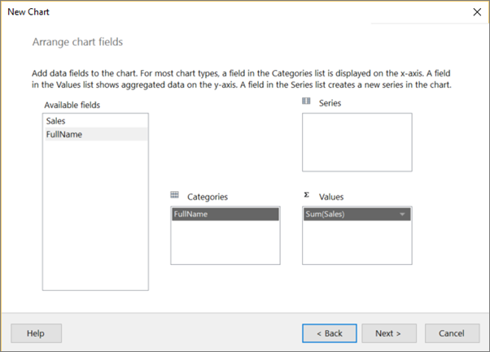
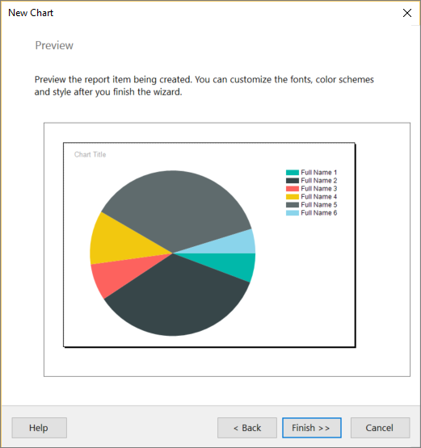
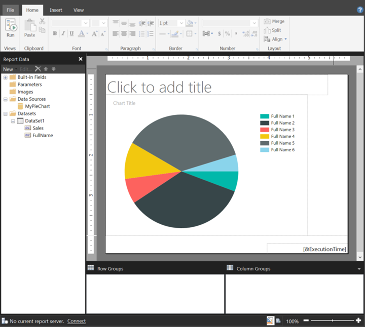
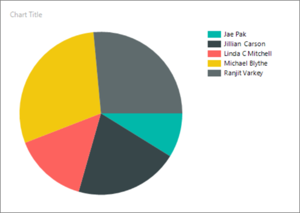

# <a name="tutorial-create-a-quick-chart-report-offline-report-builder"></a>Esercitazione: Creare un report grafico rapido offline (Generatore report)

  In questa esercitazione viene usata una procedura guidata per creare un grafico a torta in un report impaginato [!INCLUDE[ssRSnoversion](../../includes/ssrsnoversion-md.md)] in [!INCLUDE[ssRBnoversion](../../includes/ssrbnoversion-md.md)]. Aggiungere le percentuali e modificare leggermente il grafico a torta. 
  
È possibile eseguire questa esercitazione in due modi diversi. Con entrambi i metodi si otterrà lo stesso risultato, ovvero un grafico a torta simile a quello riportato in questa illustrazione:  
  
   
  
## <a name="prerequisites"></a>Prerequisiti  
 Se si utilizzano dati XML o una [!INCLUDE[tsql](../../includes/tsql-md.md)] query, è necessario avere accesso a Generatore Report. È possibile avviare [!INCLUDE[ssRBnoversion](../../includes/ssrbnoversion-md.md)] da un server di [!INCLUDE[ssRSnoversion](../../includes/ssrsnoversion-md.md)] in modalità nativa o in modalità integrata SharePoint, oppure è possibile scaricare [!INCLUDE[ssRBnoversion](../../includes/ssrbnoversion-md.md)] dall'Area download Microsoft. Per altre informazioni, vedere [Install Report Builder](../../reporting-services/install-windows/install-report-builder.md).  
  
##  <a name="TwoWays"></a> Due modi per eseguire questa esercitazione  
  
-   [Creare il grafico a torta con dati XML](#CreatePieChartXML)  
  
-   [Creare il grafico a torta con una query Transact-SQL che contiene i dati](#CreatePieQueryData)  
  
### <a name="using-xml-data-for-this-tutorial"></a>Utilizzo di dati XML per l'esercitazione  
 È possibile utilizzare dati XML copiandoli da questo argomento e incollandoli nella procedura guidata. Non è necessario essere connessi a un [!INCLUDE[ssRSnoversion](../../includes/ssrsnoversion-md.md)] modalità integrata di server di report in modalità nativa o in SharePoint e non è necessario accedere a un'istanza di SQL Server.  
  
 [Creare il grafico a torta con dati XML](#CreatePieChartXML)  
  
### <a name="using-a-includetsqlincludestsql-mdmd-query-that-contains-data-for-this-tutorial"></a>Uso di una query [!INCLUDE[tsql](../../includes/tsql-md.md)] contenente dati per l'esercitazione  
 È possibile copiare una query contenente dati da questo argomento e incollarla nella procedura guidata. È necessario il nome di un'istanza di SQL Server e credenziali sufficienti per l'accesso in sola lettura a qualsiasi database. La query del set di dati in questa esercitazione vengono utilizzati dati letterali, ma la query deve essere elaborata da un'istanza di SQL Server per restituire i metadati necessari per un set di dati del report.  
  
 Il vantaggio dell'uso della query [!INCLUDE[tsql](../../includes/tsql-md.md)] è dato dal fatto che in tutte le altre esercitazioni di [!INCLUDE[ssRBnoversion](../../includes/ssrbnoversion-md.md)] viene usato lo stesso metodo, pertanto durante le altre esercitazioni si conosceranno già le azioni da eseguire.  
  
 Per la query [!INCLUDE[tsql](../../includes/tsql-md.md)] sono necessari pochi altri prerequisiti. Per altre informazioni, vedere [Prerequisiti per le esercitazioni &#40;Generatore report&#41;](../../reporting-services/prerequisites-for-tutorials-report-builder.md).  
  
 [Creare il grafico a torta con una query Transact-SQL che contiene i dati](#CreatePieQueryData)  
  
##  <a name="CreatePieChartXML"></a> Creazione del grafico a torta con dati XML  
  
1.  [Avviare Generatore report](../../reporting-services/report-builder/start-report-builder.md) dal portale Web di [!INCLUDE[ssRSnoversion](../../includes/ssrsnoversion-md.md)] o dal server di report in modalità integrata SharePoint oppure dal computer.  
  
     Verrà visualizzata la finestra di dialogo **Riquadro attività iniziale** .  
  
       
  
     Se la finestra di dialogo **Riquadro attività iniziale** non viene visualizzata, fare clic su **File** >**Nuovo**. La finestra di dialogo **Nuovo report o set di dati** include all'incirca lo stesso contenuto della finestra di dialogo **Riquadro attività iniziale** .  
  
2.  Nel riquadro sinistro verificare che sia selezionata l'opzione **Nuovo report** .  
  
3.  Nel riquadro destro fare clic su **Creazione guidata grafico**, quindi scegliere **Crea**.  
  
4.  Nella pagina **Scegliere un set di dati** fare clic su **Crea un set di dati**, quindi scegliere **Avanti**.  
  
5.  Nella pagina **Scegliere una connessione a un'origine dei dati** fare clic su **Nuova**.  
  
     Verrà visualizzata la finestra di dialogo **Proprietà origine dati** .  
  
6.  È possibile assegnare qualsiasi nome a un'origine dati. Nella casella **Nome** digitare **Grafico a torta**.  
  
7.  Nella casella **Seleziona tipo di connessione** fare clic su **XML**.  
  
8.  Fare clic su di **credenziali** , selezionare **Usa utente di Windows corrente. Potrebbe essere richiesta la delega Kerberos**, quindi fare clic su **OK**.  
  
9. Nella pagina **Scegliere una connessione a un'origine dei dati** fare clic su **Grafico a torta**, quindi su **Avanti**.  
  
10. Copiare il testo seguente e incollarlo nella casella grande nella parte superiore della pagina **Progetta query** .  
  
    ```  
    <Query>  
    <ElementPath>Root /S  {@Sales (Integer)} /C {@FullName} </ElementPath>  
    <XmlData>  
    <Root>  
    <S Sales="150">  
      <C FullName="Jae Pak" />  
    </S>  
    <S Sales="350">  
      <C FullName="Jillian  Carson" />  
    </S>  
    <S Sales="250">  
      <C FullName="Linda C Mitchell" />  
    </S>  
    <S Sales="500">  
      <C FullName="Michael Blythe" />  
    </S>  
    <S Sales="450">  
      <C FullName="Ranjit Varkey" />  
    </S>  
    </Root>  
    </XmlData>  
    </Query>  
    ```  
  
11. (Facoltativo) Fare clic su di **eseguire** pulsante (**!**) per visualizzare i dati si baserà il grafico.  
  
       
  
12. Scegliere **Avanti**.  
  
13. Nella pagina **Scegliere un tipo di grafico** fare clic su **Torta**, quindi scegliere **Avanti**.  
  
14. Nel **Disponi campi del grafico** pagina, fare doppio clic su di **Sales** campo il **campi disponibili** casella.  
  
     Il campo verrà spostato automaticamente nella casella **Valori** perché rappresenta un valore numerico.  
  
       
  
15. Trascinare il **FullName** campo il **campi disponibili** casella per il **categorie** casella (o fare doppio clic; spostarlo il **categorie** casella) e quindi fare clic su **Avanti**.  
  
     La pagina di anteprima mostra il nuovo grafico a torta con dati rappresentativi. Nella legenda sono riportate le diciture Full Name 1, Full Name 2 e così via, anziché i nomi dei venditori, e le dimensioni delle sezioni della torta non sono precise. L'esempio serve solo per dare un'idea generale dell'aspetto del report.  
  
       
  
16. Fare clic su **Fine**.  
  
     È ora possibile visualizzare il nuovo report con grafico a torta nella visualizzazione Progettazione, sempre con dati rappresentativi.  
  
       
  
17. Per visualizzare il grafico a torta effettivo, fare clic su **Esegui** nella scheda **Home** della barra multifunzione.  
  
       
  
18. Per continuare la modifica del grafico a torta, vedere [Al termine della procedura guidata](#AfterWizard) in questo articolo.  
  
##  <a name="CreatePieQueryData"></a> Creazione del grafico a torta con una query [!INCLUDE[tsql](../../includes/tsql-md.md)]  
  
1.  [Avviare Generatore report](../../reporting-services/report-builder/start-report-builder.md) dal portale Web di [!INCLUDE[ssRSnoversion](../../includes/ssrsnoversion-md.md)] , dal server di report in modalità integrata SharePoint oppure dal computer.  
  
     Verrà visualizzata la finestra di dialogo **Riquadro attività iniziale** .  
  
    > [!NOTE]  
    >  Se la finestra di dialogo **Riquadro attività iniziale** non viene visualizzata, fare clic su **File** >**Nuovo**. La finestra di dialogo **Nuovo report o set di dati** include all'incirca lo stesso contenuto della finestra di dialogo **Riquadro attività iniziale** .  
  
2.  Nel riquadro sinistro verificare che sia selezionata l'opzione **Nuovo report** .  
  
3.  Nel riquadro destro fare clic su **Creazione guidata grafico**, quindi scegliere **Crea**.  
  
4.  Nella pagina **Scegliere un set di dati** fare clic su **Crea un set di dati**, quindi scegliere **Avanti**.  
  
5.  Nella pagina **Scegliere una connessione a un'origine dei dati** selezionare un'origine dati esistente o individuare il server di report, quindi selezionare un'origine dati e scegliere **Avanti**. Potrebbe essere necessario immettere un nome utente e una password.  
  
    > [!NOTE]  
    >  L'origine dati scelta non ha importanza purché si disponga delle autorizzazioni appropriate. Non verranno recuperati dati dall'origine dati. Per altre informazioni, vedere [Prerequisiti per le esercitazioni &#40;Generatore report&#41;](../../reporting-services/prerequisites-for-tutorials-report-builder.md).  
  
6.  Nella pagina **Progetta query** fare clic su **Modifica come testo**.  
  
7.  Incollare la query seguente nel relativo riquadro:  
  
    ```  
    SELECT 150 AS Sales, 'Jae Pak' AS FullName   
    UNION SELECT 350 AS Sales, 'Jillian Carson' AS FullName   
    UNION SELECT 250 AS Sales, 'Linda C Mitchell' AS FullName   
    UNION SELECT 500 AS Sales, 'Michael Blythe' AS FullName   
    UNION SELECT 450 AS Sales, 'Ranjit Varkey' AS FullName   
    ```  
  
8.  (Facoltativo) Fare clic sul pulsante Esegui (**!**) per visualizzare i dati sui quali verrà basato il grafico.  
  
9. Scegliere **Avanti**.  
  
10. Nella pagina **Scegliere un tipo di grafico** fare clic su **Torta**, quindi scegliere **Avanti**.  
  
11. Nel **Disponi campi del grafico** pagina, fare doppio clic su di **Sales** campo il **campi disponibili** casella.  
  
     Il campo verrà spostato automaticamente nella casella **Valori** perché rappresenta un valore numerico.  
  
12. Trascinare il **FullName** campo il **campi disponibili** casella per il **categorie** casella (o fare doppio clic; spostarlo il **categorie** casella) e quindi fare clic su **Avanti**.  
  
13. Fare clic su **Fine**.  
  
     Osservare ora il nuovo report grafico a torta nell'area di progettazione. Gli elementi visualizzati sono esemplificativi. Nella legenda sono riportate le diciture Full Name 1, Full Name 2 e così via, anziché i nomi dei venditori, e le dimensioni delle sezioni della torta non sono precise. L'esempio serve solo per dare un'idea generale dell'aspetto del report.  
  
15. Per visualizzare il grafico a torta effettivo, fare clic su **Esegui** nella scheda **Home** della barra multifunzione.  
 
##  <a name="AfterWizard"></a> Al termine della procedura guidata  
 Dopo aver terminato la creazione del report del grafico a torta, è possibile modificarlo nel modo desiderato. Nella scheda **Esegui** della barra multifunzione fare clic su **Progettazione**per continuare a modificarlo.  
  
## <a name="make-the-chart-bigger"></a>Ingrandire il grafico  
 Potrebbe essere necessario ingrandire il grafico a torta. 
 
*  Fare clic sul grafico, ma non sugli elementi in esso contenuti, per selezionarlo e trascinare l'angolo inferiore destro per ridimensionarlo.  

L'area di progettazione viene ingrandita man mano che viene trascinata.
  
## <a name="add-a-report-title"></a>Aggiungere un titolo al report  
1. Selezionare le parole **Titolo grafico** nella parte superiore del grafico, quindi digitare un titolo, ad esempio **Grafico a torta - Vendite**.  
2. Con il titolo selezionato nel riquadro Proprietà modificare **colore** a **nero** e **FontSize** a **12pt**.
  
## <a name="add-percentages"></a>Aggiungere percentuali  
 
1.  Il pulsante destro del grafico a torta e selezionare **Mostra etichette dati**. Le etichette dati vengono visualizzate in ogni sezione del grafico a torta.  
  
2.  Le etichette di mouse e scegliere **proprietà etichetta serie**. Verrà visualizzata la finestra di dialogo **Proprietà etichetta serie** .  
  
3.  Nel **etichetta dati** digitare **#PERCENT {P0}**.  
  
     Il testo **{P0}** specifica la percentuale senza cifre decimali. Se si digita solo **#PERCENT**, i numeri avranno due cifre decimali. **#PERCENT** è una parola chiave che esegue un calcolo o una funzione è; esistono molti altri.  
     
4. Fare clic su **Sì** per confermare che si vuole impostare **UseValueAsLabel** su **False**.

5. Nella scheda **Carattere** selezionare **Grassetto** e modificare **Colore** in **Bianco**.

6. Scegliere **OK**.     
  
 Per altre informazioni sulla personalizzazione di etichette e legende dei grafici, vedere [Visualizzare i valori in percentuale in un grafico a torta &#40;Generatore report e SSRS&#41;](../../reporting-services/report-design/display-percentage-values-on-a-pie-chart-report-builder-and-ssrs.md) e [Modificare il testo di un elemento legenda &#40;Generatore report e SSRS&#41;](../../reporting-services/report-design/chart-legend-change-item-text-report-builder.md).  
  
##  <a name="WhatsNext"></a> Operazioni successive  
 Al termine della creazione del primo report in [!INCLUDE[ssRBnoversion](../../includes/ssrbnoversion-md.md)], provare a eseguire le altre esercitazioni e iniziare a creare report basati su dati personalizzati. Per eseguire [!INCLUDE[ssRBnoversion](../../includes/ssrbnoversion-md.md)], è necessario disporre dell'autorizzazione per accedere alle origini dati, ad esempio i database, con una *stringa di connessione*che stabilisce l'effettiva connessione all'origine dati. L'amministratore di sistema disporrà di queste informazioni e potrà procedere alla configurazione.  
  
 Per eseguire le altre esercitazioni, è necessario il nome di un'istanza di SQL Server e credenziali sufficienti per l'accesso in sola lettura a qualsiasi database. L'amministratore di sistema potrà fornire i dati necessari.  
  
 Per salvare infine i report in un server di report o in un sito di SharePoint integrato con un server di report, è necessario disporre dell'URL e delle autorizzazioni appropriate. Tutti i report creati possono essere eseguiti direttamente dal computer, tuttavia quando vengono eseguiti dal server di report o dal sito di SharePoint i report offrono maggiori funzionalità. Per eseguire i propri report o quelli presenti sul server di report o nel sito di SharePoint in cui vengono pubblicati è necessario disporre delle autorizzazioni appropriate. Per ottenere l'accesso è necessario rivolgersi all'amministratore di sistema.  
  
 Prima di iniziare può essere utile leggere le informazioni su alcuni concetti e termini. Vedere [concetti &#40; di creazione di Report Generatore report e SSRS &#41; ](../../reporting-services/report-design/report-authoring-concepts-report-builder-and-ssrs.md). È inoltre consigliabile dedicarsi alla pianificazione prima di creare il primo report. Questa fase preliminare risulterà infatti molto utile. Vedere [Pianificazione di un report &#40;Generatore report&#41;](../../reporting-services/report-design/planning-a-report-report-builder.md).  

## <a name="next-steps"></a>Passaggi successivi

[Esercitazioni di Generatore report](../../reporting-services/report-builder-tutorials.md)   
[Generatore report in SQL Server 2016](../../reporting-services/report-builder/report-builder-in-sql-server-2016.md)  

Altre domande? [Provare a porre il forum di Reporting Services](http://go.microsoft.com/fwlink/?LinkId=620231)
