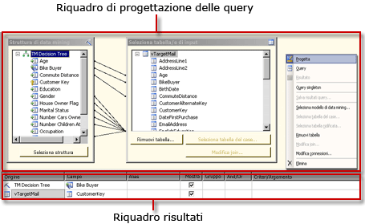
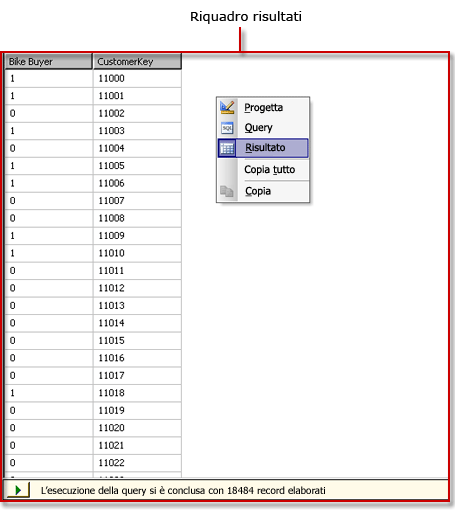

# Interfaccia utente di Progettazione query DMX in Analysis Services
  In [!INCLUDE[ssRSnoversion](../../includes/ssrsnoversion-md.md)] sono disponibili finestre Progettazione query con interfaccia grafica per la compilazione di query MDX (Multidimensional Expression) e query DMX (Data Mining Expression) per un'origine dati di [!INCLUDE[ssASnoversion](../../includes/ssasnoversion-md.md)]. In questo argomento viene descritta Progettazione query DMX. Per altre informazioni sulla finestra Progettazione query MDX, vedere [Interfaccia utente di Progettazione query MDX di Analysis Services](../../reporting-services/report-data/analysis-services-mdx-query-designer-user-interface.md).  
  
 Nella finestra Progettazione query con interfaccia grafica DMX sono disponibili tre modalità: progettazione, query e risultato. Per passare da una modalità all'altra, fare clic con il pulsante destro del mouse nel riquadro Progettazione query e selezionare la modalità. In ogni modalità è disponibile un riquadro Metadati dal quale è possibile trascinare membri dei cubi selezionati per compilare una query DMX che recupera dati per un set di dati quando il report viene elaborato.  
  
## Barra degli strumenti di Progettazione query DMX  
 I pulsanti della barra degli strumenti di Progettazione query consentono di progettare query DMX utilizzando l'interfaccia grafica. Nella tabella seguente vengono illustrati i pulsanti con le relative funzioni.  
  
|Pulsante|Description|  
|------------|-----------------|  
|**Modifica come testo**|Disabilitato per questo tipo di origine dati.|  
|**Importa**|Consente di importare una query esistente da un file di definizione di report (con estensione rdl) nel file system. Per altre informazioni, vedere [Set di dati condivisi e incorporati del report &#40;Generatore report e SSRS&#41;](../../reporting-services/report-data/report-embedded-datasets-and-shared-datasets-report-builder-and-ssrs.md).|  
||Consente di passare alla modalità Progettazione query MDX.|  
||Consente di passare alla modalità Progettazione query DMX.|  
||Consente di aggiornare i metadati dall'origine dati.|  
||Consente di eliminare dalla query la colonna selezionata nel riquadro Dati.|  
||Consente di visualizzare la finestra di dialogo **Parametri query** . Quando si assegna un valore predefinito a una variabile, un parametro del report corrispondente viene creato quando si passa alla visualizzazione Layout in Progettazione report.|  
||Consente di preparare la query.|  
||Consente di passare dalla modalità progettazione alla modalità query e viceversa. Per passare alla visualizzazione dei risultati, fare clic con il pulsante destro del mouse sul riquadro Progettazione e scegliere **Risultato**.|  
  
## Progettazione query DMX in modalità progettazione  
 Quando si modifica un set di dati che utilizza un'origine dati di [!INCLUDE[ssASnoversion](../../includes/ssasnoversion-md.md)] che non dispone di cubi validi ma dispone di modelli di data mining validi, la finestra Progettazione query con interfaccia grafica si apre in modalità progettazione. Nella figura seguente vengono etichettati i riquadri per la modalità progettazione.  
  
   
  
 Nella tabella seguente viene descritta la funzione di ogni riquadro.  
  
|Riquadro|Funzione|  
|----------|--------------|  
|Riquadro Progettazione query|Usare le finestre di dialogo **Modello di data mining** e **Seleziona tabella di input** per compilare la query DMX.|  
|Riquadro griglia|Per ogni riga nella griglia, usare l'elenco a discesa **Origine** per selezionare una funzione o un'espressione e per scegliere campi, gruppi e criteri o argomenti da usare nella query DMX. Per visualizzare il testo della query DMX generata dalle selezioni eseguite, fare clic sul pulsante **Modalità progettazione** sulla barra degli strumenti.|  
  
 Per eseguire la query DMX e visualizzare i risultati nel riquadro dei risultati, fare clic con il pulsante destro del mouse nel riquadro Progettazione query e scegliere **Risultato**.  
  
## Progettazione query DMX in modalità query  
 Per passare alla modalità query per la finestra Progettazione query con interfaccia grafica, fare clic sul pulsante **Modalità progettazione** sulla barra degli strumenti oppure fare clic con il pulsante destro del mouse nell'area di progettazione della query e scegliere **Query** dal menu di scelta rapida. Utilizzare questa modalità per immettere direttamente il testo della query DMX nel riquadro query.  
  
 Nella figura seguente vengono etichettati i riquadri per la modalità query.  
  
   
  
 Nella tabella seguente viene descritta la funzione di ogni riquadro.  
  
|Riquadro|Funzione|  
|----------|--------------|  
|Riquadro Progettazione query|Usare le finestre di dialogo **Modello di data mining** e **Seleziona tabella di input** per compilare la query DMX.|  
|Riquadro query|Consente di visualizzare o modificare direttamente nel riquadro il testo della query DMX. Le modifiche al testo della query DMX non vengono mantenute se si passa di nuovo alla modalità **Progettazione** .|  
  
 Per eseguire la query DMX e visualizzare i risultati nel riquadro dei risultati, fare clic con il pulsante destro del mouse nel riquadro Progettazione query e scegliere **Risultato**.  
  
## Progettazione query DMX in modalità risultato  
 Per visualizzare la modalità risultato, fare clic con il pulsante destro del mouse nell'area di progettazione della query e scegliere **Risultato** dal menu di scelta rapida. Quando si passa alla modalità risultato, la query DMX viene eseguita automaticamente.  
  
 Nella figura seguente viene illustrata Progettazione query in modalità risultato.  
  
   
  
 Per tornare alla modalità progettazione o alla modalità query, fare clic con il pulsante destro del mouse nel riquadro Risultato e scegliere **Progettazione** o **Query**.  
  
## Vedere anche  
 [Definizione dei parametri in Progettazione Query MDX per Analysis Services &#40; Generatore report e SSRS &#41;](../../reporting-services/report-data/define-parameters-in-the-mdx-query-designer-for-analysis-services.md)   
 [Creare un set di dati condiviso o set di dati incorporato &#40; Generatore report e SSRS &#41;](../../reporting-services/report-data/create-a-shared-dataset-or-embedded-dataset-report-builder-and-ssrs.md)   
 [Tipo di connessione di Analysis Services per DMX &#40; SSRS &#41;](../../reporting-services/report-data/analysis-services-connection-type-for-dmx-ssrs.md)   
 [Recuperare dati da un modello di Data Mining &#40; DMX &#41; &#40; SSRS &#41;](../../reporting-services/report-data/retrieve-data-from-a-data-mining-model-dmx-ssrs.md)   
 [File di configurazione RSReportDesigner](../../reporting-services/report-server/rsreportdesigner-configuration-file.md)   
 [Tipo di connessione di Analysis Services per MDX &#40; SSRS &#41;](../../reporting-services/report-data/analysis-services-connection-type-for-mdx-ssrs.md)   
 [Tipo di connessione di Analysis Services per DMX &#40; SSRS &#41;](../../reporting-services/report-data/analysis-services-connection-type-for-dmx-ssrs.md)  
  
  
