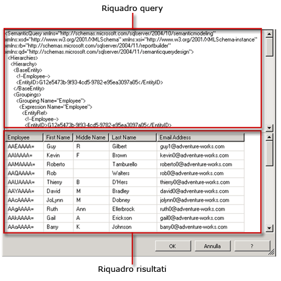

# Interfaccia utente della finestra Progettazione query del modello di report
  In Progettazione report sono disponibili due finestre Progettazione query che consentono di specificare i dati di un'origine dati di tipo Modello Server report da utilizzare in un report. Utilizzare la finestra Progettazione query con interfaccia grafica per esaminare e scegliere le entità modello e i campi delle entità. Utilizzare la finestra Progettazione query basata su testo per utilizzare direttamente una specifica del linguaggio SMDL in formato XML.  
  
> [!IMPORTANT]  
>  Gli utenti accedono alle origini dati quando creano ed eseguono query. È necessario concedere autorizzazioni minime per le origini dati, ad esempio autorizzazioni di sola lettura.  
  
## Finestra Progettazione query con interfaccia grafica  
 In Progettazione report è disponibile una finestra Progettazione query con interfaccia grafica che consente di creare ed eseguire query SMDL per popolare la raccolta di campi per un set di dati del report durante l'elaborazione del report stesso. Questa finestra è suddivisa in tre aree o riquadri.  
  
 Nella figura seguente vengono etichettati tutti i riquadri.  
  
   
  
 Nella tabella seguente viene descritta la funzione di ogni riquadro.  
  
|Riquadro|Funzione|  
|----------|--------------|  
|Riquadro di esplorazione|Consente di visualizzare rappresentazioni grafiche delle entità e dei campi delle entità nel modello. Utilizzare questo riquadro per esaminare entità, entità relative correlate e campi.|  
|Area di progettazione|Consente di visualizzare un elenco dei campi dal modello. Utilizzare questo riquadro per definire il layout dei campi selezionati.|  
|Results pane|Consente di visualizzare i risultati della query. Per eseguire la query, fare doppio clic su un riquadro qualsiasi e quindi fare clic su **eseguire**, oppure fare clic su di **eseguire** () sulla barra degli strumenti.|  
  
 La modifica delle informazioni nel riquadro di esplorazione o nel riquadro Area di progettazione influenzerà il contenuto del riquadro Risultati quando viene selezionato **Esegui**.  
  
 Per eseguire azioni all'interno di un determinato riquadro, ad esempio per eliminare una colonna dall'area di progettazione, fare clic con il pulsante destro del mouse sulla colonna, quindi scegliere il comando desiderato dal menu.  
  
### Barra degli strumenti della finestra Progettazione query con interfaccia grafica  
 Nel progettare la query, è anche possibile utilizzare i pulsanti della barra degli strumenti. Nella tabella seguente sono elencati i pulsanti sulla barra degli strumenti e le relative funzioni.  
  
|Pulsante|Description|  
|------------|-----------------|  
|**Modifica come testo**|Consente di passare dalla finestra Progettazione query basata su testo alla finestra Progettazione query con interfaccia grafica e viceversa. La query per un'origine dati di tipo Modello Server report è costituita da una specifica del linguaggio SMQL in formato XML.|  
|**Importa**|Consente di importare una query esistente da un file di definizione di report (con estensione rdl) nel file system. Per altre informazioni, vedere [Set di dati condivisi e incorporati del report &#40;Generatore report e SSRS&#41;](../../reporting-services/report-data/report-embedded-datasets-and-shared-datasets-report-builder-and-ssrs.md).|  
||Consente di annullare l'ultima azione.|  
||Consente di ripetere l'ultima azione.|  
||Consente di eseguire la query e di visualizzare le righe risultanti nel riquadro Risultati.|  
||Consente di aprire la finestra di dialogo **Filtra dati** , nella quale è possibile specificare i dati in base ai quali applicare il filtro. È possibile specificare i filtri indipendentemente dai dati attualmente presenti nell'area di progettazione.|  
  
## Finestra Progettazione query basata su testo  
 Quando si crea una query del set di dati di Modello Server report, per impostazione predefinita viene visualizzata la finestra Progettazione query con interfaccia grafica. Per passare alla finestra Progettazione query basata su testo, fare clic sul pulsante **Modifica come testo** sulla barra degli strumenti.  
  
 Nella finestra Progettazione query basata su testo sono inclusi due riquadri, ovvero un riquadro query SMQL e un riquadro Risultati. Questa visualizzazione di Progettazione query è utile essenzialmente quando si dispone già di una specifica di query SMQL da un'altra origine e si desidera incollarla nel riquadro query. Diversamente dalla finestra Progettazione query con interfaccia grafica, nella finestra Progettazione query basata su testo la sintassi della query non viene controllata né la query viene ristrutturata. Quando si fa clic su **Esegui** sulla barra degli strumenti, la query viene eseguita sull'origine dati e i risultati vengono visualizzati nel riquadro Risultati.  
  
 Nella figura seguente vengono etichettati tutti i riquadri.  
  
   
  
 Nella tabella seguente viene descritta la funzione di ogni riquadro.  
  
|Riquadro|Funzione|  
|----------|--------------|  
|Riquadro query|Consente di visualizzare il testo della specifica SMQL.|  
|Riquadro Risultati|Consente di visualizzare i risultati della query. Per eseguire la query, fare clic con il pulsante destro del mouse su un riquadro qualsiasi e scegliere **Esegui**oppure fare clic sul pulsante **Esegui** sulla barra degli strumenti.|  
  
### Barra degli strumenti di Progettazione query basata su testo  
 Nel progettare la query, è anche possibile utilizzare i pulsanti della barra degli strumenti. Nella tabella seguente sono elencati i pulsanti sulla barra degli strumenti e le relative funzioni.  
  
|Pulsante|Description|  
|------------|-----------------|  
|**Modifica come testo**|Consente di passare dalla finestra Progettazione query basata su testo alla finestra Progettazione query con interfaccia grafica e viceversa.|  
|**Importa**|Consente di importare una query da un report esistente.|  
||Consente di eseguire il testo della query e di visualizzare il set di righe risultanti nel riquadro Risultati.|  
  
## Vedere anche  
 [Strumenti di progettazione query &#40;SSRS&#41;](../../reporting-services/report-data/query-design-tools-ssrs.md)   
 [Aggiungere dati da origini dati esterne &#40;SSRS&#41;](../../reporting-services/report-data/add-data-from-external-data-sources-ssrs.md)   
 [Connessione del modello di report &#40; SSRS &#41;](../../reporting-services/report-data/report-model-connection-ssrs.md)   
 [File di configurazione RSReportDesigner](../../reporting-services/report-server/rsreportdesigner-configuration-file.md)  
  
  
