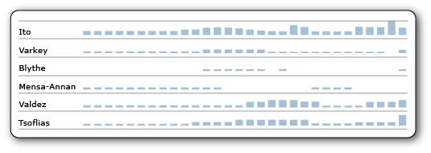

# Allineare i dati in un grafico di una tabella o matrice (Generatore report e SSRS)
  I grafici sparkline e le barre dei dati sono grafici semplici, di piccole dimensioni, contenenti numerose informazioni poco dettagliate. In un report impaginato di [!INCLUDE[ssRSnoversion_md](../../includes/ssrsnoversion-md.md)] , quando si seleziona questa opzione, i valori presenti nei grafici sparkline e nelle barre dei dati vengono allineati nelle diverse celle della tabella o della matrice, anche se mancano dei valori nei dati su cui si basano.  
  
   
  
 In questa immagine, nell'istogramma vengono mostrate le vendite giornaliere per ogni dipendente. Nei giorni in cui il dipendente non ha effettuato vendite, nel grafico viene lasciato uno spazio vuoto, mentre i giorni successivi vengono allineati orizzontalmente. I grafici vengono inoltre allineati verticalmente mettendone in relazione le diverse dimensioni. Per altre informazioni, vedere [Grafici sparkline e barre dei dati &#40;Generatore report e SSRS&#41;](../../reporting-services/report-design/sparklines-and-data-bars-report-builder-and-ssrs.md).  
  
## Allineare i dati in un grafico sparkline o in una barra dei dati  
  
1.  [Aggiungere grafici sparkline o barre dei dati](../../reporting-services/report-design/add-sparklines-and-data-bars-report-builder-and-ssrs.md) a una tabella o a una matrice.  
  
2. Fare clic nel grafico sparkline o barra dei dati, quindi selezionare **Proprietà asse orizzontale** o **Proprietà asse verticale**.  
  
2.  Nella scheda **Opzioni asse** selezionare la casella **Align axes in** (Allinea assi in), quindi nella casella a discesa selezionare il gruppo sul quale allineare l'asse.  
  
3.  [!INCLUDE[clickOK](../../includes/clickok-md.md)]  
  
## Vedere anche  
 [Grafici &#40; Generatore report e SSRS &#41;](../../reporting-services/report-design/charts-report-builder-and-ssrs.md)   
 [Aggiungere grafici sparkline e barre dei dati &#40; Generatore report e SSRS &#41;](../../reporting-services/report-design/add-sparklines-and-data-bars-report-builder-and-ssrs.md)  
  
  
