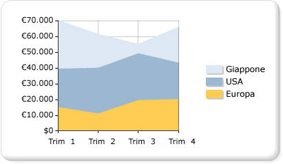

# Grafici ad area (Generatore report e SSRS)
  In un grafico ad area le serie vengono visualizzate come un set di punti collegati da una linea, con tutta l'area riempita sotto la linea. Per altre informazioni sull'aggiunta di dati a un grafico ad aree, vedere [Grafici &#40;Generatore report e SSRS&#41;](../../reporting-services/report-design/charts-report-builder-and-ssrs.md).  
  
 Nella figura seguente è illustrato un esempio di grafico ad area in pila. I dati sono particolarmente adatti per un grafico ad area in pila, in quanto è possibile visualizzare i totali per tutte le serie oltre alla percentuale di ogni serie rispetto al totale.  
  
   
  
> [!NOTE]  
>  [!INCLUDE[ssRBRDDup](../../includes/ssrbrddup-md.md)]  
  
## Variazioni  
  
-   **Area in pila**. Grafico ad area con più serie impilate in verticale. Se il grafico contiene una sola serie, il grafico ad area in pila verrà visualizzato come grafico ad area.  
  
-   **Area in pila 100%**. Grafico ad area con più serie impilate in verticale per occupare l'intera area del grafico. Se il grafico contiene una sola serie, il grafico ad area in pila verrà visualizzato come grafico ad area.  
  
-   **Area smussata**. Grafico ad area in cui i punti dati sono collegati da una linea smussata anziché regolare. Utilizzare un grafico ad area smussata anziché un grafico ad area se si preferisce che vengano visualizzate le tendenze piuttosto che i valori dei singoli punti dati.  
  
## Considerazioni sui dati per i grafici ad area  
  
-   Insieme al grafico a linee, il grafico ad area è l'unico tipo di grafico in cui è possibile visualizzare dati contigui. Per questo motivo, il grafico ad area viene utilizzato principalmente per rappresentare dati che si verificano nell'arco di un periodo continuo di tempo.  
  
-   Un grafico ad area in pila 100% risulta utile per indicare dati percentuali che si verificano nel corso del tempo.  
  
-   Se il grafico contiene una sola serie, il grafico ad area in pila verrà disegnato come grafico ad area.  
  
-   Se in un grafico ad area semplice i valori di più serie sono simili, è possibile che le aree si sovrappongano, nascondendo importanti valori di punti dati. Per risolvere questo problema, utilizzare un grafico ad area in pila, progettato per mostrare più serie in un grafico ad area.  
  
-   Se il grafico ad area in pila contiene gap, è possibile che il set di dati includa valori vuoti, che verranno visualizzati come sezione vuota nel grafico. Se il set di dati contiene valori vuoti, è consigliabile inserire punti vuoti nel grafico. In questo modo, le aree vuote del grafico verranno riempite con un colore diverso per indicare valori Null o zero. Per altre informazioni, vedere [Aggiunta di punti vuoti a un grafico &#40;Generatore report e SSRS&#41;](../../reporting-services/report-design/add-empty-points-to-a-chart-report-builder-and-ssrs.md).  
  
-   Il comportamento dei tipi di grafico ad area è molto simile a quello degli istogrammi e dei grafici a linee. Se si esegue un confronto tra più serie, è consigliabile utilizzare un istogramma. Se si analizzano tendenze in un periodo di tempo, è consigliabile utilizzare un grafico a linee.  
  
## Vedere anche  
 [Grafici &#40;Generatore report e SSRS&#41;](../../reporting-services/report-design/charts-report-builder-and-ssrs.md)   
 [Tipi di grafico &#40;Generatore report e SSRS&#41;](../../reporting-services/report-design/chart-types-report-builder-and-ssrs.md)   
 [Grafici a linee &#40;Generatore report e SSRS&#41;](../../reporting-services/report-design/line-charts-report-builder-and-ssrs.md)   
 [Modificare un tipo di grafico &#40;Generatore report e SSRS&#41;](../../reporting-services/report-design/change-a-chart-type-report-builder-and-ssrs.md)   
 [Punti dati vuoti e Null nei grafici &#40;Generatore report e SSRS&#41;](../../reporting-services/report-design/empty-and-null-data-points-in-charts-report-builder-and-ssrs.md)  
  
  
