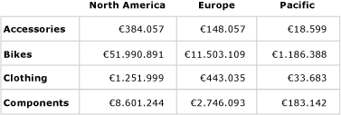
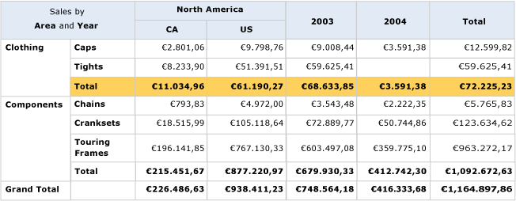

# Creare una matrice (Generatore report e SSRS)
  Usare una matrice per visualizzare dati raggruppati e informazioni di riepilogo. È possibile raggruppare i dati per più campi o espressioni in gruppi di righe e di colonne. Le funzionalità offerte dalle matrici sono analoghe a quelle dei campi incrociati e delle tabelle pivot. In fase di esecuzione, quando si combinano i dati del report e le aree dati, la matrice si espande orizzontalmente e verticalmente nella pagina. I valori contenuti nelle celle della matrice rappresentano valori aggregati che hanno come ambito l'intersezione dei gruppi di righe e di colonne ai quali appartiene la cella. È possibile formattare le righe e le colonne in modo da evidenziare i dati sui quali concentrarsi. È inoltre possibile includere elementi Toggle di drill-down per nascondere inizialmente i dati dettaglio. Successivamente, l'utente potrà fare clic su tali elementi per visualizzare un numero maggiore o minore di dettagli in base alle necessità.  
  
 Al termine della progettazione iniziale, è possibile continuare a sviluppare una matrice per migliorare la visualizzazione per l'utente. Per altre informazioni, vedere [Controllo della visualizzazione dell'area dati Tablix in una pagina del report &#40;Generatore report e SSRS&#41;](../../reporting-services/report-design/controlling-the-tablix-data-region-display-on-a-report-page.md).  
  
 Per una rapida introduzione alle matrici, vedere [Esercitazione: Creazione di un report matrice &#40;Generatore report&#41;](../../reporting-services/tutorial-creating-a-matrix-report-report-builder.md).  
  
> [!NOTE]  
>  È possibile pubblicare elenchi separatamente da un report come parti del report. Altre informazioni su [Parti del report (Generatore report e SSRS)](../../reporting-services/report-design/report-parts-report-builder-and-ssrs.md).  
  
##   Aggiunta di una matrice al report  
 Aggiungere una matrice all'area di progettazione dalla scheda Inserisci sulla barra multifunzione. È possibile aggiungere una matrice tramite la Creazione guidata tabella o matrice in cui è inclusa la creazione di una connessione all'origine dati e di un set di dati, nonché la configurazione della tabella o l'aggiunta di una matrice basata sul modello di matrice.  
  
> [!NOTE]  
>  La procedura guidata è disponibile unicamente in [!INCLUDE[ssRBDenali](../../includes/ssrbdenali-md.md)].  
  
 Per descrivere come configurare una tabella dall'inizio alla fine, in questo argomento viene usato il modello di matrice.  La matrice dispone inizialmente di un gruppo di righe, un gruppo di colonne, una cella d'angolo e una cella di dati, come mostrato nella figura seguente.  
  
   
  
 Quando si seleziona una matrice nell'area di progettazione, vengono visualizzati handle di riga e di colonna, come mostrato nella figura seguente.  
  
   
  
 Aggiungere i gruppi trascinando i campi del set di dati nelle aree Gruppi di righe e Gruppi di colonne del riquadro di raggruppamento. Il primo campo che si trascina nel riquadro dei gruppi di righe o dei gruppi di colonne sostituisce il gruppo vuoto iniziale predefinito. È quindi possibile applicare la formattazione per ogni cella, in base ai dati.  
  
   
  
 Nell'anteprima la matrice si espande per mostrare i valori dei gruppi di righe e di colonne. Nelle celle vengono visualizzati valori di riepilogo, come illustrato nella figura seguente.  
  
   
  
 La matrice iniziale è un modello basato sull'area dati Tablix. È possibile continuare a sviluppare la struttura della matrice aggiungendo gruppi di righe o gruppi di colonne nidificati o adiacenti o persino aggiungendo righe di dettaglio. Per altre informazioni, vedere [Esplorazione della flessibilità di un'area dati Tablix &#40;Generatore report e SSRS&#41;](../../reporting-services/report-design/exploring-the-flexibility-of-a-tablix-data-region-report-builder-and-ssrs.md).  
  
  
##   Aggiunta di un gruppo padre o figlio a una matrice  
 Per aggiungere un gruppo basato su un singolo campo del set di dati, trascinare il campo dal riquadro dei dati del report nell'area Gruppi di righe o Gruppi di colonne appropriata del riquadro Raggruppamento. Rilasciare il campo nella gerarchia di gruppi per impostarne la relazione con i gruppi esistenti. Rilasciarlo al di sopra di un gruppo esistente per creare un gruppo padre o al di sotto di un gruppo esistente per creare un gruppo figlio.  
  
 Quando si rilascia un campo nel riquadro **Raggruppamento** , si verifica quanto segue:  
  
-   Viene automaticamente creato un nuovo gruppo con un nome univoco basato sul nome del campo. L'espressione di raggruppamento viene impostata sul riferimento del nome di campo semplice, ad esempio `[Category]`.  
  
-   Viene visualizzata una nuova riga o una nuova colonna nell'area dei gruppi di righe o di colonne corrispondente.  
  
-   Nella nuova colonna viene visualizzata una cella del gruppo di righe per le righe di dati predefinite del set di dati del report. Le celle presenti nel corpo della Tablix per questa riga sono ora membri del gruppo di righe. In presenza di gruppi di colonne definiti, le celle incluse nelle colonne costituiscono membri di tali gruppi. Gli indicatori di gruppo offrono indicatori visivi per l'appartenenza a un gruppo di ogni cella.  
  
 Per personalizzare il gruppo dopo averlo creato, usare la finestra di dialogo **Gruppo Tablix** . È possibile modificare il nome del gruppo, nonché modificare o aggiungere altre espressioni alla definizione di gruppo. Per aggiungere o rimuovere righe dalla tabella, vedere [Inserire o eliminare una riga &#40;Generatore report e SSRS&#41;](../../reporting-services/report-design/insert-or-delete-a-row-report-builder-and-ssrs.md).  
  
 Quando il report viene eseguito, le intestazioni di colonna dinamiche si espandono verso destra, oppure verso sinistra se la proprietà Direzione della matrice è impostata su RTL, per un numero di colonne pari ai valori di gruppo univoci. Le righe dinamiche si espandono verso la parte inferiore della pagina. I dati visualizzati nelle celle del corpo della Tablix sono aggregazioni basate sulle intersezioni di gruppi di righe e di colonne, come mostrato nella figura seguente.  
  
   
  
 Nell'anteprima il report viene visualizzato come nella figura seguente.  
  
   
  
 Per scrivere espressioni che specificano un ambito diverso da quello predefinito, è necessario specificare il nome di un set di dati, di un'area dati o di un gruppo nella funzione di aggregazione. Per calcolare la percentuale rappresentata da ogni sottocategoria nei valori di gruppo della categoria Clothing, aggiungere una colonna all'interno del gruppo Category accanto alla colonna Total, formattare la casella di testo in modo da visualizzare la percentuale e aggiungere un'espressione che utilizzi l'ambito predefinito nel numeratore e l'ambito del gruppo Category nel denominatore, come illustrato nell'esempio seguente.  
  
 `=SUM(Fields!Linetotal.Value)/SUM(Fields! Linetotal.Value,"Category")`  
  
 Per altre informazioni, vedere [Ambito di espressioni per totali, aggregazioni e raccolte predefinite &#40;Generatore report e SSRS&#41;](../../reporting-services/report-design/expression-scope-for-totals-aggregates-and-built-in-collections.md).  
  
  
##   Aggiunta di un gruppo adiacente a una matrice  
 Per aggiungere un gruppo adiacente basato su un singolo campo del set di dati, usare il menu di scelta rapida nel riquadro Raggruppamento. Per altre informazioni, vedere [Aggiungere o eliminare un gruppo in un'area dati &#40;Generatore report e SSRS&#41;](../../reporting-services/report-design/add-or-delete-a-group-in-a-data-region-report-builder-and-ssrs.md). Nella figura seguente è mostrato un gruppo basato sulla geografia e un gruppo adiacente basato sull'anno.  
  
   
  
 In questo esempio la query ha filtrato i valori dei dati in modo da includere solo quelli relativi all'Europa e agli anni 2003 e 2004. È tuttavia possibile impostare filtri su ciascun gruppo indipendentemente. Nell'anteprima il report viene visualizzato come nella figura seguente.  
  
   
  
 Per aggiungere una colonna del totale per un gruppo di colonne adiacente, fare clic nella cella di definizione del gruppo di colonne e usare il comando **Aggiungi totale** . Verrà aggiunta una nuova colonna statica accanto al gruppo di colonne, con una somma di aggregazione predefinita per ogni campo numerico nelle righe esistenti. Per modificare l'espressione, apportare modifiche manuali all'aggregazione predefinita, ad esempio `Avg([Sales])`. Per altre informazioni, vedere [Aggiungere un totale a un gruppo o a un'area dati Tablix &#40;Generatore report e SSRS&#41;](../../reporting-services/report-design/add-a-total-to-a-group-or-tablix-data-region-report-builder-and-ssrs.md).  
  
  
## Vedere anche  
 [Riferimento a funzioni di aggregazione &#40; Generatore report e SSRS &#41;](../../reporting-services/report-design/report-builder-functions-aggregate-functions-reference.md)   
 [Esempi di espressioni &#40; Generatore report e SSRS &#41;](../../reporting-services/report-design/expression-examples-report-builder-and-ssrs.md)  
  
  

