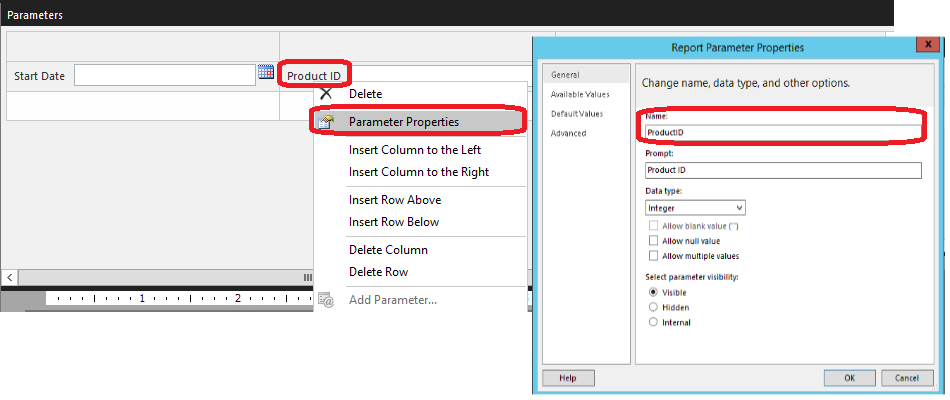

# Customize the Parameters Pane in a Report (Report Builder)
  Quando si creano report impaginati con parametri in Generatore report, è possibile personalizzare il riquadro Parametri. Nella visualizzazione di progettazione report è possibile trascinare un parametro in una colonna e in una riga specifiche del riquadro Parametri. È possibile aggiungere e rimuovere colonne per modificare il layout del riquadro.  
  
 Quando si trascina un parametro in una nuova colonna e riga del riquadro, l'ordine del parametro nel riquadro **Dati report** viene modificato. Quando si modifica l'ordine del parametro nel riquadro **Dati report**, viene modificata la posizione del parametro stesso nel riquadro. Per informazioni sul motivo per cui l'ordine dei parametri è importante, vedere [Modificare l'ordine di un parametro del report &#40;Generatore report e SSRS&#41;](../../reporting-services/report-design/change-the-order-of-a-report-parameter-report-builder-and-ssrs.md).  
  
## Per personalizzare il riquadro dei parametri  
  
1.  Nella scheda **Vista** selezionare la casella di controllo **Parametri** per visualizzare il riquadro dei parametri.  
  
       
  
     Il riquadro viene visualizzato nella parte superiore dell'area di progettazione.  
  
2.  Per aggiungere un parametro al riquadro, eseguire una delle operazioni seguenti.  
  
    -   Fare clic con il pulsante destro del mouse su una cella vuota nel riquadro dei parametri e quindi scegliere **Aggiungi parametro**.  
  
           
  
    -   Fare clic con il pulsante destro del mouse su **Parametri** nel riquadro **Dati report** e quindi scegliere **Aggiungi parametro**.  
  
3.  Per spostare un parametro in una nuova posizione nel riquadro dei parametri, trascinare il parametro in una cella diversa del riquadro.  
  
     Quando si modifica la posizione del parametro nel riquadro, viene automaticamente modificato l'ordine del parametro nell'elenco **Parametri** del riquadro **Dati report** . Per altre informazioni sull'impatto dell'ordine dei parametri, vedere [Modificare l'ordine di un parametro del report &#40;Generatore report e SSRS&#41;](../../reporting-services/report-design/change-the-order-of-a-report-parameter-report-builder-and-ssrs.md)  
  
4.  Per accedere alle proprietà di un parametro, eseguire una delle operazioni seguenti.  
  
    -   Fare clic con il pulsante destro del mouse sul riquadro dei parametri, quindi scegliere **Proprietà parametri**.  
  
           
  
    -   Fare clic con il pulsante destro del mouse sul riquadro **Dati report** e quindi scegliere **Proprietà parametri**.  
  
5.  Per aggiungere nuove colonne e righe al riquadro o eliminare le colonne e le righe esistenti, fare clic con il pulsante destro del mouse in un punto qualsiasi del riquadro dei parametri e quindi selezionare un comando nel menu visualizzato.  
  
       
  
    > [!IMPORTANT]  
    >  Quando si elimina una colonna o una riga contenente parametri, questi vengono eliminati dal report.  
  
6.  Per eliminare un parametro dal riquadro e dal report, eseguire una delle operazioni seguenti.  
  
    -   Fare clic con il pulsante destro del mouse sul riquadro dei parametri, quindi scegliere  **Elimina**.  
  
           
  
    -   Fare clic con il pulsante destro del mouse sul riquadro **Dati report** e quindi scegliere **Elimina**.  
  
## Vedere anche  
 [Parametri report &#40;Generatore report e Progettazione report&#41;](../../reporting-services/report-design/report-parameters-report-builder-and-report-designer.md)  
  
  

