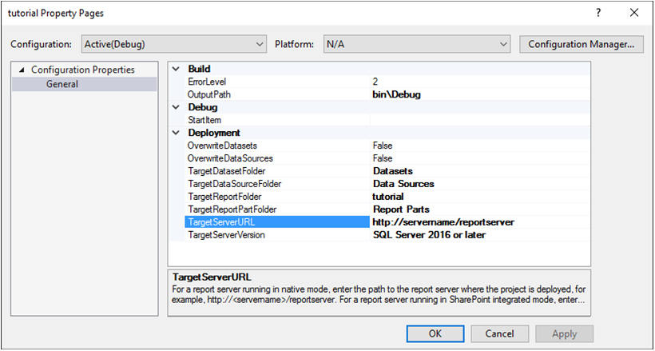

# pagine delle proprietà del progetto - finestra di dialogo

  Utilizzare le pagine delle proprietà del progetto per configurare le proprietà di distribuzione per un progetto server di report. Per aprire questa finestra di dialogo dal **progetto** menu, fare clic su  *\<nome progetto Report >***proprietà**.  
  
 Dopo aver definito le proprietà di configurazione, è possibile selezionare una configurazione nell'elenco a discesa **Configurazioni soluzione** sulla barra degli strumenti.  

  
## Opzioni  
 **Configurazione**  
 Consente di selezionare la configurazione da modificare. Sono inizialmente disponibili tre configurazioni: **Debug**, **DebugLocal**e **Release**. La configurazione attiva viene visualizzata per prima, ad esempio **Active(Debug)**.  
  
 Per visualizzare le proprietà per più configurazioni contemporaneamente, selezionare **Tutte le configurazioni** o **Più configurazioni**.  
  
 Per creare altre configurazioni, fare clic su **Gestione configurazione** sulla barra degli strumenti.  
  
 **Gestione configurazione**  
 Consente di gestire configurazioni per l'intera soluzione o per aggiungere altre configurazioni. Per altre informazioni, vedere la documentazione di [!INCLUDE[msCoName](../../includes/msconame-md.md)] [!INCLUDE[vsprvs](../../includes/vsprvs-md.md)] .  
  
 **Percorso output**  
 Digitare o incollare il percorso per archiviare la definizione del report utilizzata nella verifica della compilazione, nella distribuzione e nell'anteprima dei report. Il percorso deve essere diverso dal percorso utilizzato per il progetto e da un percorso relativo che rappresenta una sottocartella nel percorso del progetto.  
  
> [!NOTE]  
>  È possibile utilizzare più configurazioni per passare fra i percorsi a seconda dell'attività che viene eseguita.  
  
 **ErrorLevel**  
 Immettere la gravità dei problemi di compilazione segnalati come errori. I problemi con livelli di gravità minori o uguali al valore di **ErrorLevel** vengono segnalati come errori; in caso contrario, vengono segnalati come avvisi. Qualsiasi errore comporterà l'interruzione dell'attività di compilazione. I livelli di gravità validi sono compresi tra 0 e 4. Il valore predefinito è 2.  
  
 **StartItem**  
 Selezionare il report visualizzato nel browser dopo la pubblicazione del progetto nel server di report oppure nella finestra di anteprima quando il progetto viene eseguito in locale. È necessario specificare un elemento iniziale per le configurazioni che comportano la compilazione ma non la distribuzione di un progetto e per l'uso del comando **Debug** (**F5**). Tale elemento è necessario per le configurazioni che comportano la distribuzione del progetto.  
  
 **OverwriteDataSources**  
 Selezionare **True** per sovrascrivere l'origine dati nel server con l'origine dati nel progetto durante la pubblicazione dei report. Selezionare **False** per lasciare l'origine dati esistente nel server.  
  
 **TargetServerVersion**  
 Selezionare la versione corretta di [!INCLUDE[ssRSnoversion](../../includes/ssrsnoversion-md.md)] oppure selezionare **Rileva versione** per determinare automaticamente la versione installata nel server identificato dalla proprietà **TargetServer URL** . Il valore predefinito è **SQL Server 2016**.  
  
 **TargetDataSourceFolder**  
 Nome della cartella nella quale archiviare le origini dei dati pubblicate. Se non si specifica una cartella, l'origine dei dati viene pubblicata nella stessa cartella del report. Se la cartella non esiste nel server di report, verrà creata durante la pubblicazione dei report.  
  
 Quando si pubblica in un server di report in esecuzione in modalità nativa, specificare il percorso completo della gerarchia di cartelle a partire dalla radice. Ad esempio, Folder1/Folder2/Folder3.  
  
 Per la pubblicazione su un server di report in cui è attiva la modalità integrata SharePoint, utilizzare l'URL della raccolta di SharePoint. Ad esempio, `http:\\<servername>\<site>\Documents\MyFolder`.  
  
 **TargetReportFolder**  
 Nome della cartella nella quale archiviare i report pubblicati. Per impostazione predefinita, corrisponde al nome del progetto report. Se la cartella non esiste nel server di report, verrà creata durante la pubblicazione dei report.  
  
 Quando si pubblica in un server di report in esecuzione in modalità nativa, specificare il percorso completo della gerarchia di cartelle a partire dalla radice. Se una cartella si trova all'interno di un'altra cartella, includere il percorso della cartella a partire dalla radice, ad esempio Cartella1/Cartella2/Cartella3.  
  
 Per la pubblicazione su un server di report in cui è attiva la modalità integrata SharePoint, utilizzare l'URL della raccolta di SharePoint. Ad esempio, `http:\\<servername>\\<site>\Documents\MyFolder`.  
  
 **TargetServerURL**  
 URL del server di report di destinazione. Prima di pubblicare un report, è necessario impostare questa proprietà su un URL valido per il server di report.  
  
 Quando si pubblica in un server di report in esecuzione in modalità nativa, utilizzare l'URL della directory virtuale del server di report. Ad esempio, `http:\\<server>\reportserver`. In questa casella è necessario impostare la directory virtuale del server di report e non di Gestione report. Per impostazione predefinita, il server di report viene installato in una directory virtuale denominata "reportserver".  
  
 Per la pubblicazione su un server di report in cui è attiva la modalità integrata SharePoint, utilizzare l'URL di un sito principale o secondario di SharePoint. Se non si specifica un sito, verrà utilizzato il sito principale predefinito, Esempio: 
+ `http:\\<servername>`, 
+ `http:\\<servername\<site>` 
+ `http:\\<servername>\<site>\<subsite>`.  

## Passaggi successivi

[Pubblicazione di report](http://msdn.microsoft.com/library/ef5a514e-e818-4041-a8b0-15835f9a046b)   
[Pubblicare un report in una raccolta di SharePoint](../../reporting-services/reports/publish-a-report-to-a-sharepoint-library.md)   
[Impostare le proprietà di distribuzione &#40;Reporting Services&#41;](../../reporting-services/tools/set-deployment-properties-reporting-services.md)   
[Guida F1 della finestra di progettazione report](../../reporting-services/tools/report-designer-f1-help.md)  

Ulteriori domande? [Provare a porre il forum di Reporting Services](http://go.microsoft.com/fwlink/?LinkId=620231)
