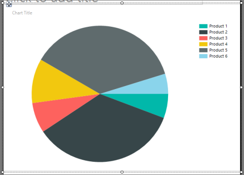
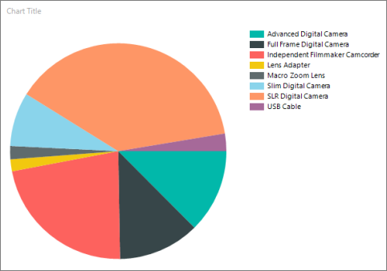

# <a name="tutorial-add-a-pie-chart-to-your-report-report-builder"></a>Esercitazione: Aggiungere un grafico a torta al report (Generatore report)
In questa esercitazione viene creato il grafico a torta in un report impaginato di Reporting Services. Vengono aggiunte le percentuali e le sezioni piccole vengono unite in un'unica sezione.

Nei grafici a torta e in quelli ad anello i dati vengono visualizzati come percentuali rispetto a un valore intero. Non hanno assi. Quando si aggiunge un campo numerico in un grafico a torta, il grafico calcola la percentuale di ogni valore rispetto al totale.  

Nell'illustrazione seguente viene mostrato il grafico a torta che verrà creato. 
 

  
Se sono presenti troppi punti dati su un grafico a torta, le etichette dei punti dati potrebbero essere difficili da leggere. In tal caso, prendere in considerazione la possibilità di unire le sezioni piccole in un'unica sezione più grande. I grafici a torta risultano più leggibili dopo avere aggregato i dati in pochi punti dati.  
 
> [!NOTE]  
> In questa esercitazione, i passaggi per la procedura guidata sono consolidati in due procedure. Per istruzioni dettagliate su come selezionare un server di report, aggiungere un'origine dati e un set di dati vedere la prima esercitazione di questa serie: [Esercitazione: Creazione di un report tabella semplice &#40;Generatore report&#41;](../reporting-services/tutorial-creating-a-basic-table-report-report-builder.md).  
  
Il tempo stimato per il completare l'esercitazione è di 10 minuti.  
  
## <a name="requirements"></a>Requisiti  
Per informazioni sui requisiti, vedere [Prerequisiti per le esercitazioni &#40;Generatore report&#41;](../reporting-services/prerequisites-for-tutorials-report-builder.md).  
  
## <a name="Chart"></a>1. Creare un grafico a torta da Creazione guidata grafico  
In questa sezione si usa la Creazione guidata grafico per creare un set di dati incorporato, scegliere un'origine dati condivisa e creare un grafico a torta.  

  
1.  [Avviare Generatore report](../reporting-services/report-builder/start-report-builder.md) dal computer, dal portale Web di [!INCLUDE[ssRSnoversion_md](../includes/ssrsnoversion-md.md)] o in modalità integrata SharePoint.  
  
    Si apre la finestra di dialogo **Nuovo report o set di dati**.  
  
    Se la finestra di dialogo **Nuovo report o set di dati** non viene visualizzata, scegliere **Nuovo** dal menu **File**.  
  
2.  Nel riquadro sinistro verificare che sia selezionata l'opzione **Nuovo report** .  
  
3.  Nel riquadro di destra fare clic su **Creazione guidata grafico**.  
  
4.  Nella pagina **Scegliere un set di dati** fare clic su **Crea un set di dati**e fare clic su **Avanti**.  
  
5.  Nella pagina **Scegliere una connessione a un'origine dati** selezionare un'origine dati esistente o individuare il server di report, quindi selezionare un'origine dati e fare clic su **Avanti**. Potrebbe essere necessario immettere un nome utente e una password.  
  
    > [!NOTE]  
    > L'origine dati scelta non ha importanza purché si disponga delle autorizzazioni appropriate. Non verranno recuperati dati dall'origine dati. Per altre informazioni, vedere [Modalità alternative di acquisizione di una connessione dati &#40;Generatore report&#41;](../reporting-services/alternative-ways-to-get-a-data-connection-report-builder.md).  
  
6.  Nella pagina **Progetta query** fare clic su **Modifica come testo**.  
  
7.  Incollare la query seguente nel relativo riquadro:  

    > [!NOTE]  
    > In questa esercitazione la query contiene i valori dei dati e non richiede un'origine dati esterna. Questa condizione tuttavia rende la query piuttosto lunga. In una query di un ambiente aziendale non sarebbe incluso alcun dato. Questo esempio è solo a scopo illustrativo.  
  
    ```  
    SELECT 'Advanced Digital Camera' AS Product, CAST(254995.21 AS money) AS Sales  
    UNION SELECT 'Slim Digital Camera' AS Product, CAST(164499.04 AS money) AS Sales  
    UNION SELECT 'SLR Digital Camera' AS Product, CAST(782176.79 AS money) AS Sales  
    UNION SELECT 'Lens Adapter' AS Product, CAST(36333.08 AS money) AS Sales  
    UNION SELECT 'Macro Zoom Lens' AS Product, CAST(40199.3 AS money) AS Sales  
    UNION SELECT 'USB Cable' AS Product, CAST(53245.5 AS money) AS Sales  
    UNION SELECT 'Independent Filmmaker Camcorder' AS Product, CAST(452288.0 AS money) AS Sales  
    UNION SELECT 'Full Frame Digital Camera' AS Product, CAST(247250.85 AS money) AS Sales  
    ```  
  
8.  (Facoltativo) Fare clic sul pulsante Esegui (**!**) per visualizzare i dati su cui si baserà il grafico.  
  
9. Scegliere **Avanti**.  
  
## <a name="ChartType"></a>2. Scegliere il tipo di grafico  
È possibile scegliere tra diversi tipi di grafico predefiniti.  

  
1.  Nella pagina **Scegliere un tipo di grafico** fare clic su **Torta**, quindi scegliere **Avanti**. Viene visualizzata la pagina **Disponi campi del grafico** .  
  
    Nella pagina **Disponi campi del grafico** trascinare il campo Product nel riquadro **Categorie** . Le categorie consentono di definire il numero di sezioni nel grafico a torta. In questo esempio, saranno presenti otto sezioni, una per ogni prodotto.  
  
2.  Trascinare il campo Sales nel riquadro **Valori** . Sales rappresenta l'importo delle vendite per la sottocategoria. Nel riquadro **Valori** viene visualizzato `[Sum(Sales)]` perché nel grafico viene mostrata l'aggregazione per ogni prodotto.  
  
3.  Fare clic su **Avanti** per visualizzare un'anteprima.  
  
5.  Fare clic su **Fine**.  
  
    Il grafico verrà aggiunto all'area di progettazione. Anziché i valori effettivi del grafico a torta vengono visualizzati Product 1, Product 2 e così via per dare un'idea dell'aspetto del grafico.  
    
    
  
6.  Fare clic sul grafico per visualizzarne gli handle. Trascinare l'angolo in basso a destra del grafico per ingrandirlo. Si noti che viene ingrandita anche l'area di progettazione del report in base alle dimensioni del grafico.  
  
7.  Fare clic su **Esegui** per visualizzare l'anteprima del report.  
  
Nel report viene visualizzato il grafico a torta con otto sezioni, una per ogni prodotto. I prodotti sono ora visibili e le dimensioni di ogni sezione rappresentano le vendite del prodotto specifico. Tre delle sezioni sono piuttosto sottili.  


  
## <a name="Percentages"></a>3. Visualizzare percentuali in ogni sezione  
Su ogni sezione della torta, è possibile visualizzare una percentuale per questa sezione rispetto alla torta intera.  

  
1.  Passare alla visualizzazione di progettazione report.  
  
2.  Fare clic con il pulsante destro del mouse sul grafico a torta e scegliere **Mostra etichette dati**. Le etichette dati vengono visualizzate nel grafico.  
  
3.  Fare clic con il pulsante destro del mouse su un'etichetta e quindi fare clic su **Proprietà etichetta serie**.  
  
4.  Nella casella **Dati etichetta** selezionare **#PERCENT**.  
    
5.  (Facoltativo) Per specificare il numero di cifre decimali l'etichetta seguente, nel **etichetta dati** casella dopo **#PERCENT**, tipo **{Pn}** in  *n*  è il numero di posizioni decimali da visualizzare. Ad esempio per non visualizzare cifre decimali, digitare **#PERCENT{P0}**.  

6.  Per visualizzare i valori come percentuali, la proprietà UseValueAsLabel deve essere impostata su false. Se viene richiesto di impostare questo valore nella finestra di dialogo **Conferma azione** fare clic su **Sì**.  
  
    > [!NOTE]  
    > L'impostazione di**Formato numeri** nella finestra di dialogo **Proprietà etichetta serie** non produrrà alcun effetto quando si formattano le percentuali. Tale opzione consente solo di formattare le etichette come percentuali, senza tuttavia calcolare la percentuale del grafico a torta rappresentata da ciascuna sezione.  
  
6.  [!INCLUDE[clickOK](../includes/clickok-md.md)]  
  
7.  Fare clic su **Esegui** per visualizzare l'anteprima del report.  
  
Nel report viene visualizzata la percentuale rispetto all'intero per ogni sezione del grafico a torta.  


  
## <a name="CombineSlices"></a>4. Combinare le piccole sezioni in una sezione  
Tre delle sezioni della torta sono piuttosto sottili. È possibile unire più sezioni piccole in un'unica sezione più grande "Other" che le rappresenta tutte tre.  

1.  Passare alla visualizzazione di progettazione report.  
  
2.  Se il riquadro Proprietà non è visualizzato, nel gruppo **Mostra/Nascondi** della scheda **Visualizza** selezionare **Proprietà**.  
  
3.  Nell'area di progettazione fare clic su una sezione del grafico a torta. Le proprietà della serie verranno visualizzate nel riquadro Proprietà.  
  
4.  Nella sezione **Generale** espandere il nodo **CustomAttributes** .  
  
5.  Impostare la proprietà **CollectedStyle** su **SingleSlice**.  

    
 
6.  Verificare che la proprietà **CollectedThreshold** sia impostata su 5.  
  
7.  Verificare che la proprietà **CollectedThresholdUsePercent** sia impostata su **True**.  
  
8.  Nella scheda **Home** fare clic su **Esegui** per visualizzare l'anteprima del report.  
  
Nella legenda è ora presente la categoria "Other". La nuova sezione del grafico a torta combina tutte le sezioni inferiori al 5% in una sezione che costituisce il 6% della torta intera.  


 
## <a name="DrawingEffect"></a>5. Iniziare la visualizzazione dei valori del grafico a torta dalla parte superiore 

Per impostazione predefinita, nei grafici a torta il primo valore nel set di dati inizia a 90 gradi dalla cima della torta. Ciò è osservabile nel grafico a torta nelle sezioni precedenti.

In questa sezione si farà in modo che il primo valore venga visualizzato nella parte superiore.

1.  Passare alla visualizzazione di progettazione report.  

2. Selezionare il grafico a torta.

3. In **Attributi personalizzati**nel riquadro Proprietà modificare PieStartAngle da **0** a **270**.

4. Fare clic su **Esegui** per visualizzare l'anteprima del report.

Le sezioni del grafico a torta sono ora in ordine alfabetico, iniziano dall'alto e finiscono con la sezione "Other".


  
## <a name="Title"></a>6. Aggiungere un titolo al report  
  
Poiché il grafico a torta è l'unica visualizzazione nel report, il grafico non richiede un titolo. Specificare un titolo per il report.
  
1.  Nel grafico, selezionare la casella Titolo del grafico e premere CANC.

2. Nell'area di progettazione fare clic su **Fare clic per aggiungere il titolo**.  
  
2.  Digitare **Vendite di fotocamere e di cineprese**, premere INVIO e quindi digitare **Come percentuale delle vendite totali**. Verrà visualizzato quanto segue:  
  
    **Vendite di fotocamere e di cineprese**  
  
    **Come percentuale delle vendite totali**  
  
3.  Selezionare **Vendite di fotocamere e di cineprese** e nella sezione **Font** della scheda **Home** fare clic su **Grassetto**.  
  
4.  Selezionare **Come percentuale delle vendite totali** e nella sezione **Carattere** della scheda **Home** impostare la dimensione del carattere su **10**.  
  
5.  (Facoltativo) Per contenere le due righe del testo potrebbe essere necessario aumentare l'altezza della casella di testo Titolo.  
  
    Il titolo verrà visualizzato nella parte superiore del report. Quando non è definita un'intestazione di pagina, gli elementi nella parte superiore del corpo del report equivalgono a un'intestazione di report.  
  
6.  Fare clic su **Esegui** per visualizzare l'anteprima del report.  
  
## <a name="Save"></a>7. Salvare il report  
  
### <a name="to-save-the-report"></a>Per salvare il report  
  
1.  Passare alla visualizzazione di progettazione report.  
  
2.  Nel menu **File** scegliere **Salva**.  
  
3.  In **Nome**digitare **Grafico a torta - Vendite**.  
  
4.  Fare clic su **Salva**.  
  
Il report verrà salvato sul server di report.  
  
## <a name="next-steps"></a>Passaggi successivi  
Questo passaggio conclude l'esercitazione relativa all'aggiunta di un grafico a torta al report. Per altre informazioni sui grafici, vedere [Grafici &#40;Generatore report e SSRS&#41;](../reporting-services/report-design/charts-report-builder-and-ssrs.md) e [Grafici sparkline e barre dei dati &#40;Generatore report e SSRS&#41;](../reporting-services/report-design/sparklines-and-data-bars-report-builder-and-ssrs.md).  
  
## <a name="see-also"></a>Vedere anche  
[Esercitazioni di Generatore report](../reporting-services/report-builder-tutorials.md)  
[Generatore report in SQL Server 2016](../reporting-services/report-builder/report-builder-in-sql-server-2016.md)  
  


