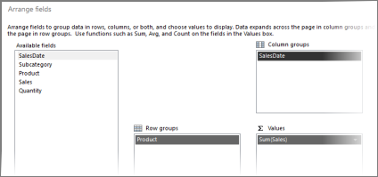
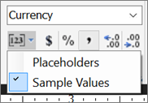
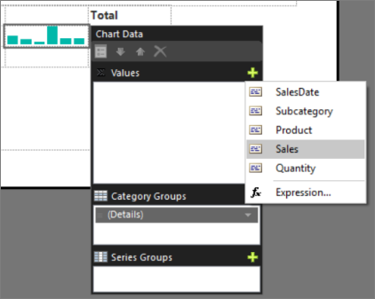
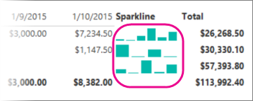
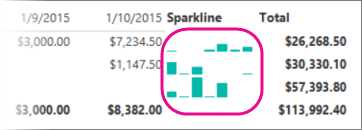

# <a name="tutorial-add-a-sparkline-to-your-report-report-builder"></a>Esercitazione: Aggiungere un grafico sparkline al report (Generatore report)

In questa esercitazione di [!INCLUDE[ssRBnoversion_md](../includes/ssrbnoversion-md.md)]viene creata una tabella semplice con un grafico sparkline in un report impaginato di [!INCLUDE[ssRSnoversion_md](../includes/ssrsnoversion-md.md)] .   
  
I grafici sparkline e le barre dei dati sono grafici semplici e di piccole dimensioni contenenti numerose informazioni in uno spazio ridotto, spesso in tabelle e matrici in report di [!INCLUDE[ssRSnoversion_md](../includes/ssrsnoversion-md.md)] . L'immagine seguente illustra un report simile a quello che verrà creato.  
  
  
     
Tempo previsto per il completamento di questa esercitazione: 30 minuti.  
  
## <a name="requirements"></a>Requisiti  
Per altre informazioni sui requisiti, vedere [Prerequisiti per le esercitazioni &#40;Generatore report&#41;](../reporting-services/prerequisites-for-tutorials-report-builder.md).  
  
## <a name="CreateTable"></a>1. Creare un report con una tabella  
  
1.  [Avviare Generatore report](../reporting-services/report-builder/start-report-builder.md) dal computer, dal portale Web di [!INCLUDE[ssRSnoversion_md](../includes/ssrsnoversion-md.md)] o in modalità integrata SharePoint.  
  
    Si apre la finestra di dialogo **Nuovo report o set di dati** .  
  
    Se la finestra di dialogo **Nuovo report o set di dati** non viene visualizzata, scegliere **Nuovo** dal menu **File**.  
  
2.  Nel riquadro sinistro verificare che sia selezionata l'opzione **Nuovo report** .  
  
3.  Nel riquadro destro fare clic su **Creazione guidata tabella o matrice**.  
  
4.  Nella pagina **Scegliere un set di dati** fare clic su **Crea un set di dati** > **Avanti**. Verrà visualizzata la pagina **Scegliere una connessione a un'origine dei dati** .  
  
    > [!NOTE]  
    > Per questa esercitazione non sono necessari dati specifici. È sufficiente una connessione a un database di SQL Server. Se in **Connessioni a origini dati**è già disponibile una connessione all'origine dati, sarà possibile selezionarla e andare al passaggio 10. Per altre informazioni, vedere [Modalità alternative di acquisizione di una connessione dati &#40;Generatore report&#41;](../reporting-services/alternative-ways-to-get-a-data-connection-report-builder.md).  
  
5.  Fare clic su **Nuovo**. Verrà visualizzata la finestra di dialogo **Proprietà origine dati** .  
  
6.  In **Nome**digitare **Vendite prodotto**come nome per l'origine dati.  
  
7.  In **Select a connection type**(Seleziona un tipo di connessione), verificare che sia selezionato **Microsoft SQL Server** .  
  
8.  In **Stringa di connessione**digitare il testo seguente:  
  
    `Data Source\=<servername>`  
  
    L'espressione `<servername>`, ad esempio Report001, indica un computer in cui è installata un'istanza del motore di database di SQL Server. Poiché i dati del report non vengono estratti da un database di SQL Server, non è necessario includere il nome di un database. Per analizzare la query viene utilizzato il database predefinito nel server specificato.  
  
9. Fare clic su **Credenziali**. Immettere le credenziali necessarie per accedere all'origine dati esterna.  
  
10. [!INCLUDE[clickOK](../includes/clickok-md.md)]  
  
    Verrà visualizzata di nuovo la pagina **Scegliere una connessione a un'origine dei dati** .  
  
11. Per verificare che la connessione all'origine dati avvenga correttamente, fare clic su **Test connessione**.  
  
    Verrà visualizzato il messaggio "Creazione connessione completata".  
  
12. [!INCLUDE[clickOK](../includes/clickok-md.md)]  
  
13. Scegliere **Avanti**.  
  
## <a name="Query"></a>2. Creare un layout query e tabella in Creazione guidata tabella  
In un report, è possibile utilizzare un set di dati condiviso che dispone di una query predefinita oppure è possibile creare un set di dati incorporato da utilizzare solo nel report. In questa esercitazione si creerà un set di dati incorporato.  
  
> [!NOTE]  
> Nella query di questa esercitazione sono contenuti i valori dei dati in modo che non sia necessaria un'origine dati esterna. Tale condizione rende tuttavia la query piuttosto lunga. In una query di un ambiente aziendale non sarebbe incluso alcun dato. Questo esempio è solo a scopo illustrativo.  
  
### <a name="to-create-a-query-and-table-layout-in-the-table-wizard"></a>Per creare un layout query e tabella in Creazione guidata tabella 
  
1.  Nella pagina **Progetta query** si apre la finestra Progettazione query relazionale. Per questa esercitazione si utilizzerà la finestra Progettazione query basata su testo.  
  
2.  Fare clic su **Modifica come testo**. Nella finestra Progettazione query basata su testo viene visualizzato il riquadro della query e il riquadro dei risultati.  
  
3.  Nella casella [!INCLUDE[tsql](../includes/tsql-md.md)] Query **incollare la query** seguente.  
  
    ```  
    SELECT CAST('2015-01-04' AS date) as SalesDate, 'Accessories' as Subcategory,   
       'Carrying Case' as Product, CAST(16996.60 AS money) AS Sales, 68 as Quantity  
    UNION SELECT CAST('2015-01-05' AS date) as SalesDate, 'Accessories' as Subcategory,  
       'Carrying Case' as Product, CAST(1350.00 AS money) AS Sales, 18 as Quantity  
    UNION SELECT CAST('2015-01-10' AS date) as SalesDate, 'Accessories' as Subcategory,  
       'Carrying Case' as Product, CAST(1147.50 AS money) AS Sales, 17 as Quantity  
    UNION SELECT CAST('2015-01-04' AS date) as SalesDate, 'Accessories' as Subcategory,  
       'Budget Movie-Maker' as Product, CAST(1056.00 AS money) AS Sales, 44 as Quantity  
    UNION SELECT CAST('2015-01-05' AS date) as SalesDate,  'Accessories' as Subcategory,  
       'Slim Digital' as Product, CAST(1380.00 AS money) AS Sales, 18 as Quantity  
    UNION SELECT CAST('2015-01-05' AS date) as SalesDate,'Accessories' as Subcategory,    
       'Budget Movie-Maker' as Product, CAST(780.00 AS money) AS Sales, 26 as Quantity  
    UNION SELECT CAST('2015-01-07' AS date) as SalesDate, 'Accessories' as Subcategory,   
       'Budget Movie-Maker' as Product, CAST(3798.00 AS money) AS Sales, 9 as Quantity  
    UNION SELECT CAST('2015-01-08' AS date) as SalesDate, 'Camcorders' as Subcategory,   
       'Budget Movie-Maker' as Product, CAST(10400.00 AS money) AS Sales, 13 as Quantity  
    UNION SELECT CAST('2015-01-09' AS date) as SalesDate, 'Camcorders' as Subcategory,   
       'Budget Movie-Maker' as Product, CAST(3000.00 AS money) AS Sales, 60 as Quantity  
    UNION SELECT CAST('2015-01-10' AS date) as SalesDate,  'Digital' as Subcategory,   
       'Budget Movie-Maker' as Product, CAST(7234.50 AS money) AS Sales, 39 as Quantity  
    UNION SELECT CAST('2015-01-06' AS date) as SalesDate,  'Digital' as Subcategory,   
       'Carrying Case' as Product, CAST(10836.00 AS money) AS Sales, 84 as Quantity  
    UNION SELECT CAST('2015-01-07' AS date) as SalesDate,  'Digital' as Subcategory,   
       'Slim Digital' as Product, CAST(2550.00 AS money) AS Sales, 17 as Quantity  
    UNION SELECT CAST('2015-01-04' AS date) as SalesDate, 'Digital' as Subcategory,   
       'Slim Digital' as Product, CAST(8357.80 AS money) AS Sales, 44 as Quantity  
    UNION SELECT CAST('2015-01-08' AS date) as SalesDate, 'Digital SLR' as Subcategory,   
       'Slim Digital' as Product, CAST(18530.00 AS money) AS Sales, 34 as Quantity  
    UNION SELECT CAST('2015-01-06' AS date) as SalesDate, 'Digital SLR' as Subcategory,   
       'Slim Digital' as Product, CAST(26576.00 AS money) AS Sales, 88 as Quantity  
    ```  
  
4.  Sulla barra degli strumenti di Progettazione query fare clic su Esegui (**!**).  
  
    La query viene eseguita e viene visualizzato il set di risultati per il campi **SalesDate**, **Subcategory**, **Product**, **Sales**e **Quantity**.  
  
5.  Scegliere **Avanti**.  
  
6.  Nella pagina **Disponi campi** trascinare **Sales** in **Valori**.  
  
    Il campo**Sales** viene aggregato mediante la funzione Sum. Il valore è [Sum(Sales)].  
  
7.  Trascinare **Product** in **Gruppi di righe**.  
  
8.  Trascinare **SalesDate** in **Gruppi di colonne**.  

    
  
9. Scegliere **Avanti**.  
  
10. Nella pagina **Scegliere il layout** , sotto **Opzioni**, verificare che la casella **Mostra subtotali e totali complessivi** sia selezionata.  
  
    Nel riquadro di anteprima della creazione guidata verrà visualizzata una tabella con tre righe. Quando si esegue il report, ogni riga viene visualizzata nel seguente modo:  
  
    *  La prima riga verrà visualizzata una sola volta per la tabella per mostrare le intestazioni di colonna.  
  
    *  La seconda riga verrà ripetuta una volta per ogni prodotto e conterrà il nome del prodotto, il totale per giorno e il totale della riga.  
  
    *  La terza riga verrà visualizzata una sola volta per la tabella per visualizzare i totali complessivi.  
    
    
  
11. Scegliere **Avanti**.  
  
12. Fare clic su **Fine**.  
  
14. La tabella viene aggiunta all'area di progettazione. Nella tabella sono presenti tre colonne e altrettante righe.  
  
    Osservare il riquadro di raggruppamento. Se il riquadro Raggruppamento non è visualizzato, scegliere **Raggruppamento** dal menu **Visualizza**. Nel riquadro Gruppi di righe viene visualizzato un gruppo di righe, ovvero **Product**. Nel riquadro Gruppi di colonne viene visualizzato un gruppo di colonne, ovvero **SalesDate**. I dati dettaglio costituiscono tutti i dati recuperati dalla query del set di dati.  
    
    
  
15. Fare clic su **Esegui** per visualizzare l'anteprima del report.  

### <a name="FormatCurrency"></a>2a. Formattare i dati come valuta  
Per impostazione predefinita, i dati di riepilogo per il campo **Sales** riportano un numero generico. È possibile formattare tale numero come valuta. Attivare o disattivare **Stili segnaposto** per visualizzare caselle di testo formattate e testo segnaposto come valori di esempio.  
  
1.  Fare clic su **Progettazione** per passare alla visualizzazione Struttura.  
  
2.  Fare clic sulla cella nella seconda riga (sotto la riga delle intestazioni di colonna) della colonna **SalesDate** . Tenere premuto CTRL e selezionare tutte le celle che contengono `[Sum(Sales)]`. 

     
  
3.  Nel gruppo **Numero** della scheda **Home** fare clic su **Valuta**. Nelle celle i numeri vengono visualizzati nel formato di valuta.  

    
  
    Se la lingua delle impostazioni locali è Inglese (Stati Uniti), il testo di esempio predefinito sarà [**$12,345.00**]. Se non viene visualizzato un valore di valuta di esempio, fare clic su **Stili segnaposto** Valori di esempio **nel gruppo** > **Numeri**.  
    
    
   
### <a name="FormatDates"></a>2b. (Facoltativo) Formattare i dati come date  
Per impostazione predefinita, nel campo **SalesDate** vengono visualizzate sia la data che l'ora. È possibile formattare tale campo in modo da visualizzare solo la data.  
  
1.  Fare clic sulla cella contenente `[SalesDate]`.  
  
3.  Nella scheda **Home** > gruppo **Numero** > **Data**.  
  
    Nella cella verrà visualizzata la data di esempio **[1/31/2000]**.
     
4.  Fare clic su **Esegui** per visualizzare l'anteprima del report.  
  
I valori in **SalesDate** vengono visualizzati nel formato di data predefinito e i valori di riepilogo per **Sales** come valuta.   
  
## <a name="Sparkline"></a>3. Aggiungere un grafico sparkline    
  
1.  Fare clic su **Progettazione** per tornare alla visualizzazione Struttura.  
  
2.  Selezionare la colonna Total nella tabella.  
  
3.  Fare clic con il pulsante destro del mouse, scegliere **Inserisci colonna**e fare clic su **A sinistra**.  

    
  
4.  Nella nuova colonna fare clic con il pulsante destro del mouse sulla cella nella `[Product]` riga > **Inserisci** > **Grafico sparkline**.  

    
  
5.  Nella finestra di dialogo **Seleziona tipo di grafico sparkline** verificare che sia selezionato il primo grafico sparkline nella riga **Column** e fare clic su **OK**.  
  
6.  Fare clic sul grafico sparkline per visualizzare il riquadro Dati grafico.  
  
7.  Fare clic sul segno più (+) nella casella Valori e selezionare **Sales**. 

     
  
    I valori nel campo **Sales** corrispondono ora ai valori per il grafico sparkline.  
  
8.  Fare clic sul segno più (+) nella casella Gruppi di categorie e selezionare **SalesDate**.  
  
9. Fare clic su **Esegui** per visualizzare l'anteprima del report.  
  
    Si noti che le barre nei grafici sparkline non sono allineate l'una all'altra. Nella seconda riga di dati sono presenti solo quattro barre; pertanto le barre risultano più ampie di quelle nella prima riga, che ne contiene sei. Non è possibile confrontare i valori di ogni prodotto per giorno. È necessario allineare.  
  
    Si noti anche che per ogni riga, la barra più alta corrisponde all'altezza della riga stessa. Anche questo è fuorviante, in quanto i valori più grandi per ogni riga non sono uguali. Il valore più grande per Budget Movie-Maker è $10.400, mentre il valore più grande per Slim Digital è $26.576, più del doppio. Inoltre, le barre più grandi in quelle due righe hanno all'incirca la stessa altezza. È necessario usare la stessa scala per tutti i grafici sparkline.  
  
     
  
## <a name="AlignSparklines"></a>4. Allineare i grafici sparkline verticalmente e orizzontalmente  
I grafici sparkline risultano di difficile lettura quando in essi non vengono usate le stesse misure. È necessario che vi sia corrispondenza tra gli assi orizzontale e verticale di ognuno.  
   
1.  Fare clic su **Progettazione** per tornare alla visualizzazione Struttura.  
  
2.  Fare clic con il pulsante destro del mouse sul grafico sparkline e scegliere **Proprietà asse verticale**.  
  
3.  Selezionare la casella di controllo **Allinea assi in** . Tablix1 è l'unica opzione nell'elenco.  
  
     e consente di impostare l'altezza delle barre in ogni grafico sparkline rispetto alle altre. 
  
4.  Scegliere **OK**.  
  
5.  Fare clic con il pulsante destro del mouse sul grafico sparkline e scegliere **Proprietà asse orizzontatale**.  
  
6.  Selezionare la casella di controllo **Allinea assi in** . Tablix1 è l'unica opzione nell'elenco. 
  
    e consente di impostare la larghezza delle barre in ogni grafico sparkline rispetto alle altre. Se sono presenti grafici sparkline con un numero inferiore di barre, in tali grafici saranno contenuti spazi vuoti per i dati mancanti.  
  
7.  Scegliere **OK**.  
  
8.  Fare clic su **Esegui** per visualizzare l'anteprima del nuovo report.  
  
Ora tutte le barre di ogni grafico sparkline sono allineate con le barre degli altri grafici sparkline e le altezze sono stata conseguentemente adattate.  
  

  
## <a name="Width"></a>7. (Facoltativo) Modificare la larghezza delle colonne  
Per impostazione predefinita, in ogni cella della tabella è contenuta una casella di testo. Una casella di testo si espande verso il basso per adattarsi al testo digitato quando la pagina viene sottoposta al rendering. Nel report visualizzabile, ogni riga si espande fino all'altezza della casella di testo visualizzabile più alta nella riga. L'altezza della riga nell'area di progettazione non ha alcun effetto sull'altezza della riga nel report visualizzabile.  
  
Per ridurre la quantità di spazio verticale di ciascuna riga, espandere la larghezza della colonna per adattare su un'unica riga il contenuto previsto delle caselle di testo nella colonna.  
  
### <a name="to-change-the-width-of-columns"></a>Per modificare la larghezza delle colonne  
  
1.  Fare clic su **Progettazione** per tornare alla visualizzazione Struttura.  
  
2.  Fare clic nella tabella in modo che le barre grigie vengano visualizzate in alto e accanto alla tabella. Si tratta dei quadratini per ridimensiona righe e colonne
  
3.  Posizionare il puntatore del mouse sulla riga tra gli handle di colonna in modo che il cursore assuma la forma di una doppia freccia. Trascinare la colonna **Product** in modo da visualizzare il nome di prodotto su una riga.  
  
4.  Fare clic su **Esegui** per visualizzare l'anteprima del report e verificare se la larghezza è sufficiente.  
  
## <a name="Title"></a>8. (Facoltativo) Aggiungere un titolo al report  
Nella parte superiore del report viene visualizzato il titolo del report. È possibile posizionare il titolo del report in un'apposita intestazione oppure, se ne è privo, in una casella di testo nella parte superiore del corpo del report. In questa esercitazione sarà utilizzata la casella di testo che viene posizionata automaticamente nella parte superiore del corpo del report.  
  
Il testo può essere ulteriormente migliorato applicando stili di carattere, dimensioni e colori diversi alle frasi e ai singoli caratteri del testo. Per altre informazioni, vedere [Formattare il testo in una casella di testo &#40;Generatore report e SSRS&#41;](../reporting-services/report-design/format-text-in-a-text-box-report-builder-and-ssrs.md).  
  
### <a name="to-add-a-report-title"></a>Per aggiungere il titolo di un report  
  
1.  Nell'area di progettazione selezionare **Fare clic per aggiungere il titolo**.  
  
2.  Digitare **Sales by Date**e fare clic all'esterno della casella di testo.  
  
3.  Selezionare la casella di testo contenente **Product Sales**.  
  
4.  Nella scheda Home > gruppo **Carattere** > selezionare **Verde acqua** in **Colore**.  
  
7.  Selezionare **Grassetto**.  
  
8.  [!INCLUDE[clickOK](../includes/clickok-md.md)]  
  
## <a name="Save"></a>9. Salvare il report  
Salvare il report in un server di report o nel computer. Se il report non viene salvato nel server di report, non saranno disponibili alcune funzionalità di [!INCLUDE[ssRSnoversion](../includes/ssrsnoversion-md.md)] , ad esempio le parti del report e i sottoreport.  
  
### <a name="to-save-the-report-on-a-report-server"></a>Per salvare il report in un server di report  
  
1.  Fare clic sul pulsante **Generatore report** , quindi su **Salva con nome**.  
  
2.  Fare clic su **Siti e server recenti**.  
  
3.  Selezionare o digitare il nome del server di report per il quale si dispone delle autorizzazioni di salvataggio dei report.  
  
    Verrà visualizzato il messaggio "Connessione al server di report". Al termine della connessione, verrà visualizzato il contenuto della cartella di report specificata dall'amministratore del server di report come posizione predefinita per i report.  
  
4.  In **Nome**sostituire il nome predefinito con **Product Sales**.  
  
5.  Fare clic su **Salva**.  
  
Il report verrà salvato sul server di report. Il nome del server di report al quale si è connessi verrà visualizzato sulla barra di stato nella parte inferiore della finestra.  
  
### <a name="to-save-the-report-on-your-computer"></a>Per salvare il report nel computer  
  
1.  Fare clic sul pulsante **Generatore report** , quindi su **Salva con nome**.  
  
2.  Fare clic su **Desktop**, **Documenti**o **Risorse del computer**e selezionare la cartella in cui si vuole salvare il report.  
  
3.  In **Nome**sostituire il nome predefinito con **Product Sales**.  
  
4.  Fare clic su **Salva**.  
  
## <a name="next-steps"></a>Passaggi successivi  

L'esercitazione sulla creazione di un report tabella con grafici sparkline è terminata. Per altre informazioni, vedere [Grafici sparkline e barre dei dati](../reporting-services/report-design/sparklines-and-data-bars-report-builder-and-ssrs.md).  
  
[Esercitazioni di Generatore report](../reporting-services/report-builder-tutorials.md) 
[Generatore report in SQL Server 2016](../reporting-services/report-builder/report-builder-in-sql-server-2016.md)  

Altre domande? [Visitare il forum su Reporting Services](http://go.microsoft.com/fwlink/?LinkId=620231)
